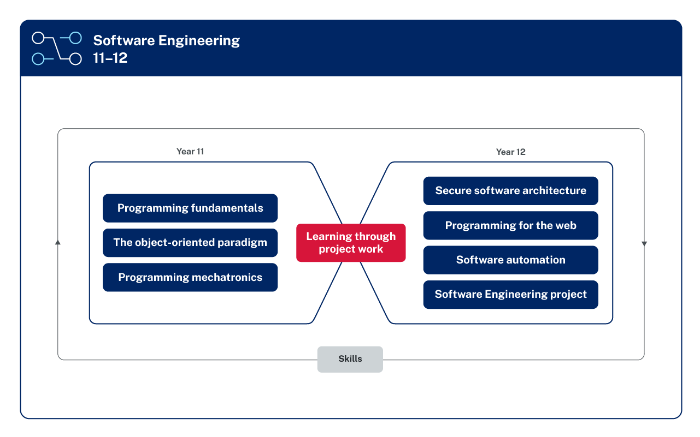

# Overview

A mapping of syllabus items to sections within this site is provided. This mapping follows the structure of the syllabus as this site has used a different structure to learning software engineering. This mapping also stands as a check that all items of the syllabus are covered.

(1) 
{.annotate}

1. From NESA Software Engineering 11 & 12 Syllabus. https://curriculum.nsw.edu.au/learning-areas/tas/software-engineering-11-12-2022/overview

The approach taken is more in alignment with the "shift left" ideology or *DevOps* processes to the software development life cycle. The term "shift left" means to move concerns and consideration in the SDLC closer to the beginning rather than the end of the life-cycle to ensure software meets design. Examples of this are:

- consider security issues up front and develop code that builds in security from the get go rather than an add-on
- focus on testing, code quality and performance earlier in the development cycle
- create the build, test process before building the software

The other side of DevOps is shift right where testing, quality and performance is done under real-world conditions. This means software running in production can handle real user load while maintaining quality. 
