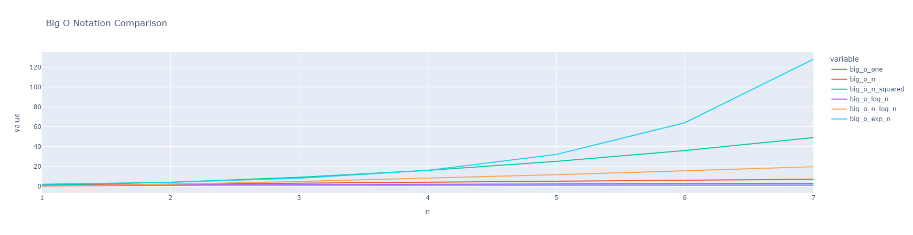

# Algorithm Complexity

Algorithm complexity is a measure of the efficiency of an algorithm. It describes how the time or space requirements of an algorithm grow as the size of the input increases. The most common way to express this is using Big O notation, which provides an upper bound on the growth rate of the algorithm. This helps in understanding the scalability and performance of algorithms.

## Big O Notation

Big O notation describes the limiting behaviour of a function when the argument tends towards a particular value or infinity. In the context of algorithms, it is used to describe how the running time or space requirements grow as the input size increases.

The general form of Big O notation is: 
$$
f(n) \leq O(g(n))
$$
where $f(n)$ represents the running time or space requirements of an algorithm with input size $n$, and $g(n)$ represents a function that describes the growth rate of the algorithm. The symbol $\leq$ is used to indicate that the growth rate of $f(n)$ is less than or equal to the growth rate of $g(n)$.

## Common Big O Notations

Here are some common Big O notations and their meanings:

- **O(1)**: Constant time complexity. The running time does not depend on the size of the input.
- **O(log n)**: Logarithmic time complexity. The running time grows logarithmically with the size of the input.
- **O(n)**: Linear time complexity. The running time grows linearly with the size of the input.
- **O(n log n)**: Linearithmic time complexity. The running time grows as a product of the input size and its logarithm.
- **O(n^2)**: Quadratic time complexity. The running time grows quadratically with the size of the input.
- **O(2^n)**: Exponential time complexity. The running time grows exponentially with the size of the input.

(1)
{.annotate}

1. Aaron Beverley, CC BY-SA 4.0 <https://creativecommons.org/licenses/by-sa/4.0>, Created with Plotly.

??? Code

    ``` python
    import plotly.express as px
    import pandas as pd

    import math

    def big_o_one(n):
        """O(1) operation"""
        return 1

    def big_o_n(n):
        """O(n) operation"""
        return n

    def big_o_n_squared(n):
        """O(n^2) operation"""
        return n * n

    def big_o_log_n(n):
        """O(log n) operation"""
        return math.log(n, 2)

    def big_o_n_log_n(n):
        """O(n log n) operation"""
        return n * math.log(n, 2)

    def big_o_exp_n(n):
        """O(e^n) operation"""
        return 2 ** n

    # Create a DataFrame to store the results
    results = pd.DataFrame(columns=["n", "big_o_one", "big_o_n", "big_o_n_squared", "big_o_log_n", "big_o_n_log_n", "big_o_exp_n"])
    for n in range(1, 8):
        results.loc[n] = [n, big_o_one(n), big_o_n(n), big_o_n_squared(n), big_o_log_n(n), big_o_n_log_n(n), big_o_exp_n(n)]

    # Plot the results using Plotly Express
    fig = px.line(results, x="n", y=["big_o_one", "big_o_n", "big_o_n_squared", "big_o_log_n", "big_o_n_log_n", "big_o_exp_n"], title="Big O Notation Comparison")
    fig.show()
    ```