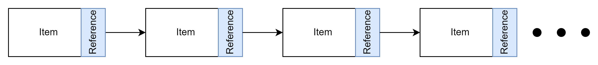
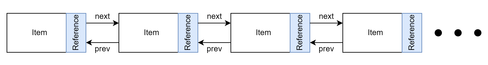
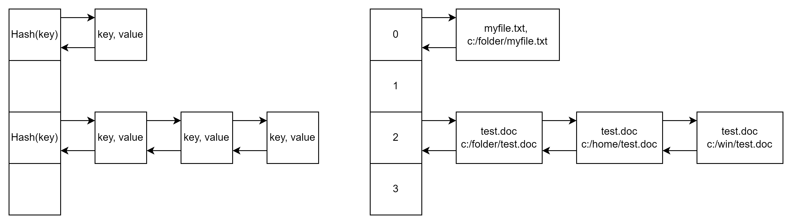

# Data Structures

In all cases you should not need to implement these data structures yourself. Use the built in version for the language or use a library. The code below is provided to illustrate how these data structures are implemented. The code is valid and you could use it to debug or step through to get a better understanding of how they work.

## Array

## Multi-dimensional Array

## List :material-school:

A list is a sequence optimised for insertion and deletion of elements. A list is dynamic in size unlike and array that is of fixed size. Lists can grow and shrink as needed meaning they will be memory efficient although there is some overhead in maintaining the reference to the next and previous item. Lists are not ordered unless specifically made to be ordered and can have duplicate values. They are accessed sequentially both forward and backward although going backward is slower for a single linked list as you can only iterated over the list front the front. Random access is slower than other data structures.

!!! note
    Every programming language has its own features when it comes to lists. Eg: C++ doesn't offer an index operator due to its definition in the language. 

| Action | Parameters | Description | [Performance](./big_o.md) |
| :----: | :--------: | :---------: | :---------: |
| Insert |  value     | Add the value to the end of the list | O(1) |
| Access |  index     | Fetch the value from the indexed location in the list | O(n) |
| Search |  value     | Find the value in the list | Worst case O(n), Average case O(n/2), Best case O(1) |
| Delete |  value     | Remove the value from the list. This can be language specific, some will remove only the first item found, others will remove all. Others will consider a delete being from the head or tail of the list only. | Worst case O(n), Average case O(n/2), Best case O(1) |

### Single Linked List

Not commonly used, it is called a single linked list as it links in a single direction from the head to the next item in the list.



### Double Linked List

Double linked as it has references in both directions to traverse a list. This does use more memory that a single linked list but does improve significantly it usage. With this structure in place it can also be used as the basis for a stack, queue and deque (pronounced deck).

#### Benefits

- It is more efficient than a single linked list when inserting and deleting nodes as it does not need to find the previous node.
- Insertion and deletion of nodes is faster as it does not need to find the previous node.
- Linked lists do not need to have all elements pre-allocated and can be resized dynamically during runtime.
- As memory is allocated dynamically, memory is not wasted as it is only allocated when needed.

#### Drawbacks

- Random access is not efficient as it requires traversing the list from the beginning or end.

#### When to Use

- When you need to insert or delete elements frequently to the head or tail of the list.
- When you need a dynamic list that can grow and shrink as needed.




??? code

    === "Python"

        ``` py
        class Node:
            def __init__(self, data):
                self.item = data
                self.next: Node = None
                self.prev: Node = None

            def __repr__(self):
                return f'Node: {self.item}'

        class LinkedList:
            def __init__(self):
                self.head: Node = None
                self.tail: Node = None

            def add(self, data):
                node = Node(data)
                if self.tail != None:
                    node.prev = self.tail
                    self.tail.next = node
                self.tail = node
                
                if self.head == None:
                    self.head = node
                
            def find(self, data) -> bool:
                node = self.head
                while node != None and data != node.item:
                    node = node.next
                
                return node != None
            
            def remove(self, data) -> bool:
                if self.head == None:
                    return False

                node = self.head
                while node is not None and data != node.item:
                    node = node.next

                if node == None:
                    return False

                # only 1 node in the list
                if node.prev == None and node.next == None:
                    self.head = None
                    self.tail = None
                    return True
                
                # last node in the list
                if node.next == None:
                    node.prev.next = None
                    self.tail = node.prev
                    node.prev = None
                # first node in the list
                elif node.prev == None:
                    node.next.prev = None
                    self.head = node.next
                    node.next = None
                # node is in the middle of the list
                else:
                    node.prev.next = node.next
                    node.next.prev = node.prev
                    node.next = None
                    node.prev = None
                
                return True

            def __repr__(self):
                output = 'LinkedList: '
                node = self.head
                while node != None:
                    output += f'({node}), '
                    node = node.next
                
                return output
        ```

    === "C#"


    === "Rust" 


### Ordered List

## Stack

## Queue

## Deque

## Dictionaries
Dictionaries is the general term for mapping a keys to values. There are many ways to implement them each with their specific features. These can be separated into 2 categories, those that allow multiple values to be associated with a value and those than can only have a single value. In some languages, like Python, a dictionary can be a data structure.

### Hash tables / Hashmap

Hash tables and hashmap are generally the same data structure. The implementation can be language dependent for example Java differentiates between the 2 as a HashTable doesn't allow null keys or values and it sychronises thread access where as a HashMap does not. 

They are used for fast access to information that has a key associated with it. The key is hashed and used as the primary means to retreive the value. The data structure is typically an indexed array where each array item is the hashed value of the key and a linked list to support multiple values having the same key. 



Hash tables work by storing buckets of values based on a hash of the key provided. The hashing function is designed to try and evenly distribute the information across the buckets. As an example you might want to store suburbs and their street names to quickly look up a street by the Suburb. If this was stored in a list you would need to search on average 1/2 the list to find the street. By using a hash table that lookup is almost an instant (constant time).

Sometimes when a key is hashed it can result in the same value from the hash and that is called a collision.

As an example of the hash, if we have 4 buckets to store values we could sum the ascii values of the characters and take the modulo of that value to decide which bucket the (key, value) pair would be stored. 

``` python
    def hash(key: str):
        total = sum([ord(char) for char in key])
        return total % 4
```

!!! Note
    This code is shown to provide a simple example. There are several issues with code above and you would not use this in a production environment.


| Action | Parameters | Description | [Performance](./big_o.md) |
| :----: | :--------: | :---------: | :---------: |
| Insert |  key, value  | Add the value to a bucket based on the key | O(1) |
| Search |  key, value  | Find the value in the list | Typically O(1), this could be O(n) if the hashing function results in many collisions |
| Delete |  key, value  | Remove the value from the list. | Typically O(1), this could be O(n) if the hashing function results in many collisions |


#### More Information
- [:simple-youtube:{ .youtube } Visualising a HashMap](https://www.youtube.com/watch?v=WEILxTBDy0Y){target="_blank"}

#### Benefits
- Efficient in finding information in constant time
- Multiple values can be associated with the same key

#### Drawbacks
- Uses more memory than a list or array
- Can be slower than a list when the data stored is small. Less than 8 values.
- Not effective for storing ordered information
- Not effective when you want to iterate over all of the items
- If the hashing function is not good, many collisions can occur with many values in the same bucket, reducing efficiency

#### When to Use
- To see if a collection of information contains the key and value. 
- Frequency of items, like counting words in a document or number of times letters appear in a word.
- File systems use these to quickly find files
- Caching data in a server for fast information access for a website

#### Implementation
A example of using the hash table is available in the Data Structures project [repository](https://github.com/mr-bev/data-structures){target="_blank"}. Here is the basic implement of a hash table in Python and also reusing the Linked List implementation.

??? Code

    ``` python
        from dataclasses import dataclass, field
        from containers.linked_list import LinkedList

        @dataclass
        class HashTable:
            bucket_size: int = 8
            buckets: list[LinkedList] = field(init=False)

            def __post_init__(self):
                self.buckets = [None] * self.bucket_size

            def hash_key(self, key: any) -> int:
                return hash(key) % self.bucket_size

            def add(self, key: any, value: any) -> None:
                hashkey = self.hash_key(key)
                if (self.buckets[hashkey] is None):
                    self.buckets[hashkey] = LinkedList()

                print({key,value})
                self.buckets[hashkey].add({key, value})
                print(self.buckets[hashkey])

            def find(self, key: any, value: any) -> bool:
                hashkey = self.hash_key(key)
                if (self.buckets[hashkey] is None):
                    return False
                
                bucket = self.buckets[hashkey]
                return bucket.find({key, value})

            def remove(self, key: any, value: any) -> bool:
                hashkey = self.hash_key(key)
                if (self.buckets[hashkey] is None):
                    return False
                
                bucket = self.buckets[hashkey]
                return bucket.remove({key, value})
    ```

### Dictionary

## Trees

### Binary Tree

### Red Black Tree