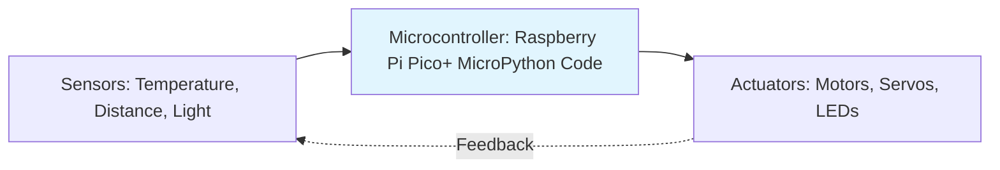
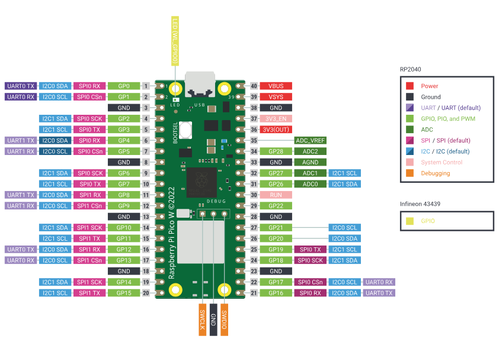
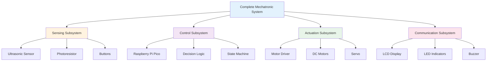

# Understanding Mechatronic Hardware and Software

## Introduction: From Code to Physical Reality

In your previous work with Object-Oriented Programming, you learned to create objects in code that represent real-world things. Now, you'll bring those objects to life—literally. **Mechatronics is where your software engineering skills meet the physical world**, allowing you to sense, think, and act in real environments.

Throughout this module, you'll be using the **Raspberry Pi Pico** microcontroller programmed with **MicroPython**, along with the comprehensive set of components from your **Freenove Ultimate Starter Kit**.

### What is Mechatronics?

!!! quote "Definition"
    **Mechatronics** is the interdisciplinary field combining mechanical engineering, electronics, computer science, and control engineering to design and create intelligent systems that can sense, decide, and act.

Mechatronic systems excel at performing tasks that are:

- **Repetitive** - executing the same action thousands of times without fatigue or variation
- **Precise** - achieving accuracy beyond human capability
- **Fast** - responding in milliseconds to environmental changes
- **Reliable** - operating consistently in hazardous or inaccessible environments
- **Cost-effective** - reducing labor costs and improving efficiency

#### Core Components of Mechatronic Systems

Every mechatronic system consists of three fundamental elements:

1. **Sensors (INPUT)** - Devices that detect physical phenomena and convert them to electrical signals
2. **Microcontroller (CONTROL)** - The "brain" that processes sensor data and makes decisions
3. **Actuators (OUTPUT)** - Devices that convert electrical signals into physical action



### Connecting to Your Previous Learning

Your OOP and project management skills directly transfer to mechatronics:

| **Software Engineering Concept** | **Mechatronics Application** |
|-----------------------------------|------------------------------|
| **Class definitions** | Hardware component abstractions (Sensor class, Motor class) |
| **Object instantiation** | Initialising physical devices with specific pin configurations |
| **Methods** | Functions controlling device behaviour (read_temperature(), move_servo()) |
| **Encapsulation** | Hiding hardware complexity behind simple interfaces |
| **Inheritance** | Creating specialised sensor types from base Sensor class |
| **Testing & debugging** | Unit testing individual components before system integration |
| **Documentation** | Technical specifications, wiring diagrams, component data sheets |
| **Iteration** | Prototyping → Testing → Refining → Deploying |

---

## Applications of Mechatronic Systems

Mechatronic systems have transformed nearly every industry, enabling automation, precision, and capabilities beyond human limits.

!!! abstract "Syllabus Outcome"
    **[PM-UM-03](../Syllabus/programming-mechatronics.md#PM-UM-01)** Outline applications of mechatronic systems in a variety of specialised fields

### Industry Applications

??? example "Manufacturing & Industry 4.0"
    **Robotic Assembly Lines**
    
    - Automated pick-and-place systems achieving 99.9% precision
    - Collaborative robots (cobots) working alongside humans
    - Quality inspection systems using computer vision
    - Automated warehousing with autonomous mobile robots (AMRs)
    
    **Smart Factories**
    
    - Real-time monitoring of production equipment
    - Predictive maintenance using vibration and temperature sensors
    - Automated inventory management
    - Just-in-time manufacturing coordination

??? example "Transportation & Automotive"
    **Vehicle Systems**
    
    - **Engine Management:** Sensors monitor temperature, pressure, oxygen levels; ECU optimises fuel injection and timing
    - **Safety Systems:** ABS (Anti-lock Braking), ESC (Electronic Stability Control), airbag deployment sensors
    - **ADAS (Advanced Driver Assistance):** Lane keeping, adaptive cruise control, automatic emergency braking
    - **Autonomous Vehicles:** LiDAR, radar, cameras integrated with AI for self-driving
    
    **Aviation**
    
    - Fly-by-wire flight control systems
    - Automated landing systems
    - Engine thrust management
    - Satellite navigation and autopilot

??? example "Healthcare & Medical"
    **Surgical Robotics**
    
    - Da Vinci Surgical System: Minimally invasive procedures with enhanced dexterity
    - Robotic exoskeletons for rehabilitation
    - Precision radiation therapy systems
    
    **Assistive Devices**
    
    - Prosthetic limbs with sensor feedback and motor control
    - Automated medication dispensers
    - Patient monitoring systems
    - Robotic surgery assistants

??? example "Agriculture & Food Production"
    **Precision Agriculture**
    
    - Autonomous tractors with GPS guidance
    - Drone-based crop monitoring and spraying
    - Automated irrigation systems with soil moisture sensors
    - Robotic harvesting systems
    
    **Controlled Environment Agriculture**
    
    - Greenhouse climate control (temperature, humidity, CO₂)
    - Hydroponic and aquaponic systems
    - Automated feeding systems for livestock

??? example "Consumer & Home"
    **Smart Homes**
    
    - Thermostats learning user preferences (Nest, Ecobee)
    - Security systems with motion detection and cameras
    - Robotic vacuum cleaners (Roomba)
    - Smart lighting with occupancy sensors
    
    **Entertainment**
    
    - Animatronics in theme parks
    - Camera stabilisation systems (gimbals)
    - Motion simulators and VR systems
    - Drones for aerial photography

### The Mechatronic Revolution

The integration of affordable microcontrollers like the Raspberry Pi Pico, combined with open-source software and accessible sensors, has democratised mechatronics. What once required industrial-scale investment can now be prototyped on a breadboard in a classroom or garage workshop.

## Raspberry Pi Pico

??? abstract "Syllabus Outcomes"
    **[PM-UM-05]** Identify the hardware requirements to run a program and the effect on code development
    
    Including:
    
    - **[PM-UM-05.01]** Assessing the relationship of microcontrollers and the central processing unit (CPU)
    - **[PM-UM-05.02]** The influence of instruction set and opcodes  
    - **[PM-UM-05.03]** The use of address and data registers

### Introduction to Raspberry Pi Pico-W

The [Raspberry Pi Pico](https://www.raspberrypi.com/documentation/microcontrollers/pico-series.html) is a low-cost, high-performance microcontroller board featuring the RP2040 chip. The W stands for wireless.

!!! info "Raspberry Pi Pico Specifications"
    **Processor:** RP2040 microcontroller chip
    
    - Dual-core ARM Cortex-M0+ @ 133MHz
    - 264KB on-chip SRAM
    - 2MB on-board Flash memory
    
    **Interfaces:**
    
    - 26 × multi-function GPIO pins
    - 3 × 12-bit ADC (Analog-to-Digital Converter)
    - 2 × UART, 2 × SPI, 2 × I²C
    - 16 × PWM channels
    - USB 1.1 with device and host support
    
    **Power:**
    
    - Operating voltage: 1.8-5.5V
    - Low power modes for battery operation

    **Wireless:**

    - Wifi 802.11n, 2.4GHz
    - WPA3
    - Bluetooth 5.2
    - Access point support for 4 clients

#### Pin Layout and Functions

The Pico-W GPIO pins are color-coded by function:



??? tip "Practical Tip: Pin Stickers"
    The Freenove kit includes pin function stickers you can apply to your breadboard for quick reference. This helps identify which pins to use for sensors, motors, and other components.

#### Key Features for Mechatronics

**1. Dual-Core Processing**

The RP2040's two cores allow you to run multiple tasks simultaneously—one core reading sensors while the other controls actuators.

**2. PWM on Every GPIO**

All GPIO pins can generate PWM (Pulse Width Modulation) signals, essential for:

- Controlling servo motor positions
- Varying LED brightness
- Regulating motor speeds

**3. Programmable I/O (PIO)**

Advanced feature allowing custom communication protocols and precise timing control.

**4. Low Cost, High Availability**

At around $8-12 AUD, the Pico is one of the most affordable yet capable microcontrollers available.

### MicroPython: Python for Microcontrollers

**MicroPython** is a lean implementation of Python 3 designed to run on microcontrollers with limited resources.

!!! info "Why MicroPython?"
    **Advantages:**
    
    - **Familiar syntax:** If you know Python, you know MicroPython
    - **Interactive REPL:** Test code immediately without compiling
    - **Rich libraries:** Pre-built modules for common hardware
    - **Rapid prototyping:** Write, test, and modify code quickly
    - **Object-oriented:** Perfect for applying your OOP skills
    
    **Key Differences from Desktop Python:**
    
    - Smaller standard library (optimised for embedded systems)
    - Direct hardware access through `machine` module
    - Real-time constraints (no operating system scheduler)
    - Limited memory requires efficient coding

#### Basic MicroPython Example

```python
from machine import Pin
import time

# Initialize onboard LED
led = Pin(25, Pin.OUT)  # Pico's onboard LED is on GP25

# Blink forever
while True:
    led.toggle()  # Switch LED state
    time.sleep(0.5)  # Wait 500ms
```

This simple program demonstrates:

- **Importing modules:** `machine` for hardware, `time` for delays
- **Pin configuration:** Setting GP25 as an output
- **Infinite loop:** Embedded systems often run continuously
- **Hardware control:** Direct manipulation of physical components

### Development Environment: VSCode
[refer ...]

## Microcontrollers vs. Microprocessors

Understanding the distinction between microcontrollers and microprocessors is fundamental to mechatronics.

??? abstract "Syllabus Outcome"
    **[PM-UM-05.01]** Assessing the relationship of microcontrollers and the central processing unit (CPU)

### The Core Difference

!!! info "Key Distinction"
    - A **microprocessor** (CPU) is solely responsible for executing instructions—it's the "brain" but needs supporting components to function
    - A **microcontroller** is a complete computer-on-a-chip integrating:
        - Microprocessor (CPU)
        - Memory (RAM and Flash storage)
        - Input/Output peripherals
        - Communication interfaces (UART, SPI, I²C)
        - Timers and counters
        - Analog-to-Digital Converters (ADC)

### Analogy: Microprocessor vs. Microcontroller

| **Microprocessor** | **Microcontroller** |
|--------------------|---------------------|
| CPU alone | Complete computer |
| Engine of a car | Entire car (engine, transmission, wheels, controls) |
| Requires circuit board design with many external components | Ready to use with minimal external components |
| Examples: Intel Core i7, AMD Ryzen | Examples: RP2040 (Pico), ATmega328 (Arduino Uno), ESP32 |

### Practical Comparison

| **Aspect** | **Microprocessor System** | **Microcontroller System** |
|------------|---------------------------|----------------------------|
| **Integration** | Requires RAM chips, ROM chips, I/O controllers, timers | All integrated on single chip |
| **Size** | Larger PCB with multiple ICs | Compact, single-chip solution |
| **Power Consumption** | Higher (multiple chips) | Lower (optimised for embedded use) |
| **Cost** | Higher total system cost | Lower cost per complete system |
| **Best Use Cases** | Computers, servers, smartphones | Embedded systems, IoT devices, robotics |
| **Processing Power** | Very high (GHz range, multiple cores) | Moderate (MHz range, often single or dual-core) |
| **Memory** | GBs of RAM | KBs of RAM |

### Why Microcontrollers for Mechatronics?

Microcontrollers are ideal for mechatronic applications because they:

1. **Integrate I/O directly:** No external chips needed to connect sensors and actuators
2. **Operate in real-time:** Deterministic timing for precise control
3. **Low power consumption:** Can run on batteries for extended periods
4. **Rugged:** Designed for industrial environments (temperature, vibration)
5. **Cost-effective:** Entire control system in a single, inexpensive chip
6. **Purpose-built:** Optimised for control and monitoring tasks

---

## Hardware Architecture: Inside the RP2040

### The Central Processing Unit (CPU)

The RP2040 features a **dual-core ARM Cortex-M0+** processor running at up to 133MHz.

!!! info "ARM Cortex-M0+ Architecture"
    **Designed for embedded systems:**
    
    - 32-bit RISC (Reduced Instruction Set Computer) architecture
    - Low power consumption
    - Efficient interrupt handling
    - Hardware multiply/divide instructions
    
    **Dual-core capability:**
    
    - Core 0 and Core 1 can run independently
    - Shared memory for inter-core communication
    - Typical usage: One core for control logic, another for communication

#### What Does "32-bit" Mean?

A **32-bit** processor can:

- Process 32 bits (4 bytes) of data in a single operation
- Address up to 4GB of memory (2³² bytes)
- Handle integer values from -2,147,483,648 to 2,147,483,647 (signed)
- Or 0 to 4,294,967,295 (unsigned)

Compare this to an **8-bit** microcontroller (like older Arduinos):

| **Capability** | **8-bit (AVR)** | **32-bit (ARM Cortex-M0+)** |
|----------------|-----------------|------------------------------|
| **Max integer value** | 255 (unsigned) | 4,294,967,295 (unsigned) |
| **Math operations** | Slower for large numbers | 4× faster per operation |
| **Memory addressing** | Limited to 64KB directly | Up to 4GB |
| **Floating-point** | Software emulation (slow) | Hardware support available |

### Instruction Sets and Opcodes

#### What is an Instruction Set?

!!! info "Definition"
    An **instruction set architecture (ISA)** defines all the commands a processor can execute. It's the interface between software and hardware.

!!! abstract "Syllabus Outcome"
    **[PM-UM-05.02]** The influence of instruction set and opcodes

The RP2040 uses the **ARM Thumb-2** instruction set—a mix of 16-bit and 32-bit instructions optimised for:

- Code density (small program size)
- Performance (fast execution)
- Power efficiency

#### Machine Code vs. Assembly vs. High-Level Languages

```
High-Level (MicroPython):
    led.value(1)

Assembly Language:
    MOV r0, #1
    STR r0, [r1]

Machine Code (Binary):
    00100000 00000001
    01100001 ...
```

- **MicroPython:** Human-readable, abstracts hardware details
- **Assembly:** Symbolic representation of machine instructions
- **Machine Code:** Actual binary executed by CPU

#### Example: ARM Instructions

```assembly
; ARM Thumb Assembly Examples
MOV r0, #42        ; Move value 42 into register r0
ADD r1, r0, #8     ; Add 8 to r0, store result in r1 (r1 = 50)
LDR r2, [r3]       ; Load value from memory address in r3 into r2
STR r0, [r4]       ; Store r0 value to memory address in r4
CMP r0, r1         ; Compare r0 and r1 (set status flags)
BEQ label          ; Branch to 'label' if equal (if r0 == r1)
```

#### Why Instruction Sets Matter for Mechatronics

1. **Timing Precision:** Some operations take fixed numbers of cycles, enabling precise timing
2. **Hardware Control:** Specialized instructions for bit manipulation and peripheral access
3. **Interrupts:** Fast response to sensor events without polling
4. **Power Management:** Instructions to enter low-power sleep modes

### Memory and Registers

!!! abstract "Syllabus Outcome"
    **[PM-UM-05.03]** The use of address and data registers

#### Types of Memory in RP2040

| **Memory Type** | **Size** | **Speed** | **Purpose** | **Volatile?** |
|-----------------|----------|-----------|-------------|---------------|
| **Registers** | 32-bit × 16 | Fastest (0 wait states) | Active calculations, CPU state | Yes |
| **SRAM** | 264KB | Very fast (few cycles) | Variables, stack, heap | Yes |
| **Flash** | 2MB | Slower (cached for speed) | Program code, constants | No (persistent) |
| **External** | Via SPI/I²C | Slowest | SD cards, EEPROM | Depends |

#### CPU Registers

!!! info "What are Registers?"
    **Registers** are ultra-fast storage locations built directly into the CPU. Think of them as the CPU's "scratch paper" for immediate calculations.

**ARM Cortex-M0+ has 16 registers:**

- **R0-R12:** General-purpose registers for calculations and data
- **R13 (SP):** Stack Pointer - tracks function calls and local variables
- **R14 (LR):** Link Register - stores return addresses for functions
- **R15 (PC):** Program Counter - points to next instruction to execute

**Special registers:**

- **APSR:** Application Program Status Register - stores condition flags (Zero, Negative, Carry, Overflow)
- **PRIMASK, CONTROL:** Interrupt and privilege control

#### Register vs. RAM

| **Characteristic** | **Registers** | **RAM (SRAM)** |
|--------------------|---------------|----------------|
| **Location** | Inside CPU | External to CPU |
| **Access Speed** | Instant (0-1 cycles) | Few cycles |
| **Quantity** | 16 registers (32-bit each) | 264KB (270,336 bytes) |
| **Use** | Active computation | Program data storage |
| **Programmer Control** | Compiler-managed (usually) | Direct allocation possible |

#### Data Registers vs. Address Registers

- **Data Registers (R0-R7 primarily):** Hold actual values being processed
  ```python
  # Conceptually, adding two numbers:
  # r0 = 42, r1 = 8
  # ADD r0, r0, r1  => r0 = 50
  ```

- **Address Registers (used as pointers):** Store memory addresses
  ```python
  # Reading from memory:
  # r2 holds address 0x20000100
  # LDR r3, [r2]  => Load value FROM address 0x20000100 INTO r3
  ```

### Peripherals and Memory-Mapped I/O

Microcontrollers use **memory-mapped I/O**, meaning hardware peripherals (GPIO, ADC, UART) are controlled by reading/writing to specific memory addresses.

#### Example: GPIO Control

```python
# High-level MicroPython
led = Pin(25, Pin.OUT)
led.value(1)  # Turn on

# What happens internally (simplified):
# Write value '1' to memory address 0x40014004 (GPIO output register)
```

The MicroPython library handles these low-level details, but understanding memory-mapped I/O helps when:

- Debugging hardware issues
- Optimising for performance
- Using advanced features not exposed in high-level libraries

---

## Your Freenove Kit: Components Overview

The Freenove Ultimate Starter Kit provides all the hardware you need to explore mechatronics. Let's examine the key components you'll be using.

!!! abstract "Syllabus Outcome"
    **[PM-UM-11]** Identify and describe a range of sensors, actuators and end effectors/manipulators within existing mechatronic systems
    
    Including:
    
    - **[PM-UM-11.01]** Motion sensors
    - **[PM-UM-11.02]** Light level sensors
    - **[PM-UM-11.03]** Hydraulic actuators
    - **[PM-UM-11.04]** Robotic grippers

### Component-to-Syllabus Quick Reference

| **Freenove Kit Component** | **Syllabus Reference** | **Type** |
|----------------------------|------------------------|----------|
| Ultrasonic Sensor (HC-SR04) | [PM-UM-11.01] | Motion Sensor |
| PIR Motion Sensor | [PM-UM-11.01] | Motion Sensor |
| Photoresistor (LDR) | [PM-UM-11.02] | Light Level Sensor |
| Push Buttons | [PM-UM-11] | Input Device |
| Potentiometers | [PM-UM-11] | Input Device (Analog) |
| Servo Motors | [PM-UM-11], [PM-UM-11.04] | Actuator / Gripper Control |
| DC Motors | [PM-UM-11] | Actuator |
| Stepper Motors | [PM-UM-11] | Actuator |
| LEDs / LED Bar | [PM-UM-11] | Output Device |
| Buzzer | [PM-UM-11] | Output Device |
| Relay | [PM-UM-11] | Actuator (Switching) |
| LCD1602 Display | [PM-UM-11] | Output Device |

!!! note "Note on Hydraulic Actuators [PM-UM-11.03]"
    The Freenove kit uses electric actuators (servos, DC motors, stepper motors). Hydraulic actuators operate on similar control principles but use pressurised fluid instead of electrical power. Understanding electric actuators provides the foundation for working with hydraulic systems in industrial applications.

### Input Devices (Sensors) [PM-UM-11.01, PM-UM-11.02]

#### Passive Components

**Resistors (Various values: 220Ω, 1KΩ, 10KΩ, etc.)**

- **Purpose:** Limit current flow, divide voltage, pull-up/pull-down for digital inputs
- **Mechatronic use:** Protect LEDs, configure button inputs, voltage dividers for sensors

**Potentiometers**

- **Type:** Variable resistor with rotary knob
- **Range:** Typically 10KΩ
- **Mechatronic use:** 
    - Analog input for user control (volume, speed, position)
    - Tuning PID control parameters
    - Manual calibration

```python
# Reading a potentiometer (analog input)
from machine import ADC, Pin

pot = ADC(Pin(26))  # GP26 is ADC0

while True:
    value = pot.read_u16()  # Returns 0-65535
    voltage = value * 3.3 / 65535
    print(f"Raw: {value}, Voltage: {voltage:.2f}V")
    time.sleep(0.1)
```

#### Active Sensors

**Push Buttons**

- **Type:** Momentary contact switch (SPST - Single Pole Single Throw)
- **Mechatronic use:** User input, emergency stop, mode selection
- **Requires:** Pull-up or pull-down resistor to prevent floating inputs

```python
# Button with internal pull-up resistor
button = Pin(15, Pin.IN, Pin.PULL_UP)

while True:
    if button.value() == 0:  # Pressed (active LOW)
        print("Button pressed!")
    time.sleep(0.1)
```

**Photoresistor (LDR - Light Dependent Resistor) [PM-UM-11.02]**

- **Function:** Resistance decreases as light intensity increases
- **Range:** Dark (1MΩ) to Bright (few hundred Ω)
- **Mechatronic use:** 
    - Automatic lighting control
    - Day/night detection
    - Light-seeking robots

```python
# Reading light level with photoresistor in voltage divider
light_sensor = ADC(Pin(27))

while True:
    value = light_sensor.read_u16()
    # Higher value = more light (depends on circuit configuration)
    print(f"Light level: {value}")
    time.sleep(0.5)
```

**Ultrasonic Sensor (HC-SR04) [PM-UM-11.01]**

- **Function:** Measures distance using ultrasonic sound waves
- **Range:** 2cm to 400cm
- **Accuracy:** ±3mm
- **Mechatronic use:**
    - Obstacle avoidance in robots
    - Level sensing in tanks
    - Automatic door openers
    - Parking assistance systems

**Operating Principle:**

1. Trigger pin sends 10μs pulse
2. Sensor emits 8 ultrasonic pulses at 40kHz
3. Echo pin goes HIGH when pulse sent, LOW when echo received
4. Measure echo pulse width to calculate distance:
   ```
   Distance (cm) = (echo_time × speed_of_sound) / 2
   Distance (cm) = (echo_time_μs × 0.0343) / 2
   ```

```python
# Ultrasonic distance sensor
from machine import Pin
import time

trigger = Pin(16, Pin.OUT)
echo = Pin(17, Pin.IN)

def measure_distance():
    # Send trigger pulse
    trigger.value(0)
    time.sleep_us(2)
    trigger.value(1)
    time.sleep_us(10)
    trigger.value(0)
    
    # Measure echo pulse width
    while echo.value() == 0:
        pulse_start = time.ticks_us()
    while echo.value() == 1:
        pulse_end = time.ticks_us()
    
    pulse_duration = time.ticks_diff(pulse_end, pulse_start)
    distance = (pulse_duration * 0.0343) / 2
    
    return distance

while True:
    dist = measure_distance()
    print(f"Distance: {dist:.1f} cm")
    time.sleep(0.5)
```

**PIR Motion Sensor (Passive Infrared) [PM-UM-11.01]**

- **Function:** Detects motion by sensing changes in infrared radiation (body heat)
- **Output:** Digital (HIGH when motion detected)
- **Mechatronic use:**
    - Security systems
    - Automatic lighting
    - Occupancy detection

### Output Devices (Actuators) [PM-UM-11.03, PM-UM-11.04]

!!! note "Note on Hydraulic Actuators"
    **[PM-UM-11.03]** While the syllabus mentions hydraulic actuators, the Freenove kit focuses on electric actuators (servos, DC motors, stepper motors) which are more practical for educational projects. Hydraulic actuators operate on the same control principles but use fluid pressure instead of electrical power.

#### Visual Outputs

**LEDs (Light Emitting Diodes)**

- **Types in kit:** Individual LEDs, LED bar (10 LEDs), RGB LEDs
- **Voltage:** Typically 2-3V forward voltage
- **Current:** 10-20mA typical
- **Requires:** Current-limiting resistor (220Ω common)

**LED Bar Graph**

- **Configuration:** 10 LEDs in a single package
- **Use:** Progress indicators, level meters, VU meters
- **Example:** Battery level display, sensor reading visualization

```python
# Controlling LED bar (10 LEDs on GP0-GP9)
from machine import Pin

leds = [Pin(i, Pin.OUT) for i in range(10)]

# Light up first 5 LEDs
for i in range(5):
    leds[i].value(1)
```

**7-Segment Display**

- **Function:** Displays digits 0-9 (and some letters)
- **Types:** Common cathode or common anode
- **Mechatronic use:** Counters, timers, sensor readings

**LCD1602 (16x2 Character Display)**

- **Specification:** 16 characters × 2 lines
- **Interface:** I²C (simplifies wiring - only 2 wires for data)
- **Mechatronic use:** System status, sensor readings, user feedback

#### Motion Actuators

**Servo Motors [PM-UM-11.04]**

- **Type:** Rotational actuator with position feedback
- **Range:** Typically 0-180° (some can do 360° continuous rotation)
- **Control:** PWM signal (1-2ms pulse width, 50Hz frequency)
- **Mechatronic use:**
    - Robot joints
    - Gripper control [PM-UM-11.04] (Robotic grippers are typically controlled by servo motors)
    - Camera pan/tilt
    - Steering mechanisms

```python
# Servo control with PWM
from machine import Pin, PWM
import time

servo = PWM(Pin(6))
servo.freq(50)  # 50Hz = 20ms period

def set_angle(angle):
    # Convert angle (0-180°) to duty cycle
    # 1ms = 0°, 2ms = 180°
    # Duty cycle in 16-bit: 0-65535
    min_duty = 1638  # ~1ms (2.5% of 65535)
    max_duty = 8192  # ~2ms (12.5% of 65535)
    duty = int(min_duty + (angle / 180) * (max_duty - min_duty))
    servo.duty_u16(duty)

# Sweep servo from 0 to 180 degrees
for angle in range(0, 181, 10):
    set_angle(angle)
    time.sleep(0.05)
```

**DC Motors (with L293D Motor Driver) [PM-UM-11]**

- **Type:** Continuous rotation motor
- **Speed Control:** PWM (varying duty cycle)
- **Direction Control:** H-bridge circuit (L293D chip)
- **Mechatronic use:**
    - Robot wheels
    - Conveyor belts
    - Fans and pumps

**Stepper Motors (28BYJ-48 with ULN2003 Driver) [PM-UM-11]**

- **Type:** Precise positioning motor
- **Steps:** Typically 2048 steps/revolution (with gearing)
- **Control:** Sequential energizing of coils
- **Mechatronic use:**
    - 3D printers
    - CNC machines
    - Camera sliders
    - Precise positioning systems

#### Other Actuators

**Buzzer (Active and Passive)**

- **Active buzzer:** Fixed frequency, just apply voltage
- **Passive buzzer:** Frequency controlled by PWM, can play tones
- **Mechatronic use:** Alarms, user feedback, musical projects

**Relay**

- **Function:** Electrically controlled switch for high-power loads
- **Configuration:** SPDT (Single Pole Double Throw)
- **Ratings:** Typically 5V coil, 10A 250VAC / 10A 30VDC contacts
- **Mechatronic use:**
    - Controlling AC appliances (lights, fans)
    - Switching high-current DC loads
    - Safety isolation between logic and power circuits

**IMPORTANT SAFETY:** Relays allow microcontrollers to control mains voltage (120V/240V AC). Exercise extreme caution—only operate under teacher supervision and use proper insulation.

### Integrated Circuits and Modules

**74HC595 Shift Register**

- **Function:** Expands outputs (3 pins control 8 outputs)
- **Cascadable:** Daisy-chain multiple chips for more outputs
- **Mechatronic use:** Driving LED matrices, multiple outputs with limited pins

**L293D Motor Driver**

- **Function:** H-bridge IC for bi-directional DC motor control
- **Channels:** Dual H-bridge (controls 2 motors)
- **Current:** Up to 600mA per channel
- **Features:** Built-in flyback diodes for inductive load protection

### Power and Connectivity

**Breadboard**

- **Purpose:** Solderless prototyping platform
- **Connection:** Rows are connected horizontally (in groups of 5), power rails vertically

**Breadboard Power Module**

- **Input:** 6.5-12V DC (9V battery or wall adapter)
- **Outputs:** 3.3V and 5V regulated supplies
- **Use:** Power components that need different voltages than Pico provides

**Jumper Wires**

- **Types:** Male-Male, Male-Female
- **Purpose:** Make connections between components

---

## Data in Mechatronic Systems

Understanding how data flows through a mechatronic system is crucial for effective programming and troubleshooting.

!!! abstract "Syllabus Outcome"
    **[PM-UM-04]** Use different types of data and understand how it is obtained and processed in a mechatronic system, including diagnostic data and data used for optimisation

### Sensor Data Types

#### Analog Signals

!!! info "Continuous Values"
    **Analog signals** represent continuously variable quantities. Examples: temperature, light intensity, sound level, pressure.

**Characteristics:**

- **Infinite resolution** (in theory—limited by ADC precision in practice)
- **Voltage-based:** Typically 0-3.3V range for Pico
- **Requires ADC:** Must be converted to digital for processing

**Pico's ADC Specifications:**

- **Resolution:** 12-bit (4096 levels)
- **Range:** 0-3.3V
- **Channels:** 3 external (GP26, GP27, GP28) + 1 internal (temperature sensor)
- **Accuracy:** ±2 LSB (Least Significant Bits)

```python
# Reading analog sensor with voltage conversion
from machine import ADC

sensor = ADC(Pin(26))

raw = sensor.read_u16()  # 16-bit value (0-65535)
# Convert to 12-bit equivalent (0-4095)
value_12bit = raw >> 4  # Right-shift 4 bits

# Convert to voltage
voltage = (value_12bit / 4095) * 3.3

print(f"Raw: {raw}, 12-bit: {value_12bit}, Voltage: {voltage:.3f}V")
```

**Common Analog Sensors in Your Kit:**

- Potentiometers (0-3.3V based on rotation)
- Photoresistors (voltage divider output)
- Temperature sensors (LM35: 10mV/°C)

#### Digital Signals (On/Off)

!!! info "Binary States"
    **Digital signals** have only two states: HIGH (1, 3.3V) or LOW (0, 0V).

**Characteristics:**

- **No ambiguity:** Clear distinction between states
- **Fast reading:** No conversion needed
- **Simple logic:** Perfect for switches, presence detection

```python
# Digital input with debouncing
button = Pin(15, Pin.IN, Pin.PULL_UP)
last_state = 1

while True:
    current_state = button.value()
    
    if current_state != last_state:
        if current_state == 0:  # Pressed
            print("Button press detected!")
        time.sleep(0.05)  # Debounce delay
    
    last_state = current_state
```

**Common Digital Sensors:**

- Push buttons
- PIR motion sensors
- Limit switches (end stops)
- Hall effect sensors (magnetic detection)

#### Serial Communication Data (UART, I²C, SPI)

Complex sensors provide data via serial protocols, allowing:

- Multiple bytes of information
- Multiple sensors on shared bus
- Error checking and device addressing

**I²C (Inter-Integrated Circuit)**

- **Wires:** 2 (SDA - data, SCL - clock) + power and ground
- **Speed:** Typically 100kHz (standard) or 400kHz (fast mode)
- **Addressing:** Each device has unique 7-bit address
- **Use:** LCD displays, sensors (accelerometers, gyroscopes, temperature/humidity)

```python
# I²C sensor example (BME280 - temperature, pressure, humidity)
from machine import I2C, Pin
import time

# Initialize I²C bus
i2c = I2C(0, scl=Pin(5), sda=Pin(4), freq=400000)

# Scan for devices
devices = i2c.scan()
print("I²C devices found:", [hex(device) for device in devices])

# Read sensor (requires sensor library)
# temp, pressure, humidity = bme280.read_data()
```

**UART (Universal Asynchronous Receiver-Transmitter)**

- **Wires:** 2 (TX - transmit, RX - receive) + ground
- **Speed:** Configurable baud rate (9600, 115200 common)
- **Use:** GPS modules, Bluetooth modules, debugging output

**SPI (Serial Peripheral Interface)**

- **Wires:** 4 (MOSI, MISO, SCK, CS) + power/ground
- **Speed:** Very fast (MHz range)
- **Use:** SD cards, displays, high-speed sensors

### Actuator Control Signals

#### PWM (Pulse Width Modulation)

!!! info "Simulating Analog with Digital"
    **PWM** rapidly toggles between HIGH and LOW to create an average voltage level. By varying the duty cycle (percentage of time HIGH), we control power delivery.

**Key PWM Parameters:**

- **Frequency:** How many times per second the signal repeats
- **Duty Cycle:** Percentage of time signal is HIGH (0-100%)
- **Period:** Time for one complete cycle (Period = 1 / Frequency)

```
Frequency = 1000Hz (1kHz)
Period = 1ms

Duty Cycle = 25%          Duty Cycle = 75%
  _                          ___
 | |_  _  _  _             | | |_  _  _
 0  250μs 1ms             0 750μs 1ms
```

**PWM Applications:**

| **Device** | **Frequency** | **Duty Cycle Effect** |
|------------|---------------|----------------------|
| **LED** | 1kHz - 10kHz | Brightness (25% = dim, 75% = bright) |
| **DC Motor** | 1kHz - 20kHz | Speed (0% = stop, 100% = full speed) |
| **Servo** | 50Hz (20ms period) | Position (1ms = 0°, 1.5ms = 90°, 2ms = 180°) |
| **Buzzer** | 100Hz - 10kHz | Tone pitch |

```python
# PWM for LED brightness control
led_pwm = PWM(Pin(15))
led_pwm.freq(1000)  # 1kHz

# Fade LED in and out
while True:
    # Fade up
    for duty in range(0, 65536, 1024):
        led_pwm.duty_u16(duty)
        time.sleep(0.02)
    
    # Fade down
    for duty in range(65535, -1, -1024):
        led_pwm.duty_u16(duty)
        time.sleep(0.02)
```

### Diagnostic and Optimisation Data

Mechatronic systems generate data beyond immediate control needs:

**Diagnostic Data: [PM-UM-14]**

- **Error logs:** Track sensor failures, communication errors
- **Performance metrics:** Response times, cycle counts
- **Health monitoring:** Battery voltage, temperature, current draw
- **Debugging info:** Intermediate calculation values, state transitions

**Optimisation Data: [PM-UM-14]**

- **Usage patterns:** Most common positions, frequently used features
- **Efficiency metrics:** Energy consumption per task
- **Calibration data:** Sensor drift corrections, mechanical wear compensation
- **Machine learning:** Training data for adaptive algorithms

**Example: System Monitoring**

```python
# Simple diagnostic logging
import time

def log_system_state(sensors, actuators):
    timestamp = time.time()
    log_entry = {
        'time': timestamp,
        'temp': sensors['temperature'],
        'distance': sensors['ultrasonic'],
        'motor_speed': actuators['motor_pwm'],
        'errors': []
    }
    
    # Check for anomalies
    if sensors['temperature'] > 60:
        log_entry['errors'].append('TEMP_HIGH')
    if sensors['ultrasonic'] < 5:
        log_entry['errors'].append('OBSTACLE_CLOSE')
    
    # Log to file or send over serial
    print(log_entry)
    return log_entry
```

---

## System Integration: Combining Components

Mechatronic systems aren't individual components—they're integrated systems where sensors, controllers, and actuators work together.

!!! abstract "Syllabus Outcome"
    **[PM-UM-05]** Experiment with software to control interactions and dependencies within mechatronic systems
    
    Including:
    
    - **[PM-UM-22.01]** Motion constraints
    - **[PM-UM-22.02]** Degrees of freedom
    - **[PM-UM-22.03]** Combination of subsystems
    - **[PM-UM-22.04]** Combination of sensors, actuators and end effectors to create viable subsystems

### Motion Constraints [PM-UM-05.01]

!!! info "Definition"
    **Motion constraints** define the limits and permissible ranges of movement for actuators and mechanical systems.

**Types of Constraints:**

**1. Physical/Mechanical:**

- Servo can only rotate 0-180° (mechanical stops)
- Linear actuator has fixed stroke length
- Robot arm joint cannot bend beyond physical limit

**2. Software:**

- Limit values in code before sending to actuators
- Safety zones (e.g., gripper doesn't close beyond certain point)
- Velocity limits (ramp up/down instead of instant changes)

**3. Electrical:**

- Maximum current draw (motors can overload power supply)
- Voltage limits (over-voltage damages components)
- PWM frequency constraints (servos require 50Hz)

```python
# Implementing software constraints
class ConstrainedServo:
    def __init__(self, pin, min_angle=0, max_angle=180):
        self.servo = PWM(Pin(pin))
        self.servo.freq(50)
        self.min_angle = min_angle
        self.max_angle = max_angle
    
    def set_angle(self, angle):
        # Constrain to safe range
        angle = max(self.min_angle, min(angle, self.max_angle))
        
        # Convert to duty cycle
        duty = int(1638 + (angle / 180) * 6554)
        self.servo.duty_u16(duty)
        return angle  # Return actual angle set

# Usage
servo = ConstrainedServo(6, min_angle=10, max_angle=170)
servo.set_angle(200)  # Will limit to 170°
```

### Degrees of Freedom (DOF) [PM-UM-05.02]

!!! info "Definition"
    **Degrees of Freedom** represent the number of independent ways a system can move.

!!! abstract "Syllabus Outcome"
    **[PM-UM-05.02]** Degrees of freedom

**Examples:**

| **System** | **DOF** | **Independent Movements** |
|------------|---------|---------------------------|
| Door hinge | 1 | Rotation around hinge axis |
| Computer mouse | 2 | X-axis, Y-axis |
| Camera gimbal (pan/tilt) | 2 | Pan (horizontal), Tilt (vertical) |
| Robot arm (3 joints) | 3 | Shoulder rotation, elbow bend, wrist rotation |
| Drone | 6 | X, Y, Z translation + Roll, Pitch, Yaw rotation |

**Calculating DOF:**

For robotic systems:
```
DOF = Number of independent actuators (joints)
```

For a 3-joint robotic arm:
- Joint 1 (base rotation): 1 DOF
- Joint 2 (shoulder): 1 DOF
- Joint 3 (elbow): 1 DOF
- **Total:** 3 DOF

**Programming Multiple DOF:**

```python
# Coordinated multi-servo control
class RobotArm:
    def __init__(self, base_pin, shoulder_pin, elbow_pin):
        self.base = PWM(Pin(base_pin))
        self.shoulder = PWM(Pin(shoulder_pin))
        self.elbow = PWM(Pin(elbow_pin))
        
        for servo in [self.base, self.shoulder, self.elbow]:
            servo.freq(50)
    
    def move_to_position(self, base_angle, shoulder_angle, elbow_angle):
        # Move all joints simultaneously
        self.base.duty_u16(self._angle_to_duty(base_angle))
        self.shoulder.duty_u16(self._angle_to_duty(shoulder_angle))
        self.elbow.duty_u16(self._angle_to_duty(elbow_angle))
    
    def _angle_to_duty(self, angle):
        return int(1638 + (angle / 180) * 6554)

# Usage
arm = RobotArm(base_pin=6, shoulder_pin=7, elbow_pin=8)
arm.move_to_position(90, 45, 135)  # Position 1
time.sleep(1)
arm.move_to_position(45, 90, 90)   # Position 2
```

### Subsystem Integration

!!! abstract "Syllabus Outcomes"
    **[PM-UM-05.03]** Combination of subsystems  
    **[PM-UM-05.04]** Combination of sensors, actuators and end effectors to create viable subsystems

Complex systems are built from subsystems:



**Example: Line-Following Robot**

**Subsystem 1: Sensing**

- Two IR sensors detect line position
- Return digital signals (line detected or not)

**Subsystem 2: Control Logic**

```python
# Decision logic based on sensor inputs
if left_sensor == 0 and right_sensor == 0:
    # Both on line: go straight
    move_forward()
elif left_sensor == 1 and right_sensor == 0:
    # Veered left: turn right
    turn_right()
elif left_sensor == 0 and right_sensor == 1:
    # Veered right: turn left
    turn_left()
else:
    # Lost line: search
    search_for_line()
```

**Subsystem 3: Actuation**

- L293D motor driver
- Two DC motors (left and right wheels)

```python
def move_forward():
    left_motor.duty_u16(50000)  # ~75% speed
    right_motor.duty_u16(50000)

def turn_right():
    left_motor.duty_u16(40000)  # Left faster
    right_motor.duty_u16(20000)  # Right slower
```

**Dependencies:**

- Motors depend on sensor readings
- Turning decisions depend on both sensors simultaneously
- Speed adjustments depend on how far off-line

### Real-Time Considerations

Unlike desktop programs, mechatronic systems operate in **real-time** with strict timing requirements.

**Critical Concepts:**

**1. Latency** - Time delay between sensor input and actuator response

```python
# Measuring response time
start = time.ticks_us()
distance = ultrasonic.measure()
if distance < 20:
    motor.stop()
end = time.ticks_us()
latency = time.ticks_diff(end, start)
print(f"Response latency: {latency}μs")
```

**2. Sampling Rate** - How often sensors are read

- Too slow: Miss rapid changes
- Too fast: Waste processing power, battery

**3. Control Loop Frequency** - How often control algorithm executes

Typical rates:
- Simple LED control: 10-100Hz
- Motor control: 50-100Hz
- Balancing robot: 100-500Hz
- Servo position updates: 50Hz

```python
# Fixed-rate control loop
LOOP_RATE = 50  # Hz
LOOP_PERIOD = 1.0 / LOOP_RATE  # seconds

while True:
    loop_start = time.time()
    
    # Control logic here
    sensor_value = read_sensor()
    actuator_command = calculate_control(sensor_value)
    set_actuator(actuator_command)
    
    # Maintain fixed rate
    elapsed = time.time() - loop_start
    if elapsed < LOOP_PERIOD:
        time.sleep(LOOP_PERIOD - elapsed)
```

---

## Power, Batteries, and Electrical Considerations

Understanding power requirements is critical for reliable mechatronic systems.

!!! abstract "Syllabus Outcome"
    **[PM-UM-06]** Determine power, battery and material requirements for components of a mechatronic system

### Voltage Requirements

Different components operate at different voltages:

| **Component** | **Operating Voltage** | **Notes** |
|---------------|----------------------|-----------|
| **Raspberry Pi Pico** | 1.8V - 5.5V (VSYS)<br>3.3V (logic level) | USB provides 5V to VSYS<br>Internal regulator provides 3.3V |
| **LEDs** | 1.8V - 3.3V | Forward voltage depends on color |
| **Servos (micro)** | 4.8V - 6V | Most common is 5V ±0.5V |
| **DC Motors** | 3V - 12V | Depends on motor size/type |
| **Logic ICs (74HC595, etc.)** | 2V - 6V | Typically 3.3V or 5V |
| **Ultrasonic Sensor** | 5V | But 3.3V logic compatible |

!!! warning "Voltage Level Compatibility"
    The Raspberry Pi Pico uses **3.3V logic**. Most components in your Freenove kit are compatible, but always verify:
    
    - **Input to Pico:** Must not exceed 3.3V on GPIO pins
    - **Output from Pico:** 3.3V HIGH may be insufficient for some 5V devices
    - **Use level shifters** if interfacing with true 5V logic devices

### Current Requirements

Current draw varies dramatically by component and operating state:

| **Component** | **Typical Current** | **Peak Current** |
|---------------|---------------------|------------------|
| **Pico (idle)** | ~20mA | ~25mA |
| **Pico (busy)** | ~30mA | ~40mA |
| **LED** | 10-20mA | 20mA |
| **Servo (idle)** | 10mA | - |
| **Servo (moving, no load)** | 100-200mA | - |
| **Servo (stalled/max load)** | 500-1000mA | 1500mA |
| **DC Motor (small)** | 100-300mA | 1000mA |
| **Ultrasonic Sensor** | 15mA | 15mA |
| **Buzzer** | 30mA | 30mA |

**Calculating Total Current:**

```
Total Current = Pico + All Active Components

Example System:
- Pico: 30mA
- 3× Servos (moving): 3 × 200mA = 600mA
- 5× LEDs: 5 × 15mA = 75mA
- Ultrasonic sensor: 15mA
- Buzzer: 30mA

Total = 30 + 600 + 75 + 15 + 30 = 750mA

Recommendation: Power supply should provide 1A minimum (safety margin)
```

### Power Supply Options

**USB Power (Computer/Wall Adapter)**

- **Voltage:** 5V
- **Current:** 500mA (USB 2.0) to 2A+ (wall adapters)
- **Pros:** Convenient for development, programming while powered
- **Cons:** Tethered, limited current for motors/servos

**Battery Packs**

**4× AA Alkaline**

- **Voltage:** 6V (1.5V × 4)
- **Capacity:** ~2500mAh
- **Runtime Example:** 2500mAh / 750mA = 3.3 hours
- **Pros:** Readily available, good capacity
- **Cons:** Not rechargeable (alkaline), voltage drops as they deplete

**4× AA NiMH Rechargeable**

- **Voltage:** 4.8V (1.2V × 4)
- **Capacity:** ~2000-2500mAh
- **Pros:** Rechargeable, consistent voltage
- **Cons:** Slightly lower voltage than alkaline

**Li-Po (Lithium Polymer) Battery**

- **Voltage:** 3.7V (1S), 7.4V (2S), 11.1V (3S)
- **Capacity:** 500-5000mAh (depends on size)
- **Pros:** High energy density, lightweight, rechargeable
- **Cons:** Requires special charger, can be dangerous if mishandled

### Power Distribution

**Critical Concept: Common Ground**

!!! danger "Essential Rule"
    **All components in a circuit must share a common ground (GND) reference.**
    
    Even when using separate power supplies (e.g., batteries for motors, USB for Pico), connect all GND lines together.

```
Pico (USB 5V)               Motor Battery Pack (6V)
    │                              │
  [Pico]                        [Motors]
    │                              │
   GND ─────────────────────────── GND
        (Common ground connection)
```

**Voltage Regulators**

When battery voltage doesn't match component needs, use regulators:

- **Linear Regulators (LM7805, LM1117):**
    - Simple, cheap
    - Convert higher voltage to lower (e.g., 9V → 5V)
    - Waste excess energy as heat
    - Suitable for low current (<500mA)

- **Switching Regulators (Buck/Boost converters):**
    - Efficient (>85%)
    - Can step voltage up or down
    - More complex, slightly more expensive
    - Suitable for higher currents

**Your Freenove Breadboard Power Module:**

- **Input:** 6.5-12V DC
- **Outputs:** 
    - 3.3V regulated
    - 5V regulated
- **Max Current:** Typically 700mA per rail

### Power Calculations and Safety

**Ohm's Law:**

```
V = I × R
P = V × I

Where:
V = Voltage (Volts)
I = Current (Amperes)
R = Resistance (Ohms)
P = Power (Watts)
```

**Example: LED Current-Limiting Resistor**

```
LED Specifications:
- Forward Voltage (V_f): 2.0V
- Desired Current (I_f): 15mA = 0.015A

Supply Voltage: 3.3V

Resistor Value Needed:
R = (V_supply - V_led) / I_desired
R = (3.3V - 2.0V) / 0.015A
R = 1.3V / 0.015A
R = 86.67Ω

Use standard value: 100Ω (nearest common value)

Power dissipated by resistor:
P = I² × R = (0.015)² × 100 = 0.0225W = 22.5mW
(Standard 1/4W resistor is adequate)
```

!!! tip "Safety Guidelines"
    **1. Never exceed component ratings**
    
    - Check datasheets for max voltage/current
    - Add safety margin (e.g., if max is 6V, don't exceed 5.5V)
    
    **2. Use fuses or current-limiting circuits**
    
    - Protects against short circuits
    - Prevents damage to expensive components
    
    **3. Avoid reverse polarity**
    
    - Double-check power connections before energising
    - Use diodes for reverse-polarity protection
    
    **4. Heat management**
    
    - High-current circuits generate heat
    - Ensure adequate ventilation
    - Use heatsinks for voltage regulators if needed
    
    **5. Mains voltage (120V/240V AC) is deadly**
    
    - Only work with low voltage DC (<12V) without supervision
    - Relays that switch AC must have proper enclosures

---

## Wiring Diagrams and Circuit Documentation

Professional mechatronic development requires clear documentation. Wiring diagrams are essential for:

- Building circuits correctly
- Troubleshooting issues
- Replicating designs
- Collaboration with others

!!! abstract "Syllabus Outcome"
    **[PM-UM-07]** Develop wiring diagrams for a mechatronic system, considering data and power supply requirements

### Schematic Diagrams vs. Fritzing Diagrams

**Schematic Diagrams**

- **Purpose:** Show electrical connections logically
- **Use:** Professional engineering, understanding circuit function
- **Advantage:** Clear electrical relationships
- **Disadvantage:** Doesn't show physical layout

**Fritzing Diagrams (Breadboard View)**

- **Purpose:** Show physical component placement
- **Use:** Educational, beginners, assembly instructions
- **Advantage:** Easy to follow for building
- **Disadvantage:** Can be cluttered for complex circuits

!!! tip "Best Practice"
    Use both: Fritzing for assembly, schematic for understanding circuit operation.

### Standard Circuit Symbols

Learn these symbols for reading and creating schematics:

| **Component** | **Symbol Description** | **Notes** |
|---------------|------------------------|-----------|
| **Resistor** | Zigzag line or rectangle | Include value (e.g., 220Ω, 10kΩ) |
| **LED** | Diode triangle with arrows | Anode (+) and cathode (-) marked |
| **Button/Switch** | Gap in line with toggle | Show normally open (NO) or normally closed (NC) |
| **Ground** | Three horizontal lines (decreasing size) | Common reference point (0V) |
| **Power (Vcc/Vdd)** | + symbol or upward arrow | Indicate voltage (e.g., +5V, +3.3V) |
| **Microcontroller** | Rectangle with pin labels | Show used pins only |
| **Motor** | Circle with M inside | Indicate DC or servo |
| **Capacitor** | Two parallel lines | Polarised vs. non-polarised |

### Creating Wiring Diagrams

**Tools:**

- **Fritzing:** Free, breadboard-friendly ([fritzing.org](https://fritzing.org))
- **Tinkercad Circuits:** Online, includes simulation ([tinkercad.com](https://tinkercad.com))
- **KiCad:** Professional, open-source schematic/PCB tool

**Best Practices:**

!!! tip "Wiring Diagram Guidelines"
    **Visual Clarity:**
    
    - Use standard wire colors:
        - **Red:** Power (+)
        - **Black:** Ground (-)
        - **Other colors:** Signals
    - Minimise wire crossings
    - Group related connections
    - Label all pins and connections
    
    **Completeness:**
    
    - Show all connections (don't omit "obvious" ones like ground)
    - Include component values (resistors, capacitors)
    - Indicate pin numbers for microcontroller
    - Note any special requirements (pull-up resistors, etc.)
    
    **Annotations:**
    
    - Add notes for critical details
    - Indicate voltage levels
    - Mark polarity (for LEDs, electrolytic capacitors)
    - Reference component datasheets if needed

**Example Wiring Description: Button with LED**

```
Components:
- Raspberry Pi Pico
- Push button
- 10kΩ resistor (pull-down for button)
- LED
- 220Ω resistor (current limiting for LED)

Connections:
Button:
  - One terminal → 3.3V (pin 36)
  - Other terminal → GP15 (pin 20) AND to 10kΩ resistor
  - 10kΩ resistor other end → GND

LED:
  - Anode (long leg, +) → 220Ω resistor
  - 220Ω resistor other end → GP14 (pin 19)
  - Cathode (short leg, -) → GND
```

### Reading Component Datasheets

Every component has a **datasheet** providing specifications and usage information. Key sections:

1. **Absolute Maximum Ratings** - Never exceed these values
2. **Recommended Operating Conditions** - Normal operating range
3. **Electrical Characteristics** - Voltage, current, timing specs
4. **Pin Configuration** - Pinout diagram
5. **Application Information** - Example circuits, design tips

**Example: Reading HC-SR04 Ultrasonic Sensor Datasheet**

- **Operating Voltage:** 5V DC
- **Operating Current:** 15mA
- **Measuring Range:** 2cm - 400cm
- **Resolution:** 0.3cm
- **Measuring Angle:** 15°
- **Trigger Input:** 10μs TTL pulse
- **Echo Output:** TTL signal proportional to distance

---

## Accessibility and Inclusive Design

!!! abstract "Syllabus Outcome"
    **[PM-UM-08]** Determine specialist requirements that influence the design and functions of mechatronic systems designed for people with disability

### Designing for People with Disabilities

Mechatronic systems can enhance independence and quality of life for people with disabilities. When designing assistive mechatronics, consider:

**Physical Accessibility:**

- **Control Interface:**
    - Large, easy-to-press buttons for motor impairments
    - Voice control for hands-free operation
    - Adjustable sensitivity (touch, pressure)
    - Accessibility of controls (height, reach)

- **Force Requirements:**
    - Minimize effort needed to operate
    - Power assist where manual operation is difficult

**Sensory Accessibility:**

- **Visual Impairments:**
    - Audio feedback (speech, tones, beeps)
    - Tactile indicators (vibration, texture)
    - High-contrast displays
    - Screen reader compatibility

- **Hearing Impairments:**
    - Visual indicators (LEDs, displays)
    - Vibration alerts
    - Text-based communication

**Cognitive Accessibility:**

- Simple, intuitive controls
- Consistent feedback
- Error prevention (confirm critical actions)
- Clear instructions (icons, simple language)

### Example Assistive Applications

??? example "Mobility Assistance"
    **Powered Wheelchair Control**
    
    - Joystick, sip-puff, or head tracking for control
    - Obstacle avoidance using ultrasonic sensors
    - Automatic speed adjustment for safety
    - Terrain adaptation (ramps, curbs)

??? example "Environmental Control"
    **Smart Home Automation**
    
    - Voice-activated lighting and appliances
    - Automated door openers
    - Remote control via smartphone app
    - Customizable routines (morning, bedtime)

??? example "Communication Aids"
    **Augmentative and Alternative Communication (AAC)**
    
    - Text-to-speech devices
    - Symbol-based communication boards
    - Eye-tracking input systems
    - Predictive text for faster input

### Universal Design Principles

Design mechatronic systems that are usable by the widest range of people:

1. **Equitable Use** - Usable by people with diverse abilities
2. **Flexibility** - Accommodates individual preferences and abilities
3. **Simple and Intuitive** - Easy to understand regardless of experience
4. **Perceptible Information** - Communicates effectively to the user
5. **Tolerance for Error** - Minimizes hazards and consequences of mistakes
6. **Low Physical Effort** - Can be used efficiently and comfortably
7. **Size and Space** - Appropriate size for approach, reach, and use

## Connection to OOP and Project Management

As you progress through the mechatronics module, constantly reflect on how your previous learning applies:

??? tip "OOP Connections"
    **Classes for Hardware Abstraction:**
    
    ```python
    class UltrasonicSensor:
        def __init__(self, trigger_pin, echo_pin):
            self.trigger = Pin(trigger_pin, Pin.OUT)
            self.echo = Pin(echo_pin, Pin.IN)
        
        def measure_distance(self):
            # Encapsulated measurement logic
            ...
            return distance
    
    class ServoMotor:
        def __init__(self, pin, min_angle=0, max_angle=180):
            self.servo = PWM(Pin(pin))
            self.servo.freq(50)
            self.min_angle = min_angle
            self.max_angle = max_angle
        
        def set_angle(self, angle):
            # Encapsulated angle conversion and constraints
            ...
    ```
    
    **Inheritance for Specialized Components:**
    
    ```python
    class Sensor:  # Base class
        def read(self):
            raise NotImplementedError
    
    class TemperatureSensor(Sensor):
        def read(self):
            # Specific implementation
            return temperature
    
    class DistanceSensor(Sensor):
        def read(self):
            # Specific implementation
            return distance
    ```

??? tip "Project Management Connections"
    **Documentation:**
    
    - Component lists = Requirements specification
    - Wiring diagrams = System architecture diagrams
    - Code comments = Technical documentation
    
    **Testing:**
    
    - Unit test each sensor/actuator individually
    - Integration testing of subsystems
    - System testing of complete mechatronic system
    
    **Iteration:**
    
    - Prototype → Test → Refine → Deploy
    - Agile sprints for project milestones
    - Version control for code (Git)

---

## Next Steps

Now that you understand the fundamentals of mechatronic hardware and software, you're ready to:

1. **Experiment with Your Kit** - Build simple circuits and test code
2. **Learn Control Algorithms** - Explore open-loop and closed-loop control
3. **Build Projects** - Create integrated mechatronic systems

## Additional Resources

??? info "Official Documentation"
    **Raspberry Pi Pico:**
    
    - [Pico Datasheet](https://datasheets.raspberrypi.org/pico/pico-datasheet.pdf)
    - [MicroPython for Pico](https://datasheets.raspberrypi.org/pico/raspberry-pi-pico-python-sdk.pdf)
    - [Getting Started Guide](https://projects.raspberrypi.org/en/projects/getting-started-with-the-pico)
    
    **Freenove Kit:**
    
    - Tutorial PDF included with kit
    - Example code on GitHub
    - [Support: support@freenove.com](mailto:support@freenove.com)

??? info "Learning Platforms"
    - [Raspberry Pi Projects](https://projects.raspberrypi.org/)
    - [MicroPython Documentation](https://docs.micropython.org/)
    - [Adafruit Learn](https://learn.adafruit.com/)
    - [SparkFun Tutorials](https://learn.sparkfun.com/)

??? info "Component References"
    - [HC-SR04 Ultrasonic Sensor](https://cdn.sparkfun.com/datasheets/Sensors/Proximity/HCSR04.pdf)
    - [L293D Motor Driver](https://www.ti.com/lit/ds/symlink/l293.pdf)
    - [74HC595 Shift Register](https://www.ti.com/lit/ds/symlink/sn74hc595.pdf)