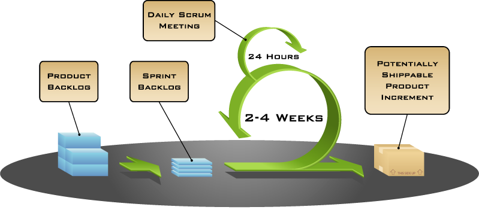

# Agile Model

Agile development is a set of principles and practices that focus on delivering software in small increments, with frequent feedback and iteration. The key principles of agile development include:

- Individuals and interactions over processes and tools
- Working software over comprehensive documentation
- Customer collaboration over contract negotiation
- Responding to change over following a plan

These principles are intended to help teams deliver high-quality software more efficiently and effectively, while also ensuring that the software meets the needs of its users. Agile development is often used in conjunction with other methodologies such as Scrum or Kanban, which provide specific frameworks for implementing agile practices.

## Practices of Agile Development

In addition to the principles, there are several key practices that are commonly associated with agile development:

- **Sprint Planning**: A meeting where the team determines what work they will complete during a sprint (usually one to four weeks).
- **Daily Stand-up**: A short daily meeting where team members share progress and discuss any blockers.
- **Sprint Review**: A meeting where the team demonstrates the completed work to stakeholders and gathers feedback. This can also be called a showcase.
- **Retrospective**: A meeting where the team reflects on their process and identifies areas for improvement.

These practices help teams stay focused, communicate effectively, and adapt to changing requirements.

(1)
{ .annotate }

1. Mountain Goat Software, CC BY 2.5 <https://creativecommons.org/licenses/by/2.5>, via Wikimedia Commons

## Roles and Stakeholders

In agile development, there are several key roles and stakeholders:

- **Product Owner**: The person responsible for defining the product vision and prioritising features.
- **Scrum Master**: The person responsible for facilitating the team's processes and ensuring they are following the agile framework.
- **Development Team**: The team responsible for building the product. This typically includes developers, testers, and designers.
- **Stakeholders**: Any individuals or groups who have an interest in the project, such as customers, managers, and investors.

These roles and stakeholders work together to ensure that the product meets the needs of the customer and is delivered on time and within budget.

## Benefits of Agile Development

Agile development offers several benefits, including:

- **Increased flexibility**: Teams can quickly respond to changes in requirements or priorities.
- **Improved collaboration**: Team members work closely together, which leads to better communication and problem-solving.
- **Better quality**: By delivering working software frequently, teams can identify and fix issues early on.
- **Faster time-to-market**: By delivering working software frequently, teams can get feedback from stakeholders and make changes more quickly.
- **Increased customer satisfaction**: By delivering working software frequently, teams can get feedback from stakeholders and make changes more quickly.

Overall, agile development is a powerful approach that helps teams deliver high-quality software more efficiently.

## Drawbacks of Agile Development

While agile development offers many benefits, it also has some drawbacks. These include:

- **Complexity**: Implementing agile practices can be challenging and require significant training.
- **Resistance to change**: Some organizations may resist adopting agile because they are used to traditional waterfall methodologies.
- **Lack of documentation**: Agile development emphasises delivering working software over comprehensive documentation, which can make it difficult for new team members to understand the project.
- **Risk management**: Agile teams must be able to manage risks effectively, as they may not have a detailed plan or timeline.
- **Measurement challenges**: Measuring the success of an agile project can be difficult because there is no one-size-fits-all approach.

## References

- [Agile Manifesto](https://agilemanifesto.org/)
- [Agile Alliance](https://www.agilealliance.org/)

### Processes
- [Scrum Guide](https://scrumguides.org/scrum-guide.html)
- [Kanban Method](https://kanbantool.com/blog/what-is-kanban/)
- [Lean Software Development](https://www.amazon.com/Lean-Software-Development-Building-Measure/dp/0321350846)
- [Continuous Delivery](https://continuousdelivery.com/)

### Practices

- [Sprint Retrospectives](https://www.scrumalliance.org/community/articles/2017/december/sprint-retrospectives-the-most-important-meeting-in-agile)
- [User Stories](https://www.mountaingoatsoftware.com/blog/user-stories-explained)
- [Backlog Refinement](https://www.scrumalliance.org/community/articles/2017/december/backlog-refinement)
- [Sprint Planning](https://www.scrumalliance.org/community/articles/2017/december/sprint-planning)
- [Daily Stand-ups](https://www.scrumalliance.org/community/articles/2017/december/daily-stand-ups)
- [Scrum of Scrums](https://www.scrumalliance.org/community/articles/2017/december/scrum-of-scrums)
- [Sprint Reviews](https://www.scrumalliance.org/community/articles/2017/december/sprint-reviews)

