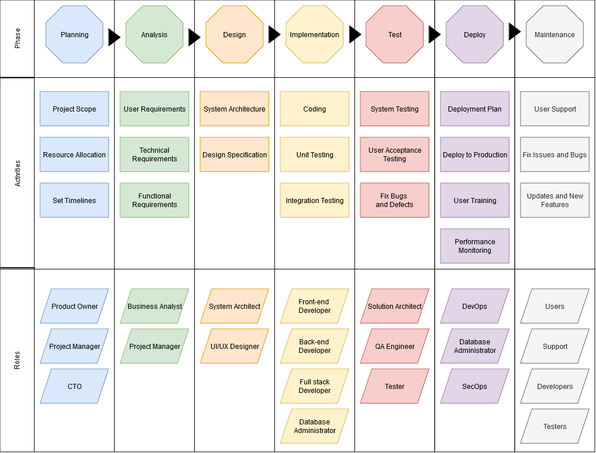
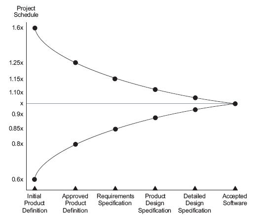
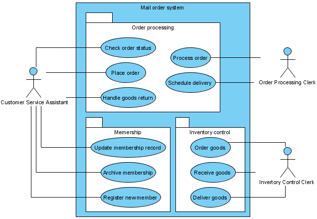
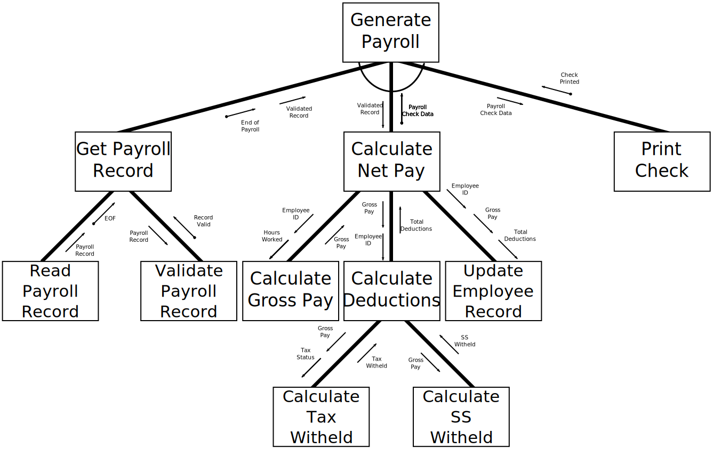

# Software Development Life Cycle

The Software Development Life Cycle *SDLC* is the core of software engineering. It aims to produce software products that meet or exceed customer expectations, even for the most basic needs. This structured process integrates critical stages to deliver high-quality results through every stage of product development, from conception to operation. The primary goal is to manage each phase efficiently while supporting customers with maximum effectiveness and timeliness. By doing so, SDLC ensures a well-designed, functional, and user-friendly product that meets customer requirements. There are many different models that can be followed but they all have similar components.

## Planning
*The best laid plans of mice and men often go awry* (1)
{ .annotate }

1. Burns, Robert. To a Mouse 1785

Planning is critical to the success of most software development projects. Plans along with estimates of effort guide investment decisions. A company may be willing to invest in a 6 month project that may require 4 *FTEs* but they may resist or refuse to invest in a project that will take many years of investment or even more than 1 year. Planning is difficult and can also be wrong. This can result in some teams avoiding to plan at all, and not able to answer simple question like "when can this be ready?". They can also spend too much time in planning trying to account for everything but their plans are not guaranteed to be right or stay accurate after the first day of design or code. Barry Boehm described the range of uncertainty with planning and estimates when describing the waterfall model. 

This shows that at the planning phase the schedule can be out by a factor of +160% or -60% and as progress is made and more is understood about the system under development those plans and estimates become more certain. 

Planning is done to:

- Identify and reduce risk
- Reduce the uncertainty of delivering a solution
- Support better decision making around doing a project and where best to invests time, money and resources.
- Establish trust with the customer through planning frequent and reliable delivery of features and trust between management and developers that timelines can be achieved and not at the cost of bugs and poor code due to poor planning.
- It also allows a customer to pick and choose features. Maybe a low priority feature can be dropped if it would take too long to develop.
- Conveys expectations and sets a baseline of what can be delivered. It does not guarantee all features can be delivered on time and on budget.

A common idiom in the software development life cycle is that you can have a project delivered on time, on budget or all features, pick two. The meaning behind this is that software development is complex and typically by the end of the project one of these 3 requirements is sacrificed to deliver a product.

### Why Plans Fail

- Nearly 2 out of 3 projects significantly overrun their cost estimates (1)
- 64% of of features included in products are not used (2)
- The average project exceeds its schedule by 100% (3)

1. LEDERER, A. L., & PRASAD, J. (1992). Nine management guidelines for better cost estimating. Communications of the ACM, 35(2), 50–59.
2. Johnson 2002
3. Standish 2001

## Analysis
Analysis involves determining the requirements of the system to be developed. If following the waterfall model it can be a thorough examination of the problem, goals, and requirements of the project to determine how it can be successfully completed. When following an agile model it can be a more iterative approach where the requirements are continuously refined throughout the development process.

### Goals of Analysis

- **Understand the Problem:** Identify and document the business needs, goals, and objectives that the system is intended to meet.
- **Define Requirements:** Gather and document the functional and non-functional requirements of the system, including user needs, technical specifications, and performance expectations.
- **Identify Feasibility:** Assess whether the proposed solution is technically feasible, economically viable, and meets the business goals.

### Analysis Activities:

- **Business Analysis:** Conduct interviews with stakeholders to understand their needs, identify potential solutions, and document requirements.
- **Requirements Gathering:** Collect and document functional and non-functional requirements through techniques such as use cases, user stories, or business process modelling.
- **Data Analysis:** Examine existing data sources, determine the data required for the system, and develop a data management plan.
- **Technical Analysis:** Evaluate the technical feasibility of proposed solutions, identify potential technical risks, and recommend architectural approaches.

#### Function Requirements:

Functional requirements describe what the system must do from a user's perspective. They outline the expected behaviour, interactions, and outcomes of the system in response to specific inputs or events. These requirements are expected to be specific, measurable, achievable, relevant, and time-bound (SMART). Different types of functional requirements include:

- **User Interface Requirements:** Describe how users will interact with the system, including screen layouts, navigation, and user controls.
- **Business Logic Requirements:** Define the rules and processes that govern the system's operations, such as data validation, business rules, and workflows.

#### Examples of Functional Requirements:

- "The user can log in to the system using their username and password."
- "The system must display a list of all customers in descending order by sales amount."
- "The system sends an automated email notification to users when their account balance falls below $10."
- "The system calculates the average price of items purchased within the last 30 days."

#### Non-Functional Requirements:

Non-functional requirements describe how the system should perform in terms of performance, reliability, security, usability, and other non-technical factors. These requirements are expected to be measurable and verifiable. Different types of non-functional requirements include:

- **Performance Requirements:** Define how fast, reliable, and scalable the system should be. Examples include response time, throughput, and concurrency.
- **Usability Requirements:** Define how easy it is for users to interact with the system. Examples include ease of navigation, clarity of instructions, and accessibility features.
- **Security Requirements:** Define how secure the system should be against unauthorised access, data breaches, and other security threats. Examples include encryption, authentication, and authorisation.
- **Reliability Requirements:** Define how often the system should be available and how quickly it should recover from failures. Examples include up-time, mean time between failures (*MTBF*), and mean time to repair (*MTTR*).

### Analysis Outputs / Deliverables:

- **Software Requirements Specification (SRS):** A document that outlines the technical requirements for the system.
- **Business Requirements Document (BRD):** A document that outlines the business needs, goals, and objectives.
- **Functional Specification Document (FSD):** A detailed description of the system's functionality, including user interfaces and system interactions.
- **Data Flow Diagrams:** Visual representations of how data flows through the system.
- **Use Case Models:** Documents that describe the interaction between actors (users) and the system.
- **User Stories:** Short descriptions of features or functionality from the perspective of a user.

 (1)
{ .annotate }

1. https://en.wikipedia.org/wiki/File:UseCaseDiagramExample.png#filelinks

### Analysis Methods:

- **Structured Analysis:** A method that uses diagrams to model business processes and identify requirements. This may include Structure Charts.
- **Object-Oriented Analysis:** An approach that focuses on modelling the structure of the system using objects and classes. *UML* diagrams are commonly used in this approach.
- **Use Case Driven Development:** A method that emphasises the importance of the user experience and their interaction with the system.

 (1)
{ .annotate }

1. Pluke, Public domain, via Wikimedia Commons

!!! Note
    Structured Charts are rarely used in the industry today due to their complexity and lack of flexibility. They can however be beneficial when learning to develop software systems to understand how it would work and the logical sequence of event that should occur. Alternative methods such as Object-Oriented Analysis or Use Case Driven Development are often preferred but are used more at a high level of detail. It is likely needed at lower levels when working on mission critical systems like a traffic control system.

### Best Practices:

- **Involve Stakeholders Early:** Engage stakeholders throughout the analysis process to ensure their needs are met.
- **Document Requirements Thoroughly:** Use clear, concise language and avoid ambiguities in requirements documents.
- **Validate Assumptions:** Regularly review and validate assumptions with stakeholders to ensure the solution is aligned with business goals.
- **Iterate Based on Feedback:** Continuously gather feedback from users and stakeholders, and make iterative improvements to the system.

## Design

The design phase is where the software architect and designers create a detailed plan for building the system. The primary goal of this phase is to produce a complete, accurate, and feasible design that meets the requirements gathered during analysis. This is expected when following the waterfall model of development. Depending on the size of the team, the project's complexity and the processes being followed the designer might also be the developer and the design may only focus on the current feature being developed.

### Purpose of Design Phase:

- **Create a System Architecture:** Develop a high-level architecture that defines the overall structure and organization of the system.
- **Define Technical Requirements:** Identify technical specifications for software components, interfaces, data storage, and other system aspects.
- **Design User Interfaces:** Create detailed designs for user interfaces, including layout, navigation, and interaction flows.
- **Identify Technical Risks:** Assess potential technical risks and propose mitigation strategies.

### Activities of Design Phase:

- **System Architecture Design:** Creating a high-level blueprint or architecture for a software system, which defines how the various components will interact with each other to achieve the - desired functionality.
- **Component-Level Design:** Create detailed designs for individual software components, including APIs, databases, and services.
- **Data Model Design:** Define data structures, relationships, and storage requirements.
- **User Interface Design:** Create wireframes, prototypes, or high-fidelity designs for user interfaces.
- **Technical Documentation Generation:** Produce technical documents that describe the system's architecture, components, and interfaces.
- **Design Review and Revisions:** Conduct design reviews to ensure the design meets requirements and makes necessary revisions.

### Design Outputs / Deliverables:

- **System Architecture Diagrams:** Visual representations of the system's overall structure and organization.
- **Component Diagrams:** Detailed diagrams illustrating individual software components and their interactions.
- **Data Flow Diagrams:** Visualisations of data flows through the system.
- **User Interface Designs:** Wireframes, prototypes, or high-fidelity designs for user interfaces.
- **Technical Documentation:** Documented descriptions of the system's architecture, components, and interfaces.

### Design Methods:

- **Object-Oriented Design (OOD):** Emphasises modular, reusable components with well-defined interfaces.
- **Agile Design:** Focuses on iterative design, prototyping, and user feedback to drive development.
- **Model-Driven Architecture (MDA):** Uses models to define the system's architecture and generate code.
- **Domain Driven Design (DDD):** Focuses on modelling the domain logic and business rules within the system.

### Best Practices for Design Phase:

- **Involve stakeholders early:** Engage users, developers, and other stakeholders in the design process.
- **Document designs thoroughly:** Use clear, concise language and avoid ambiguity.
- **Test designs with prototypes:** Validate assumptions through user testing and feedback.
- **Maintain a single source of truth:** Keep design documentation up-to-date and accessible to all team members.

More details on the design processes, tools and techniques can be found [here](./design.md).

## Implementation
The Implementation Phase is where the designed system is transformed into a working solution. The primary purpose of this phase is to bring all components and features together, ensuring seamless interactions between them. During implementation, individual software components are developed, integrated, and tested, with a focus on delivering a fully functional system that meets user needs. This phase also involves data migration, user acceptance testing (UAT), and knowledge transfer activities to ensure that the new system is properly documented and maintained. The successful completion of the Implementation Phase results in a working system that is reliable, efficient, and meets stakeholder expectations.

### Activities

1. **Code Implementation**: Writing the source code for the application using appropriate programming languages and frameworks.
2. **Integration**: Combining different modules or components to create a fully integrated system.
3. **Unit Testing**: Conducting individual unit tests on each component or module to ensure they function as expected in isolation.
4. **System Testing**: Performing comprehensive testing of the entire system to verify that it meets functional and non-functional requirements, such as performance, security, and usability.
5. **Integration Testing**: Ensuring that all integrated components work together seamlessly and produce the desired output.
6. **Code Reviews**: Conducting code reviews by other developers or stakeholders to identify potential issues and improve code quality.
7. **Documentation**: Creating comprehensive documentation for the developed system, including user manuals, API documentation, and technical specifications.

### Purpose

1. **Translate Design into Code**: Convert the design specifications into actual working software code.
2. **Ensure Functionality**: Verify that each component and the entire system functions as intended, meeting all functional requirements.
3. **Improve Quality**: Identify and fix defects or issues during testing to improve the overall quality of the system.
4. **Facilitate Integration**: Combine different components into a cohesive system, ensuring seamless integration and compatibility.
5. **Document System**: Create detailed documentation for the developed system, making it easier for users and stakeholders to understand and use the system.

By focusing on these activities and purposes, the Implementation Phase ensures that the software system is developed efficiently, effectively, and with a high degree of quality, meeting stakeholder expectations and requirements.

The unit on [Object Oriented Programming (OOP)](../object_oriented_software/index.md) will provide more details on the implementation phase.

## Test
The Test Phase is aimed at ensuring that the developed system meets the required quality standards, is reliable, and functions as expected. The primary purpose of this phase is to identify and report defects or issues in the system, allowing for timely corrections and improvements before release. Through various testing techniques, such as unit testing, integration testing, system testing, and acceptance testing, the test phase verifies that the system meets its functional, performance, security, and usability requirements. By identifying and addressing defects early on, the Test Phase helps to reduce project costs, minimise rework, and ensure that the final product is of high quality, reliable, and meets stakeholder expectations. The successful completion of the Test Phase guarantees that the developed system is defect-free, efficient, and effective in meeting its intended purpose.

More details on testing techniques can be found [here](./test.md).

## Deploy
The Deployment Phase is where the tested system is deployed to production, making it available for use by end-users. The primary purpose of this phase is to transfer the developed software from a testing environment to a live production environment, ensuring seamless integration with existing systems and infrastructure. During deployment, various tasks are performed, including configuring servers, databases, and other dependencies; updating external interfaces and integrations; and executing final quality assurance checks. The successful completion of the Deployment Phase results in the system being available for use by end-users, enabling them to access its features and functionality as intended. 

### Activities

1. **Preparation**: Preparing the deployment environment by ensuring that all necessary hardware, software, and network resources are available.
2. **Installation**: Installing the software on the target environment, including configuring dependencies and setting up any required infrastructure.
3. **Configuration**: Configuring the system according to the organization's requirements, such as integrating with existing systems or databases.
4. **Testing**: Conducting final testing of the deployed system in the production environment to ensure it meets all functional and non-functional requirements.
5. **User Training**: Providing training sessions for end-users on how to use the new system effectively.
6. **Documentation**: Creating comprehensive documentation for the deployed system, including user manuals, API documentation, and technical specifications.
7. **Go-Live Planning**: Developing a go-live plan that includes the date, time, and procedures for transitioning users from the old system (if any) to the new system.

**Purpose:**

1. **Make System Available**: Ensure that the developed software system is properly installed, configured, and integrated into the organization's environment, making it ready for actual usage.
2. **Verify Functionality**: Conduct final testing in the production environment to ensure that the system meets all functional and non-functional requirements.
3. **Transfer Ownership**: Transfer ownership of the deployed system from development teams to operational teams or end-users.
4. **Provide Support**: Provide ongoing support and maintenance services to address any issues that arise during the system's use.
5. **Document Deployment**: Create comprehensive documentation for the deployed system, making it easier for users and stakeholders to understand and use the system.

By focusing on these activities and purposes, the Deployment Phase ensures that the software system is delivered successfully, meeting stakeholder expectations and requirements, and providing ongoing support and maintenance services as needed.

The above activities are more traditional for a waterfall model. In an Agile model, these activities may be integrated into the Iteration Planning and Review phases. DevOps and SecOps practices may further streamline these processes by automating certain tasks and integrating DevOps tools into the SDLC. This is what is termed shifting left in development practices, where more of the later phases are addressed earlier in the development process.

## Maintenance
The Maintenance Phase is an ongoing component of the Software Development Life Cycle (SDLC), focused on ensuring that the deployed system continues to meet changing user needs, adapt to new technologies, and remain secure over time. The primary purpose of this phase is to monitor the system's performance, identify areas for improvement, and implement updates, fixes, and enhancements to maintain its quality, reliability, and functionality. Through regular review and analysis of user feedback, system logs, and other metrics, maintenance activities aim to address emerging issues, optimise performance, and align the system with evolving business requirements. By dedicating resources to ongoing maintenance, organisations can ensure that their software systems remain relevant, efficient, and effective in meeting stakeholder expectations.

In companies that develop and operate their own systems, the Maintenance Phase is often a significant part of their overall strategy. It involves not only technical activities such as bug fixing and performance tuning but also business processes like user training, process improvement, and strategic planning. By prioritising maintenance, organisations can reduce the risk of downtime, improve customer satisfaction, and enhance their competitive advantage. The company may set up a dedicated team or department responsible for managing the Maintenance Phase, ensuring that all necessary resources are allocated to address any issues that arise.
