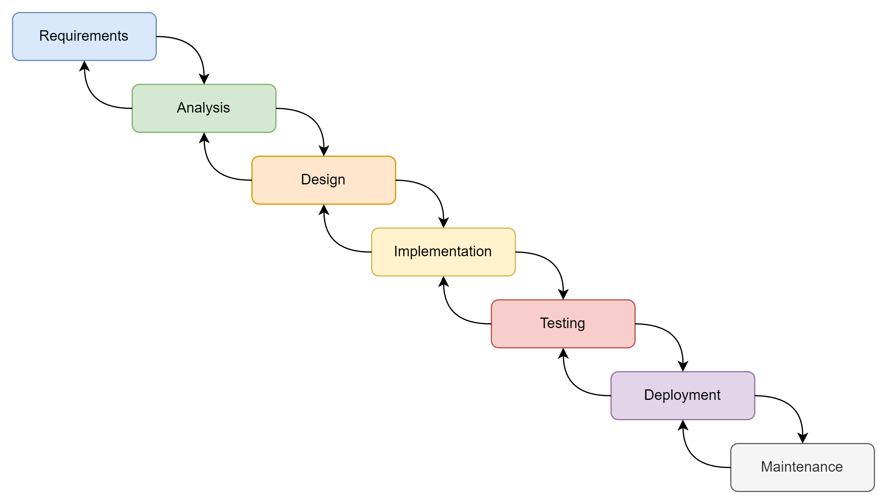

# Waterfall Model

The waterfall model is a linear sequential software development process. It involves a series of phases that must be completed in order before the next phase can begin. The phases typically include requirements gathering, design, implementation, testing, and maintenance. Each phase builds upon the previous one, ensuring that the software is developed systematically and thoroughly.

(1)
{.annotate}

1. Aaron Beverley, CC BY-SA 4.0 <https://creativecommons.org/licenses/by-sa/4.0>, Created with draw.io.

The waterfall model is often considered to be a traditional approach to software development because it has been around for many years. It is straightforward to understand and implement, making it a popular choice for small projects or teams with limited resources.

However, the waterfall model has several limitations that can make it unsuitable for larger or more complex projects. One of the main issues is that it assumes that all requirements are known at the beginning of the project and that they will not change throughout the development process. This can be difficult to achieve in practice, as requirements often evolve over time. Additionally, the sequential nature of the model means that if a problem is discovered during testing or maintenance, it may be too late to fix it without causing significant delays or additional costs. 

## Phases of Waterfall Model

The waterfall model typically consist of seven phases.

1. **Requirements Gathering**: This phase involves identifying and documenting the needs of the stakeholders. It includes activities such as interviews, surveys, and workshops. The goal is to gather all the requirements that will be used to develop the software.
2. **Analysis**: In this phase, the gathered requirements are analysed to determine their feasibility and to create a detailed design for the software. This involves creating use cases, data flow diagrams, and other artifacts that describe how the software should work. 
3. **Design**: The design phase involves creating a detailed plan for implementing the software. This includes creating architecture diagrams, component diagrams, and other artifacts that describe how the software will be built. The goal is to create a design that is both feasible and scalable.
4. **Implementation**: In this phase, the software is actually developed according to the design plan. This involves writing code, testing, and debugging. The goal is to produce a working version of the software that meets all the requirements.
5. **Testing**: This phase of the waterfall model involves testing the software to ensure that it meets all the requirements and is free of defects. This includes unit testing, integration testing, system testing, and acceptance testing.
6. **Deployment**: Once the software has been tested and approved, it is deployed to the production environment. This involves configuring the software, setting up user accounts, and providing training to users.
7. **Maintenance**: After deployment, the software may need to be updated or modified to fix defects or add new features. This phase involves ongoing support and maintenance of the software.

## Benefits of Waterfall Model
The waterfall model has several benefits, including:

1. **Clarity**: The model provides a clear and structured approach to software development. Each phase must be completed before moving on to the next, which helps ensure that all requirements are met. Note the arrows in the diagram above. You can also move back a phase, but this happens in rare cases and you will only move back to a previous phase if there is an error or defect found in the current phase.
2. **Documentation**: The model requires extensive documentation at each stage of the development process. This documentation serves as a reference for future maintenance and support.
3. **Risk Management**: By breaking down the software development process into discrete phases, the waterfall model allows for better risk management. Each phase can be tested and reviewed before moving on to the next, which helps identify potential problems early in the development process.
4. **Predictability**: The model provides a predictable timeline for software development. Each phase has a specific duration, which helps ensure that the project stays on schedule.
5. **Quality Assurance**: The model emphasises quality assurance at each stage of the development process. This includes code reviews, testing, and other activities to ensure that the final product meets the required standards.
6. **Team Coordination**: The model requires close coordination between all team members involved in the software development process. This helps ensure that everyone is working towards a common goal.

## Drawbacks of Waterfall Model
The waterfall model also has several drawbacks, including:

1. **Rigidity**: The model can be rigid and inflexible. Changes to requirements or design during the development process can be costly and time-consuming.
2. **Lack of Flexibility**: The model does not allow for flexibility in the software development process. Once a phase is completed, it cannot be changed without considerable effort and resources that can severely impact the project timeline and budget.
3. **Communication Issues**: The model relies on extensive documentation to communicate requirements and design decisions. This can lead to communication issues if the documentation is not clear or up-to-date.
4. **Risk of Failure**: The model assumes that all requirements are known at the start of the development process. If this assumption is incorrect, it can lead to a failure in the project, cost overruns, reduction in project scope, or extended project timelines.
5. **Lack of Feedback**: The model does not provide feedback until the end of each phase. This can make it difficult to identify and address issues early in the development process.
6. **High Cost**: The model can be expensive because it requires extensive documentation, testing, and quality assurance.

