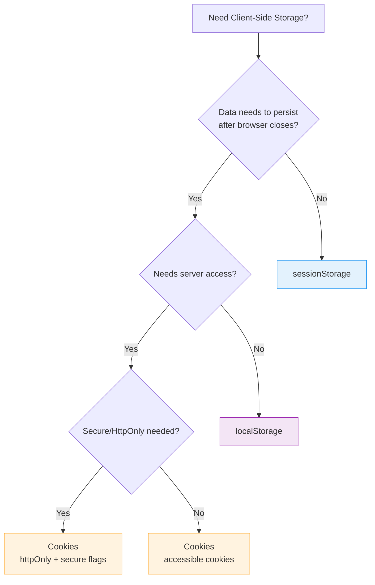
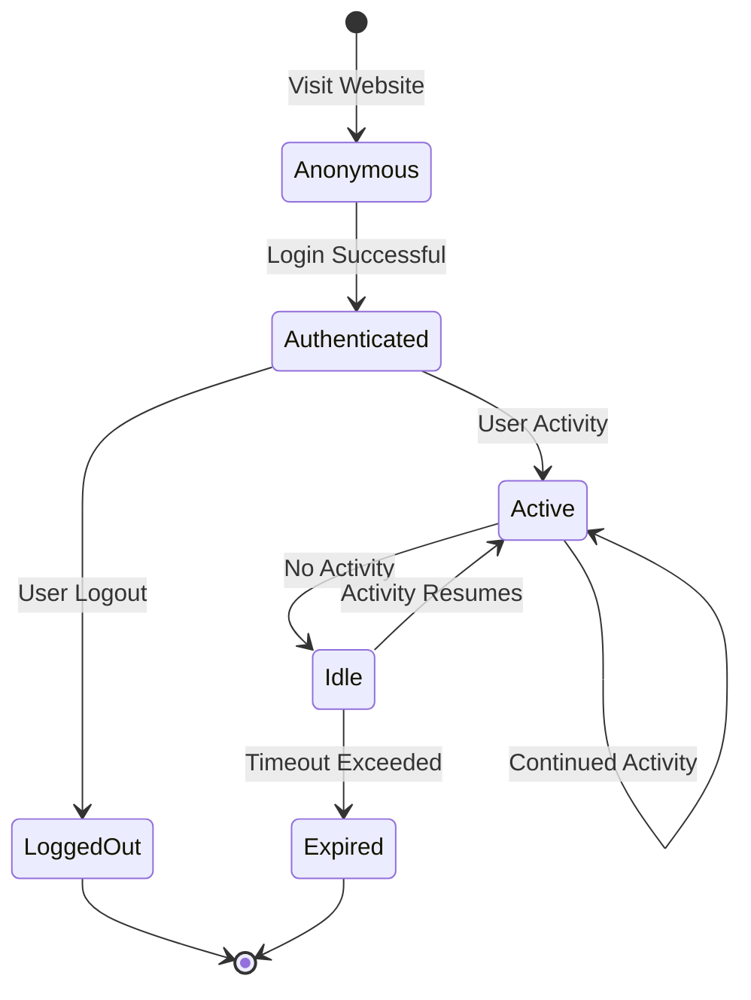
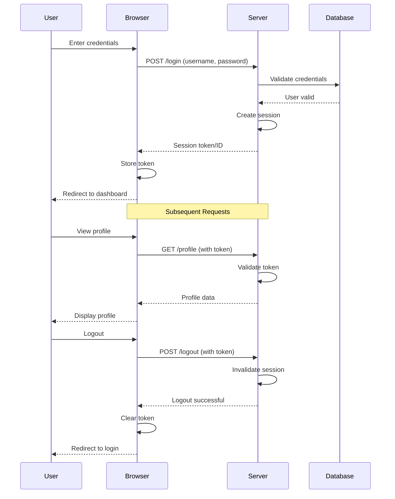
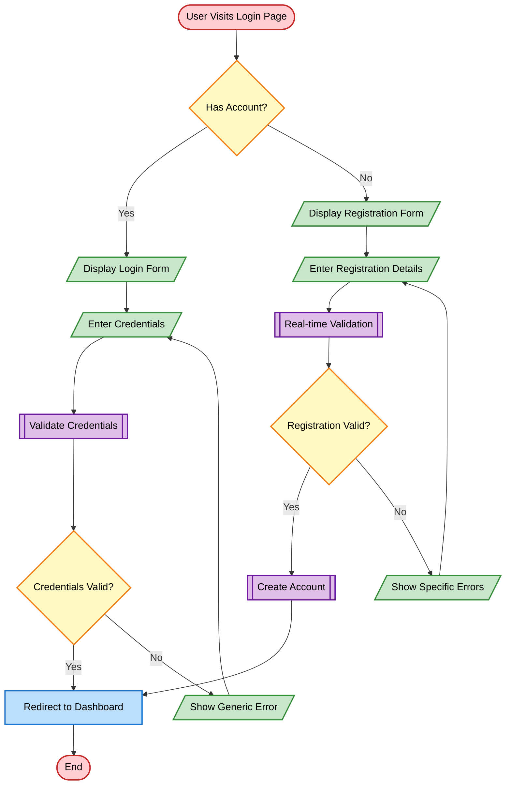
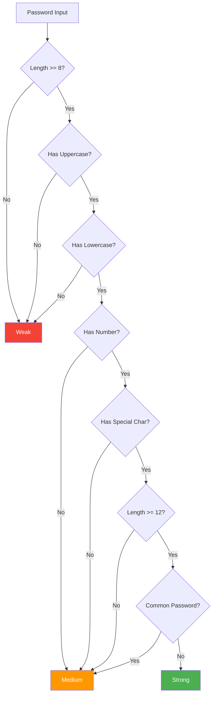
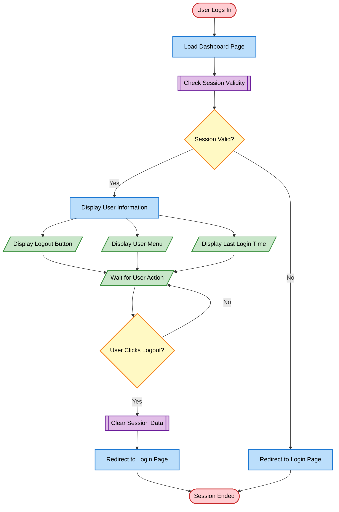

# Client-Side Session Concepts & Secure Authentication UI

## Lesson Overview

!!! info "Lesson Details"
    **Duration:** 90-120 minutes (self-paced)
    
    **Focus:** Understanding client-side storage, session concepts, and building secure authentication interfaces
    
    **Mode:** Self-paced with hands-on activities
    
    **Prerequisites:**
    
    - HTML forms and semantic markup
    - CSS styling and layout techniques
    - JavaScript DOM manipulation and event handling
    - Git version control basics
    - Understanding of basic web security concepts

## Learning Objectives

By the end of this lesson, you will be able to:

1. **Analyse** the security implications of different client-side storage options (cookies, localStorage, sessionStorage)
2. **Create** secure authentication user interfaces following UX best practices
3. **Implement** real-time password strength validation with visual feedback
4. **Evaluate** what data should and should not be stored client-side
5. **Design** session management interfaces whilst understanding their limitations without a backend

!!! warning "Important Security Note"
    This lesson focuses on **client-side implementation only**. True security requires server-side validation and authentication. Everything we build here is educational and demonstrates UI/UX patterns—not production-ready security.

## Syllabus Alignment

This lesson covers the following syllabus outcomes:

**Programming for the Web:**

- ✓ Design and apply UI/UX principles (interactive security elements, dynamic feedback)

**Secure Software Architecture:**

- ✓ Design, develop and implement code considering efficient execution (session management - client-side introduction)
- ✓ Apply security features for data protection, privacy and regulatory compliance
- ✓ Use and explain 'privacy by design' approach (respect for user privacy)

---

## 1: Client-Side Storage Options (25-30 minutes)

### Theory: Storage Mechanisms

Web browsers provide three primary storage mechanisms for client-side data. Each has different characteristics, use cases, and security implications.

| Feature | Cookies | localStorage | sessionStorage |
|---------|---------|--------------|----------------|
| **Persistence** | Can have expiry dates | Persistent until cleared | Cleared when tab closes |
| **Size Limit** | ~4KB | 5-10MB | 5-10MB |
| **Scope** | Sent with every HTTP request | Same origin only | Tab-scoped |
| **Accessibility** | Can be httpOnly and secure | Accessible via JavaScript | Accessible via JavaScript |
| **Best For** | Session IDs (server-side) | User preferences, app state | Temporary session data |



#### Cookies

Cookies are small pieces of data stored by the browser and sent with every HTTP request to the same domain.

**Characteristics:**

- Maximum size: approximately 4KB
- Can be set to expire (session cookies vs persistent cookies)
- Automatically sent with HTTP requests (can be a security risk)
- Can have security flags: `httpOnly`, `secure`, `sameSite`

**Use cases:**

- Session identifiers (when configured securely)
- User preferences that need server access
- Tracking (though privacy concerns exist)

#### localStorage

localStorage provides persistent storage that remains even after the browser is closed.

**Characteristics:**

- Storage capacity: 5-10MB (varies by browser)
- Data persists until explicitly cleared
- Accessible only from the same origin (protocol + domain + port)
- Synchronous API (can block main thread for large operations)

**Use cases:**

- User preferences and settings
- Application state that should persist
- Cached data for offline functionality
- Draft content (autosave functionality)

#### sessionStorage

sessionStorage is similar to localStorage but scoped to a single browser tab/window.

**Characteristics:**

- Storage capacity: 5-10MB (varies by browser)
- Data cleared when tab/window is closed
- Separate storage for each tab, even from the same site
- Synchronous API

**Use cases:**

- Temporary session data
- Multi-step form data within a session
- Tab-specific application state

### Security Trade-offs

!!! danger "NEVER Store These Client-Side"
    - **Passwords** (plain text or hashed)
    - **Authentication tokens** without encryption
    - **Sensitive personal information** (credit cards, national IDs)
    - **Private keys or secrets**
    - **Session tokens** in localStorage (use httpOnly cookies instead)

**Why?**

- JavaScript can access localStorage and sessionStorage
- Cross-Site Scripting (XSS) attacks can steal this data
- Users may share computers
- Browser extensions can access storage

### Activity 1.1: Exploring Storage APIs

Create a file called `storage-demo.html` and experiment with different storage mechanisms.

```html
<!DOCTYPE html>
<html lang="en">
<head>
    <meta charset="UTF-8">
    <meta name="viewport" content="width=device-width, initial-scale=1.0">
    <title>Storage Demonstration</title>
    <style>
        body {
            font-family: Arial, sans-serif;
            max-width: 800px;
            margin: 2rem auto;
            padding: 0 1rem;
        }
        .storage-section {
            border: 1px solid #ddd;
            padding: 1rem;
            margin: 1rem 0;
            border-radius: 5px;
        }
        .storage-section h3 {
            margin-top: 0;
        }
        input, button {
            margin: 0.5rem 0;
            padding: 0.5rem;
        }
        .output {
            background: #f5f5f5;
            padding: 1rem;
            margin-top: 1rem;
            border-radius: 3px;
            min-height: 50px;
        }
    </style>
</head>
<body>
    <h1>Client-Side Storage Demonstration</h1>
    
    <div class="storage-section">
        <h3>localStorage (Persistent)</h3>
        <input type="text" id="localKey" placeholder="Key">
        <input type="text" id="localValue" placeholder="Value">
        <button onclick="setLocal()">Store in localStorage</button>
        <button onclick="getLocal()">Retrieve from localStorage</button>
        <button onclick="clearLocal()">Clear localStorage</button>
        <div class="output" id="localOutput"></div>
    </div>
    
    <div class="storage-section">
        <h3>sessionStorage (Tab-scoped)</h3>
        <input type="text" id="sessionKey" placeholder="Key">
        <input type="text" id="sessionValue" placeholder="Value">
        <button onclick="setSession()">Store in sessionStorage</button>
        <button onclick="getSession()">Retrieve from sessionStorage</button>
        <button onclick="clearSession()">Clear sessionStorage</button>
        <div class="output" id="sessionOutput"></div>
    </div>

    <script>
        // localStorage functions
        function setLocal() {
            const key = document.getElementById('localKey').value;
            const value = document.getElementById('localValue').value;
            
            if (key && value) {
                localStorage.setItem(key, value);
                document.getElementById('localOutput').textContent = 
                    `Stored: ${key} = ${value}`;
            }
        }

        function getLocal() {
            const key = document.getElementById('localKey').value;
            const value = localStorage.getItem(key);
            
            document.getElementById('localOutput').textContent = 
                value ? `Retrieved: ${key} = ${value}` : `No value found for "${key}"`;
        }

        function clearLocal() {
            localStorage.clear();
            document.getElementById('localOutput').textContent = 'localStorage cleared';
        }

        // sessionStorage functions
        function setSession() {
            const key = document.getElementById('sessionKey').value;
            const value = document.getElementById('sessionValue').value;
            
            if (key && value) {
                sessionStorage.setItem(key, value);
                document.getElementById('sessionOutput').textContent = 
                    `Stored: ${key} = ${value}`;
            }
        }

        function getSession() {
            const key = document.getElementById('sessionKey').value;
            const value = sessionStorage.getItem(key);
            
            document.getElementById('sessionOutput').textContent = 
                value ? `Retrieved: ${key} = ${value}` : `No value found for "${key}"`;
        }

        function clearSession() {
            sessionStorage.clear();
            document.getElementById('sessionOutput').textContent = 'sessionStorage cleared';
        }

        // Display existing data on page load
        window.addEventListener('load', () => {
            const localKeys = Object.keys(localStorage);
            const sessionKeys = Object.keys(sessionStorage);
            
            if (localKeys.length > 0) {
                document.getElementById('localOutput').textContent = 
                    `Existing keys: ${localKeys.join(', ')}`;
            }
            
            if (sessionKeys.length > 0) {
                document.getElementById('sessionOutput').textContent = 
                    `Existing keys: ${sessionKeys.join(', ')}`;
            }
        });
    </script>
</body>
</html>
```

!!! tip "Experimentation Tasks"
    1. Store a value in localStorage, close the browser, and reopen—does it persist?
    2. Store a value in sessionStorage, close the tab, open a new tab to the same page—what happens?
    3. Open the same page in two different tabs. Store different values in sessionStorage in each tab. Are they separate?
    4. Open Developer Tools (F12) → Application tab → Storage to inspect stored values
    5. Try storing an object: `localStorage.setItem('user', JSON.stringify({name: 'Alice', role: 'student'}))`

### Activity 1.2: Understanding Storage Security

Create a file called `storage-security.html` to explore security implications.

```html
<!DOCTYPE html>
<html lang="en">
<head>
    <meta charset="UTF-8">
    <meta name="viewport" content="width=device-width, initial-scale=1.0">
    <title>Storage Security Analysis</title>
    <style>
        body {
            font-family: Arial, sans-serif;
            max-width: 900px;
            margin: 2rem auto;
            padding: 0 1rem;
        }
        .scenario {
            border-left: 4px solid #333;
            padding: 1rem;
            margin: 1rem 0;
            background: #f9f9f9;
        }
        .safe {
            border-left-color: #4CAF50;
        }
        .unsafe {
            border-left-color: #f44336;
        }
        .warning {
            border-left-color: #ff9800;
        }
        button {
            padding: 0.5rem 1rem;
            margin: 0.5rem 0.5rem 0.5rem 0;
            cursor: pointer;
        }
        .safe-btn {
            background: #4CAF50;
            color: white;
            border: none;
        }
        .unsafe-btn {
            background: #f44336;
            color: white;
            border: none;
        }
    </style>
</head>
<body>
    <h1>Storage Security Analysis</h1>
    <p>Click each button to see the security implications of different storage choices.</p>
    
    <div class="scenario safe">
        <h3>✓ Safe: User Theme Preference</h3>
        <button class="safe-btn" onclick="storeTheme()">Store Theme Preference</button>
        <p id="themeResult"></p>
    </div>
    
    <div class="scenario unsafe">
        <h3>✗ Unsafe: Password in localStorage</h3>
        <button class="unsafe-btn" onclick="storePasswordUnsafe()">Store Password (DON'T DO THIS!)</button>
        <p id="passwordResult"></p>
    </div>
    
    <div class="scenario warning">
        <h3>⚠ Questionable: Session Token in localStorage</h3>
        <button onclick="storeTokenLocal()">Store Token in localStorage</button>
        <p id="tokenLocalResult"></p>
    </div>
    
    <div class="scenario safe">
        <h3>✓ Better: Session Token in sessionStorage</h3>
        <button class="safe-btn" onclick="storeTokenSession()">Store Token in sessionStorage</button>
        <p id="tokenSessionResult"></p>
    </div>
    
    <div class="scenario safe">
        <h3>✓ Safe: Form Draft Data</h3>
        <button class="safe-btn" onclick="storeDraft()">Store Draft Content</button>
        <p id="draftResult"></p>
    </div>

    <h2>Security Analysis</h2>
    <button onclick="showAnalysis()">View All Stored Data</button>
    <div id="analysis" style="background: #f5f5f5; padding: 1rem; margin-top: 1rem; border-radius: 5px;"></div>

    <script>
        function storeTheme() {
            const theme = 'dark';
            localStorage.setItem('userTheme', theme);
            document.getElementById('themeResult').innerHTML = 
                `<strong>Safe:</strong> Theme preference stored. This is non-sensitive data that enhances user experience. ✓`;
        }

        function storePasswordUnsafe() {
            // Deliberately showing what NOT to do
            localStorage.setItem('userPassword', 'mySecretPassword123');
            document.getElementById('passwordResult').innerHTML = 
                `<strong>DANGER:</strong> Password stored in plain text! Any JavaScript code (including XSS attacks) can read this. 
                <br><strong>Never store passwords client-side!</strong> 
                <br>Check Developer Tools → Application → Local Storage to see this vulnerability.`;
        }

        function storeTokenLocal() {
            const fakeToken = 'eyJhbGciOiJIUzI1NiIsInR5cCI6IkpXVCJ9.example';
            localStorage.setItem('authToken', fakeToken);
            document.getElementById('tokenLocalResult').innerHTML = 
                `<strong>Risky:</strong> Authentication tokens in localStorage are vulnerable to XSS attacks. 
                <br>Better practice: Use httpOnly cookies (set by server) that JavaScript cannot access.
                <br>Acceptable only for: Non-critical applications where XSS risk is managed.`;
        }

        function storeTokenSession() {
            const fakeToken = 'eyJhbGciOiJIUzI1NiIsInR5cCI6IkpXVCJ9.example';
            sessionStorage.setItem('sessionToken', fakeToken);
            document.getElementById('tokenSessionResult').innerHTML = 
                `<strong>Better:</strong> sessionStorage is cleared when tab closes, reducing exposure time.
                <br>Still vulnerable to XSS, but lower risk than localStorage.
                <br>Best practice: httpOnly cookies set by server.`;
        }

        function storeDraft() {
            const draft = {
                title: 'My Blog Post',
                content: 'This is draft content...',
                lastSaved: new Date().toISOString()
            };
            localStorage.setItem('blogDraft', JSON.stringify(draft));
            document.getElementById('draftResult').innerHTML = 
                `<strong>Safe:</strong> Non-sensitive draft content stored. Improves user experience by preventing data loss. ✓`;
        }

        function showAnalysis() {
            let analysis = '<h3>Current Storage Contents:</h3>';
            
            analysis += '<h4>localStorage:</h4><ul>';
            for (let i = 0; i < localStorage.length; i++) {
                const key = localStorage.key(i);
                const value = localStorage.getItem(key);
                let risk = '✓ Safe';
                
                if (key.toLowerCase().includes('password')) {
                    risk = '✗ CRITICAL RISK';
                } else if (key.toLowerCase().includes('token')) {
                    risk = '⚠ Moderate Risk';
                }
                
                analysis += `<li><strong>${key}:</strong> ${value.substring(0, 50)}... <em>${risk}</em></li>`;
            }
            analysis += '</ul>';
            
            analysis += '<h4>sessionStorage:</h4><ul>';
            for (let i = 0; i < sessionStorage.length; i++) {
                const key = sessionStorage.key(i);
                const value = sessionStorage.getItem(key);
                let risk = '✓ Lower Risk (session-only)';
                
                if (key.toLowerCase().includes('token')) {
                    risk = '⚠ Still XSS vulnerable';
                }
                
                analysis += `<li><strong>${key}:</strong> ${value.substring(0, 50)}... <em>${risk}</em></li>`;
            }
            analysis += '</ul>';
            
            document.getElementById('analysis').innerHTML = analysis;
        }
    </script>
</body>
</html>
```

!!! question "Reflection Questions"
    After completing the activities, answer these questions:
    
    1. What happens to sessionStorage data when you close and reopen a tab?
    2. Why should passwords never be stored client-side?
    3. What is the main vulnerability of storing authentication tokens in localStorage?
    4. When might localStorage be appropriate for user data?
    5. How could you inspect what data a website has stored in your browser?

---

## 2: Session Concepts & Lifecycle (15-20 minutes)

### Theory: What is a Session?

A **session** represents a period of interaction between a user and a web application. It typically begins when a user logs in and ends when they log out or after a period of inactivity.



#### Session Lifecycle

1. **Session Creation**
    - User submits credentials (username/password)
    - Server validates credentials
    - Server creates session identifier
    - Session ID sent to client (cookie or token)

2. **Active Session**
    - Client includes session ID with each request
    - Server validates session ID
    - Server checks session hasn't expired
    - User can access protected resources

3. **Session Maintenance**
    - Activity extends session lifetime
    - Idle time tracked
    - Session data updated as needed

4. **Session Termination**
    - Explicit logout (user action)
    - Timeout (inactivity period exceeded)
    - Server-side invalidation (security event)

#### Session Tokens vs Session IDs

**Session ID:**

- A unique identifier for the session
- Typically a long random string
- Stored in a cookie (often httpOnly)
- Meaningless without server lookup

**Session Token (JWT/Bearer Token):**

- Contains encoded session data
- Can include user info, permissions, expiry
- Self-contained (server can validate without database lookup)
- Larger than session IDs



### Activity 2.1: Session State Simulator

Create a file called `session-simulator.html` to understand session lifecycle.

```html
<!DOCTYPE html>
<html lang="en">
<head>
    <meta charset="UTF-8">
    <meta name="viewport" content="width=device-width, initial-scale=1.0">
    <title>Session Lifecycle Simulator</title>
    <style>
        body {
            font-family: Arial, sans-serif;
            max-width: 800px;
            margin: 2rem auto;
            padding: 0 1rem;
        }
        .session-info {
            background: #e3f2fd;
            border-left: 4px solid #2196F3;
            padding: 1rem;
            margin: 1rem 0;
        }
        .session-expired {
            background: #ffebee;
            border-left-color: #f44336;
        }
        .session-active {
            background: #e8f5e9;
            border-left-color: #4CAF50;
        }
        .controls {
            margin: 1rem 0;
        }
        button {
            padding: 0.5rem 1rem;
            margin: 0.5rem 0.5rem 0.5rem 0;
            cursor: pointer;
            border: none;
            border-radius: 3px;
        }
        .btn-login {
            background: #4CAF50;
            color: white;
        }
        .btn-logout {
            background: #f44336;
            color: white;
        }
        .btn-activity {
            background: #2196F3;
            color: white;
        }
        .timeline {
            margin-top: 2rem;
            padding: 1rem;
            background: #f5f5f5;
            border-radius: 5px;
            max-height: 300px;
            overflow-y: auto;
        }
        .timeline-entry {
            padding: 0.5rem;
            margin: 0.25rem 0;
            background: white;
            border-left: 3px solid #ddd;
        }
        .info-display {
            font-family: monospace;
            background: #263238;
            color: #aed581;
            padding: 1rem;
            border-radius: 3px;
            margin: 1rem 0;
        }
    </style>
</head>
<body>
    <h1>Session Lifecycle Simulator</h1>
    
    <div id="sessionStatus" class="session-info">
        <h3>Session Status: Not Logged In</h3>
        <p>Please log in to start a session.</p>
    </div>
    
    <div class="controls">
        <button class="btn-login" onclick="login()" id="loginBtn">Login</button>
        <button class="btn-logout" onclick="logout()" id="logoutBtn" disabled>Logout</button>
        <button class="btn-activity" onclick="simulateActivity()" id="activityBtn" disabled>Simulate Activity</button>
    </div>
    
    <div class="info-display" id="sessionData">
        No active session
    </div>
    
    <h3>Session Settings</h3>
    <label>
        Timeout Duration (seconds): 
        <input type="number" id="timeoutDuration" value="30" min="10" max="300">
    </label>
    
    <div class="timeline" id="timeline">
        <strong>Activity Timeline:</strong>
        <p>No events yet</p>
    </div>

    <script>
        let sessionData = null;
        let timeoutTimer = null;
        let sessionStartTime = null;
        let lastActivityTime = null;

        function generateSessionToken() {
            // Simulate a session token (NOT cryptographically secure - for demo only)
            return 'sess_' + Math.random().toString(36).substring(2) + Date.now().toString(36);
        }

        function addTimelineEntry(message, type = 'info') {
            const timeline = document.getElementById('timeline');
            const entry = document.createElement('div');
            entry.className = 'timeline-entry';
            const timestamp = new Date().toLocaleTimeString();
            entry.textContent = `[${timestamp}] ${message}`;
            timeline.appendChild(entry);
            timeline.scrollTop = timeline.scrollHeight;
        }

        function updateSessionDisplay() {
            const statusDiv = document.getElementById('sessionStatus');
            const dataDiv = document.getElementById('sessionData');
            
            if (sessionData) {
                const now = Date.now();
                const sessionDuration = Math.floor((now - sessionStartTime) / 1000);
                const idleTime = Math.floor((now - lastActivityTime) / 1000);
                const timeoutDuration = parseInt(document.getElementById('timeoutDuration').value);
                const timeRemaining = Math.max(0, timeoutDuration - idleTime);
                
                statusDiv.className = 'session-info session-active';
                statusDiv.innerHTML = `
                    <h3>Session Status: Active ✓</h3>
                    <p><strong>User:</strong> ${sessionData.username}</p>
                    <p><strong>Session Duration:</strong> ${sessionDuration} seconds</p>
                    <p><strong>Idle Time:</strong> ${idleTime} seconds</p>
                    <p><strong>Time Until Timeout:</strong> ${timeRemaining} seconds</p>
                `;
                
                dataDiv.textContent = JSON.stringify(sessionData, null, 2);
            } else {
                statusDiv.className = 'session-info';
                statusDiv.innerHTML = `
                    <h3>Session Status: Not Logged In</h3>
                    <p>Please log in to start a session.</p>
                `;
                dataDiv.textContent = 'No active session';
            }
        }

        function startSessionTimeout() {
            const timeoutDuration = parseInt(document.getElementById('timeoutDuration').value) * 1000;
            
            // Clear existing timer
            if (timeoutTimer) {
                clearTimeout(timeoutTimer);
            }
            
            // Set new timer
            timeoutTimer = setTimeout(() => {
                addTimelineEntry('Session expired due to inactivity', 'warning');
                expireSession();
            }, timeoutDuration);
        }

        function login() {
            const username = prompt('Enter username:', 'student@example.com');
            if (!username) return;
            
            // Simulate login
            sessionStartTime = Date.now();
            lastActivityTime = Date.now();
            
            sessionData = {
                sessionId: generateSessionToken(),
                username: username,
                loginTime: new Date().toISOString(),
                role: 'student'
            };
            
            // Store in sessionStorage (note: real apps would use httpOnly cookies)
            sessionStorage.setItem('currentSession', JSON.stringify(sessionData));
            
            addTimelineEntry(`User "${username}" logged in successfully`);
            
            document.getElementById('loginBtn').disabled = true;
            document.getElementById('logoutBtn').disabled = false;
            document.getElementById('activityBtn').disabled = false;
            
            startSessionTimeout();
            updateSessionDisplay();
            
            // Update display every second
            setInterval(updateSessionDisplay, 1000);
        }

        function logout() {
            if (!sessionData) return;
            
            addTimelineEntry(`User "${sessionData.username}" logged out`);
            clearSession();
        }

        function expireSession() {
            if (!sessionData) return;
            
            const statusDiv = document.getElementById('sessionStatus');
            statusDiv.className = 'session-info session-expired';
            statusDiv.innerHTML = `
                <h3>Session Status: Expired ⚠</h3>
                <p>Your session has expired due to inactivity.</p>
                <p>Please log in again.</p>
            `;
            
            clearSession();
        }

        function clearSession() {
            sessionData = null;
            sessionStorage.removeItem('currentSession');
            
            if (timeoutTimer) {
                clearTimeout(timeoutTimer);
            }
            
            document.getElementById('loginBtn').disabled = false;
            document.getElementById('logoutBtn').disabled = true;
            document.getElementById('activityBtn').disabled = true;
            
            updateSessionDisplay();
        }

        function simulateActivity() {
            if (!sessionData) return;
            
            lastActivityTime = Date.now();
            addTimelineEntry('User activity detected - session extended');
            startSessionTimeout(); // Reset the timeout
            updateSessionDisplay();
        }

        // Check for existing session on page load
        window.addEventListener('load', () => {
            const stored = sessionStorage.getItem('currentSession');
            if (stored) {
                sessionData = JSON.parse(stored);
                sessionStartTime = new Date(sessionData.loginTime).getTime();
                lastActivityTime = Date.now();
                
                document.getElementById('loginBtn').disabled = true;
                document.getElementById('logoutBtn').disabled = false;
                document.getElementById('activityBtn').disabled = false;
                
                addTimelineEntry('Session restored from sessionStorage');
                startSessionTimeout();
                updateSessionDisplay();
                setInterval(updateSessionDisplay, 1000);
            }
        });
    </script>
</body>
</html>
```

!!! tip "Exploration Tasks"
    1. Login and watch the timeout countdown
    2. Click "Simulate Activity" before timeout—what happens to the timer?
    3. Let the session expire—what's the difference from logging out?
    4. Change the timeout duration and observe behaviour
    5. Refresh the page whilst logged in—does the session persist? Why?
    6. Open a new tab to the same page—is the session shared? Why/why not?

!!! question "Understanding Check"
    - What's the difference between logout and session expiry?
    - Why does clicking "Simulate Activity" reset the timeout?
    - Where is the session data stored in this example?
    - What would happen in a real application if the timeout exceeded whilst the user was typing?

---

## 3: Authentication UI Patterns (20-25 minutes)

### Theory: Secure Authentication Interfaces

Good authentication UI balances **security**, **usability**, and **accessibility**. Poor authentication experiences lead users to create weak passwords, reuse credentials, or find workarounds.

#### Key UI Patterns

**1. Login Forms**

- Clear labels and error messaging
- Password visibility toggle
- "Remember me" option (with clear implications)
- Forgot password link
- Loading states during authentication

**2. Registration Forms**

- Real-time validation feedback
- Password strength indicators
- Confirmation fields
- Clear privacy policy links
- Progressive disclosure (don't overwhelm)

**3. Security-Focused UX**

- Generic error messages (don't reveal if username exists)
- Rate limiting feedback
- Session timeout warnings
- Secure indicators (HTTPS, padlock icons)



Absolutely! Here's a much more hands-on, experiential version:

## Activity 3.1: Build Login Interface (Hands-On Exploration)

### Phase 1: HTML Structure - Security Attribute Investigation

!!! tip "Setup"
    1. Create `login.html` and copy the complete HTML template (provided below)
    2. Open the file in your browser
    3. Open DevTools (F12) - you'll use this a lot!

**Complete HTML Template:**
```html
<!DOCTYPE html>
<html lang="en">
<head>
    <meta charset="UTF-8">
    <meta name="viewport" content="width=device-width, initial-scale=1.0">
    <title>Secure Login</title>
    <link rel="stylesheet" href="login-styles.css">
</head>
<body>
    <div class="login-container">
        <h1>Welcome Back</h1>
        <p class="subtitle">Please login to your account</p>

        <div id="alertBox" class="alert"></div>

        <form id="loginForm">
            <div class="form-group">
                <label for="email">Email Address</label>
                <input 
                    type="email" 
                    id="email" 
                    name="email" 
                    required
                    autocomplete="email"
                    placeholder="student@example.com"
                >
                <div class="error-message" id="emailError"></div>
            </div>

            <div class="form-group">
                <label for="password">Password</label>
                <div class="input-wrapper">
                    <input 
                        type="password" 
                        id="password" 
                        name="password" 
                        required
                        autocomplete="current-password"
                        placeholder="Enter your password"
                    >
                    <button type="button" class="toggle-password" onclick="togglePassword()">
                        Show
                    </button>
                </div>
                <div class="error-message" id="passwordError"></div>
            </div>

            <div class="checkbox-group">
                <input type="checkbox" id="rememberMe" name="rememberMe">
                <label for="rememberMe">Remember me on this device</label>
            </div>

            <button type="submit" id="submitBtn">Login</button>

            <div class="loading" id="loading">
                <div class="spinner"></div>
                <p>Authenticating...</p>
            </div>
        </form>

        <div class="links">
            <a href="#" onclick="alert('Password reset would be implemented server-side'); return false;">
                Forgot password?
            </a>
            <br><br>
            <a href="register.html">Don't have an account? Sign up</a>
        </div>
    </div>

    <script src="login-script.js"></script>
</body>
</html>
```

#### Experiment 1.1: Test Input Types

!!! example "Change and Observe"
    **Task:** Understand why we use `type="email"` instead of `type="text"`
    
    **Step 1:** Try the form as-is
    
    - Type `notanemail` into the email field
    - Click "Login"
    - **What happens?** Record your observation: _______________
    
    **Step 2:** Break it!
    
    - Change line 24: `type="email"` → `type="text"`
    - Refresh your browser
    - Type `notanemail` again and click "Login"
    - **What happens now?** Record: _______________
    
    **Step 3:** Fix it and test on mobile (or simulate)
    
    - Change back to `type="email"`
    - Open DevTools → Toggle device toolbar (Ctrl+Shift+M)
    - Click on the email field
    - **What keyboard appears?** Take a screenshot or describe: _______________

??? success "What You Should Discover"
    - `type="email"` provides **built-in browser validation**
    - `type="text"` accepts anything
    - On mobile, `type="email"` shows @ and .com keys for easier typing

#### Experiment 1.2: Autocomplete Magic

!!! example "Understanding Autocomplete"
    **Task:** See how `autocomplete` helps users
    
    **Step 1:** Remove the autocomplete
    
    - Line 26: Delete `autocomplete="email"`
    - Save and refresh
    - Start typing an email you've used before on this browser
    - **Does the browser suggest it?** Yes / No: _______________
    
    **Step 2:** Add it back
    
    - Restore `autocomplete="email"`
    - Save and refresh
    - Start typing the same email
    - **Does the browser suggest it now?** Yes / No: _______________
    
    **Step 3:** Try wrong autocomplete value
    
    - Change to `autocomplete="username"` (incorrect)
    - Test again
    - **What happens?** _______________

??? success "What You Should Discover"
    - `autocomplete` helps browsers know what to suggest
    - Correct values improve UX
    - Different values have different purposes (email, username, current-password, new-password)

#### Experiment 1.3: Button Type Investigation

!!! example "Why type='button' Matters"
    **Task:** Discover what happens with wrong button types
    
    **Step 1:** Break the toggle button
    
    - Line 37: Change `type="button"` → `type="submit"`
    - Save and refresh
    - Click the "Show" button
    - **What happens?** _______________
    - **Does the password become visible?** Yes / No: _______________
    
    **Step 2:** Fix it
    
    - Change back to `type="button"`
    - Test again
    - **Now what happens?** _______________

??? success "What You Should Discover"
    - `type="submit"` triggers form submission (page refreshes)
    - `type="button"` just runs the onclick function
    - Using the wrong type breaks functionality

---

### Phase 2: CSS Visual States - Interactive Styling

Create `login-styles.css` with the complete stylesheet provided:

??? note "Complete CSS Stylesheet (Click to Expand)"
    ```css
    * {
        margin: 0;
        padding: 0;
        box-sizing: border-box;
    }

    body {
        font-family: -apple-system, BlinkMacSystemFont, 'Segoe UI', Roboto, Oxygen, Ubuntu, sans-serif;
        background: linear-gradient(135deg, #667eea 0%, #764ba2 100%);
        min-height: 100vh;
        display: flex;
        align-items: center;
        justify-content: center;
    }

    .login-container {
        background: white;
        padding: 2rem;
        border-radius: 10px;
        box-shadow: 0 10px 40px rgba(0, 0, 0, 0.2);
        width: 100%;
        max-width: 400px;
    }

    h1 {
        margin-bottom: 0.5rem;
        color: #333;
    }

    .subtitle {
        color: #666;
        margin-bottom: 2rem;
        font-size: 0.9rem;
    }

    .form-group {
        margin-bottom: 1.5rem;
    }

    label {
        display: block;
        margin-bottom: 0.5rem;
        color: #333;
        font-weight: 500;
    }

    .input-wrapper {
        position: relative;
    }

    input[type="text"],
    input[type="email"],
    input[type="password"] {
        width: 100%;
        padding: 0.75rem;
        border: 2px solid #ddd;
        border-radius: 5px;
        font-size: 1rem;
        transition: border-color 0.3s;
    }

    input:focus {
        outline: none;
        border-color: #667eea;
    }

    input.error {
        border-color: #f44336;
    }

    .toggle-password {
        position: absolute;
        right: 10px;
        top: 50%;
        transform: translateY(-50%);
        background: none;
        border: none;
        cursor: pointer;
        color: #666;
        font-size: 0.9rem;
        padding: 0.25rem 0.5rem;
    }

    .toggle-password:hover {
        color: #333;
    }

    .error-message {
        color: #f44336;
        font-size: 0.85rem;
        margin-top: 0.5rem;
        display: none;
    }

    .error-message.show {
        display: block;
    }

    .checkbox-group {
        display: flex;
        align-items: center;
        margin-bottom: 1rem;
    }

    .checkbox-group input[type="checkbox"] {
        margin-right: 0.5rem;
    }

    .checkbox-group label {
        margin: 0;
        font-weight: normal;
        cursor: pointer;
    }

    button[type="submit"] {
        width: 100%;
        padding: 0.75rem;
        background: #667eea;
        color: white;
        border: none;
        border-radius: 5px;
        font-size: 1rem;
        font-weight: 600;
        cursor: pointer;
        transition: background 0.3s;
    }

    button[type="submit"]:hover {
        background: #5568d3;
    }

    button[type="submit"]:disabled {
        background: #ccc;
        cursor: not-allowed;
    }

    .loading {
        display: none;
        text-align: center;
        margin-top: 1rem;
    }

    .loading.show {
        display: block;
    }

    .spinner {
        border: 3px solid #f3f3f3;
        border-top: 3px solid #667eea;
        border-radius: 50%;
        width: 30px;
        height: 30px;
        animation: spin 1s linear infinite;
        margin: 0 auto;
    }

    @keyframes spin {
        0% { transform: rotate(0deg); }
        100% { transform: rotate(360deg); }
    }

    .links {
        margin-top: 1.5rem;
        text-align: center;
    }

    .links a {
        color: #667eea;
        text-decoration: none;
        font-size: 0.9rem;
    }

    .links a:hover {
        text-decoration: underline;
    }

    .alert {
        padding: 0.75rem;
        border-radius: 5px;
        margin-bottom: 1rem;
        display: none;
    }

    .alert.show {
        display: block;
    }

    .alert.error {
        background: #ffebee;
        color: #c62828;
        border: 1px solid #ef9a9a;
    }

    .alert.success {
        background: #e8f5e9;
        color: #2e7d32;
        border: 1px solid #a5d6a7;
    }
    ```

#### Experiment 2.1: Input State Colors

!!! example "Visual Feedback Discovery"
    **Task:** Find and document the three visual states of input fields
    
    **Step 1:** Find the normal state
    
    - Look at lines 56-63 in your CSS
    - **What border color is used normally?** `#___`
    - Take a screenshot of an input in normal state
    
    **Step 2:** Trigger the focus state
    
    - Click inside the email input
    - **What border color appears?** `#___`
    - Take a screenshot
    
    **Step 3:** Experiment with focus color
    
    - Change line 66: `border-color: #667eea;` to `border-color: #00ff00;` (bright green)
    - Save, refresh, click input
    - **What do you see?** _______________
    - Change it back to `#667eea`
    
    **Step 4:** Trigger error state manually
    
    - Open DevTools → Elements tab
    - Find the email `<input>` element
    - Right-click → Edit as HTML
    - Add `class="error"` to the input tag
    - **What border color appears?** `#___`
    - Take a screenshot

??? success "What You Should Discover"
    - **Normal:** `#ddd` (light grey)
    - **Focus:** `#667eea` (purple/blue)
    - **Error:** `#f44336` (red)
    - Colors provide instant visual feedback to users

#### Experiment 2.2: Making Errors Visible

!!! example "Understanding Display Control"
    **Task:** Learn how CSS controls visibility
    
    **Step 1:** Inspect error message styling
    
    - Find lines 92-97 in CSS (`.error-message`)
    - **What is the default display value?** _______________
    
    **Step 2:** Force an error message to show
    
    - Open DevTools → Elements
    - Find `<div class="error-message" id="emailError"></div>`
    - Right-click → Edit as HTML
    - Change to: `<div class="error-message show" id="emailError">This is an error!</div>`
    - **What happens?** _______________
    
    **Step 3:** Understand the mechanism
    
    - Look at lines 99-101 (`.error-message.show`)
    - **What changes when 'show' class is added?** _______________
    
    **Step 4:** Experiment with alternative visibility
    
    - Change line 96: `display: none;` → `visibility: hidden;`
    - Save and refresh
    - Add the 'show' class via DevTools again
    - **Does it take up space even when hidden?** Yes / No: _______________
    - Change back to `display: none;`

??? success "What You Should Discover"
    - `display: none` = completely hidden, takes no space
    - `display: block` (when .show added) = visible
    - `visibility: hidden` = invisible but still takes up space
    - JavaScript adds/removes the 'show' class to control visibility

#### Experiment 2.3: Button States

!!! example "Interactive Button Feedback"
    **Task:** Explore button state changes
    
    **Step 1:** Test hover state
    
    - Hover over the Login button
    - **What color is it normally?** `#___`
    - **What color when hovering?** `#___`
    - Open DevTools → Elements → Styles
    - Find the `:hover` rule (line 126)
    
    **Step 2:** Make hover effect dramatic
    
    - Change line 126: `background: #5568d3;` → `background: #ff0000;`
    - Test hover
    - **What do you notice?** _______________
    - Change back to `#5568d3`
    
    **Step 3:** Simulate disabled state
    
    - Open DevTools → Elements
    - Find `<button type="submit" id="submitBtn">Login</button>`
    - Right-click → Edit as HTML
    - Add `disabled` attribute: `<button type="submit" id="submitBtn" disabled>Login</button>`
    - **What visual changes?** _______________
    - **Can you click it?** Yes / No: _______________
    - **What cursor appears when hovering?** _______________

??? success "What You Should Discover"
    - Normal: `#667eea` (purple)
    - Hover: `#5568d3` (darker purple)
    - Disabled: `#ccc` (grey) with `cursor: not-allowed`
    - States provide feedback about button availability

---

### Phase 3: JavaScript Behavior - Debugging & Discovery

Create `login-script.js` with this **intentionally buggy** version:

```javascript
// ========================================
// FUNCTION 1: Toggle Password Visibility
// ========================================
function togglePassword() {
    const passwordInput = document.getElementById('password');
    const toggleBtn = document.querySelector('.toggle-password');
    
    if (passwordInput.type === 'password') {
        passwordInput.type = 'text';
        toggleBtn.textContent = 'Show';  // BUG HERE!
    } else {
        passwordInput.type = 'password';
        toggleBtn.textContent = 'Hide';   // BUG HERE!
    }
}

// ========================================
// FUNCTION 2: Display Alert Messages
// ========================================
function showAlert(message, type) {
    const alertBox = document.getElementById('alertBox');
    alertBox.textContent = message;
    alertBox.className = `alert ${type} show`;
    
    setTimeout(() => {
        alertBox.className = '';  // BUG HERE!
    }, 5000);
}

// ========================================
// FUNCTION 3: Validate Email Format
// ========================================
function validateEmail(email) {
    const re = /^[^\s@]+@[^\s@]+\.[^\s@]+$/;
    return re.test(email);
}

// ========================================
// MAIN FORM SUBMISSION HANDLER
// ========================================
document.getElementById('loginForm').addEventListener('submit', async function(e) {
    e.preventDefault();
    
    // Clear previous errors
    document.querySelectorAll('.error-message').forEach(el => el.classList.remove('show'));
    document.querySelectorAll('input').forEach(el => el.classList.remove('error'));
    
    // Get form values
    const email = document.getElementById('email').value;
    const password = document.getElementById('password').value;
    const rememberMe = document.getElementById('rememberMe').checked;
    
    // Client-side validation
    let hasErrors = false;
    
    if (!validateEmail(email)) {
        document.getElementById('email').classList.add('error');
        document.getElementById('emailError').textContent = 'Please enter a valid email address';
        document.getElementById('emailError').classList.add('show');
        hasErrors = true;
    }
    
    if (password.length < 8) {
        document.getElementById('password').classList.add('error');
        document.getElementById('passwordError').textContent = 'Password must be at least 8 characters';
        document.getElementById('passwordError').classList.add('show');
        hasErrors = true;
    }
    
    if (hasErrors) {
        return;
    }
    
    // Show loading state
    document.getElementById('submitBtn').disabled = true;
    document.getElementById('loading').classList.add('show');
    
    // Simulate API call (2 second delay)
    await new Promise(resolve => setTimeout(resolve, 2000));
    
    // Simulate authentication (70% success rate for demo)
    const mockAuth = Math.random() > 0.3;
    
    if (mockAuth) {
        // Create session data
        const sessionData = {
            userId: 'user_' + Math.random().toString(36).substr(2, 9),
            email: email,
            loginTime: new Date().toISOString(),
            rememberMe: rememberMe
        };
        
        // Store based on "remember me" choice
        if (rememberMe) {
            localStorage.setItem('userSession', JSON.stringify(sessionData));
            console.log('Session stored in localStorage (persistent)');
        } else {
            sessionStorage.setItem('userSession', JSON.stringify(sessionData));
            console.log('Session stored in sessionStorage (tab-scoped)');
        }
        
        showAlert('Login successful! Redirecting...', 'success');
        
        setTimeout(() => {
            window.location.href = 'dashboard.html';
        }, 1500);
        
    } else {
        showAlert('Invalid email or password. Please try again.', 'error');
        document.getElementById('submitBtn').disabled = false;
        document.getElementById('loading').classList.remove('show');
    }
});

// ========================================
// CHECK FOR EXISTING SESSION ON PAGE LOAD
// ========================================
window.addEventListener('load', () => {
    const session = localStorage.getItem('userSession') || sessionStorage.getItem('userSession');
    if (session) {
        console.log('Active session detected');
        showAlert('You are already logged in. Redirecting...', 'success');
        setTimeout(() => {
            window.location.href = 'dashboard.html';
        }, 1500);
    }
});
```

#### Experiment 3.1: Bug Hunt - Password Toggle

!!! example "Find and Fix Bug #1"
    **Task:** The password toggle button text is backwards!
    
    **Step 1:** Test the bug
    
    - Click the "Show" button
    - **What does the password do?** _______________
    - **What does the button text change to?** _______________
    - **Is this correct?** Yes / No: _______________
    
    **Step 2:** Find the bug
    
    - Look at lines 8-15 in `login-script.js`
    - **When password is visible, what should the button say?** _______________
    - **What does it currently say?** _______________
    
    **Step 3:** Fix it
    
    - Line 10: Change `'Show'` to `'Hide'`
    - Line 13: Change `'Hide'` to `'Show'`
    - Save and test
    - **Does it work correctly now?** Yes / No: _______________

??? success "The Fix"
    ```javascript
    if (passwordInput.type === 'password') {
        passwordInput.type = 'text';
        toggleBtn.textContent = 'Hide';  // FIXED!
    } else {
        passwordInput.type = 'password';
        toggleBtn.textContent = 'Show';  // FIXED!
    }
    ```

#### Experiment 3.2: Bug Hunt - Alert Dismissal

!!! example "Find and Fix Bug #2"
    **Task:** Alert messages don't disappear cleanly
    
    **Step 1:** Trigger an alert
    
    - Try logging in with invalid email
    - Wait 5 seconds
    - **Does the alert completely disappear?** Yes / No: _______________
    - Try again and inspect in DevTools → Elements
    - **After 5 seconds, what classes remain on the alert box?** _______________
    
    **Step 2:** Understand the problem
    
    - Look at line 26 in `login-script.js`
    - It sets `alertBox.className = ''` (removes ALL classes)
    - But look at your CSS - what class should always be there? _______________
    
    **Step 3:** Fix it properly
    
    - Change line 26 from:
    ```javascript
    alertBox.className = '';
    ```
    - To:
    ```javascript
    alertBox.classList.remove('show');
    ```
    - Save and test
    - **Does it work better now?** Yes / No: _______________

??? success "Why This Matters"
    - `className = ''` removes **all** classes
    - `classList.remove('show')` removes **only** the 'show' class
    - The 'alert' class needs to stay for base styling

#### Experiment 3.3: Authentication Flow Tracing

!!! example "Follow the Flow"
    **Task:** Trace what happens when you click "Login"
    
    **Step 1:** Add console logging
    
    - Add these `console.log()` statements at the marked lines:
    
    ```javascript
    // After line 42 (after e.preventDefault())
    console.log('1. Form submitted, default prevented');
    
    // After line 48 (after getting form values)
    console.log('2. Got values:', { email, password, rememberMe });
    
    // After line 51 (before validation)
    console.log('3. Starting validation...');
    
    // After line 67 (before checking hasErrors)
    console.log('4. Validation complete, hasErrors:', hasErrors);
    
    // After line 73 (after showing loading)
    console.log('5. Loading state shown, calling API...');
    
    // After line 78 (after mock auth decision)
    console.log('6. Auth result:', mockAuth ? 'SUCCESS' : 'FAILURE');
    ```
    
    **Step 2:** Test and observe
    
    - Open DevTools → Console tab
    - Try logging in with valid credentials
    - **In what order do the messages appear?** _______________
    - **Can you see the flow clearly?** Yes / No: _______________

#### Experiment 3.4: Storage Type Investigation

!!! example "localStorage vs sessionStorage"
    **Task:** Understand the difference practically
    
    **Step 1:** Test with "Remember Me" CHECKED
    
    - Check the "Remember me" checkbox
    - Login with any valid email
    - Open DevTools → Application tab → Local Storage
    - **Can you see `userSession`?** Yes / No: _______________
    - Click on it - **what data do you see?** _______________
    
    **Step 2:** Test persistence
    
    - Close the browser completely (not just the tab!)
    - Reopen and go to `login.html`
    - Open DevTools → Application → Local Storage
    - **Is `userSession` still there?** Yes / No: _______________
    
    **Step 3:** Clear and test WITHOUT "Remember Me"
    
    - In DevTools, right-click `userSession` → Delete
    - Refresh the page
    - Login WITHOUT checking "Remember me"
    - Check Application → Session Storage
    - **Is `userSession` there?** Yes / No: _______________
    
    **Step 4:** Test tab-scoped behavior
    
    - With the session active, duplicate the tab (Ctrl+Shift+T or right-click → Duplicate)
    - In the NEW tab, check DevTools → Application → Session Storage
    - **Do you see `userSession` in the new tab?** Yes / No: _______________
    - Close the original tab, check the new tab again
    - **Is it still there?** Yes / No: _______________

??? success "What You Should Discover"
    - **localStorage** = persists after browser close, shared across tabs
    - **sessionStorage** = cleared when tab closes, separate per tab
    - "Remember me" determines which storage to use

#### Experiment 3.5: Manipulating Success Rate

!!! example "Control the Mock Authentication"
    **Task:** Change authentication behavior
    
    **Step 1:** Make it always fail
    
    - Find line 77: `const mockAuth = Math.random() > 0.3;`
    - Change to: `const mockAuth = false;`
    - Save and try logging in
    - **What message do you see?** _______________
    - **Can you ever log in?** Yes / No: _______________
    
    **Step 2:** Make it always succeed
    
    - Change to: `const mockAuth = true;`
    - Save and try logging in
    - **What message do you see?** _______________
    - **Where does it try to redirect you?** _______________
    
    **Step 3:** Restore random behavior
    
    - Change back to: `const mockAuth = Math.random() > 0.3;`
    - **What does `Math.random() > 0.3` mean?** _______________
    - Test multiple times - do you sometimes succeed and sometimes fail?

??? success "Understanding"
    - `Math.random() > 0.3` = 70% chance of success (random number 0-1, true if > 0.3)
    - Simulates real authentication where sometimes it works, sometimes doesn't
    - In production, this would be a real server check

---

### Phase 4: Integration Testing

!!! example "Complete Workflow Test"
    **Task:** Test the entire authentication flow
    
    **Scenario 1: Successful Login with Remember Me**
    
    1. Clear all storage (DevTools → Application → Clear storage)
    2. Enter email: `student@example.com`
    3. Enter password: `password123` (8+ characters)
    4. Check "Remember me"
    5. Click Login
    
    **Record your observations:**
    
    - Loading spinner appeared? _______________
    - Success message shown? _______________
    - Where is session stored? _______________
    - Does it redirect? _______________
    
    **Scenario 2: Validation Errors**
    
    1. Refresh the page
    2. Enter email: `notanemail`
    3. Enter password: `short`
    4. Click Login
    
    **Record your observations:**
    
    - Email error message: _______________
    - Email input border color: _______________
    - Password error message: _______________
    - Did the form submit? _______________
    
    **Scenario 3: Session Persistence**
    
    1. Clear storage
    2. Login WITH "Remember me"
    3. Close browser completely
    4. Reopen browser to `login.html`
    
    **What happens?** _______________
    
    **Scenario 4: Session Non-Persistence**
    
    1. Clear storage
    2. Login WITHOUT "Remember me"
    3. Close the TAB (not browser)
    4. Open new tab to `login.html`
    
    **What happens?** _______________

---

### Phase 5: Personalization Challenge

!!! tip "Make It Your Own"
    Now that you understand how everything works, customize it!

**Challenge 1: Change the Color Scheme**

- Find all instances of `#667eea` (purple) in CSS
- Replace with your school colors or personal preference
- Test that all states still work
- **Take a before/after screenshot**

**Challenge 2: Add a Feature**

Choose ONE:

1. **Add a "Caps Lock is ON" warning**
   - Hint: Use DevTools to inspect the password input during typing
   - Research: What event could detect caps lock?
   
2. **Change the loading message**
   - Make it say something different every second
   - Example: "Authenticating..." → "Checking credentials..." → "Almost there..."
   
3. **Add an animated icon**
   - Add a lock icon (🔒) that shakes on login failure
   - Research: CSS `@keyframes` animation

**Challenge 3: Break and Fix**

- Intentionally break ONE thing
- Ask a classmate to find and fix the bug
- Document what you broke and how they fixed it

---

### Reflection Checklist

!!! question "Can You Explain These?"
    Test your understanding by explaining to a classmate (or rubber duck!):
    
    - [ ] Why `type="email"` is better than `type="text"` for email inputs
    - [ ] How CSS classes control error message visibility
    - [ ] What happens when you click the Login button (the full flow)
    - [ ] The difference between localStorage and sessionStorage
    - [ ] Why client-side validation isn't enough for security
    - [ ] What the "Remember me" checkbox actually does
    - [ ] Why we show generic error messages ("Invalid email or password")

### Activity 3.2: Registration Form

Create `register.html` with a registration interface (we'll add password validation in the next section).

```html
<!DOCTYPE html>
<html lang="en">
<head>
    <meta charset="UTF-8">
    <meta name="viewport" content="width=device-width, initial-scale=1.0">
    <title>Create Account</title>
    <style>
        * {
            margin: 0;
            padding: 0;
            box-sizing: border-box;
        }
        
        body {
            font-family: -apple-system, BlinkMacSystemFont, 'Segoe UI', Roboto, Oxygen, Ubuntu, sans-serif;
            background: linear-gradient(135deg, #667eea 0%, #764ba2 100%);
            min-height: 100vh;
            display: flex;
            align-items: center;
            justify-content: center;
            padding: 2rem 1rem;
        }
        
        .register-container {
            background: white;
            padding: 2rem;
            border-radius: 10px;
            box-shadow: 0 10px 40px rgba(0, 0, 0, 0.2);
            width: 100%;
            max-width: 500px;
        }
        
        h1 {
            margin-bottom: 0.5rem;
            color: #333;
        }
        
        .subtitle {
            color: #666;
            margin-bottom: 2rem;
            font-size: 0.9rem;
        }
        
        .form-group {
            margin-bottom: 1.5rem;
        }
        
        label {
            display: block;
            margin-bottom: 0.5rem;
            color: #333;
            font-weight: 500;
        }
        
        input[type="text"],
        input[type="email"],
        input[type="password"] {
            width: 100%;
            padding: 0.75rem;
            border: 2px solid #ddd;
            border-radius: 5px;
            font-size: 1rem;
            transition: border-color 0.3s;
        }
        
        input:focus {
            outline: none;
            border-color: #667eea;
        }
    
        input.error {
            border-color: #f44336;
        }
        
        input.success {
            border-color: #4CAF50;
        }
        
        .validation-message {
            font-size: 0.85rem;
            margin-top: 0.5rem;
            display: none;
        }
        
        .validation-message.show {
            display: block;
        }
        
        .validation-message.error {
            color: #f44336;
        }
        
        .validation-message.success {
            color: #4CAF50;
        }
        
        .terms {
            margin-bottom: 1.5rem;
            font-size: 0.9rem;
            color: #666;
        }
        
        .terms input[type="checkbox"] {
            margin-right: 0.5rem;
        }
        
        .terms a {
            color: #667eea;
            text-decoration: none;
        }
        
        .terms a:hover {
            text-decoration: underline;
        }
        
        button[type="submit"] {
            width: 100%;
            padding: 0.75rem;
            background: #667eea;
            color: white;
            border: none;
            border-radius: 5px;
            font-size: 1rem;
            font-weight: 600;
            cursor: pointer;
            transition: background 0.3s;
        }
        
        button[type="submit"]:hover:not(:disabled) {
            background: #5568d3;
        }
        
        button[type="submit"]:disabled {
            background: #ccc;
            cursor: not-allowed;
        }
        
        .links {
            margin-top: 1.5rem;
            text-align: center;
        }
        
        .links a {
            color: #667eea;
            text-decoration: none;
            font-size: 0.9rem;
        }
        
        .links a:hover {
            text-decoration: underline;
        }
    </style>
</head>
<body>
    <div class="register-container">
        <h1>Create Account</h1>
        <p class="subtitle">Join us today - it's free!</p>
        
        <form id="registerForm">
            <div class="form-group">
                <label for="name">Full Name</label>
                <input 
                    type="text" 
                    id="name" 
                    name="name" 
                    required
                    autocomplete="name"
                    placeholder="John Smith"
                >
                <div class="validation-message" id="nameValidation"></div>
            </div>
            
            <div class="form-group">
                <label for="email">Email Address</label>
                <input 
                    type="email" 
                    id="email" 
                    name="email" 
                    required
                    autocomplete="email"
                    placeholder="john@example.com"
                >
                <div class="validation-message" id="emailValidation"></div>
            </div>
            
            <div class="form-group">
                <label for="password">Password</label>
                <input 
                    type="password" 
                    id="password" 
                    name="password" 
                    required
                    autocomplete="new-password"
                    placeholder="Create a strong password"
                >
                <div class="validation-message" id="passwordValidation"></div>
                <!-- Password strength meter will go here in Part 4 -->
            </div>
            
            <div class="form-group">
                <label for="confirmPassword">Confirm Password</label>
                <input 
                    type="password" 
                    id="confirmPassword" 
                    name="confirmPassword" 
                    required
                    autocomplete="new-password"
                    placeholder="Re-enter your password"
                >
                <div class="validation-message" id="confirmValidation"></div>
            </div>
            
            <div class="terms">
                <label>
                    <input type="checkbox" id="termsCheckbox" required>
                    I agree to the <a href="#">Terms of Service</a> and <a href="#">Privacy Policy</a>
                </label>
            </div>
            
            <button type="submit" id="submitBtn">Create Account</button>
        </form>
        
        <div class="links">
            <a href="login.html">Already have an account? Login</a>
        </div>
    </div>

    <script>
        // Real-time validation
        const nameInput = document.getElementById('name');
        const emailInput = document.getElementById('email');
        const passwordInput = document.getElementById('password');
        const confirmInput = document.getElementById('confirmPassword');

        function showValidation(inputId, message, isValid) {
            const input = document.getElementById(inputId);
            const validation = document.getElementById(inputId + 'Validation');
            
            input.classList.remove('error', 'success');
            validation.classList.remove('error', 'success', 'show');
            
            if (message) {
                input.classList.add(isValid ? 'success' : 'error');
                validation.classList.add(isValid ? 'success' : 'error', 'show');
                validation.textContent = message;
            }
        }

        nameInput.addEventListener('blur', function() {
            if (this.value.trim().length < 2) {
                showValidation('name', 'Name must be at least 2 characters', false);
            } else {
                showValidation('name', '✓ Looks good', true);
            }
        });

        emailInput.addEventListener('blur', function() {
            const emailRegex = /^[^\s@]+@[^\s@]+\.[^\s@]+$/;
            if (!emailRegex.test(this.value)) {
                showValidation('email', 'Please enter a valid email address', false);
            } else {
                showValidation('email', '✓ Valid email', true);
            }
        });

        confirmInput.addEventListener('input', function() {
            const password = passwordInput.value;
            if (this.value !== password && this.value.length > 0) {
                showValidation('confirm', 'Passwords do not match', false);
            } else if (this.value === password && this.value.length > 0) {
                showValidation('confirm', '✓ Passwords match', true);
            } else {
                showValidation('confirm', '', true);
            }
        });

        document.getElementById('registerForm').addEventListener('submit', function(e) {
            e.preventDefault();
            
            // Validate all fields
            const name = nameInput.value.trim();
            const email = emailInput.value;
            const password = passwordInput.value;
            const confirm = confirmInput.value;
            const termsAccepted = document.getElementById('termsCheckbox').checked;
            
            let isValid = true;
            
            if (name.length < 2) {
                showValidation('name', 'Name is required', false);
                isValid = false;
            }
            
            if (!/^[^\s@]+@[^\s@]+\.[^\s@]+$/.test(email)) {
                showValidation('email', 'Invalid email address', false);
                isValid = false;
            }
            
            if (password.length < 8) {
                showValidation('password', 'Password must be at least 8 characters', false);
                isValid = false;
            }
            
            if (password !== confirm) {
                showValidation('confirm', 'Passwords do not match', false);
                isValid = false;
            }
            
            if (!termsAccepted) {
                alert('Please accept the terms and conditions');
                isValid = false;
            }
            
            if (isValid) {
                alert('Registration successful! (This is a demo - no actual account created)');
                console.log('Would register:', { name, email, hasPassword: true });
                // In a real app, this would send data to server
                window.location.href = 'login.html';
            }
        });
    </script>
</body>
</html>
```

!!! question "Reflection"
    - Why do we validate on both `blur` (lost focus) and `submit` events?
    - What's the purpose of the password confirmation field?
    - Why should terms and conditions be required?
    - How does real-time feedback improve user experience?

---

## 4: Password Strength Validation (25-30 minutes)

### Theory: Password Security

Strong passwords are crucial for account security. However, password requirements should balance security with usability.

#### Password Requirements

**Minimum Standards:**

- At least 8 characters (12+ recommended)
- Mix of uppercase and lowercase letters
- At least one number
- At least one special character
- Not a common password
- Not based on personal information
- [Password Strength Analysis](https://www.hivesystems.com/blog/are-your-passwords-in-the-green)

**Password Strength Levels:**

| Strength | Criteria |
|----------|----------|
| **Weak** | Less than 8 characters OR only letters OR only numbers |
| **Medium** | 8+ characters with 2-3 character types |
| **Strong** | 12+ characters with all character types and no common patterns |



### Activity 4.1: Password Strength Meter

Create `password-strength.html` with a visual password strength indicator.

```html
<!DOCTYPE html>
<html lang="en">
<head>
    <meta charset="UTF-8">
    <meta name="viewport" content="width=device-width, initial-scale=1.0">
    <title>Password Strength Validator</title>
    <style>
        * {
            margin: 0;
            padding: 0;
            box-sizing: border-box;
        }
        
        body {
            font-family: -apple-system, BlinkMacSystemFont, 'Segoe UI', Roboto, Oxygen, Ubuntu, sans-serif;
            background: linear-gradient(135deg, #667eea 0%, #764ba2 100%);
            min-height: 100vh;
            display: flex;
            align-items: center;
            justify-content: center;
            padding: 2rem 1rem;
        }
        
        .container {
            background: white;
            padding: 2rem;
            border-radius: 10px;
            box-shadow: 0 10px 40px rgba(0, 0, 0, 0.2);
            width: 100%;
            max-width: 500px;
        }
        
        h1 {
            margin-bottom: 0.5rem;
            color: #333;
        }
        
        .subtitle {
            color: #666;
            margin-bottom: 2rem;
            font-size: 0.9rem;
        }
        
        .password-input-group {
            margin-bottom: 1rem;
        }
        
        .password-wrapper {
            position: relative;
        }
        
        input[type="password"],
        input[type="text"] {
            width: 100%;
            padding: 0.75rem;
            border: 2px solid #ddd;
            border-radius: 5px;
            font-size: 1rem;
            transition: border-color 0.3s;
        }
        
        input:focus {
            outline: none;
            border-color: #667eea;
        }
        
        .toggle-visibility {
            position: absolute;
            right: 10px;
            top: 50%;
            transform: translateY(-50%);
            background: none;
            border: none;
            cursor: pointer;
            color: #666;
            padding: 0.5rem;
        }
        
        .strength-meter {
            margin-top: 1rem;
        }
        
        .strength-bar-container {
            height: 8px;
            background: #e0e0e0;
            border-radius: 4px;
            overflow: hidden;
            margin-bottom: 0.5rem;
        }
        
        .strength-bar {
            height: 100%;
            width: 0%;
            transition: all 0.3s ease;
            border-radius: 4px;
        }
        
        .strength-bar.weak {
            width: 33%;
            background: #f44336;
        }
        
        .strength-bar.medium {
            width: 66%;
            background: #ff9800;
        }
        
        .strength-bar.strong {
            width: 100%;
            background: #4CAF50;
        }
        
        .strength-text {
            font-size: 0.9rem;
            font-weight: 600;
        }
        
        .strength-text.weak {
            color: #f44336;
        }
        
        .strength-text.medium {
            color: #ff9800;
        }
        
        .strength-text.strong {
            color: #4CAF50;
        }
        
        .requirements {
            margin-top: 1.5rem;
            padding: 1rem;
            background: #f5f5f5;
            border-radius: 5px;
        }
        
        .requirements h3 {
            margin-bottom: 0.75rem;
            font-size: 0.95rem;
            color: #333;
        }
        
        .requirement {
            display: flex;
            align-items: center;
            margin-bottom: 0.5rem;
            font-size: 0.9rem;
            color: #666;
        }
        
        .requirement .icon {
            width: 20px;
            height: 20px;
            margin-right: 0.5rem;
            border-radius: 50%;
            border: 2px solid #ddd;
            display: flex;
            align-items: center;
            justify-content: center;
            font-size: 0.7rem;
            transition: all 0.3s;
        }
        
        .requirement.met .icon {
            background: #4CAF50;
            border-color: #4CAF50;
            color: white;
        }
        
        .requirement.met {
            color: #4CAF50;
        }
        
        .common-passwords-warning {
            margin-top: 1rem;
            padding: 0.75rem;
            background: #fff3e0;
            border-left: 4px solid #ff9800;
            border-radius: 3px;
            font-size: 0.9rem;
            display: none;
        }
        
        .common-passwords-warning.show {
            display: block;
        }
        
        .feedback {
            margin-top: 1rem;
            padding: 0.75rem;
            border-radius: 5px;
            font-size: 0.9rem;
        }
        
        .feedback.weak {
            background: #ffebee;
            color: #c62828;
        }
        
        .feedback.medium {
            background: #fff3e0;
            color: #e65100;
        }
        
        .feedback.strong {
            background: #e8f5e9;
            color: #2e7d32;
        }
    </style>
</head>
<body>
    <div class="container">
        <h1>Password Strength Validator</h1>
        <p class="subtitle">Create a strong, secure password</p>
        
        <div class="password-input-group">
            <div class="password-wrapper">
                <input 
                    type="password" 
                    id="password" 
                    placeholder="Enter your password"
                    autocomplete="new-password"
                >
                <button type="button" class="toggle-visibility" onclick="toggleVisibility()">
                    👁️
                </button>
            </div>
        </div>
        
        <div class="strength-meter">
            <div class="strength-bar-container">
                <div class="strength-bar" id="strengthBar"></div>
            </div>
            <div class="strength-text" id="strengthText">Enter a password</div>
        </div>
        
        <div class="common-passwords-warning" id="commonWarning">
            ⚠️ This is a commonly used password. Please choose something more unique.
        </div>
        
        <div class="requirements">
            <h3>Password Requirements:</h3>
            
            <div class="requirement" id="req-length">
                <div class="icon">✓</div>
                <span>At least 8 characters (12+ recommended)</span>
            </div>
            
            <div class="requirement" id="req-uppercase">
                <div class="icon">✓</div>
                <span>At least one uppercase letter (A-Z)</span>
            </div>
            
            <div class="requirement" id="req-lowercase">
                <div class="icon">✓</div>
                <span>At least one lowercase letter (a-z)</span>
            </div>
            
            <div class="requirement" id="req-number">
                <div class="icon">✓</div>
                <span>At least one number (0-9)</span>
            </div>
            
            <div class="requirement" id="req-special">
                <div class="icon">✓</div>
                <span>At least one special character (!@#$%^&*)</span>
            </div>
        </div>
        
        <div class="feedback" id="feedback" style="display: none;"></div>
    </div>

    <script>
        // Common passwords list (simplified - real apps use much larger lists)
        const commonPasswords = [
            'password', '123456', '12345678', 'qwerty', 'abc123', 
            'monkey', '1234567', 'letmein', 'trustno1', 'dragon',
            'baseball', 'iloveyou', 'master', 'sunshine', 'ashley',
            'bailey', 'passw0rd', 'shadow', '123123', '654321',
            'superman', 'qazwsx', 'michael', 'football'
        ];

        function toggleVisibility() {
            const input = document.getElementById('password');
            if (input.type === 'password') {
                input.type = 'text';
            } else {
                input.type = 'password';
            }
        }

        function checkRequirement(id, condition) {
            const element = document.getElementById(id);
            if (condition) {
                element.classList.add('met');
            } else {
                element.classList.remove('met');
            }
            return condition;
        }

        function isCommonPassword(password) {
            return commonPasswords.includes(password.toLowerCase());
        }

        function calculatePasswordStrength(password) {
            if (!password) {
                return { score: 0, level: 'none' };
            }

            let score = 0;
            const checks = {
                length: password.length >= 8,
                longLength: password.length >= 12,
                uppercase: /[A-Z]/.test(password),
                lowercase: /[a-z]/.test(password),
                number: /[0-9]/.test(password),
                special: /[!@#$%^&*()_+\-=\[\]{};':"\\|,.<>\/?]/.test(password)
            };

            // Check each requirement
            checkRequirement('req-length', checks.length);
            checkRequirement('req-uppercase', checks.uppercase);
            checkRequirement('req-lowercase', checks.lowercase);
            checkRequirement('req-number', checks.number);
            checkRequirement('req-special', checks.special);

            // Calculate score
            if (checks.length) score += 2;
            if (checks.longLength) score += 1;
            if (checks.uppercase) score += 1;
            if (checks.lowercase) score += 1;
            if (checks.number) score += 1;
            if (checks.special) score += 2;

            // Check for common passwords
            if (isCommonPassword(password)) {
                score = Math.min(score, 3); // Cap at medium
                document.getElementById('commonWarning').classList.add('show');
            } else {
                document.getElementById('commonWarning').classList.remove('show');
            }

            // Determine strength level
            let level;
            if (score <= 3) {
                level = 'weak';
            } else if (score <= 6) {
                level = 'medium';
            } else {
                level = 'strong';
            }

            return { score, level, checks };
        }

        function updateStrengthMeter(password) {
            const strengthBar = document.getElementById('strengthBar');
            const strengthText = document.getElementById('strengthText');
            const feedback = document.getElementById('feedback');

            if (!password) {
                strengthBar.className = 'strength-bar';
                strengthText.className = 'strength-text';
                strengthText.textContent = 'Enter a password';
                feedback.style.display = 'none';
                return;
            }

            const result = calculatePasswordStrength(password);
            
            // Update bar
            strengthBar.className = `strength-bar ${result.level}`;
            
            // Update text
            strengthText.className = `strength-text ${result.level}`;
            
            let feedbackMessage = '';
            
            switch (result.level) {
                case 'weak':
                    strengthText.textContent = '❌ Weak Password';
                    feedbackMessage = 'This password is too weak. ';
                    if (!result.checks.length) {
                        feedbackMessage += 'It must be at least 8 characters long. ';
                    }
                    if (!result.checks.uppercase || !result.checks.lowercase) {
                        feedbackMessage += 'Include both uppercase and lowercase letters. ';
                    }
                    if (!result.checks.number) {
                        feedbackMessage += 'Add some numbers. ';
                    }
                    if (!result.checks.special) {
                        feedbackMessage += 'Include special characters.';
                    }
                    break;
                    
                case 'medium':
                    strengthText.textContent = '⚠️ Medium Strength';
                    feedbackMessage = 'This password is okay, but could be stronger. ';
                    if (!result.checks.longLength) {
                        feedbackMessage += 'Consider using 12+ characters. ';
                    }
                    if (!result.checks.special) {
                        feedbackMessage += 'Add special characters for better security.';
                    }
                    if (isCommonPassword(password)) {
                        feedbackMessage += ' Avoid common passwords.';
                    }
                    break;
                    
                case 'strong':
                    strengthText.textContent = '✅ Strong Password';
                    feedbackMessage = 'Excellent! This is a strong, secure password.';
                    break;
            }
            
            feedback.className = `feedback ${result.level}`;
            feedback.textContent = feedbackMessage;
            feedback.style.display = 'block';
        }

        // Real-time password strength checking
        document.getElementById('password').addEventListener('input', function(e) {
            updateStrengthMeter(e.target.value);
        });

        // Initial state
        updateStrengthMeter('');
    </script>
</body>
</html>
```

!!! tip "Testing Tasks"
    Test these passwords and observe the strength meter:
    
    1. `pass` - What strength? Why?
    2. `password123` - Is it strong? (Check the warning!)
    3. `MyP@ssw0rd` - What level?
    4. `Tr0ub4dor&3` - What makes this strong?
    5. `correcthorsebatterystaple` - Long but missing variety
    6. `C0rr3ct-H0rs3!` - Notice the difference?

### Activity 4.2: Integrate into Registration

Now update your `register.html` from Activity 3.2 to include the password strength meter. Add the following after the password input field:

```html
<!-- Add this CSS to the <style> section -->
<style>
    /* ... existing styles ... */
    
    .strength-meter {
        margin-top: 0.5rem;
    }
    
    .strength-bar-container {
        height: 6px;
        background: #e0e0e0;
        border-radius: 3px;
        overflow: hidden;
        margin-bottom: 0.5rem;
    }
    
    .strength-bar {
        height: 100%;
        width: 0%;
        transition: all 0.3s ease;
        border-radius: 3px;
    }
    
    .strength-bar.weak {
        width: 33%;
        background: #f44336;
    }
    
    .strength-bar.medium {
        width: 66%;
        background: #ff9800;
    }
    
    .strength-bar.strong {
        width: 100%;
        background: #4CAF50;
    }
    
    .strength-text {
        font-size: 0.85rem;
        font-weight: 500;
    }
    
    .strength-text.weak { color: #f44336; }
    .strength-text.medium { color: #ff9800; }
    .strength-text.strong { color: #4CAF50; }
</style>

<!-- Replace the password form-group section with this -->
<div class="form-group">
    <label for="password">Password</label>
    <input 
        type="password" 
        id="password" 
        name="password" 
        required
        autocomplete="new-password"
        placeholder="Create a strong password"
    >
    <div class="strength-meter">
        <div class="strength-bar-container">
            <div class="strength-bar" id="strengthBar"></div>
        </div>
        <div class="strength-text" id="strengthText"></div>
    </div>
    <div class="validation-message" id="passwordValidation"></div>
</div>

<!-- Add this JavaScript before the closing </script> tag -->
<script>
    // ... existing code ...
    
    function calculatePasswordStrength(password) {
        if (!password) {
            return { level: 'none', score: 0 };
        }

        let score = 0;
        
        // Length check
        if (password.length >= 8) score += 2;
        if (password.length >= 12) score += 1;
        
        // Character variety
        if (/[A-Z]/.test(password)) score += 1;
        if (/[a-z]/.test(password)) score += 1;
        if (/[0-9]/.test(password)) score += 1;
        if (/[!@#$%^&*()_+\-=\[\]{};':"\\|,.<>\/?]/.test(password)) score += 2;

        // Determine level
        let level;
        if (score <= 3) level = 'weak';
        else if (score <= 6) level = 'medium';
        else level = 'strong';

        return { level, score };
    }

    passwordInput.addEventListener('input', function() {
        const result = calculatePasswordStrength(this.value);
        const strengthBar = document.getElementById('strengthBar');
        const strengthText = document.getElementById('strengthText');
        
        if (!this.value) {
            strengthBar.className = 'strength-bar';
            strengthText.textContent = '';
            return;
        }
        
        strengthBar.className = `strength-bar ${result.level}`;
        strengthText.className = `strength-text ${result.level}`;
        
        switch(result.level) {
            case 'weak':
                strengthText.textContent = '❌ Weak - add more variety';
                break;
            case 'medium':
                strengthText.textContent = '⚠️ Medium - almost there';
                break;
            case 'strong':
                strengthText.textContent = '✅ Strong password!';
                break;
        }
    });
    
    // Update form validation to require strong password
    // Modify the existing submit handler:
    passwordInput.addEventListener('blur', function() {
        const result = calculatePasswordStrength(this.value);
        if (this.value.length < 8) {
            showValidation('password', 'Password must be at least 8 characters', false);
        } else if (result.level === 'weak') {
            showValidation('password', 'Please create a stronger password', false);
        } else {
            showValidation('password', '', true);
        }
    });
</script>
```

**Commit your work:**

```bash
git add register.html
git commit -m "Add password strength meter to registration"
```

---

## 5: User Dashboard & Session Management UI (15-20 minutes)

### Theory: Post-Authentication Interfaces

Once authenticated, users need clear feedback about their session status and easy access to logout functionality.

**Dashboard Elements:**

- Welcome message with user's name
- Session information (last login, current session duration)
- Logout button (prominent and accessible)
- Profile editing access
- Account settings



### Activity 5.1: Create Dashboard

Create `dashboard.html` with session-aware functionality.

```html
<!DOCTYPE html>
<html lang="en">
<head>
    <meta charset="UTF-8">
    <meta name="viewport" content="width=device-width, initial-scale=1.0">
    <title>Dashboard</title>
    <style>
        * {
            margin: 0;
            padding: 0;
            box-sizing: border-box;
        }
        
        body {
            font-family: -apple-system, BlinkMacSystemFont, 'Segoe UI', Roboto, Oxygen, Ubuntu, sans-serif;
            background: #f5f5f5;
        }
        
        .navbar {
            background: white;
            box-shadow: 0 2px 4px rgba(0, 0, 0, 0.1);
            padding: 1rem 2rem;
            display: flex;
            justify-content: space-between;
            align-items: center;
        }
        
        .navbar h1 {
            color: #667eea;
            font-size: 1.5rem;
        }
        
        .user-menu {
            display: flex;
            align-items: center;
            gap: 1rem;
        }
        
        .user-info {
            text-align: right;
        }
        
        .user-email {
            font-weight: 600;
            color: #333;
        }
        
        .session-info {
            font-size: 0.85rem;
            color: #666;
        }
        
        .btn-logout {
            padding: 0.5rem 1rem;
            background: #f44336;
            color: white;
            border: none;
            border-radius: 5px;
            cursor: pointer;
            font-weight: 600;
            transition: background 0.3s;
        }
        
        .btn-logout:hover {
            background: #d32f2f;
        }
        
        .container {
            max-width: 1200px;
            margin: 2rem auto;
            padding: 0 2rem;
        }
        
        .welcome-card {
            background: white;
            padding: 2rem;
            border-radius: 10px;
            box-shadow: 0 2px 8px rgba(0, 0, 0, 0.1);
            margin-bottom: 2rem;
        }
        
        .welcome-card h2 {
            margin-bottom: 1rem;
            color: #333;
        }
        
        .stats-grid {
            display: grid;
            grid-template-columns: repeat(auto-fit, minmax(250px, 1fr));
            gap: 1.5rem;
            margin-top: 2rem;
        }
        
        .stat-card {
            background: white;
            padding: 1.5rem;
            border-radius: 10px;
            box-shadow: 0 2px 8px rgba(0, 0, 0, 0.1);
        }
        
        .stat-card h3 {
            font-size: 0.9rem;
            color: #666;
            margin-bottom: 0.5rem;
            text-transform: uppercase;
            letter-spacing: 0.5px;
        }
        
        .stat-value {
            font-size: 2rem;
            font-weight: 700;
            color: #667eea;
        }
        
        .session-timeout-warning {
            background: #fff3e0;
            border-left: 4px solid #ff9800;
            padding: 1rem;
            border-radius: 5px;
            margin-bottom: 2rem;
            display: none;
        }
        
        .session-timeout-warning.show {
            display: block;
        }
        
        .session-timeout-warning strong {
            display: block;
            margin-bottom: 0.5rem;
        }
        
        .quick-actions {
            margin-top: 2rem;
        }
        
        .quick-actions h3 {
            margin-bottom: 1rem;
            color: #333;
        }
        
        .action-buttons {
            display: flex;
            gap: 1rem;
            flex-wrap: wrap;
        }
        
        .btn-action {
            padding: 0.75rem 1.5rem;
            background: #667eea;
            color: white;
            border: none;
            border-radius: 5px;
            cursor: pointer;
            font-weight: 600;
            transition: background 0.3s;
        }
        
        .btn-action:hover {
            background: #5568d3;
        }
        
        .btn-secondary {
            background: #e0e0e0;
            color: #333;
        }
        
        .btn-secondary:hover {
            background: #d0d0d0;
        }
    </style>
</head>
<body>
    <nav class="navbar">
        <h1>My Application</h1>
        <div class="user-menu">
            <div class="user-info">
                <div class="user-email" id="userEmail">Loading...</div>
                <div class="session-info" id="sessionInfo">Session active</div>
            </div>
            <button class="btn-logout" onclick="logout()">Logout</button>
        </div>
    </nav>
    
    <div class="container">
        <div class="session-timeout-warning" id="timeoutWarning">
            <strong>⚠️ Session Timeout Warning</strong>
            <p>Your session will expire in <span id="timeoutCountdown">5:00</span> due to inactivity.</p>
            <button class="btn-action" onclick="extendSession()" style="margin-top: 0.5rem;">
                Continue Session
            </button>
        </div>
        
        <div class="welcome-card">
            <h2 id="welcomeMessage">Welcome back!</h2>
            <p>You're successfully logged in. This is a demonstration dashboard showing session management.</p>
        </div>
        
        <div class="stats-grid">
            <div class="stat-card">
                <h3>Session Duration</h3>
                <div class="stat-value" id="sessionDuration">0m</div>
            </div>
            
            <div class="stat-card">
                <h3>Last Activity</h3>
                <div class="stat-value" id="lastActivity">Now</div>
            </div>
            
            <div class="stat-card">
                <h3>Storage Type</h3>
                <div class="stat-value" id="storageType">-</div>
            </div>
        </div>
        
        <div class="quick-actions">
            <h3>Quick Actions</h3>
            <div class="action-buttons">
                <button class="btn-action" onclick="viewProfile()">
                    View Profile
                </button>
                <button class="btn-action btn-secondary" onclick="viewSessions()">
                    View Session Details
                </button>
                <button class="btn-action btn-secondary" onclick="clearUserData()">
                    Clear User Data
                </button>
            </div>
        </div>
    </div>

    <script>
        let sessionData = null;
        let sessionStartTime = null;
        let lastActivityTime = null;
        let updateInterval = null;
        let timeoutWarningShown = false;
        const TIMEOUT_DURATION = 300000; // 5 minutes in milliseconds
        const WARNING_TIME = 60000; // Show warning 1 minute before timeout

        function checkSession() {
            // Check both storage types
            const localSession = localStorage.getItem('userSession');
            const sessionSession = sessionStorage.getItem('userSession');
            
            const session = localSession || sessionSession;
            
            if (!session) {
                // No session found, redirect to login
                window.location.href = 'login.html';
                return false;
            }
            
            sessionData = JSON.parse(session);
            sessionStartTime = new Date(sessionData.loginTime);
            lastActivityTime = new Date();
            
            // Display user info
            document.getElementById('userEmail').textContent = sessionData.email;
            document.getElementById('welcomeMessage').textContent = 
                `Welcome back, ${sessionData.email.split('@')[0]}!`;
            
            // Show storage type
            const storageType = localSession ? 'localStorage (persistent)' : 'sessionStorage (tab-only)';
            document.getElementById('storageType').textContent = 
                localSession ? 'Persistent' : 'Tab-only';
            
            return true;
        }

        function updateSessionInfo() {
            if (!sessionData) return;
            
            const now = new Date();
            
            // Update session duration
            const durationMs = now - sessionStartTime;
            const minutes = Math.floor(durationMs / 60000);
            const seconds = Math.floor((durationMs % 60000) / 1000);
            document.getElementById('sessionDuration').textContent = 
                `${minutes}m ${seconds}s`;
            
            // Update last activity
            const activityMs = now - lastActivityTime;
            const activitySeconds = Math.floor(activityMs / 1000);
            
            if (activitySeconds < 60) {
                document.getElementById('lastActivity').textContent = 
                    activitySeconds === 0 ? 'Now' : `${activitySeconds}s ago`;
            } else {
                const activityMinutes = Math.floor(activitySeconds / 60);
                document.getElementById('lastActivity').textContent = `${activityMinutes}m ago`;
            }
            
            // Check for timeout warning
            if (activityMs > (TIMEOUT_DURATION - WARNING_TIME) && !timeoutWarningShown) {
                showTimeoutWarning();
            }
            
            // Auto-logout after timeout
            if (activityMs > TIMEOUT_DURATION) {
                alert('Your session has expired due to inactivity.');
                logout();
            }
        }

        function showTimeoutWarning() {
            const warning = document.getElementById('timeoutWarning');
            warning.classList.add('show');
            timeoutWarningShown = true;
            
            // Countdown timer
            const countdownInterval = setInterval(() => {
                const timeLeft = TIMEOUT_DURATION - (new Date() - lastActivityTime);
                if (timeLeft <= 0) {
                    clearInterval(countdownInterval);
                    return;
                }
                
                const minutes = Math.floor(timeLeft / 60000);
                const seconds = Math.floor((timeLeft % 60000) / 1000);
                document.getElementById('timeoutCountdown').textContent = 
                    `${minutes}:${seconds.toString().padStart(2, '0')}`;
            }, 1000);
        }

        function extendSession() {
            lastActivityTime = new Date();
            timeoutWarningShown = false;
            document.getElementById('timeoutWarning').classList.remove('show');
            console.log('Session extended');
        }

        function logout() {
            // Clear session data
            localStorage.removeItem('userSession');
            sessionStorage.removeItem('userSession');
            
            // Clear intervals
            if (updateInterval) {
                clearInterval(updateInterval);
            }
            
            // Redirect to login
            window.location.href = 'login.html';
        }

        function viewProfile() {
            alert(`Profile Information:\n\nEmail: ${sessionData.email}\nUser ID: ${sessionData.userId}\nLogin Time: ${sessionData.loginTime}\nRemember Me: ${sessionData.rememberMe ? 'Yes' : 'No'}`);
        }

        function viewSessions() {
            const info = {
                'Session ID': sessionData.userId,
                'Email': sessionData.email,
                'Login Time': new Date(sessionData.loginTime).toLocaleString(),
                'Session Duration': document.getElementById('sessionDuration').textContent,
                'Storage Type': sessionData.rememberMe ? 'localStorage (persistent)' : 'sessionStorage (tab-only)',
                'Last Activity': document.getElementById('lastActivity').textContent
            };
            
            let message = 'Current Session Details:\n\n';
            for (const [key, value] of Object.entries(info)) {
                message += `${key}: ${value}\n`;
            }
            
            alert(message);
        }

        function clearUserData() {
            if (confirm('This will clear ALL stored user data and log you out. Continue?')) {
                localStorage.clear();
                sessionStorage.clear();
                logout();
            }
        }

        // Track user activity to reset idle timer
        ['mousedown', 'keydown', 'scroll', 'touchstart'].forEach(event => {
            document.addEventListener(event, () => {
                lastActivityTime = new Date();
                if (timeoutWarningShown) {
                    extendSession();
                }
            });
        });

        // Initialize
        window.addEventListener('load', () => {
            if (checkSession()) {
                // Update session info every second
                updateInterval = setInterval(updateSessionInfo, 1000);
                updateSessionInfo(); // Initial update
            }
        });

        // Handle page visibility (warn if tab is hidden for long time)
        document.addEventListener('visibilitychange', () => {
            if (document.visibilityState === 'visible') {
                updateSessionInfo();
            }
        });
    </script>
</body>
</html>
```

!!! tip "Testing the Dashboard"
    1. Login through `login.html` with "Remember me" checked
    2. Close browser and reopen—still logged in? (Should be!)
    3. Login without "Remember me"
    4. Close tab and reopen—what happens? (Should redirect to login)
    5. Watch the session timeout warning appear after 4 minutes of inactivity
    6. Test the logout functionality
    7. Try the "Clear User Data" button

**Final Git Commits:**

```bash
git add dashboard.html
git commit -m "Add user dashboard with session management"
git add .
git commit -m "Complete client-side authentication UI demonstration"
```

---

## 6. Review
<quiz>
**Question 1: What is the primary purpose of using `type="email"` instead of `type="text"` for an email input field?**

- [ ] It makes the input field look different
- [ ] It stores the email in localStorage automatically
- [x] It provides built-in browser validation and shows appropriate mobile keyboards
- [ ] It encrypts the email address for security

---

**Explanation**

The `type="email"` attribute provides built-in HTML5 validation to check for basic email format (e.g., `user@domain.com`) and triggers mobile devices to display email-optimized keyboards with @ and .com keys, improving user experience.

- Option A is incorrect - the visual appearance is controlled by CSS, not the input type
- Option B is incorrect - storage must be explicitly handled with JavaScript
- Option D is incorrect - input types don't provide encryption; that happens server-side with HTTPS
</quiz>

<quiz>
**Question 2: When styling form inputs, which CSS property controls the visibility of error messages that appear below invalid fields?**

- [ ] `visibility: hidden` and `visibility: visible`
- [x] `display: none` and `display: block`
- [ ] `opacity: 0` and `opacity: 1`
- [ ] `position: absolute` and `position: relative`

---

**Explanation**

The `display` property is used to completely hide elements (`display: none`) and make them visible (`display: block`). When hidden with `display: none`, the element takes up no space in the layout. A class like `.error-message.show { display: block; }` is toggled via JavaScript to show/hide error messages.

- Option A is incorrect - `visibility: hidden` hides the element but it still takes up space in the layout
- Option C is incorrect - `opacity` makes elements transparent but they still occupy space and can be interacted with
- Option D is incorrect - `position` properties control element placement, not visibility
</quiz>
<quiz>
**Question 3: A user logs in WITHOUT checking the "Remember me" checkbox. They close their browser tab and open a new tab to the same website. What happens to their session?**

- [ ] The session persists because it was saved in localStorage
- [x] The session is lost because it was stored in sessionStorage, which is tab-scoped
- [ ] The session persists because cookies are always permanent
- [ ] The session is lost because the browser always clears all data when tabs close

---

**Explanation**

When "Remember me" is NOT checked, the session data is stored in `sessionStorage`, which is cleared when the browser tab is closed. Each tab has its own separate sessionStorage, and the data does not persist across tabs or after closing.

- Option A is incorrect - localStorage is only used when "Remember me" IS checked
- Option C is incorrect - cookies can be session-based (cleared on browser close) or persistent; not all are permanent
- Option D is incorrect - the browser doesn't clear all data; localStorage persists, only sessionStorage is tab-scoped
</quiz>
<quiz>
**Question 4: Examine this JavaScript code from the login form:**

```javascript
if (password.length < 8) {
    document.getElementById('password').classList.add('error');
    document.getElementById('passwordError').textContent = 'Password must be at least 8 characters';
    document.getElementById('passwordError').classList.add('show');
    hasErrors = true;
}
```

**What is the purpose of adding the 'error' class to the password input element?**

- [ ] To validate the password on the server
- [ ] To store the error in localStorage
- [x] To apply CSS styling that changes the input's border to red, providing visual feedback
- [ ] To prevent the user from typing more characters

---

**Explanation**

Adding the 'error' class applies CSS rules like `input.error { border-color: #f44336; }`, which changes the visual appearance of the input to indicate validation failure. This provides immediate visual feedback to the user.

- Option A is incorrect - server validation happens separately; this is client-side only
- Option B is incorrect - classes don't interact with localStorage; they only affect styling
- Option D is incorrect - the class doesn't prevent input; it only changes appearance
</quiz>
<quiz>
**Question 5: Why should authentication error messages be generic (e.g., "Invalid email or password") rather than specific (e.g., "Email not found" or "Incorrect password")?**

- [ ] Generic messages are easier to translate into other languages
- [ ] Specific messages require more database queries
- [x] Generic messages prevent attackers from discovering which email addresses have accounts, improving security
- [ ] Generic messages take up less space on the screen

---

**Explanation**

Generic error messages are a security best practice because they prevent **user enumeration attacks**. If the system says "Email not found," an attacker can systematically test email addresses to discover which ones have accounts. Generic messages like "Invalid email or password" don't reveal whether the email exists, making it harder for attackers to gather information.

- Option A is incorrect - while true, this is not the primary security reason
- Option B is incorrect - database queries happen regardless of the message shown
- Option D is incorrect - screen space is not a security consideration
</quiz>
<quiz>
**Question 6: Analyze this code that stores session data:**

```javascript
const sessionData = {
    userId: 'user_12345',
    email: 'student@example.com',
    loginTime: new Date().toISOString(),
    rememberMe: true
};

localStorage.setItem('userSession', JSON.stringify(sessionData));
```

**What security vulnerability exists in storing authentication data this way in a production application?**

- [ ] The userId is too short and easy to guess
- [ ] Using JSON.stringify makes the data visible in DevTools
- [x] localStorage is accessible to JavaScript, making it vulnerable to XSS attacks that could steal the session token
- [ ] The email address should be encrypted before storage

---

**Explanation**

Storing authentication tokens or session data in `localStorage` creates a significant XSS (Cross-Site Scripting) vulnerability. If an attacker can inject malicious JavaScript into the page, they can read `localStorage` and steal session data. Production applications should use **httpOnly cookies** (set by the server), which JavaScript cannot access, preventing XSS attacks from stealing tokens.

- Option A is incorrect - userId length isn't the primary security concern here
- Option B is partially true but not the main vulnerability; DevTools access requires physical access to the device
- Option D is incorrect - the email isn't the sensitive data; the session token is, and client-side encryption doesn't solve the XSS problem
</quiz>
<quiz>
**Question 7: A developer wants to show a session timeout warning 1 minute before the session expires (5-minute timeout). They need to track when the user last performed an action. Which approach correctly implements this?**

- [ ] Use `setInterval()` to check `Date.now()` every second and compare to `loginTime`
- [ ] Store the expiry time in a cookie and check it on every page load
- [x] Track `lastActivityTime`, update it on user events (click, scroll, keypress), and use `setInterval()` to check if `Date.now() - lastActivityTime > 4 minutes`
- [ ] Use `setTimeout()` with a fixed 4-minute delay that triggers on page load

---

**Explanation**

Session timeouts are based on **inactivity**, not total session time. The correct approach tracks the last user activity by listening to events like clicks, scrolls, or keypresses, updating `lastActivityTime`. A periodic check (using `setInterval()`) compares the current time to `lastActivityTime`. If the idle time exceeds 4 minutes (in a 5-minute timeout), show the warning.

- Option A is incorrect - comparing to `loginTime` measures total session duration, not inactivity
- Option B is incorrect - cookies don't help track client-side activity timing without JavaScript
- Option D is incorrect - a fixed 4-minute delay from page load doesn't account for user activity extending the session
</quiz>
<quiz>
**Question 8: Evaluate this password strength validation logic:**

```javascript
function calculatePasswordStrength(password) {
    let score = 0;
    if (password.length >= 8) score += 2;
    if (password.length >= 12) score += 1;
    if (/[A-Z]/.test(password)) score += 1;
    if (/[a-z]/.test(password)) score += 1;
    if (/[0-9]/.test(password)) score += 1;
    if (/[!@#$%^&*]/.test(password)) score += 2;
    
    if (score <= 3) return 'weak';
    else if (score <= 6) return 'medium';
    else return 'strong';
}
```

**A user enters the password `aaaaaaaaaaaaaaaa` (16 'a' characters). What strength rating will it receive, and why is this problematic?**

- [ ] 'weak' - the function correctly identifies it as weak because it has no variety
- [x] 'medium' - the function incorrectly rates it as medium because it only checks for character types present, not password complexity or common patterns
- [ ] 'strong' - the function incorrectly rates it as strong because of the length
- [ ] The function will throw an error because the password is too simple

---

**Explanation**

The password `aaaaaaaaaaaaaaaa` scores:
- +2 for length ≥ 8
- +1 for length ≥ 12
- +1 for lowercase letters

Total: 4 points = 'medium' rating

This reveals a **critical flaw** in the validation: it doesn't check for:
- Repeated characters
- Common patterns (e.g., `12345678`, `qwerty`)
- Dictionary words
- Lack of entropy/randomness

A strong password validator should check against common password lists and patterns, not just character variety. The password `aaaaaaaaaaaaaaaa` is extremely weak despite meeting length requirements.

- Option A is incorrect - the function gives 4 points (medium), not weak
- Option C is incorrect - it doesn't reach 7+ points for strong
- Option D is incorrect - JavaScript regex tests don't throw errors for simple strings; they just return false
</quiz>
<quiz>
**Question 9: A developer is implementing the "Remember me" feature. Which approach best demonstrates the 'privacy by design' principle?**

- [ ] Automatically check the "Remember me" box by default to improve user convenience
- [ ] Store all user data permanently in localStorage for faster page loads
- [x] Leave "Remember me" unchecked by default and clearly explain that checking it stores session data persistently on the device
- [ ] Use localStorage for all users regardless of their choice to simplify code

---
**Explanation**
`Privacy by design` requires that privacy-protective settings are the default and users must explicitly opt-in to less private options. Leaving "Remember me" unchecked by default (using sessionStorage) is more privacy-protective, and providing clear information allows informed consent.

Option A violates privacy by design - users should opt-in, not opt-out
Option B violates user privacy and data minimization principles
Option D removes user choice entirely, violating privacy principles
</quiz>

## Understanding Check

!!! question "Self-Assessment Checklist"
    Before moving on, make sure you can confidently answer "yes" to these questions:
    
    **1: Client-Side Storage**

    - [ ] Can you explain the differences between cookies, localStorage, and sessionStorage?
    - [ ] Do you understand why passwords should never be stored client-side?
    - [ ] Can you identify what types of data are safe to store in localStorage?
    - [ ] Do you know how to inspect storage in browser DevTools?
    
    **2: Session Concepts**
    
    - [ ] Can you describe the session lifecycle (login → activity → logout/timeout)?
    - [ ] Do you understand the difference between session IDs and session tokens?
    - [ ] Can you explain what happens when a session expires?
    
    **3: Authentication UI**
    
    - [ ] Can you build a login form with proper UX (password toggle, loading states)?
    - [ ] Do you understand why error messages should be generic?
    - [ ] Can you implement "remember me" functionality with different storage strategies?
    - [ ] Can you create a registration form with real-time validation?
    
    **4: Password Validation**
    
    - [ ] Can you implement a password strength meter with visual feedback?
    - [ ] Do you understand what makes a password strong?
    - [ ] Can you validate passwords against common password lists?
    - [ ] Can you provide helpful feedback to users about password requirements?
    
    **5: Dashboard & Session Management**
    
    - [ ] Can you create a dashboard that checks for active sessions?
    - [ ] Can you implement session timeout warnings?
    - [ ] Do you understand how to track session duration and idle time?
    - [ ] Can you handle logout properly (clearing all session data)?
    
    **Overall Understanding**
    
    - [ ] Do you understand the limitations of client-only security?
    - [ ] Can you explain why server-side validation is essential?
    - [ ] Do you know which storage mechanism to use in different scenarios?
    - [ ] Can you articulate the difference between UX and security in authentication?

!!! warning "Critical Limitation Reminder"
    Everything built in this lesson is **client-side only** and therefore:
    
    - **NOT secure** for production use
    - **Easily bypassed** by users
    - **Vulnerable** to XSS attacks
    - **Missing** server-side validation
    - **Educational** demonstration only
    
    Real authentication requires:
    - Server-side credential validation
    - Secure password hashing (bcrypt, Argon2)
    - httpOnly, secure cookies
    - HTTPS/TLS encryption
    - CSRF protection
    - Rate limiting
    - Multi-factor authentication (MFA)

---

## 6. Teacher Notes

??? note "Extension Activities"

    1. **Multi-Factor Authentication (MFA) UI**
        - Add a TOTP code input field
        - Simulate email/SMS verification codes
        - Build backup code interface
    
    2. **OAuth Login Simulation**
        - Create "Login with Google" button (UI only)
        - Explain OAuth flow with diagrams
        - Discuss security benefits

    3. **Password Recovery Flow**
        - Build "Forgot Password" interface
        - Create email verification simulation
        - Implement password reset form

    4. **Session Management Enhancements**
        - Multiple device tracking (UI)
        - "Force logout all devices" button
        - Geographic location display (mock data)

    5. **Accessibility Improvements**
        - Add ARIA labels to all form elements
        - Implement keyboard navigation
        - Test with screen reader
        - Add focus indicators

??? note "Formative Assessment"

    1. **Code Review Questions:**
        - "Show me where you store the session token—why did you choose that location?"
        - "What happens if I remove this line of code?" (point to validation)
        - "How would an attacker bypass this client-side validation?"

    2. **Scenario-Based Questions:**
        - "A user complains their session expires too quickly—what would you do?"
        - "How would you handle a user who forgets their password?"
        - "What if two users share a computer—what security issues arise?"

    3. **Debugging Challenges:**
        - Introduce a bug where sessions persist after logout—can students fix it?
        - Break password validation—can they identify and repair?
        - Remove timeout warning—can they add it back?

    4. **Design Decisions:**
        - "Should 'Remember Me' be checked by default? Why/why not?"
        - "How long should sessions last? What factors matter?"
        - "When should you show password requirements—before or after typing?"

??? note "Differentiation Strategies"

    **For Struggling Students**

    1. **Simplified Activities:**
        - Provide starter code with TODOs
        - Focus on one storage type (sessionStorage)
        - Simplify password validation (just length check)
        - Reduce visual complexity

    2. **Additional Support:**
        - Step-by-step video walkthroughs
        - Code snippets library
        - Pair programming suggestions
        - Extended time allowances

    3. **Scaffolded Learning:**
        - Complete login form first, then registration
        - Add features incrementally
        - Checklist of required elements
        - Visual flowcharts for logic

    **For Advanced Students:**

    1. **Challenge Extensions:**
        - Implement biometric simulation (fingerprint icon)
        - Create password manager integration mockup
        - Build admin dashboard with user management
        - Add internationalization (i18n) support

    2. **Research Tasks:**
        - Compare JWT vs session cookies
        - Investigate WebAuthn/FIDO2
        - Research password breach databases (Have I Been Pwned)
        - Study OAuth 2.0 and OpenID Connect

    3. **Real-World Connections:**
        - Analyse authentication flows of major websites
        - Review OWASP Top 10 authentication risks
        - Explore GDPR implications for session data
        - Investigate passwordless authentication

??? note "Common Misconceptions"

    | Misconception | Reality | How to Address |
    |---------------|---------|----------------|
    | "Client-side validation is secure" | Can be bypassed easily | Demonstrate bypass in DevTools, emphasize server validation |
    | "localStorage is secure for tokens" | Vulnerable to XSS | Show XSS attack scenario, explain httpOnly cookies |
    | "Long passwords are always strong" | `aaaaaaaaaaaaaaaa` is long but weak | Test with password meter, discuss entropy |
    | "HTTPS makes everything secure" | Only encrypts transmission | Explain HTTPS scope, discuss other vulnerabilities |
    | "Sessions last forever unless logged out" | Timeouts exist for security | Demonstrate timeout, explain why it's needed |
    | "Hashing = Encryption" | Different purposes, different methods | Define both, show use cases, explain one-way nature |
    | "My password is too complex to guess" | Computers try billions per second | Show hash cracking speeds, discuss rainbow tables |
    | "Incognito mode makes me anonymous" | Only prevents local history | Explain what incognito does/doesn't do |

    **Addressing Misconceptions:**

    1. **Hands-On Demonstration:**
        - Show localStorage access via console
        - Demonstrate password bypass by removing `required` attribute
        - Modify DOM to change validation results

    2. **Real Examples:**
        - Show news of major data breaches
        - Discuss password reuse statistics
        - Analyse security of popular sites

    3. **Socratic Questioning:**
        - "If client validation is secure, why do we need servers?"
        - "What could an attacker do if they access localStorage?"
        - "How might you test if a password is truly strong?"

??? note "Assessment Rubric"

    **Competency Levels:**

    | Criteria | Developing | Proficient | Advanced |
    |----------|-----------|------------|----------|
    | **Storage Understanding** | Uses one storage type | Correctly chooses storage based on use case | Explains security trade-offs of each |
    | **Authentication UI** | Basic login form works | Proper validation, feedback, loading states | Accessible, follows best practices |
    | **Password Validation** | Checks length only | Multi-criteria strength meter | Customizable rules, common password check |
    | **Session Management** | Stores session data | Implements timeout, logout | Tracks activity, warns before timeout |
    | **Security Awareness** | Knows client-side is insecure | Identifies specific vulnerabilities | Proposes server-side solutions |
    | **Code Quality** | Works but messy | Clean, commented, organized | Modular, reusable, follows conventions |

??? note "Time Management Guidance"

    **Suggested Pacing:**

    - **Part 1 (Storage):** 25-30 minutes
        - Theory: 10 minutes
        - Activity 1.1: 10 minutes
        - Activity 1.2: 10 minutes
    
    - **Part 2 (Sessions):** 15-20 minutes
        - Theory: 8 minutes
        - Activity 2.1: 12 minutes
    
    - **Part 3 (Auth UI):** 20-25 minutes
        - Theory: 8 minutes
        - Activity 3.1: 10 minutes
        - Activity 3.2: 10 minutes
    
    - **Part 4 (Password):** 25-30 minutes
        - Theory: 8 minutes
        - Activity 4.1: 12 minutes
        - Activity 4.2: 8 minutes
    
    - **Part 5 (Dashboard):** 15-20 minutes
        - Theory: 5 minutes
        - Activity 5.1: 15 minutes

    **For 90-Minute Session:**
        - Skip Activity 1.2 or 2.1
        - Simplify password validation (Activity 4.2)
        - Provide more starter code

    **For 120-Minute Session:**
        - Complete all activities
        - Include extension tasks
        - Time for reflection and discussion

### Additional Resources

**For Students:**

- [OWASP Authentication Cheat Sheet](https://cheatsheetseries.owasp.org/cheatsheets/Authentication_Cheat_Sheet.html)
- [MDN Web Storage API](https://developer.mozilla.org/en-US/docs/Web/API/Web_Storage_API)
- [Have I Been Pwned](https://haveibeenpwned.com/) - Check password breaches
- [WebAuthn Guide](https://webauthn.guide/) - Future of authentication

**For Teachers:**

- NIST Password Guidelines (SP 800-63B)
- GDPR Requirements for User Data
- WCAG 2.1 Authentication Accessibility

**Tools:**

- Browser DevTools (Application tab for storage inspection)
- [jwt.io](https://jwt.io/) - JWT decoder for understanding tokens
- Password strength testers for comparison

??? note "Homework/Follow-Up"

    **Suggested Tasks:**

    1. **Research Assignment:**
        - Compare 3 popular websites' authentication flows
        - Document security features observed
        - Identify potential vulnerabilities

    2. **Improvement Exercise:**
        - Take provided login form
        - Add 5 improvements (list provided)
        - Explain why each improves security or UX

    3. **Preparation for Backend:**
        - List 5 things that MUST happen server-side
        - Explain why client-side isn't sufficient for each
        - Sketch API endpoints needed for authentication

    4. **Creative Challenge:**
        - Design a passwordless authentication flow
        - Create mockups/wireframes
        - Present security considerations

---

## Summary

!!! success "What We've Learned"
    In this lesson, you've built a complete client-side authentication system covering:
    
    ✅ **Storage mechanisms** and their security implications  
    ✅ **Session concepts** and lifecycle management  
    ✅ **Professional authentication UI** with proper UX patterns  
    ✅ **Password validation** with real-time strength feedback  
    ✅ **Dashboard interfaces** with session awareness  
    
    Most importantly, you understand that **client-side security is educational only**—real applications require robust server-side implementation.

**Next Steps:**

In future lessons, you'll learn:

- Server-side authentication with secure password hashing
- Session management with httpOnly cookies
- API endpoint protection and authorization
- HTTPS/TLS encryption
- OAuth and third-party authentication
- Multi-factor authentication implementation

**Remember:** Always prioritize security over convenience, and user privacy is paramount!