# CSS Frameworks, Git & Secure Development Practices

## 1. Lesson Overview

!!! info "Lesson Details"
    **Duration:** 90-120 minutes  
    **Focus:** CSS frameworks, version control with Git, and secure software development lifecycle  
    **Mode:** Self-paced with hands-on activities  
    **Prerequisites:** 
    
    - Understanding of HTML and CSS basics
    - JavaScript fundamentals
    - Basic command line familiarity
    - Understanding of web security concepts (client-side security, input validation)

## 2. Learning Objectives

By the end of this lesson, you will be able to:

1. **Apply** CSS frameworks (Bootstrap/Tailwind) to create responsive, accessible web designs
2. **Use** Git for version control including init, add, commit, push, pull, branching, and merging
3. **Explain** the Software Development Lifecycle (SDLC) with integrated security practices
4. **Evaluate** how end-user capabilities and technical literacy influence secure design decisions
5. **Design** user interfaces that prioritise accessibility, privacy, and security

!!! note "Syllabus Alignment"
    This lesson covers key content from both:
    
    - **Programming for the Web:** CSS frameworks, version control, UI/UX principles, accessibility
    - **Secure Software Architecture:** SDLC, privacy by design, user-centred secure design

---

## 3. Content Parts

### Part 1: CSS Frameworks & Responsive Design (25-30 minutes)

#### 1.1 Introduction to CSS Frameworks

**Why CSS Frameworks?**

Writing CSS from scratch for every project is time-consuming and error-prone. CSS frameworks provide predesigned CSS classes and components that solve common web development challenges:

- **Consistency:** Uniform design patterns across your application
- **Flexibility:** Responsive grid systems that adapt to different screen sizes
- **Maintenance:** Well-tested code reduces bugs and simplifies updates
- **Speed:** Faster development with ready-to-use components
- **Accessibility:** Built-in ARIA attributes and keyboard navigation

**Popular Frameworks:**

While many CSS frameworks exist, two dominant approaches have emerged:

- **Component-based** (e.g., Bootstrap): Pre-built components like navbars, cards, buttons
- **Utility-first** (e.g., Tailwind CSS): Small, single-purpose classes you combine

!!! info "Framework Choice"
    This lesson focuses on **Bootstrap 5** because:
    
    - Component-based approach is easier for beginners
    - Extensive documentation with visual examples
    - Large community support
    - Quick results (motivating for learners)
    
    The concepts you learn (responsive grids, breakpoints, component thinking) transfer to any framework.


#### 1.2 Understanding Content Delivery Networks (CDNs)

**What is a CDN?**

A Content Delivery Network (CDN) is a geographically distributed network of servers that work together to deliver web content to users quickly and efficiently.

Think of it like this: Instead of everyone ordering books from one warehouse in Sydney, there are copies of popular books in warehouses across the world. When you order, you get it from the closest warehouse, making delivery much faster.


**Traditional Hosting vs CDN:**

!!! note "Traditional (Single Server):"
    ```mermaid
    graph LR
        A[User in Australia] -->|Short distance<br/>Fast!| B[Server in Australia]
        C[User in Europe] -->|Long distance<br/>Slow!| B
        D[User in Asia] -->|Long distance<br/>Slow!| B
        
        style B fill:#ffe1e1
    ```

!!! note "With CDN (Distributed Servers):"
    ```mermaid
    graph LR
        A[User in Australia] -->|Short distance<br/>Fast!| B[CDN Server<br/>Sydney]
        C[User in Europe] -->|Short distance<br/>Fast!| D[CDN Server<br/>London]
        E[User in Asia] -->|Short distance<br/>Fast!| F[CDN Server<br/>Tokyo]
        
        style B fill:#e1ffe1
        style D fill:#e1ffe1
        style F fill:#e1ffe1
    ```

---

**Why Use a CDN?**

**1. Speed (Reduced Latency)**

When you request a file from far away, it takes longer. CDNs serve files from the server closest to you.

**Example:**

- **Without CDN:** User in New York requests Bootstrap from server in Sydney

    - Distance: ~16,000 km
    - Time: ~200-300ms
  
- **With CDN:** User in New York requests Bootstrap from CDN server in New York

    - Distance: Local
    - Time: ~20-50ms
  
**That's 4-6x faster!**

**2. Reduced Server Load**

Your server doesn't have to serve popular libraries - the CDN handles it.

**Example scenario:**

- You build a website with Bootstrap
- 1,000 people visit your site per day
- Each person needs to download Bootstrap CSS (~150 KB)

**Without CDN:**

- Your server sends: 1,000 × 150 KB = 150 MB/day
- That's 4.5 GB/month from your bandwidth!
- That costs you or your company money

**With CDN:**

- Your server sends: 0 KB (CDN handles it)
- You save bandwidth and server resources
- CDN has setup costs but cheaper overall

**3. Caching Benefits**

If a user visited *any other website* that uses the same CDN link, they already have Bootstrap cached in their browser!


**4. Reliability & Redundancy**

CDNs have multiple backup servers. If one fails, another takes over automatically.

**5. DDoS Protection**

CDNs can absorb malicious traffic before it reaches your server.

---

**Who Needs a CDN?**

| User Type | Need for CDN? | Why? |
|-----------|---------------|------|
| **Student learning web dev** | Nice to have | Fast setup, free to use |
| **Personal blog** | Optional | Probably low traffic |
| **Small business website** | Recommended | Improves user experience |
| **E-commerce site** | Essential | Speed = sales; global customers |
| **News website** | Essential | Traffic spikes, global audience |
| **Streaming service** | Critical | Massive files, many users |
| **Enterprise application** | Critical | Performance, reliability, security |

**General rule:** The more traffic or the more global your audience, the more you need a CDN.

---

**When to Use a CDN**

!!! success "Use a CDN when:"
    - ✅ You're using popular libraries (Bootstrap, jQuery, React)
    - ✅ Your users are spread across different countries
    - ✅ You want to improve page load speed
    - ✅ You're learning/prototyping (easiest setup)
    - ✅ You want to reduce your hosting costs
    - ✅ Your site experiences traffic spikes

!!! warning "Consider NOT using a CDN when:"
    - ❌ You need guaranteed offline functionality
    - ❌ You have strict privacy/compliance requirements (some CDNs track requests)
    - ❌ You're in a restricted network environment (some firewalls block CDNs)
    - ❌ You need 100% control over file availability
    - ❌ You're developing on a plane/remote location without internet

---

**Understanding CDN Links**

Let's break down a CDN URL:

```
https://cdn.jsdelivr.net/npm/bootstrap@5.3.0/dist/css/bootstrap.min.css
```

| Part | Meaning |
|------|---------|
| `https://` | Secure protocol (always use HTTPS!) |
| `cdn.jsdelivr.net` | The CDN domain |
| `/npm/` | Source (npm package registry) |
| `bootstrap` | Package name |
| `@5.3.0` | Specific version (important!) |
| `/dist/css/` | Path within the package |
| `bootstrap.min.css` | The actual file (`.min` = minified) |

!!! tip "Always Specify Versions"
    Notice the `@5.3.0` in the URL? This locks to a specific version.
    
    - ✅ **Good:** `bootstrap@5.3.0` (specific version)
    - ❌ **Risky:** `bootstrap@latest` (could break your site when updated)

---

**Security Considerations with CDNs**

**Subresource Integrity (SRI)**

When using a CDN, there's a small risk the file could be tampered with. SRI protects against this:

```html
<link href="https://cdn.jsdelivr.net/npm/bootstrap@5.3.0/dist/css/bootstrap.min.css" 
      rel="stylesheet"
      integrity="sha384-9ndCyUaIbzAi2FUVXJi0CjmCapSmO7SnpJef0486qhLnuZ2cdeRhO02iuK6FUUVM"
      crossorigin="anonymous">
```

**What this does:**

- `integrity`: Hash of the file's contents
- Browser checks: "Does the downloaded file match this hash?"
- If no match → Browser refuses to load it (prevents tampering)
- `crossorigin="anonymous"`: Required for CORS security

**Where to get SRI hashes?**

- Most CDN services provide them automatically
- Bootstrap docs include SRI hashes in their examples
- Generate your own at [srihash.org](https://www.srihash.org)

---

**Practical Example: Comparing Both Approaches**

Let's see both methods side-by-side:

**Option A: Using CDN (Bootstrap)**
```html
<!DOCTYPE html>
<html lang="en">
<head>
    <meta charset="UTF-8">
    <meta name="viewport" content="width=device-width, initial-scale=1.0">
    <title>My Site with CDN</title>
    
    <!-- Just add this link - done! -->
    <link href="https://cdn.jsdelivr.net/npm/bootstrap@5.3.0/dist/css/bootstrap.min.css" 
          rel="stylesheet">
</head>
<body>
    <div class="container">
        <h1 class="text-primary">Hello Bootstrap!</h1>
    </div>
</body>
</html>
```

**Pros:**

- ✅ One line of code
- ✅ Works immediately
- ✅ Fast for users worldwide
- ✅ Possibly cached already

**Option B: Local Hosting (Bootstrap)**
```html
<!DOCTYPE html>
<html lang="en">
<head>
    <meta charset="UTF-8">
    <meta name="viewport" content="width=device-width, initial-scale=1.0">
    <title>My Site with Local Files</title>
    
    <!-- You need to download Bootstrap first and place in /css/ folder -->
    <link href="/css/bootstrap.min.css" rel="stylesheet">
</head>
<body>
    <div class="container">
        <h1 class="text-primary">Hello Bootstrap!</h1>
    </div>
</body>
</html>
```

**Additional steps required:**

1. Download Bootstrap from [getbootstrap.com](https://getbootstrap.com)
2. Extract files
3. Create `css` folder in your project
4. Copy `bootstrap.min.css` to that folder
5. Reference it with relative path

**Pros:**

- ✅ Works offline
- ✅ Full control
- ✅ No external dependencies

---

**Quick Decision Guide**


---

**Key Takeaways**

!!! success "Remember"
    - **CDN** = Fast delivery from servers close to users
    - **Free for popular libraries** like Bootstrap, jQuery, React
    - **Use CDN when** learning, prototyping, or serving global users
    - **Use local hosting when** privacy matters or offline access needed
    - **Always specify versions** in CDN URLs to prevent surprises
    - **Use SRI hashes** for security when using CDNs

For this course, we'll use CDN links because they're:

- Faster to set up (focus on learning, not file management)
- Realistic (most developers use CDNs for popular libraries)
- Free and reliable

---

### 📝 Activity 1.1: Setting Up Your Portfolio (Start Here!)

!!! example "Progressive Build Activity"
    Lets build a professional portfolio page step-by-step using Bootstrap. Each section below teaches a concept, then you immediately apply it.

**Starting Point - Plain HTML with Content:**

Create a new file called `portfolio.html` and start with this basic structure:

```html
<!DOCTYPE html>
<html lang="en">
<head>
    <meta charset="UTF-8">
    <meta name="viewport" content="width=device-width, initial-scale=1.0">
    <title>Jane Developer - Portfolio</title>
</head>
<body>
    <header>
        <h1>Jane Developer</h1>
        <nav>
            <a href="#home">Home</a>
            <a href="#projects">Projects</a>
            <a href="#contact">Contact</a>
        </nav>
    </header>
    
    <main>
        <section id="home">
            <h2>Welcome to My Portfolio</h2>
            <p>I'm a web developer passionate about creating accessible, user-friendly websites.</p>
        </section>
        
        <section id="projects">
            <h2>My Projects</h2>
            
            <article>
                <h3>Weather Dashboard</h3>
                <p>A responsive weather application that displays 5-day forecasts using a public API.</p>
                <a href="#">View Project</a>
            </article>
            
            <article>
                <h3>Task Manager</h3>
                <p>A productivity app with drag-and-drop functionality and local storage persistence.</p>
                <a href="#">View Project</a>
            </article>
            
            <article>
                <h3>Recipe Finder</h3>
                <p>Search and save recipes with dietary filters and meal planning features.</p>
                <a href="#">View Project</a>
            </article>
        </section>
        
        <section id="contact">
            <h2>Get In Touch</h2>
            <p>Interested in working together? Let's connect!</p>
            <a href="mailto:jane@example.com">Email Me</a>
        </section>
    </main>
    
    <footer>
        <p>&copy; 2024 Jane Developer. All rights reserved.</p>
    </footer>
</body>
</html>
```

**Open this in your browser.** It should display plain, unstyled content. We'll now transform this step-by-step!

---

#### Step 1: Adding Bootstrap to Your Project (5 minutes)


Add these lines to your `<head>` section (right before the closing `</head>` tag):

```html
    <!-- Bootstrap CSS -->
    <link href="https://cdn.jsdelivr.net/npm/bootstrap@5.3.0/dist/css/bootstrap.min.css" 
          rel="stylesheet">
    
    <!-- Bootstrap JavaScript (for interactive components) -->
    <script src="https://cdn.jsdelivr.net/npm/bootstrap@5.3.0/dist/js/bootstrap.bundle.min.js"></script>
</head>
```

**Refresh your browser.** Notice the font changed slightly? Bootstrap's default typography is now applied!

---

#### Step 2: Improving Typography & Spacing (5 minutes)

**Concept: Bootstrap Utility Classes**

Bootstrap provides utility classes for common styling needs. Let's add some breathing room to your page.

**Container Classes:**

- `container`: Fixed-width, centred container with responsive breakpoints
- `container-fluid`: Full-width container
- `my-5`: Margin on Y-axis (top and bottom), size 5
- `py-3`: Padding on Y-axis, size 3

**🔨 Add Containers and Spacing**

Wrap your `<main>` content in a container and add spacing to sections:

```html
<body>
    <header>
        <h1>Jane Developer</h1>
        <nav>
            <a href="#home">Home</a>
            <a href="#projects">Projects</a>
            <a href="#contact">Contact</a>
        </nav>
    </header>
    
    <main class="container my-5">  <!-- New code -->
        <section id="home" class="mb-5">
            <h2>Welcome to My Portfolio</h2>
            <p class="lead">I'm a web developer passionate about creating accessible, user-friendly websites.</p>
        </section>
        
        <section id="projects" class="mb-5">
            <h2 class="mb-4">My Projects</h2>
            
            <article class="mb-4">
                <h3>Weather Dashboard</h3>
                <p>A responsive weather application that displays 5-day forecasts using a public API.</p>
                <a href="#">View Project</a>
            </article>
            
            <article class="mb-4">
                <h3>Task Manager</h3>
                <p>A productivity app with drag-and-drop functionality and local storage persistence.</p>
                <a href="#">View Project</a>
            </article>
            
            <article class="mb-4">
                <h3>Recipe Finder</h3>
                <p>Search and save recipes with dietary filters and meal planning features.</p>
                <a href="#">View Project</a>
            </article>
        </section>
        
        <section id="contact">
            <h2>Get In Touch</h2>
            <p>Interested in working together? Let's connect!</p>
            <a href="mailto:jane@example.com">Email Me</a>
        </section>
    </main>
    
    <footer class="bg-dark text-white text-center py-3">
        <p class="mb-0">&copy; 2024 Jane Developer. All rights reserved.</p>
    </footer>
</body>
```

**Classes you added:**

- `container my-5`: Centers content with margin top/bottom
- `mb-5`, `mb-4`: Margin bottom for spacing between sections
- `lead`: Makes the intro paragraph larger
- `bg-dark text-white text-center py-3`: Dark background, white text, centered, padding top/bottom
- `mb-0`: Removes default margin from footer paragraph

**Refresh and see the difference!** Your page should have better spacing and a styled footer.

---

#### Step 3: Creating a Professional Navigation Bar (8 minutes)

**Concept: Bootstrap Navbar Component**

A navbar is a complex component that needs to:

- Look good on all screen sizes
- Collapse into a hamburger menu on mobile
- Be keyboard accessible
- Have clear visual states (hover, active)

Bootstrap's navbar handles all of this for you!

**Key Classes:**

- `navbar`: Base navbar class
- `navbar-expand-lg`: Expand to horizontal on large screens, collapse on small
- `navbar-dark bg-dark`: Dark theme
- `navbar-toggler`: Hamburger button for mobile
- `collapse navbar-collapse`: Content that collapses on mobile

**🔨 Replace the Header**

Replace your entire `<header>` section with this Bootstrap navbar:

```html
<nav class="navbar navbar-expand-lg navbar-dark bg-dark">
    <div class="container-fluid">
        <a class="navbar-brand" href="#">Jane Developer</a>
        
        <button class="navbar-toggler" 
                type="button" 
                data-bs-toggle="collapse" 
                data-bs-target="#navbarNav"
                aria-controls="navbarNav" 
                aria-expanded="false" 
                aria-label="Toggle navigation">
            <span class="navbar-toggler-icon"></span>
        </button>
        
        <div class="collapse navbar-collapse" id="navbarNav">
            <ul class="navbar-nav ms-auto">
                <li class="nav-item">
                    <a class="nav-link active" aria-current="page" href="#home">Home</a>
                </li>
                <li class="nav-item">
                    <a class="nav-link" href="#projects">Projects</a>
                </li>
                <li class="nav-item">
                    <a class="nav-link" href="#contact">Contact</a>
                </li>
            </ul>
        </div>
    </div>
</nav>
```

**New features:**

- `ms-auto`: Pushes navigation links to the right (margin-start: auto)
- `active`: Highlights current page
- `aria-*` attributes: Screen reader accessibility
- Responsive collapse: Try resizing your browser!

**Test it:** Make your browser window narrow. The navigation should collapse into a hamburger menu!

---

#### Step 4: Responsive Grid System (8 minutes)

**Concept: Bootstrap's 12-Column Grid**

Bootstrap divides the page into 12 columns. You specify how many columns each element should take at different screen sizes.

**Breakpoints:**

| Breakpoint | Class | Screen Width | Device |
|------------|-------|--------------|--------|
| Extra small | (none) | <576px | Phone portrait |
| Small | `sm` | ≥576px | Phone landscape |
| Medium | `md` | ≥768px | Tablet |
| Large | `lg` | ≥992px | Desktop |
| Extra large | `xl` | ≥1200px | Large desktop |

**Example:**
```html
<div class="row">
    <div class="col-12 col-md-6 col-lg-4">
        <!-- Mobile: full width (12/12)
             Tablet: half width (6/12) 
             Desktop: one-third width (4/12) -->
    </div>
</div>
```



```mermaid
graph TD
    A[Screen Size] --> B{Width?}
    B -->|"< 768px<br/>(Mobile)"| C["col-12<br/>Full Width<br/>███████████"]
    B -->|"≥ 768px<br/>(Tablet)"| D["col-md-6<br/>Half Width<br/>█████ | █████"]
    B -->|"≥ 992px<br/>(Desktop)"| E["col-lg-4<br/>One-Third<br/>███ | ███ | ███"]
    
    style C fill:#ffe1e1
    style D fill:#fff4e1
    style E fill:#e1ffe1
```

**🔨 Make Projects Responsive**

Update your projects section to use Bootstrap's grid:

```html
<section id="projects" class="mb-5">
    <h2 class="mb-4">My Projects</h2>
    
    <div class="row">
        <div class="col-12 col-md-6 col-lg-4 mb-4">
            <article>
                <h3>Weather Dashboard</h3>
                <p>A responsive weather application that displays 5-day forecasts using a public API.</p>
                <a href="#">View Project</a>
            </article>
        </div>
        
        <div class="col-12 col-md-6 col-lg-4 mb-4">
            <article>
                <h3>Task Manager</h3>
                <p>A productivity app with drag-and-drop functionality and local storage persistence.</p>
                <a href="#">View Project</a>
            </article>
        </div>
        
        <div class="col-12 col-md-6 col-lg-4 mb-4">
            <article>
                <h3>Recipe Finder</h3>
                <p>Search and save recipes with dietary filters and meal planning features.</p>
                <a href="#">View Project</a>
            </article>
        </div>
    </div>
</section>
```

**What you added:**

- `<div class="row">`: Creates a horizontal group
- `col-12`: Full width on mobile
- `col-md-6`: Half width on tablets (2 projects per row)
- `col-lg-4`: One-third width on desktop (3 projects per row)

**Test responsiveness:** Resize your browser and watch the projects reorganise!

---

#### Step 5: Bootstrap Cards for Professional Display (8 minutes)

**Concept: Card Component**

Cards are flexible containers for displaying content. They include:

- Optional image
- Card body with title and text
- Optional footer
- Built-in styling and shadows

**Basic Card Structure:**
```html
<div class="card">
    
    <div class="card-body">
        <h5 class="card-title">Title</h5>
        <p class="card-text">Content goes here.</p>
        <a href="#" class="btn btn-primary">Action</a>
    </div>
</div>
```

**🔨 Convert Projects to Cards**

Replace the `<article>` elements with Bootstrap cards:

```html
<section id="projects" class="mb-5">
    <h2 class="mb-4">My Projects</h2>
    
    <div class="row">
        <div class="col-12 col-md-6 col-lg-4 mb-4">
            <div class="card h-100">
                <div class="card-body">
                    <h5 class="card-title">Weather Dashboard</h5>
                    <p class="card-text">A responsive weather application that displays 5-day forecasts using a public API.</p>
                </div>
                <div class="card-footer">
                    <a href="#" class="btn btn-primary">View Project</a>
                </div>
            </div>
        </div>
        
        <div class="col-12 col-md-6 col-lg-4 mb-4">
            <div class="card h-100">
                <div class="card-body">
                    <h5 class="card-title">Task Manager</h5>
                    <p class="card-text">A productivity app with drag-and-drop functionality and local storage persistence.</p>
                </div>
                <div class="card-footer">
                    <a href="#" class="btn btn-primary">View Project</a>
                </div>
            </div>
        </div>
        
        <div class="col-12 col-md-6 col-lg-4 mb-4">
            <div class="card h-100">
                <div class="card-body">
                    <h5 class="card-title">Recipe Finder</h5>
                    <p class="card-text">Search and save recipes with dietary filters and meal planning features.</p>
                </div>
                <div class="card-footer">
                    <a href="#" class="btn btn-primary">View Project</a>
                </div>
            </div>
        </div>
    </div>
</section>
```

**New features:**

- `card`: Creates card container with border and shadow
- `h-100`: Makes all cards equal height (even with different content lengths)
- `card-body`: Main content area
- `card-title` and `card-text`: Proper typography
- `card-footer`: Footer area for actions
- `btn btn-primary`: Bootstrap button styling

**Your page should now look more professional!**

---

#### Step 6: Improving the Contact Section (5 minutes)

**Concept: Bootstrap Buttons**

Bootstrap provides various button styles for different purposes:

| Class | Purpose | Color |
|-------|---------|-------|
| `btn-primary` | Primary action | Blue |
| `btn-secondary` | Secondary action | Gray |
| `btn-success` | Positive action | Green |
| `btn-danger` | Destructive action | Red |
| `btn-outline-*` | Outlined version | Border only |

**🔨 Style the Contact Section**

Update your contact section with better styling:

```html
<section id="contact" class="text-center py-5 bg-light">
    <h2 class="mb-3">Get In Touch</h2>
    <p class="lead mb-4">Interested in working together? Let's connect!</p>
    <a href="mailto:jane@example.com" class="btn btn-primary btn-lg">Email Me</a>
</section>
```

**Classes added:**

- `text-center`: Centers all text
- `py-5`: Adds vertical padding
- `bg-light`: Light gray background
- `lead`: Larger paragraph text
- `btn btn-primary btn-lg`: Large primary button


---

### 📝 Activity 1.2: Accessibility Audit (10 minutes)

!!! example "Ensure Your Site Works for Everyone"
    Now that we have a styled page, let's verify it's accessible to all users.

**Part A: Built-in Accessibility Check (5 minutes)**

Bootstrap includes many accessibility features, but you need to verify you're using them correctly.

**✅ Accessibility Checklist:**

Go through the `portfolio.html` and verify:

- [ ] **Semantic HTML**: Used `<nav>`, `<main>`, `<section>`, `<footer>`, `<article>`
- [ ] **Heading Hierarchy**: h1 → h2 → h3 in proper order (no skipping levels)
- [ ] **Link Purpose**: Links clearly describe where they go
    - ✅ "View Project" (in context of project title)
    - ❌ "Click here"
- [ ] **ARIA Attributes**: Navbar toggler has proper ARIA labels
    - Check for `aria-label="Toggle navigation"`
    - Check for `aria-current="page"` on active link
- [ ] **Color Contrast**: Bootstrap's default colors meet WCAG AA standards
    - Dark navbar (white on dark) ✅
    - Primary buttons (white on blue) ✅
- [ ] **Responsive Design**: Works on mobile, tablet, and desktop

**Part B: Keyboard Navigation Test (3 minutes)**

**Test your page using only your keyboard:**

1. **Close or ignore your mouse/trackpad**
2. Press `Tab` repeatedly to move through interactive elements
3. Press `Enter` to activate links
4. Press `Shift + Tab` to move backwards

**Questions to answer:**

- Can you reach every link and button?
- Is it clear which element currently has focus? (Should have blue outline)
- Can you open the mobile menu using keyboard? (when window is narrow)
- Is the tab order logical (top to bottom, left to right)?

**Part C: Screen Reader Test (2 minutes)**

If possible, test with a screen reader:

- **Windows**: Narrator (Win + Ctrl + Enter)
- **macOS**: VoiceOver (Cmd + F5)
- **Linux**: Orca

**Listen for:**

- Does it announce "navigation" for the navbar?
- Does it read project titles and descriptions clearly?
- Does it announce button purposes ("View Project button")?

**If you can't test with screen reader:** That's okay! Just verify your HTML is semantic and has proper ARIA attributes.

---

### Part 1 Summary: What You've Built

Congratulations! You've transformed a plain HTML page into a professional, responsive, accessible portfolio using Bootstrap.

**What you learned:**

✅ **CSS frameworks** save time and ensure consistency  
✅ **CDN hosting** is fastest for learning and prototyping  
✅ **Bootstrap components** (navbar, cards, buttons) provide professional styling  
✅ **Responsive grid** adapts layouts to different screen sizes  
✅ **Accessibility** is built into Bootstrap but requires correct usage  
✅ **Progressive enhancement** - build up features step-by-step

**Your final page has:**

- ✅ Responsive navigation that collapses on mobile
- ✅ Professional card-based project display
- ✅ Responsive grid (1 column mobile → 2 tablet → 3 desktop)
- ✅ Accessible, semantic HTML
- ✅ Consistent, professional styling

!!! tip "Bootstrap Documentation"
    Bookmark [getbootstrap.com](https://getbootstrap.com) - you'll reference it constantly!
    
    When you need a component:

    1. Visit the docs
    2. Find what you need (navbar, modal, form, etc.)
    3. Copy the example
    4. Customise for your project

**Next up:** Learn how to track changes to this code with Git version control!

### Part 2: Version Control with Git (25-30 minutes)

#### 2.1 Why Version Control?

Version control systems track changes to code over time, enabling:

- **History:** See what changed, when, and by whom
- **Collaboration:** Multiple developers working on same codebase
- **Backup:** Recover previous versions if something breaks
- **Branching:** Experiment without affecting main code
- **Security:** Track who made security-sensitive changes


#### 2.2 Git Fundamentals

**Core Commands:**

```bash
# Initialise a new Git repository
git init

# Check status of files
git status

# Stage files for commit
git add filename.html
git add .  # Stage all changes

# Commit staged changes
git commit -m "Add responsive navigation"

# Connect to remote repository
git remote add origin https://github.com/username/repo.git

# Push changes to remote
git push origin main

# Pull changes from remote
git pull origin main
```

!!! tip "Commit Messages"
    Write clear, descriptive commit messages:
    
    - ✅ "Fix XSS vulnerability in search input"
    - ✅ "Add responsive grid to portfolio page"
    - ❌ "Updated stuff"
    - ❌ "Fixed bug"

#### 2.3 Branching & Merging

Branches allow parallel development without interfering with stable code.


**Branch Workflow:**

```bash
# Create and switch to new branch
git checkout -b feature-contact-form

# Make changes and commit
git add contact.html
git commit -m "Add contact form with validation"

# Switch back to main branch
git checkout main

# Merge feature branch into main
git merge feature-contact-form

# Delete feature branch (optional)
git branch -d feature-contact-form
```

**Why Branch?**

- Test features without breaking main code
- Security patches can be developed separately
- Multiple team members work on different features
- Easy rollback if feature doesn't work

---

### 📝 Activity 2.1: Initialise Git Repository (15 minutes)

!!! example "Version Control Practice"
    Set up Git for your portfolio project.

**Steps:**

1. **Initialise repository:**
   ```bash
   cd your-project-folder
   git init
   ```

2. **Create .gitignore file:**
   ```
   # .gitignore
   .DS_Store
   node_modules/
   *.log
   .env
   ```

3. **Stage and commit initial files:**
   ```bash
   git add .
   git commit -m "Initial commit: Basic portfolio structure"
   ```

4. **Create a GitHub repository** (github.com → New repository)

5. **Connect local to remote:**
   ```bash
   git remote add origin https://github.com/yourusername/portfolio.git
   git push -u origin main
   ```

**Verification:**

- Check GitHub to confirm files uploaded
- Run `git log` to see commit history

---

### 📝 Activity 2.2: Branching Workflow (10 minutes)

!!! example "Feature Development"
    Practice using branches for new features.

**Scenario:** Add a [dark mode toggle](https://getbootstrap.com/docs/5.3/customize/color-modes/) to your portfolio.

1. **Create feature branch:**
   ```bash
   git checkout -b feature-dark-mode
   ```

2. **Make changes:**
   - Add a dark mode CSS file
   - Add toggle button to navbar
   - Commit your changes:
   ```bash
   git add .
   git commit -m "Add dark mode toggle functionality"
   ```

3. **Merge back to main:**
   ```bash
   git checkout main
   git merge feature-dark-mode
   ```

4. **Push to remote:**
   ```bash
   git push origin main
   ```

**Reflection Question:**
Why is it better to develop new features in separate branches rather than directly on main?

---

### Part 3: Software Development Lifecycle (SDLC) (20-25 minutes)

#### 3.1 Understanding the SDLC

The Software Development Lifecycle is a structured process for building secure, reliable software.


#### 3.2 SDLC Phases with Security Integration

!!! info "Security by Design"
    Security should be integrated at EVERY phase, not added at the end.

**1. Requirements Definition**

- **What:** Identify what the software must do
- **Security Integration:** 
    - Define security requirements (authentication, data protection)
    - Identify sensitive data and compliance needs ([OAIC](https://www.oaic.gov.au/){target="_blank"}, GDPR, COPPA)
    - Consider threat landscape
- **Example:** *Users must authenticate with MFA; passwords must be hashed with bcrypt*

**2. Design & Specifications**

- **What:** Plan architecture, database schema, UI/UX
- **Security Integration:**
    - Threat modelling (what could go wrong?)
    - Privacy by design principles
    - Secure architecture patterns
- **Example:** *Design database with encrypted password field; plan rate limiting for login*

**3. Development**

- **What:** Write code implementing the design
- **Security Integration:**
    - Secure coding practices (input validation, parameterised queries)
    - Code reviews focused on security
    - Use version control (Git) for accountability
- **Example:** *Implement input sanitisation; use prepared statements for SQL*

**4. Testing & Debugging**

- **What:** Verify functionality and find bugs
- **Security Integration:**
    - Security testing (penetration testing, vulnerability scanning)
    - Test edge cases and malicious inputs
    - Automated security checks
- **Example:** *Test SQL injection attempts; verify XSS protection*

**5. Deployment**

- **What:** Release software to production
- **Security Integration:**
    - Secure configuration (HTTPS, secure headers)
    - Access controls and monitoring
    - Incident response plan
- **Example:** *Enable HTTPS; configure Content Security Policy headers*

**6. Maintenance**

- **What:** Fix bugs, add features, update dependencies
- **Security Integration:**
    - Regular security patches
    - Monitor for vulnerabilities
    - Update dependencies
- **Example:** *Apply security patches; update to latest framework versions*

---

### 📝 Activity 3.1: SDLC Documentation (15 minutes)

!!! example "Project Planning"
    Document SDLC phases for a simple web application.

**Project:** Student Grade Tracker

Students can log in, view their grades, and see GPA calculations.

**Your Task:** Complete the SDLC documentation below:

| Phase | Activities | Security Considerations |
|-------|-----------|------------------------|
| **Requirements** | User login, view grades, calculate GPA | - Authentication and Authorisation<br>- Data protection<br>- Input validation<br> - Compliance |
| **Design** | Database schema (users, grades tables), UI mockups | *Your answer* |
| **Development** | *Your answer* | *Your answer* |
| **Testing** | *Your answer* | *Your answer* |
| **Deployment** | *Your answer* | *Your answer* |
| **Maintenance** | *Your answer* | *Your answer* |

**Hint:** Think about:

- What data is sensitive?
- What could attackers try to do?
- How can we prevent unauthorised access?

---

### Part 4: Privacy by Design & User-Centred Security (15-20 minutes)

#### 4.1 Privacy by Design Principles

Privacy by Design means building privacy into systems from the start, not adding it later.

!!! quote "Core Principles"
    1. **Proactive, Not Reactive:** Anticipate and prevent privacy issues before they occur.
    2. **Privacy as the Default Setting:** Personal data is automatically protected without user action.
    3. **Privacy Embedded into Design:** Privacy is built into the system architecture, not added later.
    4. **Full Functionality:** Achieve both privacy and usability—no trade-offs.
    5. **End-to-End Security:** Protect data throughout its entire lifecycle, from collection to deletion.
    6. **Visibility and Transparency:** Ensure operations remain open, auditable, and accountable.
    7. **User-Centric:** Prioritise user interests and control over their personal data.

**Examples:**

| Practice | Privacy by Design | Privacy Bolted-On |
|----------|-------------------|-------------------|
| Data Collection | Collect only necessary data | Collect everything, allow opt-out |
| Password Storage | Hash passwords immediately | Store plaintext, encrypt later |
| Analytics | Anonymous by default | Track everything, anonymise on request |
| Data Retention | Auto-delete after period | Keep indefinitely unless requested |

#### 4.2 End User Capabilities & Design Decisions

!!! warning "Critical Consideration"
    Design should minimise exclusion by supporting users with diverse abilities, levels of technical literacy, and contexts.

**User Capability Spectrum:**


**Design Implications:**

| User Characteristic | Design Response |
|---------------------|-----------------|
| **Low technical literacy** | Clear, non-technical language; visual indicators; progressive disclosure |
| **Visual impairment** | High contrast; screen reader support; keyboard navigation |
| **Motor difficulties** | Large click targets; no time-sensitive actions; keyboard alternatives |
| **Limited bandwidth** | Optimised images; minimal JavaScript; offline functionality |
| **Mobile-only access** | Mobile-first design; touch-friendly controls; responsive layouts |
| **Privacy concerns** | Transparent data practices; granular controls; local-first options |

**Security UX Examples:**

| Good (User-Friendly) ✅ | Bad (Technical Jargon) ❌ |
|-------------------------|---------------------------|
| "Choose a password with at least 12 characters, including numbers and symbols" | "Password must match regex: `^(?=.*[A-Z])(?=.*[0-9])(?=.*[@#$%]).{12,}$`" |
| "We'll remember you for 30 days (you can change this)" | "Check box to enable persistent authentication token with 2592000s TTL" |
| "We protect your data with encryption - like a secure lock on your information" | "Data encrypted using AES-256-GCM with HKDF key derivation" |
| "Your session will automatically log out after 15 minutes of inactivity for your security" | "Idle session timeout configured to 900000ms before token invalidation" |

---

### 📝 Activity 4.1: Privacy by Design Analysis (10 minutes)

!!! example "Privacy by Design Challenge"
    You've been hired to redesign a social media app that has serious privacy issues.

**Current Design (Privacy Nightmare 😱):**

A social media app currently has these features:

- Requires real name, birthdate, phone number to create account
- Collects location data continuously in the background
- Shares user data with third parties by default (for "personalised ads")
- No way to download or delete your data
- Passwords stored with MD5 hashing
- All posts are public by default
- Reads contact list and suggests friends automatically

**Your Task: Redesign for Privacy**

Using the **7 Privacy by Design principles**, redesign this app to respect user privacy while maintaining core functionality.

**Part A: Identify the Problems (5 minutes)**

For each current feature, identify which Privacy by Design principle(s) it violates:

| Current Feature | Principle Violated | Why is this a problem? |
|-----------------|-------------------|------------------------|
| Requires real name, birthdate, phone | *Your answer* | *Your answer* |
| Continuous location tracking | *Your answer* | *Your answer* |
| Third-party sharing by default | *Your answer* | *Your answer* |
| No data export/deletion | *Your answer* | *Your answer* |
| MD5 password hashing | *Your answer* | *Your answer* |

**Part B: Propose Solutions (10 minutes)**

Redesign each feature following Privacy by Design principles:

| Feature Area | Your Privacy-Friendly Redesign | Which Principle(s) Applied? |
|--------------|-------------------------------|----------------------------|
| Account Creation | *Example: Allow usernames instead of real names; make phone optional* | *Privacy as Default, Minimal Collection* |
| Location Data | *Your answer* | *Your answer* |
| Data Sharing | *Your answer* | *Your answer* |
| User Data Control | *Your answer* | *Your answer* |
| Password Security | *Your answer* | *Your answer* |

**Part C: Reflection (5 minutes)**

Answer these questions:

1. **Trade-offs:** What functionality might be reduced by your privacy improvements? Is it worth it?

2. **User Experience:** How do your changes affect ease of use? Can privacy AND usability coexist?

3. **Business Impact:** The original design collected data for advertising revenue. How could your privacy-friendly design still be financially sustainable?

**Bonus Challenge:**

Design the user interface for one of your privacy features. For example:

- What would the "Data Export" page look like?
- How would you explain location permissions to users?
- How would privacy settings be organised?

Sketch it on paper or describe it in detail.

---

### 📝 Activity 4.2: Accessible Security Design (10 minutes)

!!! example "Inclusive Design Challenge"
    Design a secure password reset flow that works for all users.

**Scenario:** User forgot their password.

**Constraints:**

- Some users have visual impairments
- Some users have limited technical knowledge
- Some users may not have access to secondary email/phone
- Must prevent account takeover attacks

**Your Design:**

Sketch or describe a password reset process that:

1. Clearly explains what will happen
2. Provides multiple verification options
3. Works with screen readers
4. Uses simple, non-technical language
5. Prevents unauthorised resets

**Consider:**

- What verification methods could you offer?
- How do you balance security with accessibility?
- What instructions would you provide?
- How would you confirm the reset was successful?

---

### Part 5: Integration & Best Practices (10-15 minutes)

#### 5.1 Bringing It All Together

Professional web development integrates all these concepts:


#### 5.2 Development Workflow Example

**Building a Secure Web App:**

1. **Plan (SDLC: Requirements & Design)**

    - Define features and security requirements
    - Design with privacy by default
    - Consider accessibility from start

2. **Setup (Version Control)**

    - Initialise Git repository
    - Create `.gitignore` for sensitive files
    - Set up branching strategy

3. **Develop (Framework & Coding)**

    - Choose CSS framework (Bootstrap/Tailwind)
    - Implement responsive design
    - Follow secure coding practices
    - Commit regularly with clear messages

4. **Test (Quality & Security)**

    - Test responsiveness across devices
    - Verify accessibility (keyboard, screen reader)
    - Security testing (XSS, SQL injection attempts)
    - Create testing branch for experiments

5. **Deploy (Production)**

    - Merge tested features to main
    - Configure secure hosting (HTTPS)
    - Set up monitoring
    - Tag release version in Git

6. **Maintain (Ongoing)**

    - Monitor for security issues
    - Update dependencies
    - Track changes with Git
    - Iterate based on user feedback

---

### 📝 Activity 5.1: Security & Privacy Review (15 minutes)

!!! example "Synthesis Activity"
    Apply your knowledge of SDLC, privacy by design, and accessibility to evaluate a real-world scenario.

**Scenario: School Assignment Submission System**

Your school wants to build a web application where students can:
- Log in with student ID and password
- Upload assignment files (PDFs, Word docs)
- See their grades and feedback from teachers
- Download their previous submissions

**Part A: SDLC Security Integration (5 minutes)**

For each SDLC phase, identify ONE specific security or privacy consideration for this system:

| SDLC Phase | Your Security/Privacy Consideration |
|------------|-------------------------------------|
| **Requirements** | Example: "Student data falls under OAIC rules so we need compliance requirements" |
| **Design** | *Your answer* |
| **Development** | *Your answer* |
| **Testing** | *Your answer* |
| **Deployment** | *Your answer* |
| **Maintenance** | *Your answer* |

**Part B: Privacy by Design Application (5 minutes)**

Which Privacy by Design principles are most critical for this system? Choose 3 and explain how you'd apply them:

1. **Principle:** ________________
   **Application:** ________________

2. **Principle:** ________________
   **Application:** ________________

3. **Principle:** ________________
   **Application:** ________________

**Part C: User-Centred Security (5 minutes)**

Answer these questions considering different user capabilities:

1. **A student with visual impairment needs to upload an assignment.**
   - What accessibility features must the upload form have?
   - How would you ensure error messages are screen-reader friendly?

2. **A student with limited technical literacy forgets their password.**
   - Design a password reset flow that is both secure AND easy to understand
   - What instructions would you provide? (Write them in plain language)

3. **A student using a slow mobile connection needs to check grades.**
   - How would you optimise the page for low bandwidth?
   - What Git workflow would help you test mobile performance?

**Part D: Quick Knowledge Check (Multiple Choice)**

<quiz>
**Question 1: Which Git command would you use to save your current work before switching to work on a security patch?**

- [ ] `git save`
- [x] `git commit -m "Work in progress"`
- [ ] `git push origin main`
- [ ] `git pull`

---

**Explanation**

`git commit` saves your changes to the local repository with a descriptive message. This creates a snapshot of your current work that you can return to later.

- Option A is incorrect - `git save` is not a valid Git command
- Option C pushes to remote repository but doesn't save locally first
- Option D pulls changes from remote, it doesn't save your work

</quiz>

<quiz>
**Question 2: A student complains they can't navigate the file upload form using only their keyboard. This violates which principle?**

- [ ] Privacy by Design
- [ ] SDLC best practices
- [x] Accessibility (WCAG)
- [ ] Responsive design

---

**Explanation**

Keyboard navigation is a core accessibility requirement under WCAG (Web Content Accessibility Guidelines). All interactive elements must be operable via keyboard for users who cannot use a mouse.

- Option A (Privacy by Design) focuses on data protection, not navigation
- Option B (SDLC) is a general development process, not specific to keyboard access
- Option D (Responsive design) addresses different screen sizes, not input methods

</quiz>

<quiz>
**Question 3: In which SDLC phase should you implement password hashing?**

- [ ] Requirements (define that passwords must be hashed)
- [ ] Design (plan the hashing algorithm)
- [ ] Development (write the hashing code)
- [x] All of the above

---

**Explanation**

Security considerations, including password hashing, must be integrated throughout the entire SDLC:

- **Requirements phase:** Specify that passwords must be hashed (security requirement)
- **Design phase:** Choose the hashing algorithm (bcrypt, Argon2) and plan implementation
- **Development phase:** Write the actual code that performs the hashing

This demonstrates "Security by Design" - security isn't added at the end, it's built in from the start.

</quiz>

<quiz>
**Question 4: The upload form uses a CDN for Bootstrap. The CDN goes down. What happens?**

- [x] The form still works but looks unstyled
- [ ] The form completely breaks
- [ ] Users see an error message
- [ ] The browser uses a cached version

---

**Explanation**

If a CDN is unavailable, the Bootstrap CSS simply won't load, but the HTML still functions. The page will display with browser default styling (unstyled but functional).

- Option B is incorrect - HTML functionality isn't dependent on CSS
- Option C is incorrect - browsers don't show errors for missing CSS files
- Option D is possible if the file was previously cached, but the question implies the CDN is currently down, so we can't assume a cache hit

This illustrates a key disadvantage of CDN hosting - external dependency.

</quiz>

<quiz>
**Question 5: Which Bootstrap class makes a layout stack vertically on mobile but display in 3 columns on desktop?**

- [x] `col-12 col-lg-4`
- [ ] `col-mobile-1 col-desktop-3`
- [ ] `responsive-3-col`
- [ ] `col-sm-12 col-md-4`

---

**Explanation**

`col-12 col-lg-4` means:
- `col-12`: Take all 12 columns (full width) on extra small and small screens (mobile)
- `col-lg-4`: Take 4 out of 12 columns (one-third width) on large screens (desktop)

This creates the stacking behavior on mobile and 3-column layout on desktop.

- Option B uses non-existent Bootstrap classes
- Option C is not a valid Bootstrap class
- Option D would create 3 columns starting at medium (tablet) size, not large (desktop)

</quiz>

<quiz>
**Question 6: A commit message reads: "fix stuff". What's wrong with this?**

- [x] It's not descriptive enough to understand what changed
- [ ] It should use past tense ("Fixed stuff")
- [ ] It should reference a ticket number
- [ ] Nothing - it's fine

---

**Explanation**

Good commit messages clearly describe **what** changed and **why**. "fixed stuff" provides no useful information for:

- Other team members reviewing the history
- Future you trying to understand what was fixed
- Security audits tracking changes

**Better examples:**

- ✅ "Fix XSS vulnerability in comment input field"
- ✅ "Add input validation to prevent SQL injection"
- ❌ "fixed stuff"

**Others:**

- Option B: While past tense is preferred by some teams, the real problem is lack of detail
- Option C: Ticket numbers are helpful but not always required
- Option D: This is definitely not fine!

</quiz>

<quiz>
**Question 7: Which is an example of "Privacy as Default"?**

- [ ] Requiring users to opt-in to data collection
- [x] Making profiles private unless user chooses public
- [ ] Asking for minimal data during registration
- [ ] Providing a privacy policy link

---

**Explanation**

"Privacy as Default" means the system provides maximum privacy **without any user configuration**. Making profiles private by default ensures privacy protection immediately, and users must actively choose to make their profile public.

- Option A describes opt-in consent, which is good practice but not "privacy as default"
- Option C describes data minimisation, a different privacy principle
- Option D is about transparency, not default privacy settings

**Example:** A messaging app with end-to-end encryption turned ON by default (users don't have to find and enable it).

</quiz>

<quiz>
**Question 8: Why might you choose local hosting over CDN for Bootstrap in a school project?**

- [ ] It's always faster
- [x] The school network blocks external CDNs
- [ ] It has better security
- [ ] Bootstrap isn't available on CDNs

---

**Explanation**

Many schools, corporate networks, and restricted environments block external CDN domains for security or policy reasons. In these cases, local hosting is the only option.

- Option A is incorrect - CDNs are typically faster due to geographic distribution
- Option C is debatable - both can be secure when properly configured
- Option D is incorrect - Bootstrap is widely available on multiple CDNs (jsDelivr, cdnjs, etc.)

**Other valid reasons for local hosting:**

- Need for offline functionality
- Privacy/compliance requirements
- Complete control over file availability

</quiz>
---

## 4. Syllabus Alignment

### Programming for the Web

✅ **Investigate CSS and its impact**

- Covered in Part 1: CSS frameworks for consistency, flexibility, and maintenance

✅ **Investigate reasons for version control and apply it when developing web applications**

- Covered in Part 2: Git fundamentals, branching, merging, and practical application

✅ **Explore types and significance of code libraries for front-end development**

- Covered in Part 1: CSS frameworks (Bootstrap/Tailwind) and predesigned CSS classes

✅ **Investigate methods to support and manage load times of web pages/applications**

- Covered in Part 1.2: CDN vs local hosting analysis

✅ **Design and apply UI/UX principles**

- Covered in Part 1.3 & Part 4: Responsive design, frameworks, user-centred design

✅ **Design UI that considers accessibility and inclusivity**

- Covered in Activities 1.2 and 4.2: WCAG guidelines, inclusive design practices

### Secure Software Architecture

✅ **Interpret and apply fundamental software development steps**

- Covered in Part 3: Complete SDLC with all six phases

✅ **Describe how capabilities and experience of end users influence secure design features**

- Covered in Part 4.2: User capability spectrum and design implications

✅ **Use and explain 'privacy by design' approach**

- Covered in Part 4.1: Seven privacy by design principles with examples

---

## 5. Knowledge Check

Before moving on, verify you can:

- [ ] Explain the benefits of using CSS frameworks over custom CSS
- [ ] Apply Bootstrap or Tailwind classes to create responsive layouts
- [ ] Describe when to use CDN vs local hosting for frameworks
- [ ] Initialise a Git repository and make commits
- [ ] Create, merge, and delete Git branches
- [ ] Write clear, descriptive commit messages
- [ ] Identify all six phases of the SDLC
- [ ] Explain how security integrates into each SDLC phase
- [ ] List the seven Privacy by Design principles
- [ ] Describe how end-user capabilities influence design decisions
- [ ] Design accessible interfaces following WCAG guidelines
- [ ] Implement keyboard navigation and screen reader support
- [ ] Evaluate designs for privacy and security concerns
- [ ] Apply version control to real development projects


---

## 6. Teacher Notes

??? "Differentiation Strategies"
    **For Advanced Students:**

    - Explore Tailwind CSS as alternative to Bootstrap
    - Implement Git workflows with pull requests and code review
    - Research DevSecOps and CI/CD integration
    - Design complex responsive layouts with CSS Grid
    - Investigate WCAG AAA standards (higher accessibility)
    - Explore threat modelling frameworks (STRIDE, PASTA)

    **For Students Needing Support:**

    - Provide completed Bootstrap examples to modify
    - Use GitHub Desktop GUI instead of command line
    - Focus on one CSS framework thoroughly
    - Provide SDLC templates with prompting questions
    - Pair programming for Git activities
    - Visual diagrams for Git concepts
    - Simplified privacy by design checklist

    **Alternative Activities:**

    - Video demonstrations of Git workflows
    - Interactive Git tutorials (learngitbranching.js.org)
    - Bootstrap/Tailwind playground environments
    - Accessibility testing with automated tools
    - Collaborative Google Doc for SDLC planning

??? "Common Misconceptions"

    | Misconception | Reality | Correction Strategy |
    |---------------|---------|---------------------|
    | "CSS frameworks make sites all look the same" | Frameworks are customisable; provide starting point | Show examples of diverse sites using same framework |
    | "Git is only for teams" | Version control benefits solo developers too | Demonstrate rollback and history features |
    | "Security is added at testing phase" | Security must be integrated throughout SDLC | Show consequences of late security integration |
    | "Accessibility is just for blind users" | Benefits many user groups (motor, cognitive, situational) | Demonstrate keyboard navigation, mobile benefits |
    | "Privacy by design means no data collection" | Means collecting only necessary data with consent | Clarify difference between privacy and no data |
    | "More commits is better" | Quality over quantity; logical groupings | Teach commit message best practices |

??? "Formative Assessment Opportunities"

    **Observation:**

    - Monitor Git commit messages for clarity and consistency
    - Check responsive design implementation across breakpoints
    - Observe accessibility testing approach

    **Quick Checks:**

    - "Explain in your own words why we use branches"
    - "What security consideration belongs in the Design phase?"
    - "Show me how to stage and commit a file"

    **Exit Tickets:**

    - "One thing you learned about privacy by design"
    - "One accessibility feature you implemented"
    - "One Git command you'll use regularly"

    **Code Review:**

    - Review Git history for logical progression
    - Check Bootstrap/Tailwind class usage for appropriateness
    - Verify accessibility attributes in HTML
    - Assess responsive design implementation

    **Reflection Questions:**

    - "How would your design change for users with low technical literacy?"
    - "What security measures did you integrate into each SDLC phase?"
    - "How does version control support secure development?"

??? "Extension Activities"

    1. **Advanced Git:** Explore rebasing, cherry-picking, and Git hooks
    2. **Framework Customisation:** Create custom Bootstrap theme or Tailwind configuration
    3. **Automated Accessibility:** Integrate Lighthouse CI into Git workflow
    4. **Security Headers:** Research and implement Content Security Policy
    5. **Performance:** Analyse and optimise load times with developer tools
    6. **Mobile-First:** Redesign existing desktop-only site for mobile
    7. **Design System:** Create comprehensive design system documentation

??? "Time Management Tips"

    - **Short on time?** Focus on Parts 1, 2, and 4; assign Part 3 as homework
    - **Extra time?** Deep dive into Git merge conflicts and resolution strategies
    - **Flexible pacing:** Activities can be shortened or extended based on student progress
    - **Checkpoint:** After Part 2, students should have functional Git repository

### Resources for Further Learning

- [Bootstrap Documentation](https://getbootstrap.com)
- [Tailwind CSS Documentation](https://tailwindcss.com)
- [Git Documentation](https://git-scm.com/doc)
- [WCAG Guidelines](https://www.w3.org/WAI/WCAG21/quickref/)
- [Privacy by Design Framework](https://www.ipc.on.ca/wp-content/uploads/resources/7foundationalprinciples.pdf)
- [OWASP Secure SDLC](https://owasp.org/www-project-integration-standards/)

---

## Summary

This lesson integrated CSS frameworks, version control, and secure development practices to build professional, accessible, privacy-respecting web applications. 

You learned that:

- CSS frameworks accelerate development while maintaining consistency and responsiveness
- Version control with Git enables collaboration, accountability, and safe experimentation
- Security and privacy must be integrated throughout the entire SDLC, not added at the end
- User capabilities and accessibility needs should drive design decisions from the start

Continue practising these skills in your projects, and remember: great developers write code that works; exceptional developers write code that's secure, accessible, and respects user privacy.