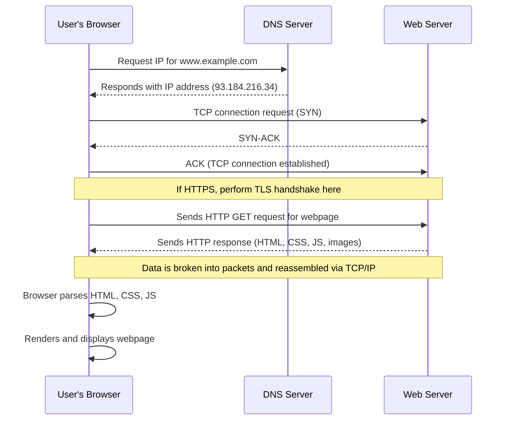

# How the Web Works

## Lesson 1: The Journey of a Web Request

### Overview

**Duration:** 90-120 minutes  
**Focus:** Data transmission, packets, and the request-response cycle  
**Mode:** Self-paced, remote learning

### Learning Objectives

By the end of this lesson, you will be able to:

- Trace the complete journey of a web request from URL to rendered page
- Explain how data packets work and why they're used
- Identify the role of IP addresses and DNS in web communication

### Part 1: Mystery Scenario (10 minutes)

Imagine you're sending a 1000-piece jigsaw puzzle to a friend across the country, but you can only send one piece at a time in small envelopes. How would you make sure:

1. All pieces arrive?
2. Your friend knows which puzzle the pieces belong to?
3. Your friend can put them together in the right order?

!!! activity "Activity"
    Write down your strategy in your learning journal for the mystery scenario. Keep this analogy in mind as we explore how the internet sends data!

### Part 2: What Happens When You Visit a Website? (30 minutes)

When you type `www.example.com` into your browser and press Enter, an incredible chain of events occurs in milliseconds. Let's break it down:

#### Step 1: DNS Lookup (Finding the Address)

- Your computer doesn't understand "www.example.com" - it needs a number!
- DNS (Domain Name System) acts like a phone book for the internet
- Your browser asks a DNS server: "What's the IP address for example.com?"
- DNS responds with something like: `93.184.216.34` (IPv4 address)

#### Step 2: Making the Request

- Your browser creates an HTTP request asking for the website's content
- This request includes information like: what you want, what browser you're using, and what language you prefer

#### Step 3: Data Packets

- Your request is broken into small chunks called **packets**
- Each packet contains:
    - **Header:** Destination IP address, source IP address, packet number, protocol information
    - **Payload:** The actual data being sent
    - **Trailer:** Error checking information

**Why packets?**

- More efficient use of network resources
- Multiple communications can share the same connection
- If one packet fails, only that packet needs resending
- Packets can take different routes to reach the destination faster

#### Step 4: TCP/IP Protocol

- **TCP (Transmission Control Protocol):** Ensures packets arrive correctly and in order
- **IP (Internet Protocol):** Routes packets to the correct destination
- TCP adds sequence numbers so packets can be reassembled correctly

#### Step 5: Server Response

- The web server receives your request
- It processes the request and prepares a response
- The response (HTML, CSS, images, etc.) is also broken into packets
- Packets travel back to your computer

#### Step 6: Rendering

- Your browser receives all the packets
- TCP reassembles them in the correct order
- Your browser interprets the HTML, CSS, and JavaScript
- The webpage appears on your screen!

#### Sequence Diagram for Visiting a Website


#### Using Chrome DevTools to Inspect Network Activity
- Watch [:simple-youtube:{ .youtube } Inspect Network Activity - Chrome DevTools 101](https://www.youtube.com/watch?v=e1gAyQuIFQo)

!!! activity "Structure Chart for Visiting a Website"
    Create a structure chart to represent the process of visiting a website. Use the [Higher School Certificate Course Specifications – Software Engineering](https://curriculum.nsw.edu.au/file/b746704f-f613-4bce-9466-19835b2623fc/software-engineering-11-12-2022-higher-school-certificate-course-specifications.pdf) section on structure charts as a guide.

### Part 2B: Why Security Matters in Data Transmission (15 minutes)

Now that you understand HOW data travels across the internet, let's explore WHY security is critical at every step.

#### The Security Challenge

Remember our jigsaw puzzle analogy? Imagine if:

- Someone could intercept your puzzle pieces and see what picture you're sending
- Someone could swap out pieces with different ones
- Someone could block pieces from arriving at all

This is exactly what can happen with data on the internet!

### Benefits of Developing Secure Software

When developers build software with security in mind from the start, they achieve:

#### 1. Data Protection

**What it means:** Keeping sensitive information safe from unauthorised access

**Real-world examples:**

- Your bank app encrypts your account details during transmission
- Your medical records are protected as they move between systems
- Your private messages stay private

**Without it:**

- Credit card numbers stolen during online shopping
- Personal information exposed in data breaches
- Identity theft and fraud

#### 2. Minimising Cyber Attacks and Vulnerabilities

**What it means:** Reducing the opportunities for attackers to exploit weaknesses

**How data transmission creates vulnerabilities:**

- **Interception:** Attackers can "listen" to unencrypted data packets
- **Manipulation:** Attackers can alter packets in transit
- **Disruption:** Attackers can block or flood networks

**Real example from data transmission:**
When you connect to public Wi-Fi at a café, without proper security:

- Attackers on the same network can intercept your packets
- They can see websites you visit, login credentials, messages
- This is called a "man-in-the-middle" attack

**With secure software:**

- Data is encrypted (scrambled) before transmission
- Even if intercepted, packets are unreadable
- Verification ensures data hasn't been tampered with

---

#### Introduction to the CIA Triad

Three fundamental security principles protect data as it travels across networks:

##### Confidentiality

**Definition:** Ensuring that only authorized people can read the data

**In data transmission:**

- Packets travelling over HTTP can be read by anyone who intercepts them
- Packets travelling over HTTPS are encrypted - they look like gibberish to interceptors
- DNS requests can reveal what websites you're visiting (privacy concern)

**Analogy:** 

- HTTP is like sending a postcard - anyone handling it can read your message
- HTTPS is like sending a sealed, locked box - only the recipient has the key

**Think about it:**
When you traced the route of packets with `traceroute`, you saw they passed through many different networks (hops). Each hop is a potential point where someone could intercept and read unencrypted data!

---

##### Integrity

**Definition:** Ensuring data hasn't been altered during transmission

**In data transmission:**

- TCP includes checksums to verify packets haven't been corrupted
- If a packet is damaged, TCP requests it be resent
- Without integrity checks, altered data could cause serious problems

**Real-world scenario:**
Imagine you're transferring $100 to a friend. Without integrity protection:

- An attacker intercepts the packet
- Changes the recipient or amount
- Your $100 goes to the wrong person!

**How it's protected:**

- Checksums: Mathematical "fingerprints" of data
- If data changes, the checksum won't match
- Receiver knows something went wrong

---

##### Availability

**Definition:** Ensuring data and services are accessible when needed

**In data transmission:**

- Networks must be able to handle traffic loads
- Packets must successfully reach their destination
- Systems must recover quickly from failures

**Threats to availability:**

- **DDoS (Distributed Denial of Service) attacks:** Flooding servers with so many packets they can't respond to legitimate requests
- **Packet loss:** Too many dropped packets make services unusable
- **Network congestion:** Like traffic jams, but for data

**Example:**
Remember when you used `ping` and saw response times? If response times are too high or packets are lost, the service becomes unavailable - it's technically online but unusable.

---

#### Security Across the Journey

Let's revisit our 6-step web request journey with a security lens:

| Step | Security Concern | How It's Protected |
|------|------------------|-------------------|
| **1. DNS Lookup** | DNS requests are unencrypted - anyone can see what sites you're visiting | DNS over HTTPS (DoH) encrypts DNS queries |
| **2. Making Request** | HTTP requests sent in plain text | Use HTTPS instead of HTTP |
| **3. Data Packets** | Packets can be intercepted and read | Encryption scrambles packet contents |
| **4. TCP/IP** | Packets could be altered | Checksums verify data integrity |
| **5. Server Response** | Response data could be intercepted | HTTPS encrypts the entire response |
| **6. Rendering** | Browser could execute malicious code | Sandboxing isolates potentially dangerous code |

---

#### Discussion Activity: Security vs. Speed

Read this scenario and write your thoughts:

**Scenario:** A developer is building a weather app. They're debating whether to use HTTP or HTTPS.

**Arguments for HTTP:**

- Faster (no encryption overhead)
- Easier to implement
- "It's just weather data, not sensitive information"

**Arguments for HTTPS:**

- Protects user privacy (what weather they check reveals their location)
- Prevents data manipulation (fake weather warnings could be injected)
- Builds user trust
- Modern browsers mark HTTP as "Not Secure"

**Your task:**

1. Which approach would you recommend? Why?
2. Can you think of scenarios where "non-sensitive" data could still be exploited?
3. What would happen if an attacker could inject false information into the weather app?
4. As a developer, what's your responsibility to users even for "simple" apps?

!!! question "Reflection"
    Write 100-150 words defending your position. Consider: confidentiality, integrity, and availability.

#### Extended Reading
- [What’s the difference between HTTP and HTTPS?](https://aws.amazon.com/compare/the-difference-between-https-and-http/)

### Part 3: Visualising the Journey (20 minutes)

#### Using Online Tools

1. Visit: [Cloudflare DNS Learning](https://www.cloudflare.com/learning/dns/what-is-dns/)
2. Read the interactive explanation of DNS
3. Create a simple flowchart showing the DNS lookup process

#### Using Command Line Tools

(Works on Windows, Mac, or Linux)

**On Windows (Command Prompt):**

```bash
ping www.google.com
tracert www.google.com
nslookup www.google.com
```

**On Mac/Linux (Terminal):**

```bash
ping www.google.com
traceroute www.google.com
nslookup www.google.com
```

#### What to Observe

- `ping`: Shows the IP address and response time
- `tracert/traceroute`: Shows all the "hops" your data takes across the internet
- `nslookup`: Shows the DNS server response with IP address

!!! activity "Record in Your Journal"
    - What IP address did you get for google.com?
    - How many hops did the traceroute show?
    - How long did each step take?

## Part 4: Investigation Task: Packet Detective (30-40 minutes)

**Your Mission:** Investigate three different websites and document how data travels to reach them.

#### Choose Three Websites from Different Categories

- A social media site (e.g., facebook.com, instagram.com)
- An educational site (e.g., khanacademy.org, abc.net.au/education)
- A streaming service (e.g., youtube.com, spotify.com)

#### For Each Website, Complete the Following

**1. DNS Investigation**

- Use `nslookup [website]` to find the IP address
- Record: Domain name, IP address, DNS server used

**2. Route Tracing**

- Use `tracert/traceroute [website]`
- Count: How many hops does it take?
- Record: The geographic locations (if identifiable) the data passes through

**3. Response Time Analysis**

- Use `ping [website]`
- Record: Minimum, maximum, and average response times
- Question: Why might some sites be faster than others?

#### Create a Comparison Table

| Website | IP Address | Number of Hops | Average Ping Time | Geographic Path |
|---------|------------|----------------|-------------------|-----------------|
|         |            |                |                   |                 |
|         |            |                |                   |                 |
|         |            |                |                   |                 |

#### Analysis Questions

1. Which website had the fastest response time? Why do you think this is?
2. Did any websites have servers in multiple locations?
3. How might packet loss affect your experience on each of these sites?
4. If you were designing a global website, what would you consider based on what you've learned?

#### Security-Focused Questions

5. **Confidentiality:** Which website travelled through the most hops? What are the security implications of data travelling through more networks?
6. **Integrity:** If a packet was altered during transmission, which step in the journey would detect it? (Hint: Think about TCP)
7. **Availability:** Compare the ping times. If a website had very high response times or packet loss, how would this affect availability?
8. **Risk Assessment:** For each website type (social media, educational, streaming), rate the importance of:
   - Confidentiality (1-5): _____
   - Integrity (1-5): _____
   - Availability (1-5): _____
   
   Explain your ratings.

### Creative Challenge: Design Your Own Protocol

!!! note
    This is the same process that a High Frequency Trading firm might follow to design their own communication protocols for tracking markets, risk analysis or trading between 2 or more different departments (desks) within the same company.


Imagine you're designing a new way to send messages across a network where:

- Messages can be maximum 10 words long
- Networks can only handle 3 words at a time
- 20% of packets get lost or delayed

**Design a system that includes:**

1. How you'll break messages into chunks
2. How you'll number/identify chunks
3. How you'll detect missing chunks
4. How you'll ensure chunks are reassembled correctly

!!! example "Test Your Protocol"
    Write your protocol rules and test it by:
    
    - Writing a 10-word message
    - Breaking it according to your rules
    - Having a family member or friend "receive" the chunks out of order
    - See if they can reassemble your message correctly

## Part 5: Reflection & Extension (10 minutes)

### Learning Journal Entry

Answer these reflection questions:

1. How is sending data across the internet similar to our jigsaw puzzle analogy? How is it different?
2. What surprised you most about how data travels on the internet?
3. Why do you think TCP ensures packets arrive in order? What would happen if they didn't?
4. How does understanding data transmission help you think about internet security?

#### Security Reflection

5. **Benefits of Secure Software:** Now that you understand how many networks your data passes through, explain in your own words why developers need to build security into software from the beginning. What could go wrong if they don't?

6. **CIA Triad Application:** Give a specific example from today's lesson for each principle:
   - **Confidentiality:** How could data packets be kept confidential? _____
   - **Integrity:** How does TCP maintain integrity? _____
   - **Availability:** What threats to availability did you observe? _____

7. **Real-world Impact:** Think about an app you use daily (social media, banking, gaming, etc.). Based on what you learned about how data travels:
   - What security features do you think are protecting your data?
   - What would happen if those security features were removed?
   - How would you feel knowing your data travelled unencrypted through 10+ different networks?

### Extension Resources

- **Interactive visualisation:** [Submarine Cable Map](https://www.submarinecablemap.com/) - See physical internet infrastructure
- **Video:** 
    - Search for "Warriors of the Net" - a classic visualisation of packets travelling through the internet and a bit of a laugh.
    - [Cisco Packet Tracer](https://www.netacad.com/learning-collections/cisco-packet-tracer?courseLang=en-US) - Simulate network traffic and protocols
    - [:simple-youtube:{ .youtube } Client-Server and Peer-to-Peer Networks](https://www.youtube.com/watch?v=z98ECVn-w3Q)

### Prepare for Next Lesson

Next time, we'll explore the different protocols that govern how data is formatted and secured. 

!!! question "Think About"
    What's the difference between HTTP and HTTPS? Why does it matter?

---

## Syllabus Alignment

### Programming for the Web

✓ Investigate how data is transferred on the internet (data packets, IP addresses IPv4, DNS)  
✓ Explore and explain the influence of a web browser on web development, including dev tools

### Secure Software Architecture

✓ Describe benefits of developing secure software (data protection, minimising cyber attacks)  
✓ Explore fundamental security concepts (introduction to confidentiality, integrity, availability)

---

## Checklist

Before moving to the next lesson, ensure you have completed:

- [ ] The DNS investigation of 3 websites
- [ ] Created a Structure Chart for Visiting a Website
- [ ] Performed traceroute analysis with data recorded
- [ ] Analysed security implications of multiple network hops
- [ ] Completed Security vs. Speed discussion (weather app scenario)
- [ ] Created your own packet protocol design
- [ ] Tested your protocol with another person
- [ ] Answered all reflection questions in your journal
- [ ] Created a flowchart showing the DNS lookup process
- [ ] Explained the benefits of secure software development in your journal

---

??? note "Teacher Notes"

    **Formative Assessment Opportunities:**

    - Journal entries demonstrate understanding of both technical and security concepts
    - Comparison table shows ability to use command-line tools
    - Protocol design demonstrates creative application of packet concepts
    - Security vs. Speed discussion reveals understanding of security benefits
    - CIA Triad application shows grasp of fundamental security principles
    - Reflection questions assess depth of understanding of security in data transmission

    **Common Misconceptions to Address:**

    - Students may think data travels in one piece
    - Students may confuse IP addresses with MAC addresses
    - Students may not understand why packets take different routes
    - **Students may assume "just technical data" doesn't need security**
    - **Students may think encryption is only for "important" websites**
    - **Students may not realise how many networks their data passes through**

    **Security Concepts Addressed:**

    - **Confidentiality:** Introduced through the vulnerability of unencrypted packets travelling through multiple networks
    - **Integrity:** Demonstrated through TCP checksums and packet verification
    - **Availability:** Explored through packet loss, response times, and DDoS concepts
    - **Benefits of secure software:** Connected to protecting data as it traverses untrusted networks

    **Differentiation:**

    - **Extension:** Research IPv6 and compare to IPv4; investigate DNS over HTTPS (DoH)
    - **Support:** Provide pre-filled partial tables and sentence starters for CIA analysis
    - **Alternative:** Use online traceroute tools if command line is not accessible

    **Key Teaching Point:**
    This lesson establishes the foundation for understanding WHY security matters by showing students that their data travels through many untrusted networks. This makes the need for encryption (Lesson 2) and security practices (Lesson 3) concrete and relatable rather than abstract.