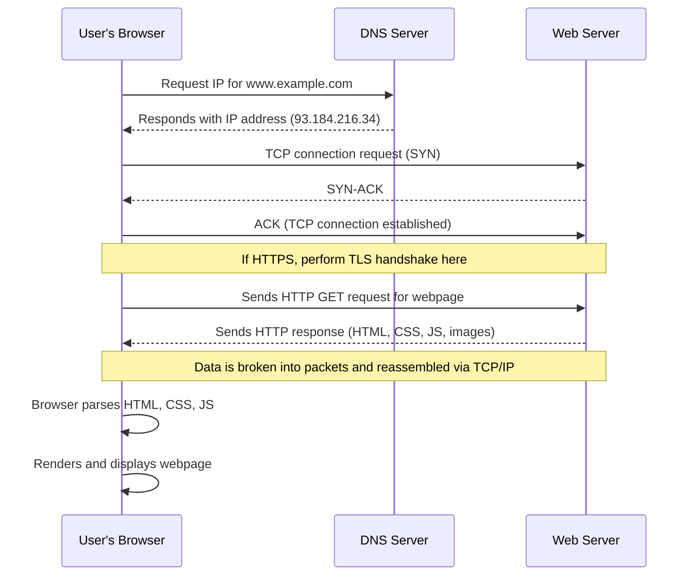

# How the Web Works

## Lesson 1: The Journey of a Web Request

### Overview

**Duration:** 90-120 minutes  
**Focus:** Data transmission, packets, and the request-response cycle  
**Mode:** Self-paced, remote learning

### Learning Objectives

By the end of this lesson, you will be able to:

- Trace the complete journey of a web request from URL to rendered page
- Explain how data packets work and why they're used
- Identify the role of IP addresses and DNS in web communication

### Part 1: Mystery Scenario (10 minutes)

Imagine you're sending a 1000-piece jigsaw puzzle to a friend across the country, but you can only send one piece at a time in small envelopes. How would you make sure:

1. All pieces arrive?
2. Your friend knows which puzzle the pieces belong to?
3. Your friend can put them together in the right order?

!!! activity "Activity"
    Write down your strategy in your learning journal for the mystery scenario. Keep this analogy in mind as we explore how the internet sends data!

### Part 2: What Happens When You Visit a Website? (30 minutes)

When you type `www.example.com` into your browser and press Enter, an incredible chain of events occurs in milliseconds. Let's break it down:

#### Step 1: DNS Lookup (Finding the Address)

- Your computer doesn't understand "www.example.com" - it needs a number!
- DNS (Domain Name System) acts like a phone book for the internet
- Your browser asks a DNS server: "What's the IP address for example.com?"
- DNS responds with something like: `93.184.216.34` (IPv4 address)

#### Step 2: Making the Request

- Your browser creates an HTTP request asking for the website's content
- This request includes information like: what you want, what browser you're using, and what language you prefer

#### Step 3: Data Packets

- Your request is broken into small chunks called **packets**
- Each packet contains:
    - **Header:** Destination IP address, source IP address, packet number, protocol information
    - **Payload:** The actual data being sent
    - **Trailer:** Error checking information

**Why packets?**

- More efficient use of network resources
- Multiple communications can share the same connection
- If one packet fails, only that packet needs resending
- Packets can take different routes to reach the destination faster

#### Step 4: TCP/IP Protocol

- **TCP (Transmission Control Protocol):** Ensures packets arrive correctly and in order
- **IP (Internet Protocol):** Routes packets to the correct destination
- TCP adds sequence numbers so packets can be reassembled correctly

#### Step 5: Server Response

- The web server receives your request
- It processes the request and prepares a response
- The response (HTML, CSS, images, etc.) is also broken into packets
- Packets travel back to your computer

#### Step 6: Rendering

- Your browser receives all the packets
- TCP reassembles them in the correct order
- Your browser interprets the HTML, CSS, and JavaScript
- The webpage appears on your screen!

### Sequence Diagram for Visiting a Website


### Using Chrome DevTools to Inspect Network Activity
- Watch [:simple-youtube:{ .youtube } Inspect Network Activity - Chrome DevTools 101](https://www.youtube.com/watch?v=e1gAyQuIFQo)

!!! activity "Structure Chart for Visiting a Website"
    Create a structure chart to represent the process of visiting a website. Use the [Higher School Certificate Course Specifications – Software Engineering](https://curriculum.nsw.edu.au/file/b746704f-f613-4bce-9466-19835b2623fc/software-engineering-11-12-2022-higher-school-certificate-course-specifications.pdf) section on structure charts as a guide.

## Part 3: Visualising the Journey (20 minutes)

#### Using Online Tools

1. Visit: [Cloudflare DNS Learning](https://www.cloudflare.com/learning/dns/what-is-dns/)
2. Read the interactive explanation of DNS
3. Create a simple flowchart showing the DNS lookup process

#### Using Command Line Tools

(Works on Windows, Mac, or Linux)

**On Windows (Command Prompt):**

```bash
ping www.google.com
tracert www.google.com
nslookup www.google.com
```

**On Mac/Linux (Terminal):**

```bash
ping www.google.com
traceroute www.google.com
nslookup www.google.com
```

#### What to Observe

- `ping`: Shows the IP address and response time
- `tracert/traceroute`: Shows all the "hops" your data takes across the internet
- `nslookup`: Shows the DNS server response with IP address

!!! activity "Record in Your Journal"
    - What IP address did you get for google.com?
    - How many hops did the traceroute show?
    - How long did each step take?

## Part 4: Investigation Task: Packet Detective (30-40 minutes)

**Your Mission:** Investigate three different websites and document how data travels to reach them.

#### Choose Three Websites from Different Categories

- A social media site (e.g., facebook.com, instagram.com)
- An educational site (e.g., khanacademy.org, abc.net.au/education)
- A streaming service (e.g., youtube.com, spotify.com)

#### For Each Website, Complete the Following

**1. DNS Investigation**

- Use `nslookup [website]` to find the IP address
- Record: Domain name, IP address, DNS server used

**2. Route Tracing**

- Use `tracert/traceroute [website]`
- Count: How many hops does it take?
- Record: The geographic locations (if identifiable) the data passes through

**3. Response Time Analysis**

- Use `ping [website]`
- Record: Minimum, maximum, and average response times
- Question: Why might some sites be faster than others?

#### Create a Comparison Table

| Website | IP Address | Number of Hops | Average Ping Time | Geographic Path |
|---------|------------|----------------|-------------------|-----------------|
|         |            |                |                   |                 |
|         |            |                |                   |                 |
|         |            |                |                   |                 |

#### Analysis Questions

1. Which website had the fastest response time? Why do you think this is?
2. Did any websites have servers in multiple locations?
3. How might packet loss affect your experience on each of these sites?
4. If you were designing a global website, what would you consider based on what you've learned?

### Creative Challenge: Design Your Own Protocol

!!! note
    This is the same process that a High Frequency Trading firm might follow to design their own communication protocols for tracking markets, risk analysis or trading between 2 or more different departments (desks) within the same company.


Imagine you're designing a new way to send messages across a network where:

- Messages can be maximum 10 words long
- Networks can only handle 3 words at a time
- 20% of packets get lost or delayed

**Design a system that includes:**

1. How you'll break messages into chunks
2. How you'll number/identify chunks
3. How you'll detect missing chunks
4. How you'll ensure chunks are reassembled correctly

!!! example "Test Your Protocol"
    Write your protocol rules and test it by:
    
    - Writing a 10-word message
    - Breaking it according to your rules
    - Having a family member or friend "receive" the chunks out of order
    - See if they can reassemble your message correctly

## Part 5: Reflection & Extension (10 minutes)

### Learning Journal Entry

Answer these reflection questions:

1. How is sending data across the internet similar to our jigsaw puzzle analogy? How is it different?
2. What surprised you most about how data travels on the internet?
3. Why do you think TCP ensures packets arrive in order? What would happen if they didn't?
4. How does understanding data transmission help you think about internet security?

### Extension Resources

- **Interactive visualisation:** [Submarine Cable Map](https://www.submarinecablemap.com/) - See physical internet infrastructure
- **Video:** 
    - Search for "Warriors of the Net" - a classic visualisation of packets travelling through the internet and a bit of a laugh.
    - [Cisco Packet Tracer](https://www.netacad.com/learning-collections/cisco-packet-tracer?courseLang=en-US) - Simulate network traffic and protocols
    - [:simple-youtube:{ .youtube } Client-Server and Peer-to-Peer Networks](https://www.youtube.com/watch?v=z98ECVn-w3Q)

### Prepare for Next Lesson

Next time, we'll explore the different protocols that govern how data is formatted and secured. 

!!! question "Think About"
    What's the difference between HTTP and HTTPS? Why does it matter?

---

## Syllabus Alignment

### Programming for the Web

✓ Investigate how data is transferred on the internet (data packets, IP addresses IPv4, DNS)  
✓ Explore and explain the influence of a web browser on web development, including dev tools

### Secure Software Architecture

✓ Describe benefits of developing secure software (data protection, minimising cyber attacks)  
✓ Explore fundamental security concepts (introduction to confidentiality, integrity, availability)

---

## Checklist

Before moving to the next lesson, ensure you have completed:

- [ ] The DNS investigation of 3 websites
- [ ] Created a Structure Chart for Visiting a Website
- [ ] Performed traceroute analysis with data recorded
- [ ] Created your own packet protocol design
- [ ] Tested your protocol with another person
- [ ] Answered all reflection questions in your journal
- [ ] Created a flowchart showing the DNS lookup process

---
