# JavaScript Fundamentals & Client-Side Security

## Lesson Overview

| Aspect | Details |
|--------|---------|
| **Duration** | 90-120 minutes |
| **Focus** | JavaScript basics, DOM manipulation, XSS vulnerabilities, input validation, and defensive programming |
| **Mode** | Self-paced with hands-on coding activities |
| **Prerequisites** | Basic HTML and CSS knowledge, text editor, modern web browser with developer tools |

!!! info "What You'll Build"
    By the end of this lesson, you'll create a secure, interactive comment system that demonstrates both vulnerable and secure coding practices. You'll learn to identify, exploit (ethically), and fix XSS vulnerabilities.

---

## Learning Objectives

By the end of this lesson, you will be able to:

!!! abstract "Aligned with Syllabus Content"
    1. **Create** interactive web pages using JavaScript variables, functions, and DOM manipulation
    2. **Demonstrate** how Cross-Site Scripting (XSS) vulnerabilities occur in web applications
    3. **Apply** input validation and sanitisation techniques to prevent XSS attacks
    4. **Evaluate** code for security vulnerabilities and implement defensive programming practices
    5. **Design** secure web forms that balance security requirements with user experience

---

## Content Part 1: JavaScript Fundamentals (20-25 minutes)

### Introduction to JavaScript Core Concepts

JavaScript is the programming language that adds interactivity to web pages. Let's explore the fundamental building blocks.


#### Variables and Data Types

Modern JavaScript uses `let` and `const` to declare variables. Python on the other hand uses naming conventions.

=== "Javascript"

    ```javascript
    // const - for values that won't change
    const MAX_ATTEMPTS = 3;
    const USER_ROLE = "admin";

    // let - for values that will change
    let userName = "Alice";
    let loginAttempts = 0;

    // Common data types
    let message = "Hello";           // String
    let age = 25;                    // Number
    let isActive = true;             // Boolean
    let colours = ["red", "blue"];   // Array
    let user = {name: "Bob"};        // Object
    ```

=== "Python"

    ```python
    # no const in Python but we casing to indicate the same
    MAX_ATTEMPTS = 3
    USER_ROLE = "admin"

    # variables are lowercase with words separated by underscores as 
    # necessary to improve readability
    user_name = "Alice"
    login_attempts = 0

    # Common data types
    message = "Hello"            # String
    age = 25                     # Number
    is_active = TRUE             # Boolean
    colours = ["red", "blue"];   # List
    user = {name: "Bob"};        # Dictionary
    ```

#### Functions

Functions are reusable blocks of code:

=== "Javascript"

    ```javascript
    // Basic function
    function greetUser(name) {
        return "Welcome, " + name + "!";
    }

    // Call the function
    let greeting = greetUser("Alice");
    console.log(greeting); // Output: Welcome, Alice!

    // Function with validation
    function isValidAge(age) {
        return age >= 18 && age <= 120;
    }

    console.log(isValidAge(25));  // true
    console.log(isValidAge(15));  // false
    ```

=== "Python"

    ```python
    # Basic function
    def greet_user(name)
        return f"Welcome, {name}!"

    # Call the function
    greeting = greet_user("Alice")
    print(greeting); # Output: Welcome, Alice!

    # Function with validation
    def is_valid_age(age)
        return age >= 18 and age <= 120

    print(isValidAge(25))  // TRUE
    print(isValidAge(15))  // FALSE
    ```


#### DOM Manipulation

The Document Object Model (DOM) lets JavaScript interact with HTML:

```javascript
// Select elements
let heading = document.getElementById("title");
let button = document.querySelector(".submit-btn");
let allInputs = document.querySelectorAll("input");

// Modify content (SAFE - prevents XSS)
heading.textContent = "New Title";

// Modify styles
heading.style.color = "blue";
heading.style.fontSize = "24px";

// Modify attributes
button.setAttribute("disabled", "true");
```

#### Event Handling

Events allow JavaScript to respond to user actions:

```javascript
let button = document.getElementById("myButton");

button.addEventListener("click", function() {
    console.log("Button clicked!");
});

// Common events:
// click, submit, input, change, keypress, mouseover
```

### Guided Practice

Let's build a simple interactive greeting system together.

```html
<!DOCTYPE html>
<html>
<head>
    <title>Interactive Greeting</title>
    <style>
        body {
            font-family: Arial, sans-serif;
            max-width: 500px;
            margin: 50px auto;
            padding: 20px;
        }
        input {
            padding: 8px;
            margin: 10px 0;
            width: 100%;
            box-sizing: border-box;
        }
        button {
            padding: 10px 20px;
            background-color: #4CAF50;
            color: white;
            border: none;
            cursor: pointer;
        }
        #output {
            margin-top: 20px;
            padding: 15px;
            background-color: #f0f0f0;
            border-radius: 5px;
        }
    </style>
</head>
<body>
    <h1>Welcome Message Generator</h1>
    <input type="text" id="nameInput" placeholder="Enter your name">
    <button id="greetButton">Generate Greeting</button>
    <div id="output"></div>
    
    <script>
        // Get references to elements
        let nameInput = document.getElementById("nameInput");
        let greetButton = document.getElementById("greetButton");
        let output = document.getElementById("output");
        
        // Add event listener
        greetButton.addEventListener("click", function() {
            let name = nameInput.value;
            
            // Basic validation
            if (name === "") {
                output.textContent = "Please enter a name!";
            } else {
                output.textContent = "Hello, " + name + "! Welcome to our site.";
            }
        });
    </script>
</body>
</html>
```

!!! tip "Try This"
    1. Copy the code above into a new HTML file
    2. Open it in your browser
    3. Enter your name and click the button
    4. Notice how `textContent` safely displays the input

### Student Activity 1.1: Build an Interactive Calculator

!!! practice "Activity: Simple Age Calculator (10 minutes)"
    **Task:** Create a webpage that calculates birth year from age.
    
    **Requirements:**

    1. Input field for age
    2. Button labelled "Calculate Birth Year"
    3. Display the calculated birth year
    4. Validate that age is between 1 and 120
    5. Show error message for invalid input
    
    **Starter Template:**
    ```html
    <!DOCTYPE html>
    <html>
    <head>
        <title>Age Calculator</title>
        <style>
            body { font-family: Arial; max-width: 500px; margin: 50px auto; }
            input, button { padding: 10px; margin: 5px 0; }
            .error { color: red; }
            .result { color: green; font-weight: bold; }
        </style>
    </head>
    <body>
        <h1>Birth Year Calculator</h1>
        <input type="number" id="ageInput" placeholder="Enter your age">
        <button id="calculateBtn">Calculate Birth Year</button>
        <div id="output"></div>
        
        <script>
            // TODO: Write your JavaScript here
            // 1. Get element references
            // 2. Add click event listener
            // 3. Validate age (1-120)
            // 4. Calculate birth year (2025 - age)
            // 5. Display result
        </script>
    </body>
    </html>
    ```
    
    ??? example "Solution"
        ```javascript
        let ageInput = document.getElementById("ageInput");
        let calculateBtn = document.getElementById("calculateBtn");
        let output = document.getElementById("output");
        
        calculateBtn.addEventListener("click", function() {
            let age = parseInt(ageInput.value);
            
            // Validate input
            if (isNaN(age) || age < 1 || age > 120) {
                output.className = "error";
                output.textContent = "Please enter a valid age between 1 and 120";
            } else {
                // Calculate birth year
                let birthYear = 2025 - age;
                output.className = "result";
                output.textContent = "You were born in " + birthYear;
            }
        });
        ```

### Student Activity 1.2: Form Interaction

!!! practice "Activity: Multi-Field Form (10 minutes)"
    **Task:** Create a simple profile display form
    
    **Requirements:**

    1. Input fields: name, age, favourite colour
    2. Submit button
    3. Display all information in a formatted div
    4. Clear button to reset form
    
    ??? example "Solution Framework"
        ```html
        <!DOCTYPE html>
        <html>
        <head>
            <title>Profile Form</title>
        </head>
        <body>
            <h1>Create Your Profile</h1>
            <form id="profileForm">
                <input type="text" id="name" placeholder="Name" required><br>
                <input type="number" id="age" placeholder="Age" required><br>
                <input type="text" id="colour" placeholder="Favourite Colour" required><br>
                <button type="submit">Create Profile</button>
                <button type="button" id="clearBtn">Clear</button>
            </form>
            <div id="profileDisplay"></div>
            
            <script>
                let form = document.getElementById("profileForm");
                let display = document.getElementById("profileDisplay");
                let clearBtn = document.getElementById("clearBtn");
                
                form.addEventListener("submit", function(e) {
                    e.preventDefault(); // Prevent page reload
                    
                    let name = document.getElementById("name").value;
                    let age = document.getElementById("age").value;
                    let colour = document.getElementById("colour").value;
                    
                    display.textContent = 
                        "Name: " + name + 
                        ", Age: " + age + 
                        ", Favourite Colour: " + colour;
                });
                
                clearBtn.addEventListener("click", function() {
                    form.reset();
                    display.textContent = "";
                });
            </script>
        </body>
        </html>
        ```

---

## Content Part 2: Understanding XSS Vulnerabilities (20-25 minutes)

### What is Cross-Site Scripting (XSS)?

Cross-Site Scripting (XSS) is a security vulnerability that allows attackers to inject malicious scripts into web pages viewed by other users.


!!! danger "Why XSS is Dangerous"
    XSS attacks can:
    
    - 🔓 **Steal session cookies** and hijack user accounts
    - 🎣 **Phish for credentials** by modifying page content
    - 🔄 **Redirect users** to malicious websites
    - 📝 **Modify page content** to spread misinformation
    - 💾 **Install malware** or keyloggers
    - 🤖 **Perform actions** on behalf of the user

#### Types of XSS Attacks

**1. Reflected XSS**

- The malicious script is reflected off the web server (e.g., in search results, error messages).

**2. Stored XSS**  

- The malicious script is permanently stored on the server (e.g., in comments, forum posts, profile data).

**3. DOM-based XSS**  

- The vulnerability exists in client-side JavaScript code rather than server-side code.

### We Do: Creating a Vulnerable Application

!!! warning "Educational Purpose Only"
    We're creating vulnerable code **only** to understand how XSS works. Never write code like this in production, and never test XSS on websites you don't own.

```html
<!DOCTYPE html>
<html>
<head>
    <title>VULNERABLE Comment System</title>
    <style>
        body {
            font-family: Arial, sans-serif;
            max-width: 600px;
            margin: 50px auto;
            padding: 20px;
        }
        .comment {
            border: 1px solid #ddd;
            padding: 15px;
            margin: 10px 0;
            background-color: #f9f9f9;
            border-radius: 5px;
        }
        textarea {
            width: 100%;
            padding: 10px;
            margin: 10px 0;
            box-sizing: border-box;
        }
        button {
            padding: 10px 20px;
            background-color: #4CAF50;
            color: white;
            border: none;
            cursor: pointer;
        }
    </style>
</head>
<body>
    <h1>⚠️ VULNERABLE Comment System</h1>
    <p style="color: red;">This is intentionally vulnerable for learning purposes!</p>
    
    <textarea id="commentInput" rows="4" placeholder="Write your comment..."></textarea>
    <button id="postBtn">Post Comment</button>
    
    <h2>Comments:</h2>
    <div id="commentsSection"></div>
    
    <script>
        let postBtn = document.getElementById("postBtn");
        let commentsSection = document.getElementById("commentsSection");
        let commentInput = document.getElementById("commentInput");
        
        postBtn.addEventListener("click", function() {
            let comment = commentInput.value;
            
            // 🚨 VULNERABILITY: Using innerHTML with user input
            commentsSection.innerHTML += 
                '<div class="comment">' + comment + '</div>';
            
            commentInput.value = ""; // Clear input
        });
    </script>
</body>
</html>
```

!!! question "Can You Spot the Vulnerability?"
    Look at line 47. What's dangerous about using `innerHTML` with user input?
    
    ??? info "Answer"
        `innerHTML` interprets its content as HTML. If a user enters `<script>alert('XSS')</script>`, it will be executed as code, not displayed as text.

### Student Activity 2.1: Demonstrate XSS Attacks

!!! practice "Activity: Testing XSS Payloads (15 minutes)"
    **Part A: Setup**
    
    1. Copy the vulnerable comment system code above
    2. Save it as `vulnerable-comments.html`
    3. Open it in your browser
    
    **Part B: Test These XSS Payloads**
    
    Enter each payload in the comment box and observe what happens:
    
    **Payload 1: Basic Alert**
    ```html
    <script>alert('XSS Attack!');</script>
    ```
    !!! note
        **Payload 1** may not work as some browsers may block the execution of scripts due to security settings.

    
    **Payload 2: Image with Error Event**
    ```html
    
    ```
    
    **Payload 3: Style Injection**
    ```html
    <div style="position:fixed; top:0; left:0; width:100%; height:100%; background:red; color:white; font-size:50px; text-align:center; padding-top:200px;">
    HACKED!
    </div>
    ```
    
    **Payload 4: Cookie Theft Simulation**
    ```html
    <script>alert('Your cookies: ' + document.cookie);</script>
    ```
    
    **Payload 5: Redirect Attempt**
    ```html
    <script>console.log('In real attack, would redirect to malicious site');</script>
    ```
    
    **Documentation Task:**
    
    Create a table documenting each payload:
    
    | Payload # | What Happened | Why It Worked | Potential Harm |
    |-----------|---------------|---------------|----------------|
    | 1 | | | |
    | 2 | | | |
    | 3 | | | |
    | 4 | | | |
    | 5 | | | |
    
    ??? example "Expected Observations"
        | Payload # | What Happened | Why It Worked | Potential Harm |
        |-----------|---------------|---------------|----------------|
        | 1 | Alert box appeared | innerHTML executed `<script>` tag | Can run any JavaScript code |
        | 2 | Alert appeared despite broken image | `onerror` event handler executed | Hidden attacks don't need script tags |
        | 3 | Red overlay covered page | CSS was applied via style attribute | Can deface website, create fake login forms |
        | 4 | Showed cookie data | JavaScript can access document.cookie | Session hijacking, account theft |
        | 5 | Message in console | Console.log executed successfully | Could redirect to phishing site |

### Student Activity 2.2: Analysis Questions

!!! practice "Activity: Understanding XSS Impact (10 minutes)"
    **Answer these questions based on your observations:**
    
    1. **Why does the browser execute the malicious code?**
       
    ??? info "Answer"
        The browser executes the code because `innerHTML` treats the input as HTML/JavaScript, not as plain text. The browser can't distinguish between legitimate code and user-provided code.
    
    2. **Besides `<script>` tags, what other HTML elements can execute JavaScript?**
       
    ??? info "Answer"
        Many elements can execute JavaScript through event handlers:

        - `` with `onerror`
        - `<body>` with `onload`
        - `<div>` with `onmouseover`
        - `<iframe>` with `src="javascript:..."`
        - `<a>` with `href="javascript:..."`
        - Any element with event handlers (onclick, onload, etc.)
    
    3. **In a real application with stored XSS, how many users could be affected?**
       
    ??? info "Answer"
        Every user who views the page with the stored malicious content would be affected. This could be thousands or millions of users, making stored XSS particularly dangerous.
    
    4. **What sensitive information could an attacker steal using XSS?**
       
    ??? info "Answer"
        - Session cookies (account hijacking)
        - Authentication tokens
        - Personal information displayed on the page
        - Form data (including passwords)
        - User's browsing behaviour
        - CSRF tokens

---

## Content Part 3: Input Validation & sanitisation (25-30 minutes)

### Defence in Depth Strategy

Security isn't one solution—it's multiple layers of protection working together.


!!! info "The Three Pillars of Input Security"
    1. **Validation**: Check if input meets expected criteria
    2. **Sanitisation**: Remove or escape dangerous characters
    3. **Safe Output**: Display data in ways that prevent code execution

### Input Validation Techniques

#### Regular Expressions for Validation

Regular expressions (regex) are patterns used to match character combinations.

!!! Note
    Regex is not required for the HSC but it can be useful for basic validation and is an industry standard tool.


```javascript
// Email validation
function isValidEmail(email) {
    const emailRegex = /^[^\s@]+@[^\s@]+\.[^\s@]+$/;
    return emailRegex.test(email);
}

// Username: 3-20 characters, letters and numbers only
function isValidUsername(username) {
    const usernameRegex = /^[a-zA-Z0-9]{3,20}$/;
    return usernameRegex.test(username);
}

// Strong password: min 8 chars, must have letter and number
function isStrongPassword(password) {
    return password.length >= 8 && 
           /[a-zA-Z]/.test(password) && 
           /[0-9]/.test(password);
}

// Age validation: 1-120
function isValidAge(age) {
    const ageNum = parseInt(age);
    return !isNaN(ageNum) && ageNum >= 1 && ageNum <= 120;
}

// Test the functions
console.log(isValidEmail("user@example.com"));     // true
console.log(isValidEmail("invalid.email"));        // false
console.log(isValidUsername("Alice123"));          // true
console.log(isValidUsername("ab"));                // false (too short)
console.log(isStrongPassword("Pass1234"));         // true
console.log(isStrongPassword("password"));         // false (no number)
```

!!! tip "Regular Expression Basics"
    **Common Pattern Components:**
    
    - `^` - Start of string
    - `$` - End of string
    - `[a-z]` - Any lowercase letter
    - `[A-Z]` - Any uppercase letter
    - `[0-9]` - Any digit
    - `[a-zA-Z0-9]` - Any letter or digit
    - `{3,20}` - Between 3 and 20 characters
    - `+` - One or more
    - `*` - Zero or more
    - `[^\s@]` - Any character except space or @

#### Sanitisation: Escaping HTML

Sanitisation makes dangerous input safe by escaping special characters.

```javascript
// Method 1: Using DOM (recommended)
function escapeHTML(str) {
    const div = document.createElement('div');
    div.textContent = str;
    return div.innerHTML;
}

// Method 2: Explicit character replacement
function escapeHTMLExplicit(str) {
    return str
        .replace(/&/g, '&amp;')   // & must be first
        .replace(/</g, '&lt;')    // 
        .replace(/>/g, '&gt;')    // >
        .replace(/"/g, '&quot;')  // "
        .replace(/'/g, '&#x27;')  // '
        .replace(/\//g, '&#x2F;'); // /
}

// Test escaping
let malicious = '<script>alert("XSS")</script>';
let safe = escapeHTML(malicious);
console.log(safe);
// Output: &lt;script&gt;alert("XSS")&lt;/script&gt;
```

!!! success "The Critical Mechanism"
    textContent treats everything as plain text, NOT as HTML.
    When you set `textContent`, the browser automatically encodes special HTML characters so they will be **displayed** as text rather than **interpreted** as code.

    What happens internally:
    
    The string `<script>alert('XSS')</script>` is stored in the div, but the browser internally represents it as:
    
    **html:** `<div>&lt;script&gt;alert('XSS')&lt;/script&gt;</div>`
    
    The browser has automatically converted:
    ```
    < → &lt;
    > → &gt;
    ```

!!! warning "Character Escaping Reference"
    | Character | Entity Code | Meaning |
    |-----------|-------------|---------|
    | `<` | `&lt;` | Less than (starts HTML tag) |
    | `>` | `&gt;` | Greater than (ends HTML tag) |
    | `&` | `&amp;` | Ampersand (starts entity) |
    | `"` | `&quot;` | Double quote (attribute delimiter) |
    | `'` | `&#x27;` | Single quote (attribute delimiter) |
    | `/` | `&#x2F;` | Forward slash (closes tags) |

#### Safe DOM Manipulation

```javascript
// ❌ UNSAFE - Can execute scripts
element.innerHTML = userInput;
element.outerHTML = userInput;
document.write(userInput);

// ✅ SAFE - Cannot execute scripts
element.textContent = userInput;        // Recommended
element.innerText = userInput;          // Also safe
element.setAttribute('value', userInput);

// ✅ SAFE - Creating elements programmatically
let safeDiv = document.createElement('div');
safeDiv.className = 'comment';
safeDiv.textContent = userInput;  // User input as text only
document.getElementById('container').appendChild(safeDiv);
```

### Student Activity 3.1: Build Validation Functions

!!! practice "Activity: Create a Validation Library (15 minutes)"
    **Task:** Create a JavaScript validation library with multiple functions
    
    **Requirements:**
    
    Create validation functions for:

    1. **Phone number**: Format (XX) XXXX-XXXX
    2. **Postal code**: 4 digits
    3. **URL**: Must start with http:// or https:// 
        - Look at the [string library](https://developer.mozilla.org/en-US/docs/Web/JavaScript/Reference/Global_Objects/String){target="_blank"} for Javascript
    4. **Credit card**: 16 digits, numbers only
    5. **Name**: 2-50 characters, letters and spaces only
    
    !!! tip "Regex choices"

        - /^\(\d{2}\) \d{4}-\d{4}$/
        - /^[a-zA-Z ]{2,50}$/
        - /^\d{5}$/
        - /^\d{16}$/
        
    **Starter Code:**
    ```javascript
    // TODO: Complete these validation functions
    // TODO: You can test these by wrapping the code in HTML and run in a browser
    
    function isValidPhone(phone) {
        // Format: (123) 456-7890
        const phoneRegex = // YOUR REGEX HERE
        return phoneRegex.test(phone);
    }
    
    function isValidPostalCode(code) {
        // 5 digits only
        const postalRegex = // YOUR REGEX HERE
        return postalRegex.test(code);
    }
    
    function isValidURL(url) {
        // Must start with http:// or https://
        // Hint: use url.startsWith()
    }
    
    function isValidCreditCard(card) {
        // 16 digits, no spaces or dashes
        const cardRegex = // YOUR REGEX HERE
        return cardRegex.test(card);
    }
    
    function isValidName(name) {
        // 2-50 characters, letters and spaces only
        const nameRegex = // YOUR REGEX HERE
        return nameRegex.test(name);
    }
    
    // Test your functions
    console.log("Phone test:", isValidPhone("(555) 123-4567"));
    console.log("Postal test:", isValidPostalCode("12345"));
    console.log("URL test:", isValidURL("https://example.com"));
    console.log("Card test:", isValidCreditCard("1234567890123456"));
    console.log("Name test:", isValidName("John Doe"));
    ```
    
    ??? example "Solution"
        ```javascript
        function isValidPhone(phone) {
            const phoneRegex = /^\(\d{3}\) \d{3}-\d{4}$/;
            return phoneRegex.test(phone);
        }
        
        function isValidPostalCode(code) {
            const postalRegex = /^\d{5}$/;
            return postalRegex.test(code);
        }
        
        function isValidURL(url) {
            return url.startsWith("http://") || url.startsWith("https://");
        }
        
        function isValidCreditCard(card) {
            const cardRegex = /^\d{16}$/;
            return cardRegex.test(card);
        }
        
        function isValidName(name) {
            const nameRegex = /^[a-zA-Z ]{2,50}$/;
            return nameRegex.test(name);
        }
        ```

### Student Activity 3.2: Secure the Comment System

!!! practice "Activity: Fix the Vulnerable Code (15 minutes)"
    **Task:** Transform the vulnerable comment system into a secure one
    
    **Requirements:**
    
    1. Add validation for comments (1-500 characters, no script tags)
    2. Use safe DOM manipulation (textContent, createElement)
    3. Display validation errors
    4. Test with previous XSS payloads - they should NOT execute
    5. Show success message when comment is posted
    
    **Starter Template:**
    ```html
    <!DOCTYPE html>
    <html>
    <head>
        <title>SECURE Comment System</title>
        <style>
            body {
                font-family: Arial, sans-serif;
                max-width: 600px;
                margin: 50px auto;
                padding: 20px;
            }
            .comment {
                border: 1px solid #ddd;
                padding: 15px;
                margin: 10px 0;
                background-color: #f9f9f9;
                border-radius: 5px;
                word-wrap: break-word;
            }
            textarea {
                width: 100%;
                padding: 10px;
                margin: 10px 0;
                box-sizing: border-box;
                border: 2px solid #ddd;
            }
            textarea.invalid {
                border-color: red;
            }
            textarea.valid {
                border-color: green;
            }
            button {
                padding: 10px 20px;
                background-color: #4CAF50;
                color: white;
                border: none;
                cursor: pointer;
            }
            .error {
                color: red;
                font-size: 14px;
                margin: 5px 0;
            }
            .success {
                color: green;
                font-size: 14px;
                margin: 5px 0;
            }
        </style>
    </head>
    <body>
        <h1>✅ SECURE Comment System</h1>
        
        <textarea id="commentInput" rows="4" placeholder="Write your comment..."></textarea>
        <div id="errorMessage" class="error"></div>
        <div id="successMessage" class="success"></div>
        <button id="postBtn">Post Comment</button>
        
        <h2>Comments:</h2>
        <div id="commentsSection"></div>
        
        <script>
            // TODO: Add validation function
            function isValidComment(comment) {
                // Check length and no script tags
            }
            
            // TODO: Get element references
            
            // TODO: Add event listener with validation and safe DOM manipulation
        </script>
    </body>
    </html>
    ```
    
    ??? example "Complete Solution"
        ```html
        <!DOCTYPE html>
        <html>
        <head>
            <title>SECURE Comment System</title>
            <style>
                body {
                    font-family: Arial, sans-serif;
                    max-width: 600px;
                    margin: 50px auto;
                    padding: 20px;
                }
                .comment {
                    border: 1px solid #ddd;
                    padding: 15px;
                    margin: 10px 0;
                    background-color: #f9f9f9;
                    border-radius: 5px;
                    word-wrap: break-word;
                }
                .comment-meta {
                    color: #666;
                    font-size: 12px;
                    margin-bottom: 8px;
                }
                textarea {
                    width: 100%;
                    padding: 10px;
                    margin: 10px 0;
                    box-sizing: border-box;
                    border: 2px solid #ddd;
                }
                textarea.invalid {
                    border-color: red;
                }
                textarea.valid {
                    border-color: green;
                }
                button {
                    padding: 10px 20px;
                    background-color: #4CAF50;
                    color: white;
                    border: none;
                    cursor: pointer;
                }
                .error {
                    color: red;
                    font-size: 14px;
                    margin: 5px 0;
                }
                .success {
                    color: green;
                    font-size: 14px;
                    margin: 5px 0;
                }
            </style>
        </head>
        <body>
            <h1>✅ SECURE Comment System</h1>
            
            <textarea id="commentInput" rows="4" placeholder="Write your comment (1-500 characters)..."></textarea>
            <div id="errorMessage" class="error"></div>
            <div id="successMessage" class="success"></div>
            <button id="postBtn">Post Comment</button>
            
            <h2>Comments:</h2>
            <div id="commentsSection"></div>
            
            <script>
                // Validation function
                function isValidComment(comment) {
                    return comment.trim().length >= 1 && 
                           comment.length <= 500 && 
                           !comment.toLowerCase().includes('<script');
                }
                
                // Get element references
                let postBtn = document.getElementById("postBtn");
                let commentsSection = document.getElementById("commentsSection");
                let commentInput = document.getElementById("commentInput");
                let errorMessage = document.getElementById("errorMessage");
                let successMessage = document.getElementById("successMessage");
                
                // Real-time validation feedback
                commentInput.addEventListener("input", function() {
                    let comment = commentInput.value;
                    errorMessage.textContent = "";
                    successMessage.textContent = "";
                    
                    if (comment.length === 0) {
                        commentInput.classList.remove("valid", "invalid");
                    } else if (isValidComment(comment)) {
                        commentInput.classList.add("valid");
                        commentInput.classList.remove("invalid");
                    } else {
                        commentInput.classList.add("invalid");
                        commentInput.classList.remove("valid");
                        if (comment.length > 500) {
                            errorMessage.textContent = "Comment is too long (" + comment.length + "/500 characters)";
                        }
                        if (comment.toLowerCase().includes('<script')) {
                            errorMessage.textContent = "Script tags are not allowed for security reasons";
                        }
                    }
                });
                
                // Post comment with validation
                postBtn.addEventListener("click", function() {
                    let comment = commentInput.value;
                    
                    // Clear previous messages
                    errorMessage.textContent = "";
                    successMessage.textContent = "";
                    
                    // Validate comment
                    if (comment.trim().length === 0) {
                        errorMessage.textContent = "Please enter a comment";
                        return;
                    }
                    
                    if (!isValidComment(comment)) {
                        if (comment.length > 500) {
                            errorMessage.textContent = "Comment must be 500 characters or less";
                        } else if (comment.toLowerCase().includes('<script')) {
                            errorMessage.textContent = "Script tags are not allowed for security reasons";
                        } else {
                            errorMessage.textContent = "Please enter a valid comment";
                        }
                        return;
                    }
                    
                    // SAFE METHOD: Create elements programmatically
                    let commentDiv = document.createElement('div');
                    commentDiv.className = 'comment';
                    
                    // Add timestamp
                    let metaDiv = document.createElement('div');
                    metaDiv.className = 'comment-meta';
                    let now = new Date();
                    metaDiv.textContent = 'Posted on ' + now.toLocaleString();
                    
                    // Add comment text safely
                    let commentText = document.createTextNode(comment);
                    
                    commentDiv.appendChild(metaDiv);
                    commentDiv.appendChild(commentText);
                    
                    // Add to page
                    commentsSection.insertBefore(commentDiv, commentsSection.firstChild);
                    
                    // Success feedback
                    successMessage.textContent = "✓ Comment posted successfully!";
                    
                    // Clear input
                    commentInput.value = "";
                    commentInput.classList.remove("valid", "invalid");
                    
                    // Clear success message after 3 seconds
                    setTimeout(function() {
                        successMessage.textContent = "";
                    }, 3000);
                });
            </script>
        </body>
        </html>
        ```

---

## Content Part 4: Error Handling & User Experience (15-20 minutes)

### Balancing Security and Usability

Good security doesn't frustrate users. Error handling should be clear, helpful, and guide users toward success.


#### Good vs Bad Error Messages

!!! failure "Bad Error Messages (Don't Do This)"
    - ❌ "Error 403: Forbidden"
    - ❌ "Invalid input"
    - ❌ "Security violation detected"
    - ❌ "SQL injection attempt blocked" (reveals too much)
    - ❌ "Your input contains illegal characters"

!!! success "Good Error Messages (Do This)"
    - ✅ "Please enter a valid email address (example: user@domain.com)"
    - ✅ "Username must be 3-20 characters and contain only letters and numbers"
    - ✅ "Password must be at least 8 characters with at least one letter and one number"
    - ✅ "Please enter a comment between 1 and 500 characters"

### Implementing User-Friendly Validation

```javascript
// Registration form validation with good error messages
function validateRegistrationForm() {
    let isValid = true;
    let errors = [];
    
    // Get form values
    let email = document.getElementById("email").value.trim();
    let username = document.getElementById("username").value.trim();
    let password = document.getElementById("password").value;
    
    // Clear previous errors
    clearAllErrors();
    
    // Validate email
    if (email === "") {
        showError("email", "Email is required");
        isValid = false;
    } else if (!isValidEmail(email)) {
        showError("email", "Please enter a valid email (example: user@domain.com)");
        isValid = false;
    }
    
    // Validate username
    if (username === "") {
        showError("username", "Username is required");
        isValid = false;
    } else if (username.length < 3) {
        showError("username", "Username must be at least 3 characters long");
        isValid = false;
    } else if (username.length > 20) {
        showError("username", "Username must be no more than 20 characters");
        isValid = false;
    } else if (!/^[a-zA-Z0-9]+$/.test(username)) {
        showError("username", "Username can only contain letters and numbers");
        isValid = false;
    }
    
    // Validate password
    if (password === "") {
        showError("password", "Password is required");
        isValid = false;
    } else if (password.length < 8) {
        showError("password", "Password must be at least 8 characters long");
        isValid = false;
    } else if (!/[a-zA-Z]/.test(password)) {
        showError("password", "Password must contain at least one letter");
        isValid = false;
    } else if (!/[0-9]/.test(password)) {
        showError("password", "Password must contain at least one number");
        isValid = false;
    }
    
    return isValid;
}

// Helper functions
function showError(fieldId, message) {
    let errorDiv = document.getElementById(fieldId + "Error");
    if (errorDiv) {
        errorDiv.textContent = message;
        errorDiv.style.display = "block";
    }
    
    let inputField = document.getElementById(fieldId);
    if (inputField) {
        inputField.style.borderColor = "red";
    }
}

function clearAllErrors() {
    let errorDivs = document.querySelectorAll(".error");
    errorDivs.forEach(function(div) {
        div.textContent = "";
        div.style.display = "none";
    });
    
    let inputs = document.querySelectorAll("input");
    inputs.forEach(function(input) {
        input.style.borderColor = "";
    });
}
```

#### Real-Time Validation Feedback

Provide immediate feedback as users type:

```javascript
// Real-time email validation
let emailInput = document.getElementById("email");

emailInput.addEventListener("input", function() {
    let email = emailInput.value;
    let errorDiv = document.getElementById("emailError");
    
    if (email === "") {
        // Empty - neutral state
        emailInput.style.borderColor = "";
        errorDiv.textContent = "";
    } else if (isValidEmail(email)) {
        // Valid - positive feedback
        emailInput.style.borderColor = "green";
        errorDiv.style.color = "green";
        errorDiv.textContent = "✓ Valid email";
    } else {
        // Invalid - constructive feedback
        emailInput.style.borderColor = "red";
        errorDiv.style.color = "red";
        errorDiv.textContent = "Please enter a valid email address";
    }
});
```

### Student Activity 4.1: Password Strength Indicator

!!! practice "Activity: Build a Password Strength Checker (15 minutes)"
    **Task:** Create a password input with real-time strength feedback
    
    **Requirements:**
    
    Display strength as:

    - **Weak**: Less than 8 characters
    - **Medium**: 8+ characters with letters OR numbers
    - **Strong**: 8+ characters with letters AND numbers
    - **Very Strong**: 12+ characters with letters, numbers, AND special characters
    
    **Starter Code:**
    ```html
    <!DOCTYPE html>
    <html>
    <head>
        <title>Password Strength Checker</title>
        <style>
            body {
                font-family: Arial, sans-serif;
                max-width: 400px;
                margin: 50px auto;
                padding: 20px;
            }
            input {
                width: 100%;
                padding: 10px;
                margin: 10px 0;
                box-sizing: border-box;
                font-size: 16px;
            }
            #strengthBar {
                height: 10px;
                background-color: #ddd;
                border-radius: 5px;
                margin: 10px 0;
                overflow: hidden;
            }
            #strengthFill {
                height: 100%;
                width: 0%;
                transition: width 0.3s, background-color 0.3s;
            }
            #strengthText {
                font-weight: bold;
                margin: 10px 0;
            }
            .weak { background-color: #ff4444; }
            .medium { background-color: #ffaa00; }
            .strong { background-color: #44aaff; }
            .very-strong { background-color: #00cc44; }
            #requirements {
                margin-top: 15px;
                padding: 15px;
                background-color: #f9f9f9;
                border-radius: 5px;
            }
            #requirements div {
                margin: 5px 0;
            }
            .requirement-met {
                color: green;
            }
            .requirement-unmet {
                color: #999;
            }
        </style>
    </head>
    <body>
        <h1>Password Strength Checker</h1>
        
        <label for="password">Enter Password:</label>
        <input type="password" id="password" placeholder="Enter your password">
        
        <div id="strengthBar">
            <div id="strengthFill"></div>
        </div>
        <div id="strengthText"></div>
        
        <div id="requirements">
            <div id="req-length" class="requirement-unmet">○ At least 8 characters</div>
            <div id="req-letter" class="requirement-unmet">○ Contains letters</div>
            <div id="req-number" class="requirement-unmet">○ Contains numbers</div>
            <div id="req-special" class="requirement-unmet">○ Contains special characters</div>
        </div>
        
        <script>
            // TODO: Complete the password strength checker
            let passwordInput = document.getElementById("password");
            let strengthFill = document.getElementById("strengthFill");
            let strengthText = document.getElementById("strengthText");
            
            passwordInput.addEventListener("input", function() {
                let password = passwordInput.value;
                
                // TODO: Check each requirement
                // TODO: Calculate strength
                // TODO: Update visual feedback
                // TODO: Update requirement indicators
            });
        </script>
    </body>
    </html>
    ```
    
    ??? example "Solution"
        ```javascript
        let passwordInput = document.getElementById("password");
        let strengthFill = document.getElementById("strengthFill");
        let strengthText = document.getElementById("strengthText");
        
        passwordInput.addEventListener("input", function() {
            let password = passwordInput.value;
            
            // Check requirements
            let hasLength = password.length >= 8;
            let hasLetter = /[a-zA-Z]/.test(password);
            let hasNumber = /[0-9]/.test(password);
            let hasSpecial = /[!@#$%^&*(),.?":{}|<>]/.test(password);
            let isVeryLong = password.length >= 12;
            
            // Update requirement indicators
            updateRequirement("req-length", hasLength);
            updateRequirement("req-letter", hasLetter);
            updateRequirement("req-number", hasNumber);
            updateRequirement("req-special", hasSpecial);
            
            // Calculate strength
            let strength = 0;
            let strengthClass = "";
            let strengthLabel = "";
            
            if (password.length === 0) {
                strength = 0;
                strengthLabel = "";
            } else if (!hasLength) {
                strength = 25;
                strengthClass = "weak";
                strengthLabel = "Weak";
            } else if (hasLength && (hasLetter || hasNumber)) {
                strength = 50;
                strengthClass = "medium";
                strengthLabel = "Medium";
            } else if (hasLength && hasLetter && hasNumber) {
                strength = 75;
                strengthClass = "strong";
                strengthLabel = "Strong";
            }
            
            if (isVeryLong && hasLetter && hasNumber && hasSpecial) {
                strength = 100;
                strengthClass = "very-strong";
                strengthLabel = "Very Strong";
            }
            
            // Update visual feedback
            strengthFill.style.width = strength + "%";
            strengthFill.className = strengthClass;
            strengthText.textContent = strengthLabel;
            strengthText.className = strengthClass;
        });
        
        function updateRequirement(id, isMet) {
            let element = document.getElementById(id);
            if (isMet) {
                element.className = "requirement-met";
                element.textContent = element.textContent.replace("○", "✓");
            } else {
                element.className = "requirement-unmet";
                element.textContent = element.textContent.replace("✓", "○");
            }
        }
        ```

### Student Activity 4.2: Complete Secure Registration Form

!!! practice "Activity: Final Project - Secure Registration (20 minutes)"
    **Task:** Create a complete, secure registration form with excellent UX
    
    **Requirements:**
    
    **Fields:**

    1. Username (3-20 chars, alphanumeric)
    2. Email (valid format)
    3. Password (8+ chars, letter + number)
    4. Confirm Password (must match)
    
    **Features:**

    1. Real-time validation for all fields
    2. Visual feedback (green border = valid, red border = invalid)
    3. Clear, helpful error messages
    4. Success message on valid submission
    5. Form reset after successful submission
    6. All outputs must be XSS-safe
    
    **Bonus Challenges:**

    - Disable submit button until all fields are valid
    - Show password requirements checklist
    - Add "Show/Hide Password" toggle
    - Implement password strength meter
    
    ??? example "Solution Available"

        Due to length, this solution follows the patterns established in previous activities. Key elements:

        - Use validation functions from Part 3
        - Apply error handling techniques from Part 4
        - Use safe DOM methods (textContent, createElement)
        - Provide real-time feedback with addEventListener("input")

---

## Content Part 5: Security Best Practices & Review (15-20 minutes)

### Client-Side Security Principles

!!! quote "The Golden Rules of Web Security"
    1. **Never trust user input** - Always validate and sanitise
    2. **Defence in depth** - Use multiple layers of protection
    3. **Client-side ≠ Security** - Always validate server-side too
    4. **Fail securely** - Errors shouldn't reveal sensitive info
    5. **Least privilege** - Give minimum necessary access

### XSS Prevention Checklist

```mermaid
flowchart TD
    A[User Input Received] --> B{Displayed on page?}
    B -->|Yes| C[Use textContent<br/>NOT innerHTML]
    B -->|No| D{Used in attributes?}
    
    C --> E[Validate Format]
    D -->|Yes| F[Escape HTML entities]
    D -->|No| G{Stored for later?}
    
    F --> E
    G -->|Yes| H[Sanitise before storage]
    G -->|No| I[Still validate format!]
    H --> E
    I --> E
    
    E --> J{Validation passes?}
    J -->|Yes| K[✓ Process Safely]
    J -->|No| L[❌ Show user-friendly error]
    
    style K fill:#6bcf7f
    style L fill:#ff6b6b
    style A fill:#4d96ff
```



### Quick Reference Guide

!!! abstract "Safe vs Unsafe Methods"
    **✅ SAFE Methods:**
    ```javascript
    element.textContent = userInput;
    element.setAttribute('value', userInput);
    document.createTextNode(userInput);
    escapeHTML(userInput);
    ```
    
    **❌ UNSAFE Methods (with user input):**
    ```javascript
    element.innerHTML = userInput;
    element.outerHTML = userInput;
    document.write(userInput);
    eval(userInput);
    ```

!!! abstract "Validation vs sanitisation"
    | Aspect | Validation | sanitisation |
    |--------|-----------|--------------|
    | **Purpose** | Check if acceptable | Make it safe |
    | **Action** | Accept or reject | Modify or escape |
    | **When** | Before processing | Before display/storage |
    | **Example** | "Is this valid email?" | "Escape < and > characters" |
    | **Result** | Pass/Fail | Modified input |

### Student Activity 5.1: Security Code Review

!!! practice "Activity: Find the Vulnerabilities (15 minutes)"
    **Task:** Review code snippets and identify security issues
    
    **For each code snippet:**
    1. Identify the vulnerability
    2. Explain why it's dangerous
    3. Provide a secure alternative
    
    **Code Snippet 1:**
    ```javascript
    let userComment = document.getElementById("comment").value;
    document.getElementById("display").innerHTML = userComment;
    ```
    
    ??? info "Analysis"
        **Vulnerability:** Using innerHTML with user input  
        **Danger:** Allows XSS attacks - any HTML/JavaScript will execute  
        **Fix:**
        ```javascript
        let userComment = document.getElementById("comment").value;
        document.getElementById("display").textContent = userComment;
        ```
    
    **Code Snippet 2:**
    ```javascript
    function validateUsername(username) {
        if (username.length > 0) {
            return true;
        }
        return false;
    }
    ```
    
    ??? info "Analysis"
        **Vulnerability:** Weak validation - only checks if not empty  
        **Danger:** Allows special characters, scripts, very long usernames  
        **Fix:**
        ```javascript
        function validateUsername(username) {
            const regex = /^[a-zA-Z0-9]{3,20}$/;
            return regex.test(username);
        }
        ```
    
    **Code Snippet 3:**
    ```javascript
    let searchQuery = document.getElementById("search").value;
    window.location = "search.html?q=" + searchQuery;
    ```
    
    ??? info "Analysis"
        **Vulnerability:** URL injection - no encoding of user input  
        **Danger:** Can inject malicious URLs or parameters  
        **Fix:**
        ```javascript
        let searchQuery = document.getElementById("search").value;
        window.location = "search.html?q=" + encodeURIComponent(searchQuery);
        ```
    
    **Code Snippet 4:**
    ```javascript
    function displayUserProfile(userData) {
        document.getElementById("profile").innerHTML = `
            <h2>${userData.name}</h2>
            <p>Email: ${userData.email}</p>
        `;
    }
    ```
    
    ??? info "Analysis"
        **Vulnerability:** Template literal with innerHTML and user data  
        **Danger:** XSS if userData contains malicious content  
        **Fix:**
        ```javascript
        function displayUserProfile(userData) {
            let profile = document.getElementById("profile");
            profile.innerHTML = ""; // Clear first
            
            let heading = document.createElement("h2");
            heading.textContent = userData.name;
            
            let emailP = document.createElement("p");
            emailP.textContent = "Email: " + userData.email;
            
            profile.appendChild(heading);
            profile.appendChild(emailP);
        }
        ```
    
    **Code Snippet 5:**
    ```javascript
    if (username !== "" && password !== "") {
        // Log in user
        loginUser(username, password);
    }
    ```
    
    ??? info "Analysis"
        **Vulnerability:** No validation of username/password format  
        **Danger:** Accepts any string, including malicious payloads  
        **Fix:**
        ```javascript
        if (isValidUsername(username) && isValidPassword(password)) {
            // Log in user
            loginUser(username, password);
        } else {
            showError("Invalid username or password format");
        }
        ```

### Student Activity 5.2: Build Your Own Secure Component

!!! practice "Activity: Design Challenge (20 minutes)"
    **Task:** Choose ONE component to build with security as a priority
    
    **Option 1: Search Bar**

    - Text input for search queries
    - Display search results safely
    - Handle special characters
    - Validate query length
    
    **Option 2: User Profile Editor**

    - Fields: display name, bio, website
    - Validate all inputs
    - Display preview safely
    - Save button with validation
    
    **Option 3: Rating System**

    - Star rating (1-5)
    - Optional comment (max 200 chars)
    - Display submitted ratings
    - Prevent duplicate submissions
    
    **Requirements for All Options:**

    - Input validation
    - XSS prevention
    - User-friendly error messages
    - Visual feedback
    - Success confirmation
    
    **Evaluation Criteria:**

    1. Security: No XSS vulnerabilities
    2. Validation: Proper input checking
    3. UX: Clear feedback and error messages
    4. Code Quality: Clean, well-commented code

---

## Self-Assessment Questions

Test your understanding of JavaScript security concepts. These questions increase in difficulty from basic recall to advanced application.

---

<quiz>

**Question 1: What is the primary purpose of using `textContent` instead of `innerHTML` when displaying user input?**

---

- [ ] It improves page load performance
- [x] It prevents XSS attacks by treating content as plain text
- [ ] It allows for better styling with CSS
- [ ] It is required by modern web standards

**Explanation**

`textContent` treats all content as plain text and will not execute any HTML or JavaScript, preventing XSS attacks. This is the key security benefit when handling user-generated content.

- Option A is incorrect—while there may be minor performance differences, this is not the primary reason
- Option C is incorrect—both methods have the same CSS styling capabilities
- Option D is incorrect—both methods are valid in web standards; `textContent` is simply safer for user content

</quiz>

---

<quiz>

**Question 2: How does the following `escapeHTML()` function sanitise user input?**

```javascript
function escapeHTML(str) {
    const div = document.createElement('div');
    div.textContent = str;
    return div.innerHTML;
}
```

---

- [ ] It removes all HTML tags from the string
- [x] It uses textContent to force the browser to encode special HTML characters, then reads the encoded version using innerHTML
- [ ] It validates the string against a regular expression pattern
- [ ] It encrypts the string using a cryptographic algorithm

**Explanation**

When you set `textContent`, the browser automatically encodes special characters like `<` to `&lt;` and `>` to `&gt;`. Reading `innerHTML` returns this encoded version, which is safe to display.

For example:
- Input: `<script>alert('XSS')</script>`
- After `textContent`: Browser internally stores it as `&lt;script&gt;alert('XSS')&lt;/script&gt;`
- `innerHTML` returns: `&lt;script&gt;alert('XSS')&lt;/script&gt;`
- When displayed, user sees the text, script doesn't execute

- Option A is incorrect—tags are encoded (converted to entities), not removed
- Option C is incorrect—no regex is used; it relies on browser's built-in encoding
- Option D is incorrect—this is encoding, not encryption

</quiz>

---

<quiz>

**Question 3: You need to display a user's comment that may contain special characters. Which implementation is the MOST secure?**

---

- [ ] `element.innerHTML = userInput;`
- [ ] `element.innerHTML = userInput.replace('<script>', '');`
- [x] `element.textContent = userInput;`
- [ ] `element.innerHTML = userInput.toLowerCase();`

**Explanation**

Using `textContent` ensures all content is treated as plain text, preventing any code execution regardless of input content. This is the safest approach.

- Option A is vulnerable to XSS—if `userInput` contains `<script>alert('XSS')</script>`, it will execute
- Option B uses blacklist filtering which is insufficient—attackers can bypass with ``, `<Script>` (uppercase), or dozens of other variations
- Option D is still vulnerable—converting to lowercase doesn't prevent XSS; `<script>alert('xss')</script>` will still execute

**Best Practice:** Always use `textContent` for user-generated content unless you have a specific, well-justified reason to use `innerHTML` with properly sanitized content.

</quiz>

---

<quiz>

**Question 4: Validation Process** 

*A web application validates usernames client-side (3-20 characters, alphanumeric only) using JavaScript, then sends them to a Python backend. An attacker submits `<script>alert('XSS')</script>` directly to the API endpoint using curl, bypassing the web form. What happens and why?*

```bash
curl -X POST https://example.com/api/register \
  -d "username=<script>alert('XSS')</script>"
```

---

- [ ] The attack fails because the client-side JavaScript validation prevents the submission
- [ ] The attack fails because the browser's built-in XSS protection blocks it
- [x] The attack succeeds if the server doesn't validate the input, because client-side validation was bypassed
- [ ] The attack fails because HTML cannot be transmitted through API requests

**Explanation**

Direct API requests completely bypass all JavaScript validation. The server receives the malicious payload as a string and will process it if server-side validation is missing. **Client-side validation is only for user experience, not security.**

This demonstrates the critical principle: **Never trust the client.** The Python backend MUST validate independently:

```python
# Server must validate!
def validate_username(username):
    if not re.match(r'^[a-zA-Z0-9]{3,20}$', username):
        abort(400, "Invalid username format")
```

- Option A is incorrect—curl requests never touch the client-side JavaScript
- Option B is incorrect—browser protections don't apply to direct API requests, and they're not a substitute for proper validation
- Option D is incorrect—any text (including HTML/JavaScript) can be sent as data in API requests

**Key Takeaway:** Always implement server-side validation. Client-side validation improves UX but provides zero security.

</quiz>

---

<quiz>

**Question 5: Review this comment system implementation. What is the PRIMARY security vulnerability?**

```javascript
// User posts a comment
let comment = document.getElementById('commentInput').value;

// Validation
if (comment.length > 0 && comment.length <= 500) {
    // Create display
    let commentHTML = `
        <div class="comment">
            <p>${escapeHTML(comment)}</p>
        </div>
    `;
    
    // Add to page
    document.getElementById('comments').innerHTML += commentHTML;
}
```

---

- [ ] The validation only checks length, not content pattern
- [ ] Using template literals can allow XSS because they create HTML context
- [x] Using `innerHTML +=` re-parses all existing comments, which could cause issues if previous comments weren't properly escaped
- [ ] The escapeHTML function doesn't work with template literals

**Explanation**

The `innerHTML +=` operation is the primary vulnerability. Here's what happens:

1. Read current `innerHTML` (all existing comments)
2. Parse it back into a string
3. Concatenate new content
4. Parse and render everything again

If ANY existing comment somehow contains unescaped content (perhaps from a previous bug, database compromise, or different code path), it gets re-evaluated and could execute.

**Better approach:**
```javascript
// Option 1: Use appendChild
let commentDiv = document.createElement('div');
commentDiv.className = 'comment';
let p = document.createElement('p');
p.textContent = comment; // Safe!
commentDiv.appendChild(p);
document.getElementById('comments').appendChild(commentDiv);

// Option 2: Use insertAdjacentHTML (safer than innerHTML +=)
document.getElementById('comments').insertAdjacentHTML('beforeend', commentHTML);
```

- Option A is incorrect—while better validation is good practice, `escapeHTML()` handles dangerous content
- Option B is incorrect—the escaped content is safe in template literals
- Option D is incorrect—`escapeHTML()` is called first, returns an escaped string, which is then inserted into the template

</quiz>

---

<quiz>

**Question 6: Security and Functionality**

*You're designing a secure user profile system where users can set a display name and bio. The bio may contain line breaks and basic markdown formatting (*bold*, _italic_). Which architecture provides the BEST balance of security and functionality?*

---

- [ ] Allow full HTML in bio, use innerHTML to display it, rely on Content Security Policy (CSP) headers to prevent XSS
- [ ] Client-side: validate format/length. Server-side: validate again, sanitise HTML, store sanitised HTML. Display: use innerHTML
- [x] Client-side: validate format/length, convert markdown to HTML. Server-side: validate, strip ALL HTML, store plain text. Display: render markdown using a trusted library
- [ ] Store bio as-is. When displaying, use escapeHTML() then use regex to replace \n with `<br>` tags

**Explanation**

This design follows security best practices:

**Architecture:**
```javascript
// Client-side (UX layer)
function validateBio(bio) {
    if (bio.length > 500) return false;
    // Show preview with markdown rendered
    return true;
}

// Server-side (Security layer - Python example)
def process_bio(bio):
    # Validate
    if len(bio) > 500:
        abort(400, "Bio too long")
    
    # Strip ALL HTML (store plain text only)
    bio_clean = strip_html(bio)
    
    # Store plain text with markdown
    save_to_database(bio_clean)

// Display (Render time)
function displayBio(bioText) {
    // Use trusted markdown library
    let safeHTML = markdownLibrary.render(bioText);
    element.innerHTML = safeHTML; // Safe because library sanitises
}
```

**Why this is best:**
1. **Store plain text** - Safest possible storage format
2. **Render at display time** - Easy to update sanitisation rules without touching stored data
3. **Use trusted library** - Don't write your own markdown parser
4. **Validate both sides** - UX on client, security on server
5. **Defence in depth** - Multiple layers of protection

**Why other options fail:**

- Option A: Allowing full HTML is dangerous even with CSP. CSP helps but isn't foolproof (can be bypassed, misconfigured, or not supported). Never store unsanitised HTML.

- Option B: Storing sanitised HTML creates problems:
  - If sanitisation library has bugs, all stored data is compromised
  - Can't easily update sanitisation rules
  - Must trust past sanitisation forever
  
- Option D: Multiple issues:
  - No validation means unlimited length accepted
  - Replacing `\n` with `<br>` after escaping won't work (you'd see literal `&lt;br&gt;` text)
  - Can't support any formatting like bold/italic
  - Wrong order: need to parse BEFORE escaping, not after

**Real-world example:** This is similar to how GitHub, Stack Overflow, and Reddit handle user content—store markdown, render on display.

</quiz>

```

## Syllabus Alignment

This lesson fully covers the following syllabus requirements:

**Programming for the Web:**

- ✅ Model elements that form a web development system
    - *Covered in: Parts 1, 2, 3 - JavaScript, DOM, events*
- ✅ Client-side/front-end web programming
    - *Covered in: All parts - JavaScript fundamentals through security*

**Secure Software Architecture:**

- ✅ Explore fundamental security concepts (authentication, authorisation, accountability)
    - *Covered in: Parts 2, 3, 5 - XSS, validation, defensive programming*
- ✅ Design, develop and implement code using defensive data input handling practices
    - *Covered in: Parts 3, 4 - Input validation, sanitisation, error handling*
- ✅ Design, develop and implement secure code to minimise vulnerabilities in user action controls (XSS)
    - *Covered in: Parts 2, 3, 5 - XSS demonstration, prevention, best practices*
- ✅ Apply security features for data protection, security, privacy and regulatory compliance
    - *Covered in: Parts 3, 4, 5 - sanitisation, safe output, security principles*

---

## Student Self-Assessment Checklist

!!! question "Check Your Understanding"
    Before moving on, ensure you can confidently do the following:
    
    **JavaScript Fundamentals:**

    - [ ] I can declare variables using `const` and `let` appropriately
    - [ ] I can write functions that accept parameters and return values
    - [ ] I can select HTML elements using `getElementById`, `querySelector`
    - [ ] I can modify element content using safe methods (`textContent`)
    - [ ] I can add event listeners to respond to user actions
    - [ ] I can explain the difference between `innerHTML` and `textContent`
    
    **XSS Understanding:**

    - [ ] I can explain what Cross-Site Scripting (XSS) is
    - [ ] I can describe the three types of XSS attacks
    - [ ] I can demonstrate how XSS vulnerabilities work (in controlled environment)
    - [ ] I can explain why XSS is dangerous to users and websites
    - [ ] I can identify vulnerable code that allows XSS
    
    **Defensive Programming:**

    - [ ] I can write validation functions using regular expressions
    - [ ] I can implement input sanitisation/HTML escaping
    - [ ] I can use safe DOM manipulation methods
    - [ ] I can validate user input before processing
    - [ ] I can explain the difference between validation and sanitisation
    - [ ] I understand why client-side validation alone is insufficient
    
    **Error Handling & UX:**

    - [ ] I can write clear, helpful error messages
    - [ ] I can implement real-time validation feedback
    - [ ] I can provide visual cues (colors, borders) for validation states
    - [ ] I can balance security requirements with user experience
    
    **Security Principles:**

    - [ ] I understand the "never trust user input" principle
    - [ ] I can explain defence in depth
    - [ ] I can identify safe vs unsafe JavaScript methods
    - [ ] I can review code for potential security vulnerabilities
    - [ ] I can implement multiple layers of input security
    
    **Practical Skills:**

    - [ ] I have created a secure, interactive web form
    - [ ] I have successfully prevented XSS in my own code
    - [ ] I have implemented proper input validation
    - [ ] I have tested my code with malicious inputs
    - [ ] I can explain my security decisions

---

## Teacher Notes

??? "Extension Activities For Advanced Students"

    **Challenge 1: Content Security Policy (CSP)**

    - Research CSP headers and meta tags
    - Implement CSP in HTML document
    - Test how it blocks inline scripts
    - Document which scripts are allowed/blocked
    
    **Challenge 2: Rate Limiting**

    - Implement client-side rate limiting using localStorage
    - Prevent form submission more than 3 times per minute
    - Display countdown timer for locked forms
    - Consider: Why isn't this sufficient for real security?
    
    **Challenge 3: Stored XSS Simulation**

    - Use localStorage to persist comments
    - Demonstrate stored XSS vulnerability
    - Fix the vulnerability
    - Compare with reflected XSS
    
    **Challenge 4: Framework Comparison**

    - Research how React prevents XSS
    - Research how Vue.js handles user input
    - Compare with vanilla JavaScript approach
    - Present findings

??? "Formative Assessment Strategies"

    **Throughout the Lesson:**
    
    **After Part 1 (JS Fundamentals):**

    - Can students select and modify DOM elements?
    - Do they understand the difference between `let` and `const`?
    - Can they attach event listeners correctly?
    - *Quick Check:* "Show me how to safely display user input"
    
    **After Part 2 (XSS Understanding):**

    - Can students explain HOW XSS works?
    - Do they understand why it's dangerous?
    - Can they identify vulnerable code?
    - *Quick Check:* "Why is innerHTML dangerous with user input?"
    
    **After Part 3 (Validation/sanitisation):**

    - Can students write regex validation patterns?
    - Do they know when to validate vs sanitise?
    - Can they implement HTML escaping?
    - *Quick Check:* "How would you validate an email address?"
    
    **After Part 4 (Error Handling):**

    - Are error messages clear and helpful?
    - Is visual feedback appropriate?
    - Do they balance security and usability?
    - *Quick Check:* "Give an example of a good error message"
    
    **After Part 5 (Review):**

    - Can students identify vulnerabilities in code?
    - Do they understand defence in depth?
    - Can they apply all concepts together?
    - *Quick Check:* "Review this code and find security issues"
    
    **Observable Evidence of Learning:**

    - Working code from activities
    - Ability to explain security concepts
    - Recognition of vulnerable patterns
    - Implementation of multiple security layers
    - Quality of error messages
    - Code that successfully prevents XSS

??? Differentiation Strategies

    **For Struggling Students:**
    
    *Reduce Cognitive Load:*

    - Focus on one concept at a time (validation first, then sanitisation)
    - Provide completed HTML structure, focus only on JavaScript
    - Offer code templates with clear TODO comments
    - Use colour-coded examples (red=dangerous, green=safe)
    
    *Additional Support:*

    - JavaScript syntax reference sheet
    - Common regex patterns cheat sheet
    - Visual flowcharts for decision-making
    - Paired programming opportunities
    - Extended time on foundational activities
    
    *Simplified Activities:*

    - Start with single-field forms
    - Provide validation functions, focus on using them
    - Use pre-written regex patterns initially
    - Break complex activities into smaller steps
    
    **For Advanced Students:**
    
    *Increase Complexity:*

    - All extension challenges listed above
    - Research modern framework approaches
    - Implement advanced validation (credit cards, IBAN)
    - Build multi-step forms with validation
    
    *Independent Exploration:*

    - Compare different sanitisation libraries
    - Research OWASP guidelines
    - Build security testing tools
    - Create educational demonstrations for peers
    
    *Depth Activities:*

    - Server-side validation concepts
    - Database security (SQL injection preview)
    - Cryptographic concepts (hashing)
    - Security headers (CSP, CORS)
    
    **For All Learners:**

    - Diagrams showing data flow
    - Colour-coded vulnerable vs secure code
    - Visual validation feedback
    - Flowcharts for decision logic
    - Hands-on coding throughout
    - Physical "attack and defend" demonstrations
    - Build increasingly complex forms
    - Test with actual malicious inputs

??? "Common Misconceptions"

    **Misconception 1: "Modern browsers prevent all XSS"**

    - *Reality:* Browsers have some protections but can't prevent all XSS
    - *Evidence:* XSS remains in OWASP Top 10
    - *Address:* Demonstrate successful XSS in modern browsers
    
    **Misconception 2: "Client-side validation = security"**

    - *Reality:* Client-side can be bypassed (disabled JavaScript, direct requests)
    - *Evidence:* Show bypassing with browser dev tools
    - *Address:* Explain defence in depth, client-side is UX + layer 1
    
    **Misconception 3: "I can just remove dangerous characters"**

    - *Reality:* Blacklist approach is incomplete - too many attack vectors
    - *Evidence:* Show various XSS payloads that don't use obvious keywords
    - *Address:* Emphasise whitelist validation + proper encoding
    
    **Misconception 4: "Only &lt;script&gt; tags are dangerous"**

    - *Reality:* Many HTML elements/attributes can execute JavaScript
    - *Evidence:* Demonstrate XSS without &lt;script&gt; (img onerror, etc.)
    - *Address:* Show variety of attack vectors in activities
    
    **Misconception 5: "My small site won't be targeted"**

    - *Reality:* Automated tools scan ALL websites
    - *Evidence:* Discuss web crawlers and vulnerability scanners
    - *Address:* Security is everyone's responsibility
    
    **Misconception 6: "JavaScript and Java are related"**

    - *Reality:* Completely different languages
    - *Evidence:* Compare syntax, use cases, history
    - *Address:* Clarify early and consistently
    
    **Misconception 7: "innerHTML is fine if I sanitise first"**

    - *Reality:* Better to use textContent - why take the risk?
    - *Evidence:* Show edge cases where sanitisation fails
    - *Address:* Emphasise textContent as best practice
    
    **Misconception 8: "Regex patterns are universal"**

    - *Reality:* Validation requirements vary by context and region
    - *Evidence:* International phone numbers, addresses, names
    - *Address:* Discuss context-specific validation
    
    **Misconception 9: "Security makes sites unusable"**

    - *Reality:* Good security enhances trust and can improve UX
    - *Evidence:* Examples of secure AND usable forms
    - *Address:* Part 4 focuses on balancing security and UX
    
    **Misconception 10: "I can learn regex completely in this lesson"**

    - *Reality:* Regex is complex and takes practice
    - *Evidence:* Show advanced regex examples
    - *Address:* Provide resources, encourage ongoing learning

??? "Assessment Evidence"

    **Student work should demonstrate:**
    
    1. **Functional JavaScript code** that:
        - Uses appropriate variable declarations
        - Implements event handling correctly
        - Manipulates DOM safely
    
    2. **Security awareness** through:
        - Using textContent over innerHTML
        - Implementing input validation
        - Writing sanitisation functions
        - Testing with malicious inputs
    
    3. **User experience design** with:
        - Clear error messages
        - Real-time feedback
        - Visual validation cues
        - Appropriate tone in messages
    
    4. **Understanding of concepts** via:
        - Ability to explain XSS
        - Identifying vulnerabilities in code
        - Justifying security decisions
        - Articulating validation vs sanitisation
    
    **Portfolio Evidence:**

    - Completed secure comment system
    - Registration form with validation
    - Password strength checker
    - Code review with annotations
    - Reflection on learning
