# Server-Side Programming, Authentication & Template Engines

## Lesson Overview

**Duration:** 90-120 minutes (self-paced)  
**Level:** Intermediate web development  
**Prerequisites:** Basic HTML, CSS, JavaScript, and command line familiarity

---

## Learning Outcomes

By the end of this lesson, you will be able to:

1. **Remember & Understand:** Explain how web servers process requests and the role of server-side programming
2. **Apply:** Set up a web server and create routes to handle HTTP requests
3. **Apply:** Implement template engines to render dynamic HTML content
4. **Analyse:** Compare secure vs insecure authentication practices
5. **Create:** Build a complete authentication system with password hashing
6. **Evaluate:** Test and review code for security vulnerabilities

---

## Required Setup

Before starting, ensure you have:

- **Python 3.8+** installed (check with `python --version` or `python3 --version`)
- **Text editor** (VS Code, Sublime Text, or similar)
- **Terminal/Command Prompt** access
- **Web browser** with developer tools

!!! warning "Important Setup Note"
    This lesson uses Python and Flask. If you prefer Node.js/Express, the concepts remain identical—only the syntax differs. Focus on understanding the principles rather than memorising specific code.

---

## Part 1: Understanding Server-Side Web Programming (15 minutes)

### 1.1 The Request-Response Cycle

When you visit a website, here's what happens:


**Key Components:**

- **Client-side (Front-end):** What runs in the user's browser (HTML, CSS, JavaScript)
- **Server-side (Back-end):** What runs on the web server (Python, Node.js, PHP, etc.)
- **Web Server Software:** Apache, Nginx, or built-in servers (handles HTTP requests)
- **Web Framework:** Express, Flask, Django (simplifies building web applications)

### 1.2 Why Server-Side Programming?

Server-side code allows you to:

- **Process sensitive data** (passwords, payments) securely
- **Access databases** to store and retrieve information
- **Generate dynamic content** based on user input or data
- **Implement authentication** and authorisation
- **Control business logic** that shouldn't be exposed to clients

```mermaid
graph TB
    subgraph "Client-Side (Browser)"
        A[HTML/CSS/JS]
        B[User Interface]
        C[Client Validation]
    end
    
    subgraph "Server-Side (Secure)"
        D[Authentication]
        E[Business Logic]
        F[Database Access]
        G[Server Validation]
    end
    
    subgraph "Why Server-Side?"
        H[🔒 Security: Hide sensitive code]
        I[🗄️ Data: Access databases safely]
        J[✅ Validation: Enforce rules]
        K[🔐 Auth: Control access]
    end
    
    A --> D
    B --> E
    C --> G
    
    D --> H
    E --> I
    F --> I
    G --> J
    D --> K
```



!!! tip "Real-World Example"
    When you log into a website, the server checks your password, creates a session, and decides what content you're allowed to see. This cannot happen on the client-side because users could manipulate the code!

### 1.3 Check Your Understanding

**Question 1:** Why can't password verification happen entirely on the client-side (in the browser)?


??? "Click to reveal answer"
    Because client-side code can be viewed and modified by anyone using browser developer tools. If password checking happened in JavaScript, a malicious user could bypass it or steal password hashes. Server-side code is hidden and secure.


**Question 2:** Match the component to its role:

- Apache/Nginx → [ ]
- Flask/Express → [ ]
- HTML/CSS → [ ]
- Database → [ ]

Options: A) Web framework, B) Webserver software, C) Client-side presentation, D) Data storage

??? "Click to reveal answer"

    - Apache/Nginx → **B** (Webserver software)
    - Flask/Express → **A** (Web framework)
    - HTML/CSS → **C** (Client-side presentation)
    - Database → **D** (Data storage)

---

## Part 2: Setting Up Your First Web Server (20 minutes)

### 2.1 Installation

Open your terminal and install Flask:

```bash
# Create a project directory
mkdir week7-server
cd week7-server

# Install Flask (Python web framework)
pip install flask
```

### 2.2 Create Your First Server (Guided Practice)

Create a file called `app.py`:

```python
# Import the Flask framework and related functions
from flask import Flask, request, render_template_string

# Create a Flask application instance
app = Flask(__name__)

# Define a route - this handles requests to the home page "/"
@app.route('/')
def home():
    """
    This function runs when someone visits http://localhost:5000/
    Returns HTML content to display
    """
    return """
    <html>
        <head><title>My First Server</title></head>
        <body>
            <h1>Hello from the Server!</h1>
            <p>This HTML was generated by Python code running on the server.</p>
        </body>
    </html>
    """

# Define another route for an about page
@app.route('/about')
def about():
    return "<h1>About Page</h1><p>This is a different route!</p>"

# Start the server when this file is run
if __name__ == '__main__':
    app.run(debug=True, port=5000)
```

**Run your server:**

```bash
python app.py
```

Open your browser and visit: `http://localhost:5000`

!!! success "You've Created a Web Server!"
    Your computer is now acting as a web server! The Flask framework is listening for HTTP requests on port 5000.

### 2.3 Understanding Routes and Endpoints


**Routes** are URL paths that your server responds to:

- `@app.route('/')` → Handles `http://localhost:5000/`
- `@app.route('/about')` → Handles `http://localhost:5000/about`
- `@app.route('/users/profile')` → Handles `http://localhost:5000/users/profile`

### 2.4 Handling Different HTTP Methods

Add this to your `app.py`:

```python
@app.route('/contact', methods=['GET', 'POST'])
def contact():
    """
    This route handles both GET and POST requests
    GET: Display the contact form
    POST: Process the submitted form data
    """
    if request.method == 'POST':
        # Access form data sent from the client
        name = request.form.get('name')
        email = request.form.get('email')
        
        # SERVER-SIDE VALIDATION (critical for security!)
        if not name or not email:
            return "Error: Name and email are required!", 400
        
        # Process the data (would normally save to database)
        return f"<h1>Thank you, {name}!</h1><p>We'll contact you at {email}</p>"
    
    # GET request - show the form
    return """
    <html>
        <body>
            <h1>Contact Us</h1>
            <form method="POST">
                <label>Name: <input type="text" name="name" required></label><br>
                <label>Email: <input type="email" name="email" required></label><br>
                <button type="submit">Submit</button>
            </form>
        </body>
    </html>
    """
```
#### Test your change

- The link below will test your change by calling your server-side code.
- hover over the link to verify that it is not doing anything malicious
    - try typing in good and bad data to see how validation works
- [http://localhost:5000/contact](http://localhost:5000/contact){_target = blank}
- ensure that you put it above the following code if you get a Not Found error. Also double check the port number is the one you are using
```python
# Start the server when this file is run
if __name__ == '__main__':
    app.run(debug=True, port=5000)
```


!!! warning "Critical Security Concept"
    **ALWAYS validate and sanitise data on the server**, even if you have client-side validation. Users can bypass HTML form validation using browser tools or direct HTTP requests.

### 2.5 Practice Activity: Create Your Own Routes

**Task:** Add the following routes to your `app.py`:

1. `/products` - displays a list of 3 products (hardcoded for now)
2. `/search` - accepts a GET parameter `?query=` and displays the search term
   - Example: `/search?query=laptops` should display "Searching for: laptops"

??? "Click for solution"

    ```python
    @app.route('/products')
    def products():
        return """
        <h1>Our Products</h1>
        <ul>
            <li>Laptop - $999</li>
            <li>Mouse - $25</li>
            <li>Keyboard - $75</li>
        </ul>
        """

    @app.route('/search')
    def search():
        # Get the 'query' parameter from the URL
        query = request.args.get('query', '')
        
        # Input validation
        if not query:
            return "Please provide a search query", 400
        
        # Sanitise to prevent XSS (basic example)
        from markupsafe import escape
        safe_query = escape(query)
        
        return f"<h1>Searching for: {safe_query}</h1>"
    ```

---

## Part 3: Template Engines - Dynamic HTML Generation (20 minutes)

### 3.1 Why Use Template Engines?

So far, we've been writing HTML inside Python strings. This becomes messy for large pages. **Template engines** let us:

- Separate HTML structure from Python logic
- Inject dynamic data into HTML templates
- Reuse common HTML components (headers, footers)
- Write cleaner, more maintainable code


**Popular Template Engines:**

- **Jinja2** (Python/Flask) - what we'll use
- **EJS** (Node.js/Express)
- **Handlebars** (JavaScript)

### 3.2 Setting Up Templates

Create a folder structure:

```
week7-server/
├── app.py
└── templates/
    ├── base.html
    ├── home.html
    └── user_profile.html
```

**Create `templates/base.html`** (reusable layout):

```html
<!DOCTYPE html>
<html lang="en">
<head>
    <meta charset="UTF-8">
    <meta name="viewport" content="width=device-width, initial-scale=1.0">
    <title>My Website</title>
    <style>
        body { font-family: Arial, sans-serif; margin: 0; padding: 20px; }
        nav { background: #333; padding: 10px; }
        nav a { color: white; margin-right: 15px; text-decoration: none; }
        .container { max-width: 800px; margin: 20px auto; }
    </style>
</head>
<body>
    <nav>
        <a href="/">Home</a>
        <a href="/about">About</a>
        <a href="/profile">Profile</a>
    </nav>
    
    <div class="container">
        
        <!-- Child templates will inject content here -->
        
    </div>
</body>
</html>
```

**Create `templates/home.html`:**

```html


Home - My Website


    <h1>Welcome, {{ username }}!</h1>
    <p>The current time is: {{ current_time }}</p>
    
    <h2>Recent Activity:</h2>
    <ul>
    
        <li>{{ activity }}</li>
    
    </ul>

```

**Update `app.py` to use templates:**

```python
from flask import Flask, render_template
from datetime import datetime

app = Flask(__name__)

@app.route('/')
def home():
    # Prepare data to send to the template
    data = {
        'username': 'Student',
        'current_time': datetime.now().strftime('%Y-%m-%d %H:%M:%S'),
        'activities': [
            'Completed Week 6 assignment',
            'Started server-side programming',
            'Built first web server'
        ]
    }
    
    # Render the template with the data
    return render_template('home.html', **data)

if __name__ == '__main__':
    app.run(debug=True, port=5000)
```

### 3.3 Template Syntax Essentials


**Jinja2 syntax:**

- `{{ variable }}` - Output a variable's value
- `...` - Loop through items
- `...` - Conditional logic
- `` - Inherit from another template
- `...` - Define/override content blocks

### 3.4 Practice Activity: Create a User Profile Template

**Task:** Create `templates/user_profile.html` that displays:

- User's name, email, and account age
- A list of their skills
- A conditional message: "Premium Member" if they are premium, otherwise "Free Account"

Then create a route `/profile` that renders this template with sample data.

??? "Click for solution"

    **templates/user_profile.html:**

    ```html
    

    User Profile

    
        <h1>{{ user.name }}'s Profile</h1>
        
        
            <p class="badge">⭐ Premium Member</p>
        
            <p class="badge">Free Account</p>
        
        
        <div class="profile-info">
            <p><strong>Email:</strong> {{ user.email }}</p>
            <p><strong>Member since:</strong> {{ user.account_age }} days</p>
        </div>
        
        <h2>Skills:</h2>
        <ul>
        
            <li>{{ skill }}</li>
        
        </ul>
    
    ```

    **In app.py:**

    ```python
    @app.route('/profile')
    def profile():
        user_data = {
            'user': {
                'name': 'Alex Smith',
                'email': 'alex@example.com',
                'account_age': 127,
                'is_premium': True,
                'skills': ['Python', 'JavaScript', 'SQL', 'Web Security']
            }
        }
        return render_template('user_profile.html', **user_data)
    ```

---

## Part 4: Cryptography & Secure Authentication (35 minutes)

!!! danger "Critical Security Concept"
    **NEVER store passwords in plain text!** This is one of the most serious security vulnerabilities. If your database is breached, all user passwords would be exposed.

### 4.1 Understanding Password Hashing

```mermaid
graph TB
    subgraph "Plain Text Storage (NEVER DO THIS)"
        direction TB
        A1[User Password:<br/>'mypassword123'] --> B1[Database]
        B1 --> C1[❌ Stored as:<br/>'mypassword123']
        D1[Hacker breaches DB] --> C1
        C1 --> E1[💀 All passwords exposed!]
    end
    
    subgraph "Hashed Storage (CORRECT)"
        direction TB
        A2[User Password:<br/>'mypassword123'] --> F[Hash Function<br/>bcrypt]
        F --> G[Database]
        G --> H[✅ Stored as:<br/>'$2b$12$KIx...' hash]
        I[Hacker breaches DB] --> H
        H --> J[🔒 Cannot reverse hash<br/>Passwords safe!]
    end
    
    style E1 fill:#ffcccc,stroke:#cc0000,stroke-width:2px
    style J fill:#ccffcc,stroke:#00cc00,stroke-width:2px
```



**Hashing** is a one-way cryptographic function:

- Takes any input (password) → produces fixed-length output (hash)
- **Irreversible:** Cannot convert hash back to original password
- **Deterministic:** Same input always produces same hash
- **Avalanche effect:** Tiny change in input drastically changes hash

**Example:**

```
Password: "mysecret123"
SHA-256 Hash: "8d4f1c5..." (64 characters)

Password: "mysecret124" (changed one character!)
SHA-256 Hash: "f2a9b7e..." (completely different hash)
```

### 4.2 Why Hashing Alone Isn't Enough


**Problem:** Rainbow tables (precomputed hashes of common passwords)

**Solution: Salting**

- Add random data (salt) to each password before hashing
- Same password → different hash for each user
- Makes rainbow table attacks impractical

```
User 1: hash("password123" + "random_salt_1") → "a7f3c2..."
User 2: hash("password123" + "random_salt_2") → "9e4d1b..."
```

### 4.3 Password Hashing Algorithms

| Algorithm | Security Level | Speed | Recommendation |
|-----------|---------------|-------|----------------|
| MD5 | ❌ Broken | Very Fast | Never use |
| SHA-256 | ⚠️ Not ideal for passwords | Fast | Use for data integrity, not passwords |
| **bcrypt** | ✅ Excellent | Slow (good!) | **Recommended** |
| **scrypt** | ✅ Excellent | Slow (good!) | **Recommended** |
| **Argon2** | ✅ Best | Slow (good!) | **Recommended** (newest) |

!!! info "Why "Slow" is Good for Passwords"
    Password hashing should be intentionally slow (adjustable) to make brute-force attacks expensive and time-consuming. Bcrypt, scrypt, and Argon2 include a "cost factor" that controls computational difficulty.

### 4.4 Implementing Secure Authentication (Guided Practice)

Install the bcrypt library:

```bash
pip install bcrypt
```

**Create `auth.py`:**

```python
import bcrypt

def hash_password(password):
    """
    Hash a password using bcrypt with automatic salting.
    
    Args:
        password (str): Plain text password
    
    Returns:
        bytes: Hashed password (includes salt)
    """
    # Convert string to bytes
    password_bytes = password.encode('utf-8')
    
    # Generate salt and hash (cost factor = 12)
    # Higher cost = more secure but slower
    salt = bcrypt.gensalt(rounds=12)
    hashed = bcrypt.hashpw(password_bytes, salt)
    
    return hashed

def verify_password(password, hashed_password):
    """
    Verify a password against a stored hash.
    
    Args:
        password (str): Plain text password to check
        hashed_password (bytes): Stored hashed password
    
    Returns:
        bool: True if password matches, False otherwise
    """
    password_bytes = password.encode('utf-8')
    return bcrypt.checkpw(password_bytes, hashed_password)

# Example usage:
if __name__ == '__main__':
    # Simulate user registration
    user_password = "SuperSecret123!"
    hashed = hash_password(user_password)
    print(f"Stored in database: {hashed}")
    
    # Simulate user login
    login_attempt = "SuperSecret123!"
    if verify_password(login_attempt, hashed):
        print("✓ Login successful!")
    else:
        print("✗ Invalid password!")
    
    # Try wrong password
    wrong_attempt = "WrongPassword"
    if verify_password(wrong_attempt, hashed):
        print("✓ Login successful!")
    else:
        print("✗ Invalid password!")
```

**Run it:**

```bash
python auth.py
```

### 4.5 Building a Complete Authentication System


**Create `templates/register.html`:**

```html


Register


    <h1>Create an Account</h1>
    
    
        <div style="color: red; padding: 10px; background: #ffebee; margin-bottom: 10px;">
            {{ error }}
        </div>
    
    
    
        <div style="color: green; padding: 10px; background: #e8f5e9; margin-bottom: 10px;">
            {{ success }}
        </div>
    
    
    <form method="POST" action="/register">
        <div style="margin-bottom: 15px;">
            <label for="username">Username:</label><br>
            <input type="text" id="username" name="username" required 
                   minlength="3" maxlength="20" 
                   pattern="[a-zA-Z0-9_]+"
                   title="Letters, numbers, and underscores only">
        </div>
        
        <div style="margin-bottom: 15px;">
            <label for="email">Email:</label><br>
            <input type="email" id="email" name="email" required>
        </div>
        
        <div style="margin-bottom: 15px;">
            <label for="password">Password:</label><br>
            <input type="password" id="password" name="password" required
                   minlength="8"
                   title="At least 8 characters">
            <small>Minimum 8 characters</small>
        </div>
        
        <div style="margin-bottom: 15px;">
            <label for="confirm_password">Confirm Password:</label><br>
            <input type="password" id="confirm_password" name="confirm_password" required>
        </div>
        
        <button type="submit">Register</button>
    </form>
    
    <p>Already have an account? <a href="/login">Login here</a></p>

```

**Create `templates/login.html`:**

```html


Login


    <h1>Login</h1>
    
    
        <div style="color: red; padding: 10px; background: #ffebee; margin-bottom: 10px;">
            {{ error }}
        </div>
    
    
    <form method="POST" action="/login">
        <div style="margin-bottom: 15px;">
            <label for="username">Username:</label><br>
            <input type="text" id="username" name="username" required>
        </div>
        
        <div style="margin-bottom: 15px;">
            <label for="password">Password:</label><br>
            <input type="password" id="password" name="password" required>
        </div>
        
        <button type="submit">Login</button>
    </form>
    
    <p>Don't have an account? <a href="/register">Register here</a></p>

```

**Update `app.py` with authentication:**

```python
from flask import Flask, render_template, request, redirect, url_for, session
import bcrypt
import re

app = Flask(__name__)
app.secret_key = 'your-secret-key-change-this-in-production'  # Needed for sessions

# Simulated database (in real app, use actual database)
users_db = {}

# Import password hashing functions
def hash_password(password):
    password_bytes = password.encode('utf-8')
    salt = bcrypt.gensalt(rounds=12)
    return bcrypt.hashpw(password_bytes, salt)

def verify_password(password, hashed_password):
    password_bytes = password.encode('utf-8')
    return bcrypt.checkpw(password_bytes, hashed_password)

# Input validation functions
def validate_username(username):
    """
    Validate username: 3-20 characters, alphanumeric and underscores only
    """
    if not username or len(username) < 3 or len(username) > 20:
        return False
    if not re.match(r'^[a-zA-Z0-9_]+$', username):
        return False
    return True

def validate_email(email):
    """
    Basic email validation
    """
    email_pattern = r'^[a-zA-Z0-9._%+-]+@[a-zA-Z0-9.-]+\.[a-zA-Z]{2,}$'
    return re.match(email_pattern, email) is not None

def validate_password(password):
    """
    Password must be at least 8 characters
    For better security, add complexity requirements
    """
    if not password or len(password) < 8:
        return False
    return True

@app.route('/register', methods=['GET', 'POST'])
def register():
    if request.method == 'POST':
        # Get form data
        username = request.form.get('username', '').strip()
        email = request.form.get('email', '').strip()
        password = request.form.get('password', '')
        confirm_password = request.form.get('confirm_password', '')
        
        # SERVER-SIDE VALIDATION (critical!)
        # Never trust client-side validation alone
        
        # Validate username
        if not validate_username(username):
            return render_template('register.html', 
                error='Username must be 3-20 characters, letters/numbers/underscores only')
        
        # Check if username exists
        if username in users_db:
            return render_template('register.html', 
                error='Username already exists')
        
        # Validate email
        if not validate_email(email):
            return render_template('register.html', 
                error='Invalid email address')
        
        # Validate password
        if not validate_password(password):
            return render_template('register.html', 
                error='Password must be at least 8 characters')
        
        # Check password confirmation
        if password != confirm_password:
            return render_template('register.html', 
                error='Passwords do not match')
        
        # HASH THE PASSWORD (never store plain text!)
        hashed_password = hash_password(password)
        
        # Store user in database (simulated)
        users_db[username] = {
            'email': email,
            'password': hashed_password
        }
        
        # Success - redirect to login
        return render_template('login.html', 
            success='Account created successfully! Please login.')
    
    # GET request - show registration form
    return render_template('register.html')

@app.route('/login', methods=['GET', 'POST'])
def login():
    if request.method == 'POST':
        username = request.form.get('username', '').strip()
        password = request.form.get('password', '')
        
        # Input validation
        if not username or not password:
            return render_template('login.html', 
                error='Username and password are required')
        
        # Check if user exists
        if username not in users_db:
            # Don't reveal whether username exists (security best practice)
            return render_template('login.html', 
                error='Invalid username or password')
        
        # Verify password
        stored_hash = users_db[username]['password']
        if not verify_password(password, stored_hash):
            return render_template('login.html', 
                error='Invalid username or password')
        
        # SUCCESS - Create session
        session['username'] = username
        session['logged_in'] = True
        
        return redirect(url_for('dashboard'))
    
    return render_template('login.html')

@app.route('/dashboard')
def dashboard():
    # Check if user is logged in
    if not session.get('logged_in'):
        return redirect(url_for('login'))
    
    username = session.get('username')
    return f"""
    <html>
        <body>
            <h1>Welcome to your dashboard, {username}!</h1>
            <p>You are successfully logged in.</p>
            <a href="/logout">Logout</a>
        </body>
    </html>
    """

@app.route('/logout')
def logout():
    # Clear the session
    session.clear()
    return redirect(url_for('login'))

@app.route('/')
def home():
    return """
    <html>
        <body>
            <h1>Authentication Demo</h1>
            <ul>
                <li><a href="/register">Register</a></li>
                <li><a href="/login">Login</a></li>
            </ul>
        </body>
    </html>
    """

if __name__ == '__main__':
    app.run(debug=True, port=5000)
```

### 4.6 Understanding Sessions


**Sessions** allow the server to remember users across multiple requests:

1. User logs in successfully
2. Server creates a session ID and stores it (in memory or database)
3. Server sends session ID to browser (stored in cookie)
4. Browser includes session ID in subsequent requests
5. Server validates session ID to identify the user

!!! warning "Session Security"
    - Always use HTTPS in production (encrypts session cookies)
    - Set session timeout (expire inactive sessions)
    - Regenerate session ID after login (prevents session fixation attacks)
    - Use secure, httpOnly, and sameSite cookie flags

### 4.7 Practice Activity: Test the Authentication System

**Tasks:**

1. Start your server and test the complete flow:

    - Register a new account
    - Try to register with the same username (should fail)
    - Login with correct credentials
    - Try to access `/dashboard` without logging in (should redirect)
    - Logout

2. **Security Testing:**

    - Try SQL injection in username: `admin' OR '1'='1`
    - Try XSS in username: `<script>alert('XSS')</script>`
    - Use browser dev tools to examine the session cookie
    - Try accessing `/dashboard` after deleting the session cookie

3. **Code Review:**

    - Identify all input validation points
    - Verify passwords are never logged or displayed
    - Check that error messages don't reveal too much information

---

## Part 5: Security Best Practices & Code Review (15 minutes)

### 5.1 Defensive Data Input Handling

!!! danger "Never Trust User Input"
    **ALL user input is potentially malicious** until proven otherwise. This includes form data, URL parameters, cookies, and file uploads.


**Three-Layer Defence:**

1. **Validation:** Check if input meets expected format/criteria
2. **Sanitisation:** Clean input by removing/escaping dangerous characters
3. **Error Handling:** Gracefully handle invalid input without revealing sensitive info

**Example of comprehensive input handling:**

```python
from markupsafe import escape
import re

@app.route('/comment', methods=['POST'])
def submit_comment():
    comment = request.form.get('comment', '')
    
    # 1. VALIDATION
    if not comment:
        return "Comment cannot be empty", 400
    
    if len(comment) > 500:
        return "Comment too long (max 500 characters)", 400
    
    # Check for suspicious patterns
    if re.search(r'<script|javascript:|onerror=', comment, re.IGNORECASE):
        return "Invalid comment content", 400
    
    # 2. SANITISATION
    # Escape HTML to prevent XSS
    safe_comment = escape(comment)
    
    # 3. ERROR HANDLING (shown above)
    # Return appropriate error codes, don't expose system details
    
    # Store the sanitised comment
    # database.save(safe_comment)
    
    return f"Comment saved: {safe_comment}"
```

### 5.2 Common Web Vulnerabilities


| Vulnerability | Description | Prevention |
|---------------|-------------|------------|
| **Broken Authentication** | Weak password policies, session management flaws | Use bcrypt/argon2, implement session timeout, secure cookies |
| **XSS (Cross-Site Scripting)** | Injecting malicious scripts into web pages | Sanitise all output, use Content Security Policy headers |
| **CSRF (Cross-Site Request Forgery)** | Forcing users to execute unwanted actions | Use CSRF tokens in forms, verify origin headers |
| **SQL Injection** | Manipulating database queries | Use parameterised queries/ORMs, never concatenate SQL |
| **Session Hijacking** | Stealing session cookies | HTTPS only, httpOnly cookies, regenerate session IDs |

### 5.3 Security Testing Checklist

Use this checklist to review your authentication code:

- [ ] Passwords are hashed with bcrypt/scrypt/argon2
- [ ] No passwords stored in plain text anywhere (including logs!)
- [ ] Password has minimum length requirement (8+ characters)
- [ ] All user inputs are validated on the server
- [ ] Special characters in inputs are escaped/sanitised
- [ ] Error messages don't reveal whether username exists
- [ ] Sessions expire after inactivity
- [ ] Session IDs are regenerated after login
- [ ] SQL queries use parameterisation (not string concatenation)
- [ ] HTTPS is used in production (not HTTP)
- [ ] Rate limiting prevents brute force attacks
- [ ] File uploads are validated (type, size, content)

### 5.4 Practice Activity: Security Code Review

**Review this code and identify the security vulnerabilities:**

```python
@app.route('/login_bad', methods=['POST'])
def login_bad():
    username = request.form.get('username')
    password = request.form.get('password')
    
    # Query database (VULNERABLE!)
    query = f"SELECT * FROM users WHERE username='{username}' AND password='{password}'"
    result = database.execute(query)
    
    if result:
        print(f"User {username} logged in with password {password}")  # VULNERABLE!
        return f"Welcome {username}!"  # VULNERABLE!
    else:
        return f"No user found with username {username}"  # VULNERABLE!
```

<details>
<summary>Click to reveal vulnerabilities</summary>


**Vulnerabilities identified:**

1. **SQL Injection:** Query uses string concatenation instead of parameterised queries
   - Attack: username = `admin' --` would bypass authentication
   
2. **Passwords in Plain Text:** 
   - Stored in database as plain text
   - Logged to console (security breach!)
   
3. **XSS Vulnerability:** Username is inserted into HTML without escaping
   - Attack: username = `<scrip>alert('XSS')</scrip>`
   - **Note:** script is spelt wrong on purpose as mkdocs-material will try to execute the script
   
4. **Information Disclosure:** Error message reveals whether username exists
   - Helps attackers enumerate valid usernames
   
5. **No Input Validation:** No checks on username or password format

**Fixed version:**

```python
@app.route('/login_secure', methods=['POST'])
def login_secure():
    username = request.form.get('username', '').strip()
    password = request.form.get('password', '')
    
    # Validation
    if not username or not password:
        return "Invalid credentials", 401  # Generic message
    
    # Parameterised query (prevents SQL injection)
    query = "SELECT password_hash FROM users WHERE username = ?"
    result = database.execute(query, (username,))
    
    if result and verify_password(password, result['password_hash']):
        # Never log passwords!
        # logger.info(f"Successful login for user {username}")
        
        session['username'] = username
        safe_username = escape(username)  # Prevent XSS
        return f"Welcome {safe_username}!"
    else:
        # Generic error (doesn't reveal if username exists)
        return "Invalid credentials", 401
```

</details>

---

## Part 6: Bringing It All Together (10-15 minutes)

### 6.1 Complete Architecture Overview

Let's review how all the pieces work together:


**Complete Request Flow:**


### 6.2 Final Comprehensive Challenge

**Build a Mini Blog System**

Create a complete application with:

**Requirements:**

1. **User Registration & Login** (already complete from Part 4)
2. **Blog Post Creation:** Authenticated users can create posts
    - Title (required, max 100 chars)
    - Content (required, max 5000 chars)
    - Created timestamp
3. **View All Posts:** Anyone can view all posts (no login required)
4. **Security Requirements:**
    - All inputs validated and sanitised
    - Posts associated with user who created them
    - Only post author can delete their posts
    - XSS protection on post content


**Starter Structure:**

```python
# Add to your existing app.py

@app.route('/posts')
def view_posts():
    """Display all blog posts"""
    # TODO: Fetch posts from database
    # TODO: Render template with posts
    pass

@app.route('/posts/create', methods=['GET', 'POST'])
def create_post():
    """Create a new blog post (requires login)"""
    # TODO: Check if user is logged in
    # TODO: Validate title and content
    # TODO: Sanitise inputs
    # TODO: Save to database
    # TODO: Associate with current user
    pass

@app.route('/posts/delete/<int:post_id>', methods=['POST'])
def delete_post(post_id):
    """Delete a post (only by author)"""
    # TODO: Check if user is logged in
    # TODO: Verify user owns this post
    # TODO: Delete from database
    pass
```

**Try it yourself first**, then check the solution below.

??? "Click for complete solution"

    ```python
    from datetime import datetime
    from markupsafe import escape

    # Add to global variables
    posts_db = []  # Simulated database
    post_id_counter = 1

    # Add these routes to app.py

    @app.route('/posts')
    def view_posts():
        """Display all blog posts"""
        return render_template('posts.html', posts=posts_db)

    @app.route('/posts/create', methods=['GET', 'POST'])
    def create_post():
        # Check authentication
        if not session.get('logged_in'):
            return redirect(url_for('login'))
        
        if request.method == 'POST':
            title = request.form.get('title', '').strip()
            content = request.form.get('content', '').strip()
            
            # Validation
            if not title or len(title) > 100:
                return render_template('create_post.html', 
                    error='Title required (max 100 characters)')
            
            if not content or len(content) > 5000:
                return render_template('create_post.html', 
                    error='Content required (max 5000 characters)')
            
            # Sanitise
            safe_title = escape(title)
            safe_content = escape(content)
            
            # Create post
            global post_id_counter
            post = {
                'id': post_id_counter,
                'title': safe_title,
                'content': safe_content,
                'author': session.get('username'),
                'created_at': datetime.now().strftime('%Y-%m-%d %H:%M:%S')
            }
            posts_db.append(post)
            post_id_counter += 1
            
            return redirect(url_for('view_posts'))
        
        return render_template('create_post.html')

    @app.route('/posts/delete/<int:post_id>', methods=['POST'])
    def delete_post(post_id):
        # Check authentication
        if not session.get('logged_in'):
            return "Unauthorised", 401
        
        # Find post
        post = next((p for p in posts_db if p['id'] == post_id), None)
        
        if not post:
            return "Post not found", 404
        
        # Check authorisation (only author can delete)
        if post['author'] != session.get('username'):
            return "Forbidden - you can only delete your own posts", 403
        
        # Delete post
        posts_db.remove(post)
        
        return redirect(url_for('view_posts'))
    ```

    **templates/posts.html:**

    ```html
    

    Blog Posts

    
        <h1>All Blog Posts</h1>
        
        
            <a href="/posts/create" style="display: inline-block; margin-bottom: 20px; 
                                            padding: 10px 15px; background: #007bff; 
                                            color: white; text-decoration: none; border-radius: 4px;">
                Create New Post
            </a>
        
        
        
            
            <article style="border: 1px solid #ddd; padding: 20px; margin-bottom: 20px; border-radius: 4px;">
                <h2>{{ post.title }}</h2>
                <p style="color: #666; font-size: 0.9em;">
                    By {{ post.author }} on {{ post.created_at }}
                </p>
                <div style="margin: 15px 0; white-space: pre-wrap;">{{ post.content }}</div>
                
                
                <form method="POST" action="/posts/delete/{{ post.id }}" 
                    onsubmit="return confirm('Are you sure you want to delete this post?');"
                    style="margin-top: 10px;">
                    <button type="submit" style="background: #dc3545; color: white; 
                                                border: none; padding: 8px 12px; 
                                                border-radius: 4px; cursor: pointer;">
                        Delete Post
                    </button>
                </form>
                
            </article>
            
        
            <p>No posts yet. Be the first to create one!</p>
        
    
    ```

    **templates/create_post.html:**

    ```html
    

    Create Post

    
        <h1>Create New Blog Post</h1>
        
        
            <div style="color: red; padding: 10px; background: #ffebee; margin-bottom: 10px;">
                {{ error }}
            </div>
        
        
        <form method="POST">
            <div style="margin-bottom: 15px;">
                <label for="title">Title:</label><br>
                <input type="text" id="title" name="title" required 
                    maxlength="100" style="width: 100%; padding: 8px;">
            </div>
            
            <div style="margin-bottom: 15px;">
                <label for="content">Content:</label><br>
                <textarea id="content" name="content" required rows="10" 
                        maxlength="5000" style="width: 100%; padding: 8px;"></textarea>
            </div>
            
            <button type="submit" style="padding: 10px 20px; background: #28a745; 
                                        color: white; border: none; border-radius: 4px; 
                                        cursor: pointer;">
                Publish Post
            </button>
            <a href="/posts" style="margin-left: 10px;">Cancel</a>
        </form>
    
    ```

---

## Assessment & Next Steps

### Self-Assessment Checklist

Rate your confidence (1-5) on each outcome:

- [ ] I understand how web servers process HTTP requests
- [ ] I can create routes and handle GET/POST requests
- [ ] I can use template engines to render dynamic HTML
- [ ] I understand why password hashing is critical
- [ ] I can implement secure authentication with bcrypt
- [ ] I can validate and sanitise user inputs
- [ ] I can identify common security vulnerabilities
- [ ] I can build a complete authenticated web application

### Quiz

<quiz>
**"Question 1: What is the primary purpose of password hashing in web applications?"**

- [ ] To encrypt passwords so they can be decrypted later when needed
- [ ] To compress passwords to save database storage space
- [x] To create a one-way transformation that cannot be reversed to obtain the original password
- [ ] To make passwords longer and more complex for users

---

**Explanation**

Password hashing creates a one-way cryptographic transformation. Unlike encryption (which is reversible), hashing cannot be reversed to obtain the original password. This protects user passwords even if the database is compromised. 

- Option A is incorrect because hashing is one-way (not encryption)
- Option B is incorrect as compression is not the purpose
- Option D is incorrect as hashing doesn't change the user's password itself
        
</quiz>
<quiz>

**Question 2: A student creates a Flask route - which statement best describes a security issue?**
```python
    @app.route('/profile', methods=['GET'])
    def profile():
        username = request.args.get('username')
        return f"<h1>Welcome {username}</h1>"
```

---

- [ ] The route should use POST instead of GET for better security
- [x] The username parameter is not validated or sanitised, allowing potential XSS attacks
- [ ] Flask automatically sanitises all input, so this code is secure
- [ ] The route should check if the user is logged in before displaying the profile

**Explanation**
The code directly inserts user input (`username`) into HTML without any validation or sanitisation. An attacker could pass `username=<script>alert('XSS')</script>` to execute malicious JavaScript.

- Option A is incorrect because GET is acceptable for retrieving data (though authentication should be checked)
- Option C is completely false—Flask does not automatically sanitise input in f-strings
- Option D identifies another issue but is not the primary security vulnerability shown in this code pattern
        
</quiz>
<quiz>
**Question 3: Which code snippet correctly verifies the password 'MyPassword123'?**

    The stored password hash in the database is:
```
    $2b$12$KIXr7QFWGhEwqYLx8E5.3.zX8kP6vY9fJ2rN4sT1uV3wX5yZ7aB2C
```

---

- [ ] `if hash_password("MyPassword123") == stored_hash: login_success()`
- [ ] `if "MyPassword123" == decrypt_password(stored_hash): login_success()`
- [x] `if bcrypt.checkpw("MyPassword123".encode('utf-8'), stored_hash.encode('utf-8')): login_success()`
- [ ] `if stored_hash.verify("MyPassword123"): login_success()`

**Explanation**
Option C correctly uses `bcrypt.checkpw()` to verify the password against the stored hash. It properly encodes the password to bytes and compares it with the hash. The bcrypt algorithm handles the salt extraction and comparison internally.

- Option A is incorrect because hashing the input password again will produce a different hash due to a new random salt—you cannot compare hashes directly
- Option B is incorrect because hashing is one-way and cannot be decrypted
- Option D is incorrect because bcrypt hashes are byte strings, not objects with methods
        
</quiz>
<quiz>
**Question 4: Compare these two session management approaches - which analysis is correct?**

**Developer A's approach:**
```python
    @app.route('/dashboard')
    def dashboard():
        user_id = request.cookies.get('user_id')
        if user_id:
            user = get_user(user_id)
            return render_template('dashboard.html', user=user)
        return redirect('/login')
```

**Developer B's approach:**
```python
    @app.route('/dashboard')
    def dashboard():
        if not session.get('logged_in'):
            return redirect('/login')
        user_id = session.get('user_id')
        user = get_user(user_id)
        return render_template('dashboard.html', user=user)
```

---

- [ ] Developer A's approach is more secure because cookies are encrypted by the browser
- [x] Developer B's approach is more secure because server-side sessions are harder to manipulate than client-side cookies
- [ ] Both approaches are equally secure as long as HTTPS is used
- [ ] Developer A's approach is better because it reduces server load by not storing session data

**Explanation**
Developer B uses Flask's server-side session system (which stores session data on the server and only sends a session ID to the client). This is more secure because:

- Session data cannot be modified by the client
- The session is cryptographically signed
- Additional checks like `logged_in` status are stored server-side

Developer A's approach is vulnerable because:

- Cookies can be easily modified by users using browser dev tools
- A user could change `user_id=123` to `user_id=456` to access another user's dashboard
- There's no verification that the user actually logged in

Other options are incorrect:

- Option A: cookies are not encrypted by default
- Option C: HTTPS encrypts transmission but doesn't prevent client-side cookie manipulation
- Option D: identifies a performance consideration but ignores the critical security flaw
        
</quiz>
<quiz>
**Question 5: Evaluate these security measures for a student portal - which evaluation is most accurate?**

**Proposed security measures:**

1. Password Policy: Minimum 8 characters, no complexity requirements
2. Hashing Algorithm: SHA-256 without salting
3. Session Timeout: 24 hours of inactivity
4. Input Validation: Client-side JavaScript validation only
5. HTTPS: Only on the login page, HTTP for other pages

---

- [ ] The security measures are adequate for a school environment since students aren't high-value targets
- [x] Measures 1 and 3 are acceptable, but measures 2, 4, and 5 have critical security flaws that must be addressed
- [ ] All measures except 3 are secure; the session timeout should be reduced to 1 hour
- [ ] The measures are acceptable if the school also implements two-factor authentication

**Explanation**
Let's evaluate each measure:

**Measure 1 (Acceptable):** 8 characters minimum is the bare minimum acceptable. While complexity requirements are debated, length is most important.

**Measure 2 (CRITICAL FLAW):** SHA-256 without salting is vulnerable to rainbow table attacks. Even with salting, SHA-256 is too fast for password hashing. Should use bcrypt, scrypt, or Argon2 with proper salting.

**Measure 3 (Acceptable):** 24-hour timeout is reasonable for a student portal.

**Measure 4 (CRITICAL FLAW):** Client-side validation can be completely bypassed using browser dev tools or direct HTTP requests. Server-side validation is mandatory for security.

**Measure 5 (CRITICAL FLAW):** Using HTTP for authenticated sessions means session cookies and all data are sent in plain text. An attacker on school WiFi could steal session cookies. HTTPS must be used site-wide.

Why other options are incorrect:

- Option A: security shouldn't be compromised based on perceived threat level; student data is protected by privacy laws
- Option C: incorrectly identifies only one issue
- Option D: 2FA doesn't fix the fundamental flaws in measures 2, 4, and 5
        
</quiz>
<quiz>
**Question 6: Design a secure authentication system for a medical records application**

**Scenario:** You are building a web application for a medical clinic that stores patient records. The system needs:

- Different user types: patients can view their own records, doctors can view/edit patient records, admins can manage all users
- Protection against unauthorised access to sensitive medical data
- A record of who accessed which patient files and when (for legal compliance)
- Protection from common attacks (XSS, SQL injection, session hijacking, etc.)
    
---

**Question:** Which security implementation provides the MOST complete protection for this medical application?

- [ ] **Option A:** bcrypt password hashing *<br>• Users' access levels checked using JavaScript in the browser<br>• Sessions expire after 15 minutes<br>• HTTPS on all pages<br>• Form validation*
- [x] **Option B:** Argon2 password hashing *<br>• Access permissions checked on the server against a database of user roles<br>• Sessions expire after 15 minutes AND session IDs change after login<br>• HTTPS on all pages with forced HTTPS redirect<br>• All inputs validated on server with SQL injection protection<br>• Every file access is logged with username, timestamp, and which record was accessed*
- [ ] **Option C:** Passwords stored without hashing (the database file itself is encrypted)*<br>• Access control on server<br>• Sessions never expire for doctor convenience<br>• HTTPS only on login page<br>• Validation on both client and server*
- [ ] **Option D:** bcrypt password hashing*<br>• Access permissions managed by JavaScript code<br>• Sessions last 24 hours<br>• HTTPS on all pages<br>• User inputs are cleaned before use*

**Explanation**

**Correct Answer: Option B**

Medical applications require the highest security standards due to privacy laws (like HIPAA in the US or similar regulations). Option B is the only one that addresses ALL critical requirements:

---

**Why Option B is the BEST choice:**

✅ **Argon2 password hashing**

- Most secure modern algorithm, specifically designed to resist specialised hardware attacks
- Better than bcrypt for high-security applications

✅ **Server-side role checking against database**

- Users cannot modify their own permissions
- Every page load verifies: "Does this user REALLY have permission to see this data?"

✅ **Session timeout + ID regeneration**

- 15-minute timeout prevents abandoned computers from being used
- Changing session ID after login prevents "session fixation" attacks

✅ **HTTPS everywhere with forced redirect**

- All data encrypted in transit
- Automatic redirect prevents accidentally using HTTP

✅ **Server validation + SQL injection protection**

- Using prepared statements makes SQL injection impossible
- Server validation cannot be bypassed by users

✅ **Audit logging**

- **CRITICAL for medical applications** - required by law
- If there's a privacy breach, you can trace who accessed what and when

---

**Why the other options FAIL:**

❌ **Option A has a CRITICAL flaw:**

- "Access levels checked using JavaScript in the browser" means any user can open browser dev tools (F12) and change their role from "patient" to "doctor" or "admin"
- They could then access ANY patient's records
- **This is completely unacceptable for medical data**
- Also missing: audit logging (legally required)

❌ **Option C has MULTIPLE critical flaws:**

- **Plain text passwords:** If someone steals the database file, they have everyone's passwords immediately (even if the file is encrypted, once they decrypt it, passwords are exposed)
- **No session timeout:** A doctor could log in, walk away from their computer, and anyone could access patient records
- **HTTPS only on login:** After login, all data (including patient records) is sent unencrypted over the network where it can be intercepted
- **Missing:** Audit logging

❌ **Option D has critical flaws:**

- **JavaScript access control:** Same problem as Option A - users can bypass it entirely
- **24-hour sessions:** Far too long for medical data - an unlocked computer could be used all day
- **No SQL injection protection mentioned**
- **Missing:** Audit logging

---

**Real-World Context:**

Medical applications face legal requirements like:

- **HIPAA (USA):** Requires audit trails, encryption, access controls
- **GDPR (Europe):** Requires data protection by design
- **Australian Privacy Principles:** Require reasonable security measures

A security breach in medical software can result in:

- Massive fines (up to millions of dollars)
- Legal liability
- Loss of patient trust
- Harm to patients if records are altered

This is why medical systems need **defence in depth** - multiple layers of security so that if one fails, others still protect the data.
</quiz>

### Extension Activities

If you completed everything and want to go further:

1. **Add Password Reset:** Email-based password recovery
2. **Implement Rate Limiting:** Prevent brute force login attempts
3. **Add Profile Pictures:** File upload with validation
4. **Email Verification:** Require users to verify email before login
5. **Two-Factor Authentication:** Add TOTP-based 2FA
6. **Database Integration:** Replace simulated database with SQLite/PostgreSQL
7. **API Development:** Create RESTful API endpoints
8. **OAuth Integration:** Add "Login with Google" functionality

### Additional Resources

- **Flask Documentation:** https://flask.palletsprojects.com/
- **OWASP Top 10:** https://owasp.org/www-project-top-ten/
- **Web Security Academy:** https://portswigger.net/web-security
- **Real Python Flask Tutorial:** https://realpython.com/tutorials/flask/
- **MDN Web Security:** https://developer.mozilla.org/en-US/docs/Web/Security

---

### Syllabus Alignment

**Programming for the Web:**

✓ Model elements of web development system

- client-side (front-end) web programming
- server-side (back-end) web programming

✓ Observe and describe the back-end process used to manage a web request

- role of webserver software
- web framework
- libraries

✓ Develop a web application using an appropriate scripting language with shell scripts to make files and directories, and searching for text in a text file

✓ Explore the types and significance of code libraries for front-end web development

- frameworks that control complex web applications
- template engines

**Secure Software Architecture:**

✓ Explore fundamental software design security concepts when developing programming code

- Authentication
- authorisation
- accountability

✓ Use and explain the contribution of cryptography and sandboxing to the ‘security by design’ approach in the development of software solutions

✓ Design, develop and implement code using defensive data input handling practices, including input validation, sanitisation and error handling

✓ Design, develop and implement secure code to minimise vulnerabilities in user action controls

- broken authentication and session management
- cross-site scripting (XSS) and cross-site request forgery (CSRF)

✓  Design, develop and implement code considering efficient execution for the user

- memory management
- session management
- exception management

✓ Test and evaluate the security and resilience of software by determining vulnerabilities, hardening systems, handling breaches, maintaining business continuity and conducting disaster recovery


## Teacher Notes

??? "Differentiation Strategies"

    **For Students Who Need Support:**

    - Provide the complete code files and have them modify specific functions
    - Use pair programming approach (even self-paced, students can review together)
    - Create a checklist version of each section to track progress
    - Offer simplified challenges (e.g., "add one more route" instead of "build blog system")
    - Provide video walkthrough of key concepts (you can record yourself)
    - Use visual debugging: print statements to trace code execution

    **For Advanced Students:**

    - Challenge them to implement the extension activities
    - Ask them to refactor code using decorators for authentication checks
    - Have them research and implement Argon2 instead of bcrypt
    - Request they create a comprehensive security testing suite
    - Encourage exploration of async frameworks (FastAPI, Quart)
    - Ask them to implement a JSON API alongside the HTML interface

    **Accessibility Considerations:**

    - Ensure all code examples have clear comments
    - Provide text descriptions of diagrams
    - Use high-contrast code highlighting
    - Offer transcripts if creating video content
    - Allow extra time for hands-on activities

??? "Common Misconceptions"

    1. **"Client-side validation is enough for security"**
        - Reality: Client-side can be bypassed; always validate server-side
        - Address: Show how to bypass HTML5 validation using dev tools

    2. **"Hashing and encryption are the same thing"**
        - Reality: Hashing is one-way; encryption is reversible
        - Address: Use analogies (hashing = shredding paper, encryption = locked box)

    3. **"Sessions and cookies are the same thing"**
        - Reality: Session is server-side data; cookie is client-side storage
        - Address: Draw diagram showing client-server interaction

    4. **"More complex passwords = more secure storage"**
        - Reality: Password complexity helps against guessing, but hashing protects storage
        - Address: Explain different attack vectors (brute force vs database breach)

    5. **"If it works, it's secure"**
        - Reality: Functionality ≠ security
        - Address: Show working but vulnerable code, then exploit it

    6. **"Template engines are just for convenience"**
        - Reality: They also provide automatic XSS protection
        - Address: Demonstrate XSS vulnerability with manual HTML concatenation

??? "Formative Assessment Opportunities"

    **Throughout the Lesson:**

    - **Check Your Understanding questions** - Monitor conceptual grasp
    - **Practice Activities** - Assess ability to apply concepts
    - **Code Review exercises** - Evaluate analytical skills
    - **Security Testing tasks** - Check security awareness

    **Observable Indicators of Understanding:**

    ✅ **Student is on track if they:**

    - Complete routes work and return expected responses
    - Templates render correctly with dynamic data
    - Authentication system successfully registers and logs in users
    - Can explain why password hashing is necessary
    - Identify at least 3 vulnerabilities in the code review

    ⚠️ **Student may need support if they:**

    - Routes return 404 or 500 errors consistently
    - Templates show variable names instead of values (e.g., `{{ username }}` appears literally)
    - Cannot explain the difference between GET and POST
    - Skip server-side validation
    - Confused about where code executes (client vs server)

    **Intervention Strategies:**

    - Debugging checklist: Is server running? Correct route? Template in templates folder?
    - Pair them with a peer who's progressing well
    - Provide partially completed code with TODO comments
    - Schedule brief check-in to review their approach
    - Offer alternative examples in different context (e.g., e-commerce instead of blog)

### Technical Troubleshooting

**Common Technical Issues:**

| Problem | Cause | Solution |
|---------|-------|----------|
| "Module not found" | Package not installed | `pip install flask bcrypt` |
| "Port already in use" | Server still running | Kill process or use different port |
| "Template not found" | Wrong folder structure | Ensure `templates/` folder exists |
| 404 errors | Typo in route | Check URL matches `@app.route()` exactly |
| Form submission fails | Method mismatch | Ensure route accepts POST: `methods=['POST']` |
| Session not persisting | No secret key | Add `app.secret_key` |
| Password verification fails | Encoding issue | Ensure `.encode('utf-8')` is used |

**Setup Verification Script:**

Provide this to students to check their environment:

```python
# setup_check.py
import sys

print("Python version:", sys.version)

try:
    import flask
    print("✓ Flask installed:", flask.__version__)
except ImportError:
    print("✗ Flask NOT installed - run: pip install flask")

try:
    import bcrypt
    print("✓ bcrypt installed")
except ImportError:
    print("✗ bcrypt NOT installed - run: pip install bcrypt")

print("\nIf all items show ✓, you're ready to start!")
```

**Blooms Taxonomy:**

- **Remember:** Security concepts, HTTP methods, hashing vs encryption
- **Understand:** Request-response cycle, client-server architecture
- **Apply:** Create routes, implement authentication, use templates
- **Analyse:** Identify vulnerabilities in code, compare secure vs insecure practices
- **Evaluate:** Assess code security, test authentication system
- **Create:** Build complete authenticated web application