# Web Protocols and Security

**Duration:** 90-120 minutes  

**Focus:** Investigate how web protocols secure data transmission through encryption, certificates, hashing, and access control to protect confidentiality, integrity, and availability.

**Mode:** Self-paced, remote learning

---

## Learning Objectives

By the end of this lesson, you will be able to:

- describe and compare web protocols (FTP, SFTP, SSL, TLS, SMTP, POP3, IMAP) including their functions, port numbers, and security features
- Explain encryption fundamentals (symmetric vs asymmetric), the SSL/TLS handshake process, and analyse SSL certificates to verify secure connections
- Understand and apply hash values and digital signatures for data integrity, authentication, and non-repudiation
- Design secure systems by distinguishing between authentication and authorisation, and applying the CIA triad to real-world security scenarios

---

## Part 1: Web Protocols Foundations

*Duration: 25-30 minutes*

### Introduction: Protocol Discovery

*Read the following (10 minutes):*

**What are Web Protocols?**

Protocols are standardised rules that govern how data is transmitted across networks. Think of them as languages that computers use to communicate.

**Key Protocols and Their Ports:**

| Protocol | Port | Function | Security Level |
|----------|------|----------|----------------|
| **FTP** (File Transfer Protocol) | 20, 21 | Transfers files between client and server | ⚠️ Insecure - sends credentials in plain text |
| **SFTP** (SSH File Transfer Protocol) | 22 | Secure file transfer using SSH encryption | ✅ Secure - all data encrypted |
| **SMTP** (Simple Mail Transfer Protocol) | 25, 587 | Sends email from client to server | ⚠️ Can be insecure without TLS |
| **POP3** (Post Office Protocol 3) | 110, 995 | Downloads email from server (deletes from server) | 995 = secure version |
| **IMAP** (Internet Message Access Protocol) | 143, 993 | Syncs email across devices (keeps on server) | 993 = secure version |
| **SSL/TLS** | 443 (HTTPS) | Encrypts web traffic | ✅ Secure communication layer |

!!! info "Port Numbers"
    Think of ports as "doors" on a computer. Port numbers tell data which application to go to (port 80 = HTTP, port 443 = HTTPS).

---

### Activity 1.1: Protocol Comparison

*Complete this guided comparison (10 minutes)*

**Scenario:** You need to transfer a file containing customer passwords to a web server.

!!! activity
    **Option A: FTP**

    - Connects to port 21
    - Credentials sent as plain text: username = "admin", password = "secret123"
    - Anyone monitoring the network can read this information
    - **Security issue? :** ___

    **Option B: SFTP**

    - Connects to port 22
    - All data encrypted before transmission
    - Credentials appear as: "8f3$kL9@pQ2#mN7&"
    - **Advantage over FTP? :** ___

    **Your analysis:** Which protocol should you use and why?

??? success "Check your thinking"
    **Security issue:** Data travels in plain text, making it vulnerable to interception (man-in-the-middle attacks).

    **Advantage:** Encryption protects data confidentiality and integrity during transmission.

    **Correct choice:** SFTP - never transmit sensitive data over unencrypted protocols.

---

### Activity 1.2: Email Protocol Analysis

*Independent Task (8 minutes)*

Your company needs to set up email for 50 employees who work both in-office and remotely. They need to access email from phones, laptops, and desktop computers.

**Compare POP3 vs IMAP:**

1. Draw a dataflow diagram showing:
   - How POP3 handles email (client → downloads → deletes from server)
   - How IMAP handles email (client ↔ syncs ↔ server keeps copy)

2. Answer: Which protocol would you recommend and why?

3. What port numbers would you specify for secure configuration?

!!! tip "Success criteria"
    - Diagram shows direction of data flow
    - Recommendation considers multi-device access
    - Port numbers include secure versions (995 or 993)

---

## Part 2: Encryption Fundamentals

*Duration: 30-35 minutes*

### Introduction: Understanding Encryption

*Read the following (12 minutes):*

**Core Security Principles ([CIA Triad](./how_the_web_works.md#introduction-to-the-cia-triad)):**

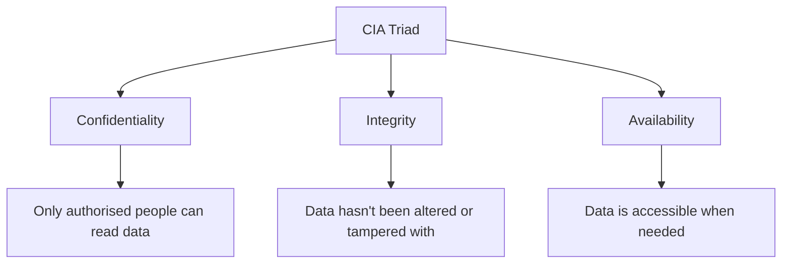

**Plain Text vs Cipher Text:**

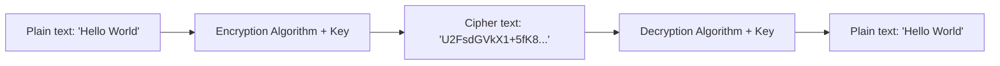

---

**Two Types of Encryption:**

**1. Symmetric Encryption**

- Same key encrypts AND decrypts
- Fast and efficient
- Problem: How do you securely share the key?
- Example: AES (Advanced Encryption Standard)

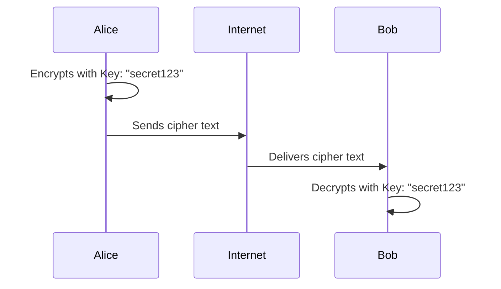

**2. Asymmetric Encryption**

- Two keys: public key (can share) and private key (keep secret)
- Public key encrypts, private key decrypts
- Slower but solves key distribution problem
- Example: RSA

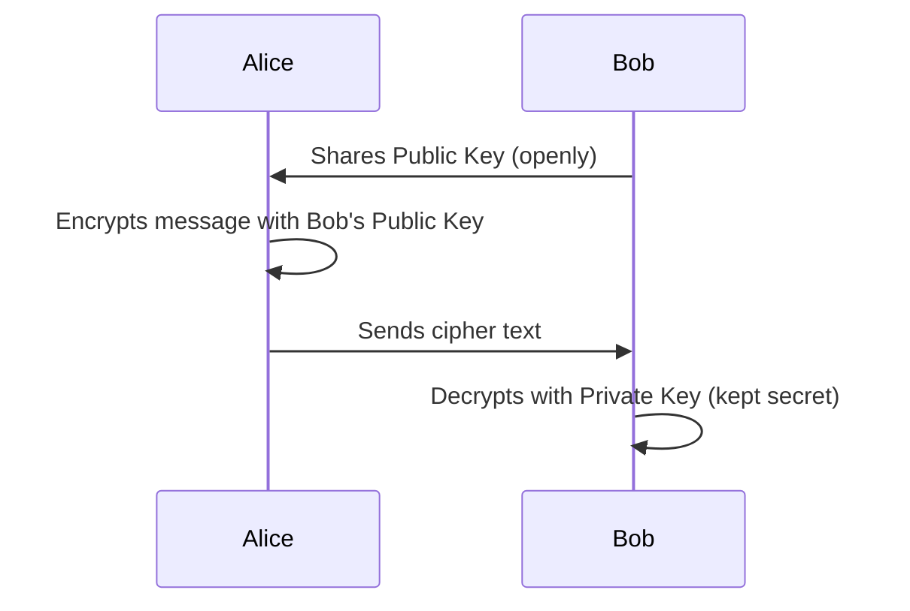

---

### The SSL/TLS Handshake Process

*Read through this process - you'll apply it in the next activity:*

This happens every time you visit an HTTPS website.

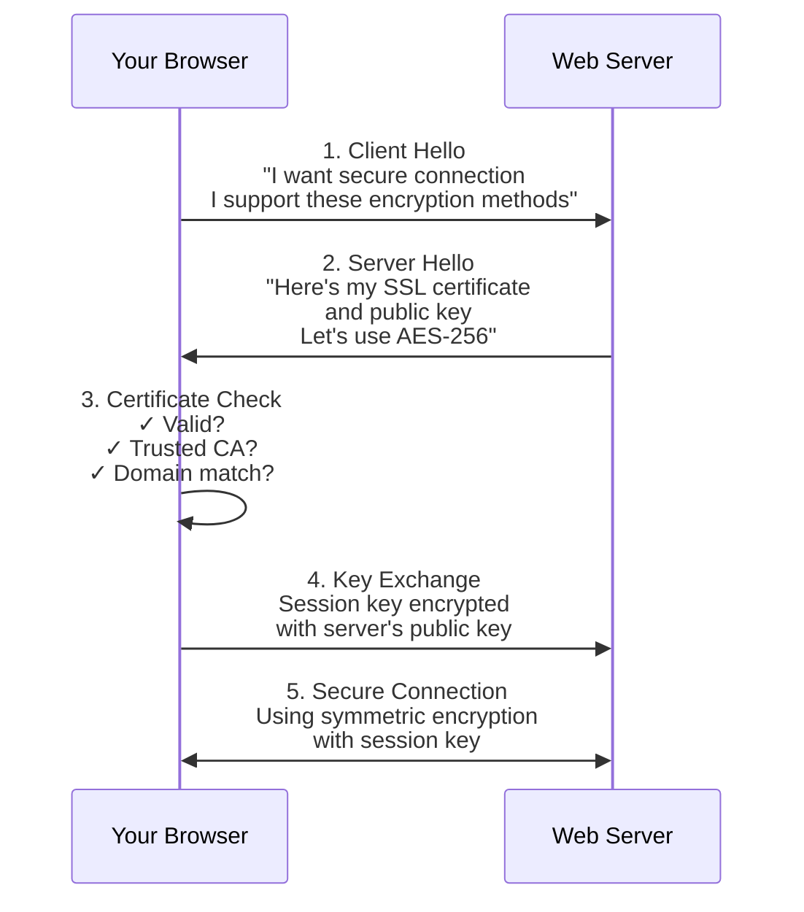

**Step-by-step process:**

1. **Client Hello:** Your browser contacts server: "I want a secure connection. I support these encryption methods..."

2. **Server Hello:** Server responds: "Here's my SSL certificate and public key. Let's use AES-256 encryption."

3. **Certificate Check:** Your browser verifies:
   - Is this certificate valid?
   - Is it issued by a trusted Certificate Authority (CA)?
   - Does the domain name match?

4. **Key Exchange:** Browser generates a random session key, encrypts it with server's public key, sends it back.

5. **Secure Connection:** Both sides now have the same session key (symmetric encryption) for fast, secure communication.

!!! note "Why this matters"
    Asymmetric encryption solves the "how do we share keys" problem. Then switches to faster symmetric encryption for actual data transfer.

**Video:**

- [:simple-youtube:{ .youtube } TLS Handshake - EVERYTHING that happens when you visit an HTTPS website](https://www.youtube.com/watch?v=ZkL10eoG1PY)

---

### Activity 2.1: Certificate Investigation

*Practical Exercise (12 minutes)*

**Part A: Examine an SSL Certificate**

1. Visit any HTTPS website (e.g., https://www.google.com)
2. Click the padlock or info icon in the address bar
3. View certificate details

{ width=400 }
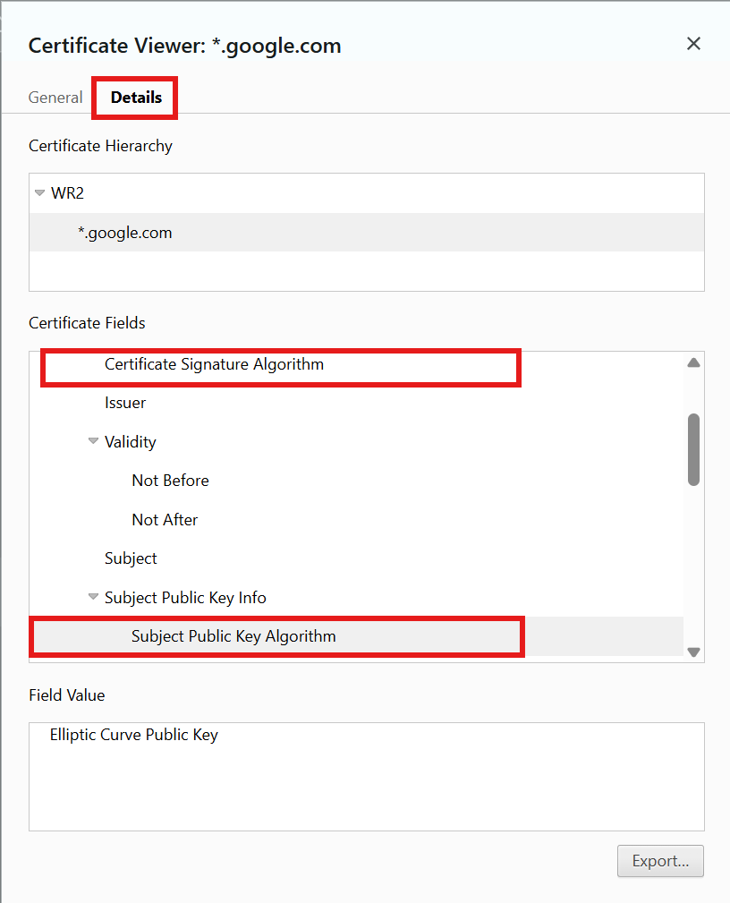{ width=400 }

**Record the following information:**
```
- Issued to (domain): 
- Issued by (Certificate Authority): 
- Valid from: 
- Valid until: 
- Public key algorithm: 
- Signature algorithm: 
```

**Part B: Analysis Questions**

1. Why does the certificate have an expiration date?
2. What would happen if the domain name on the certificate didn't match the website URL?
3. Why must the Certificate Authority be trusted?

!!! example "Extension Challenge"
    Try visiting http://expired.badssl.com/ (intentionally expired certificate). What warning does your browser show? Why is this security feature important?

---

## Part 3: Hash Values and Digital Signatures

*Duration: 25-30 minutes*

### Introduction: Understanding Hashing

*Read the following (10 minutes):*

**What is a Hash Value?**

A hash function takes any input and produces a fixed-size output (the hash). It's a one-way process - you can't reverse it.

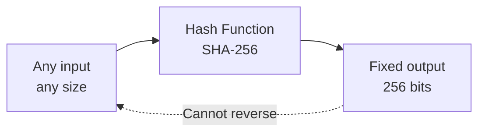

**Key Properties:**

- **Deterministic:** Same input always produces same hash
- **Fixed size:** Any input size → same hash length
- **One-way:** Can't reverse engineer original from hash
- **Avalanche effect:** Tiny change in input = completely different hash

**Example using SHA-256:**

```
Input: "Hello"
Hash:  185f8db32271fe25f561a6fc938b2e264306ec304eda518007d1764826381969

Input: "Hello!"  (just added one character!)
Hash:  334d016f755cd6dc58c53a86e183882f8ec14f52fb05345887c8a5edd42c87b7
```

**Common Hash Algorithms:**

- **MD5:** 128-bit (outdated, insecure)
- **SHA-1:** 160-bit (deprecated)
- **SHA-256:** 256-bit (current standard)
- **SHA-512:** 512-bit (very secure)

**Use Cases:**

- Password storage (store hash, not actual password)
- File integrity verification (download hash = file wasn't corrupted/tampered)
- Digital signatures
- Blockchain

---

### Worked Example: Hashing in Practice

**Scenario: Password Security**

**Poor Practice:**
 
 - store password as plain text
 - anyone can view and use the password if the have access to the database
```
Database stores:
Username: alice
Password: password123  ← Stored as plain text!
```

**Better Practice:**

- password is hashed 
- hash is stored instead of actual password
- is vulnerable to brute force attacks, rainbow tables, grouping of identical passwords
```
Database stores:
Username: alice
Password: ef92b778bafe771e89245b89ecbc08a44a4e166c06659911881f383d4473e94f
(This is the SHA-256 hash of "password123")
```

**Best Practice:**

- password is hashed and salted
- unique salt per user
- salt is stored with the hash
```
Database stores:
Username: alice
Salt: 1a2b3c4d5e6f7g8h9i0jklmno
Password: 39192c8e95ad9fdc20087163df96cdbb26f72c6b349e16ad3d0a77ebdaba3f08
(This is the SHA-256 hash with salting)
```

Try it out: [Online SHA256 tool](https://emn178.github.io/online-tools/sha256.html)

**Login Process:**

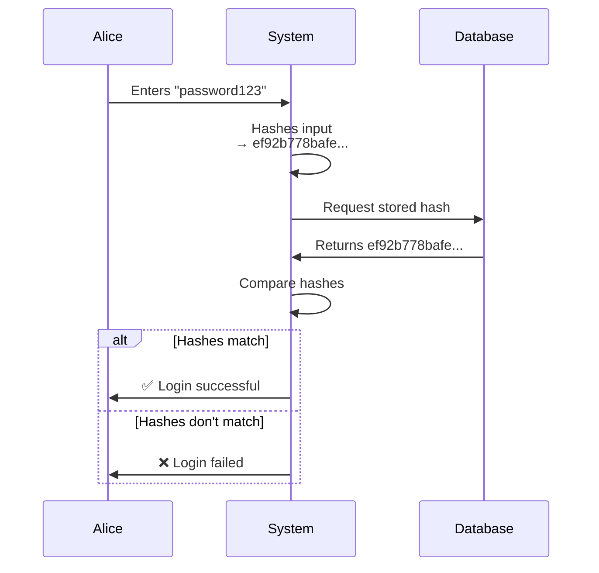

!!! success "Why this is secure"
    Even if hackers steal the database, they can't reverse the hash to get actual passwords. They can only see the hash, not the original but their are techniques to brute force the hash and find a matching password.    

---

### Activity 3.1: Digital Signatures Deep Dive

*(8 minutes)*

**Understanding Digital Signatures**

First, read this explanation:

A digital signature proves:

1. **Authentication:** The message is from who it claims to be from
2. **Integrity:** The message hasn't been altered
3. **Non-repudiation:** Sender can't deny sending it

**How it works:**

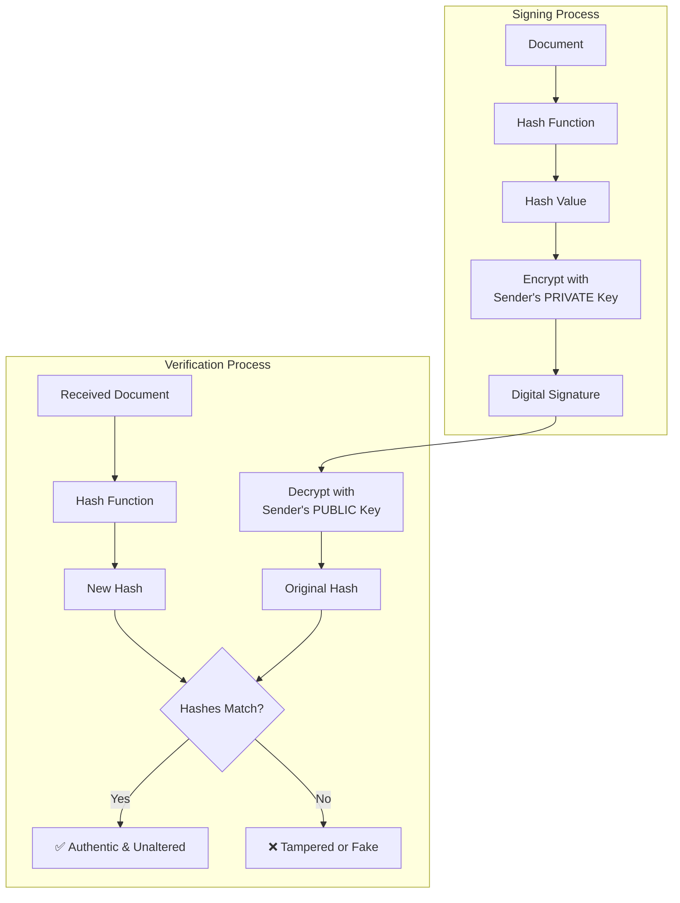

**Your Task:**

Explain in your own words why digital signatures use the private key to encrypt (opposite of normal encryption). Consider:

- What does this prove?
- Why can't someone forge a signature?
- How does this provide non-repudiation?

---

## Part 4: Authentication vs Authorisation

*Duration: 15-20 minutes*

### Introduction: Key Concepts

*Read the following (6 minutes):*

**Authentication vs Authorisation**

| Authentication | Authorisation |
|----------------|---------------|
| **"Who are you?"** | **"What can you do?"** |
| Proving identity | Defining permissions |
| Username/password, biometrics, tokens | Access control lists, roles, policies |
| Happens first | Happens after authentication |

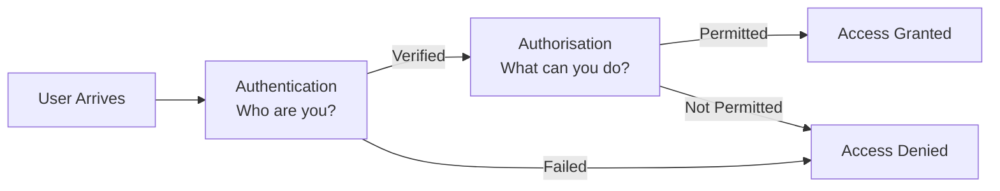

**Example:**

|Concept|Analogy|Explanation|
| ---- |----|----|
|**Authentication**|Showing your **Student ID card to the librarian** to check out a book.|You prove your identity to the librarian.|
|**Authorisation**|Being told you can only check out **5 books** at a time, or only books from the **Junior/Senior section**.|Your status (student) determines the **limits and permissions** of your access (how many, what kind).|


**Authentication Methods:**

- Something you **know** (password, PIN)
- Something you **have** (phone, security token)
- Something you **are** (fingerprint, face)
- **Multi-factor authentication (MFA):** Combining 2+ methods

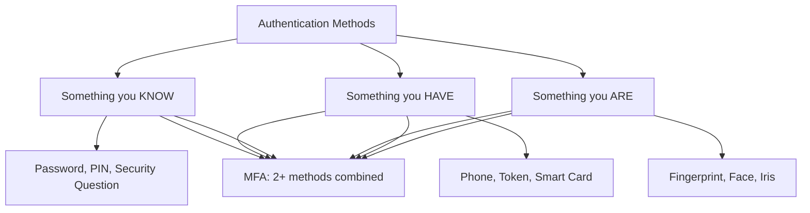

---

### Activity 4.1: Security Analysis

*Case Study (8 minutes)*

**Case Study: Securing a Student Portal**

**Requirements:**

- 10,000 students need access
- Students can view grades, enrol in subjects
- Teachers can view all student data and enter grades
- Administrators can modify student records

**Let's design the security together:**

**Authentication Layer:**

1. What authentication method(s) would you use?
2. Should we implement MFA? For whom?
3. How should passwords be stored?

**Authorisation Layer:**

1. What roles do we need? (Student, Teacher, Admin)
2. What permissions does each role have?
3. How do we prevent a student from accessing teacher functions?

**Fill in this table:**

| Role | Can View Grades | Can Edit Grades | Can Modify Records | Authentication Required |
|------|----------------|-----------------|-------------------|------------------------|
| Student | Own only | ❌ | ❌ | Username/Password |
| Teacher | All students | ✅ | ❌ | ? |
| Admin | All | ✅ | ✅ | ? |

---

### Activity 4.2: Independent Application

*Design Challenge (8 minutes)*

You're building a healthcare patient portal. Consider these security requirements:

**Stakeholders:**

- Patients (view own records)
- Doctors (view/edit patient records they treat)
- Nurses (view records, add notes)
- Billing staff (view insurance info only)
- System admins (full access)

!!! activity
    1. **Design the authentication system:**
        - What methods will you use for each user type?
        - Which users should have MFA mandatory?
        - How will you handle password storage?

    2. **Design the authorisation matrix:**
        - Create a table showing what each role can access
        - Consider the CIA triad (Confidentiality, Integrity, Availability)

    3. **Security protocols:**
        - Which protocols (HTTPS, TLS) are mandatory? Why?
        - Should you log access attempts? What information?

    4. **Encryption requirements:**
        - What data must be encrypted at rest (in database)?
        - What data must be encrypted in transit?
        - Symmetric or asymmetric encryption for stored medical records?

---

## Part 5: Synthesis and Application

*Duration: 15-20 minutes*

### Activity 5.1: Comprehensive Scenario

*Real-World Challenge*

**Real-World Challenge: Securing an E-Commerce Platform**

You're the security architect for a new online store. You must make decisions about every security layer.

**Complete the following security audit:**

#### Section A: Protocol Selection

For each function, choose and justify the protocol:

1. **Uploading product images from vendor computers:**
   - Protocol choice: ___
   - Port number: ___
   - Justification: ___

2. **Sending order confirmation emails:**
   - Protocol choice: ___
   - Port number: ___
   - Security consideration: ___

3. **Customer support accessing email from multiple devices:**
   - Protocol choice: ___
   - Justification: ___

#### Section B: Encryption Strategy

4. **Customer credit card information:**
   - Storage: Encrypted or hashed? Why?
   - Algorithm suggestion: ___
   - Type (symmetric/asymmetric): ___

5. **Customer passwords:**
   - Storage method: ___
   - Algorithm: ___
   - Why not store plain text: ___

6. **HTTPS implementation:**
   - Describe the SSL/TLS handshake for your site
   - Which encryption is used during handshake: ___
   - Which encryption is used for data transfer: ___

#### Section C: Authentication & Authorisation

7. **Design three user roles:**
   - Customer permissions: ___
   - Staff permissions: ___
   - Admin permissions: ___

8. **Should you implement MFA?**
   - For which roles: ___
   - Justification: ___

#### Section D: Integrity & Verification

9. **Software updates for your platform:**
   - How will you use hash values: ___
   - Which hash algorithm: ___

10. **Digital signatures:**
    - Where will you use them in your e-commerce flow: ___
    - What do they verify: ___

#### Section E: CIA Triad Application

For each scenario, identify which principle(s) are threatened and your solution:

11. **Competitor tries to read customer database:**
    - Principle: ___
    - Solution: ___

12. **Hacker modifies product prices in database:**
    - Principle: ___
    - Solution: ___

13. **DDoS attack makes website unavailable:**
    - Principle: ___
    - Solution: ___

---
## Syllabus Alignment
### Programming For The Web
✓ Investigate and describe the function of web protocols and their ports. Including:

- TCP/IP
- FTP, SFTP
- SSL, TLS
- SMTP, POP 3, IMAP

✓ Explain the processes for securing the web. Including:

- Secure Sockets Layer (SSL) certificates
- encryption algorithms
- encryption keys
- plain text and cipher text
- authentication and authorisation
- hash values
- digital signatures

### Secure Software Architecture

✓ Explore fundamental security concepts (confidentiality, integrity, availability)

## Checklist

### Web Protocols

- [ ] Explain the function of FTP, SFTP, SMTP, POP3, IMAP
- [ ] Identify port numbers for each protocol
- [ ] Describe SSL and TLS operation
- [ ] Compare security features of different protocols

### Encryption

- [ ] Define plain text and cipher text
- [ ] Explain symmetric vs asymmetric encryption
- [ ] Describe encryption keys and algorithms
- [ ] Explain the SSL/TLS handshake process

### SSL Certificates

- [ ] Describe what SSL certificates contain
- [ ] Explain how certificates are verified
- [ ] Identify Certificate Authorities
- [ ] Analyse real certificates

### Authentication & Authorisation

- [ ] Distinguish between authentication and authorisation
- [ ] Describe authentication methods
- [ ] Design authorisation structures

### Hash Values & Digital Signatures

- [ ] Explain what hash values are
- [ ] Describe properties of hash functions
- [ ] Explain how digital signatures work
- [ ] Apply hashing to real scenarios

### Security Concepts

- [ ] Explain confidentiality, integrity, availability
- [ ] Apply CIA triad to scenarios
- [ ] Analyse security threats and solutions

---

## Extension Resources

**If you finish early or want to go deeper:**

1. **Interactive SSL/TLS Simulator:**
    - Try the SSL Labs test: [https://www.ssllabs.com/ssltest/](https://www.ssllabs.com/ssltest/)
    - Test your favourite websites' security

2. **Hashing Practice:**
    - Use an [online SHA-256 generator](https://emn178.github.io/online-tools/sha256.html)
    - Hash your name, then change one letter - observe the avalanche effect
    - Try salting you name and then hashing it

3. **Certificate Exploration:**
    - Find three different websites
    - Compare their SSL certificates
    - Identify different Certificate Authorities

4. **Protocol Investigation:**
    - Use your computer's terminal/command prompt
    - Try: `nslookup` commands to see DNS
    - Observe protocol communications

---

## Learning Reflection

*Complete before finishing (5 minutes):*

1. **Most challenging concept:** ___
2. **How I overcame it:** ___
3. **Real-world application I found interesting:** ___
4. **One question I still have:** ___
5. **Confidence rating (1-5) for each topic:**
   - Protocols: ___/5
   - Encryption: ___/5
   - Certificates: ___/5
   - Hashing: ___/5
   - Authentication: ___/5

---

## Answer Guide

**For Self-Checking - only reveal after attempting activities**

??? success "Activity 1.2 - Email Protocol Answer"
    **Recommended:** IMAP on port 993 (secure)

    **Reasoning:**
    
    - Employees need multi-device access
    - IMAP syncs across all devices
    - Email stays on server (accessible anywhere)
    - Port 993 provides encryption
    - POP3 would download and delete, losing sync capability

??? success "Activity 4.1 - Security Design Answer"
    | Role | Can View Grades | Can Edit Grades | Can Modify Records | Authentication Required |
    |------|----------------|-----------------|-------------------|------------------------|
    | Student | Own only | ❌ | ❌ | Username/Password |
    | Teacher | All students | ✅ | ❌ | Username/Password + MFA |
    | Admin | All | ✅ | ✅ | Username/Password + MFA + IP restriction |

    **Passwords:** Stored as SHA-256 hashes with salt

---

!!! success "Congratulations!"
    You've completed coverage of NSW Software Engineering web protocols and security syllabus content. You should now be able to describe, explain, and analyse all required concepts.

??? notes "Teacher Notes - Formative Assessment"
    
    ## Formative Assessment Opportunities
    ### Activity 1.1: Protocol Comparison
    What to assess:

    - Can students identify security vulnerabilities in plain text transmission?
    - Do they understand the fundamental difference between secure and insecure protocols?

    Look for:

    - ✅ Recognition that FTP sends credentials in plain text
    - ✅ Understanding that encryption protects data in transit
    - ❌ Students who think "it's okay if the network is private"

    **Intervention:**
    - If students struggle, revisit the concept of network monitoring and man-in-the-middle attacks. Ask: "Who else might be on the network between you and the server?"

    ### Activity 1.2: Email Protocol Analysis
    What to assess:

    - Understanding of protocol functionality (POP3 vs IMAP)
    - Ability to match technical solutions to real-world requirements
    - Knowledge of secure port numbers

    Look for:

    - ✅ Recognition that IMAP is better for multi-device scenarios
    - ✅ Use of secure ports (993 or 995)
    - ❌ Confusion about when email is deleted from server
    - ❌ Selecting insecure ports (110, 143)

    **Quick formative check:**
    Ask students: "If you delete an email on your phone using POP3, will it still be on your laptop?" This reveals understanding of the protocol's behaviour.

    ### Activity 2.1: Certificate Investigation
    What to assess:

    - Ability to navigate browser security features
    - Understanding of certificate components
    - Critical thinking about trust and verification

    Look for:

    - ✅ Students can locate and read certificate details
    - ✅ Understanding that CA trust is hierarchical
    - ❌ Accepting certificates without checking expiry
    - ❌ Not understanding domain name matching

    Extension for advanced students:
    Ask them to investigate what happens with self-signed certificates and why browsers warn against them.

    ### Activity 3.1: Digital Signatures
    What to assess:

    - Understanding of asymmetric encryption application
    - Ability to explain authentication vs confidentiality
    - Comprehension of one-way hash functions

    Look for:

    - ✅ Recognition that signing uses private key (opposite of encryption)
    - ✅ Understanding that public key verification proves identity
    - ❌ Confusion about which key to use when
    - ❌ Thinking digital signatures encrypt the entire document

    **Intervention:**
    Use the analogy of a physical signature sealed in wax. Only you can create your signature (private key), but anyone can verify it's yours (public key).

    ### Activity 4.1 & 4.2: Security Design Tasks
    What to assess:

    - Application of authentication vs authorisation concepts
    - Risk assessment and appropriate security measures
    - Understanding of role-based access control

    Look for:

    - ✅ MFA applied to privileged accounts
    - ✅ Password storage using hashing (not encryption)
    - ✅ Principle of least privilege in authorisation design
    - ❌ Over-engineering security for low-risk users
    - ❌ Under-protecting sensitive data/roles

    **Discussion prompt:**
    "Why do we hash passwords but encrypt credit cards?" This reveals understanding of one-way vs reversible cryptography.

    ### Activity 5.1: Comprehensive Scenario
    What to assess:

    - Synthesis of all concepts
    - Decision-making with justification
    - Application of CIA triad principles

    Look for:

    - ✅ Consistent security approach across all sections
    - ✅ Appropriate protocol/algorithm selection with reasoning
    - ✅ Recognition of trade-offs (security vs usability)
    - ❌ Contradictory decisions (e.g., secure protocols but plain text passwords)
    - ❌ Missing critical security measures

??? notes "Teacher Notes - Common Misconceptions"

    ## Common Misconceptions

    1. **"Encryption and hashing are the same thing"**

        **Misconception:** Students often use these terms interchangeably.
        
        **Reality:**

        - Encryption is reversible (cipher text → plain text with key)
        - Hashing is one-way (cannot reverse hash → original)

        **Teaching strategy:**
        ``` mermaid
        flowchart LR
            A[Encryption] --> B[Reversible]
            B --> C[Used for: Credit cards,<br/>files, communications]
            D[Hashing] --> E[One-way]
            E --> F[Used for: Passwords,<br/>integrity checks]
        ```
        **Key question:** "If a hacker steals your database, would you rather they have encrypted passwords or hashed passwords? Why?"

    2. **"HTTPS just means the website is safe/trustworthy"**

        **Misconception:** The padlock icon means the website owner is legitimate and won't scam you.
        
        **Reality:** HTTPS only guarantees:

        - The connection is encrypted (confidentiality)
        - You're connected to the domain shown (authentication)
        - It does NOT verify the website owner's intentions

        **Teaching strategy:**
        - Demonstrate that phishing sites can have valid HTTPS certificates. The padlock protects your data in transit, not from a malicious website owner.
        - Example: https://definitely-not-fake-bank.com can have a valid certificate.

    3. **"Symmetric encryption is less secure than asymmetric"**

        **Misconception:** Students think asymmetric encryption is "better" because it's more complex.
        
        **Reality:**

        - Both can be equally secure with proper key lengths
        - Asymmetric is slower (used for key exchange)
        - Symmetric is faster (used for bulk data)
        - They solve different problems

        **Teaching strategy:**
        Use the SSL/TLS handshake to show they work together. Asymmetric solves key distribution; symmetric provides speed.

    4. **"Port numbers are security features"**

        **Misconception:** Using port 443 instead of 80 makes data secure.
        
        **Reality:**

        - Ports are just addresses/doorways
        - The protocol (HTTP vs HTTPS) provides security
        - You could run HTTP on port 443 (insecure)
        - You could run HTTPS on port 8080 (secure)

        **Teaching strategy:**
        - Analogy: "A secure door on a building doesn't depend on its number. Port 443 is just the standard address where we expect to find HTTPS, but the HTTPS protocol is what provides security."

    5. **"Authentication and authorisation are the same thing"**

        **Misconception:** Students treat these as synonyms.
        
        **Reality:**

        - Authentication = identity verification ("Who are you?")
        - Authorisation = permission checking ("What can you do?")
        - Must authenticate before authorising
        - Can be authenticated but not authorised

        **Teaching strategy:**
        - Physical analogy: Your student ID authenticates you as a student. But that doesn't authorise you to enter the staff room or change grades in the system.

    6. **"Digital signatures encrypt documents"**

        **Misconception:** If you sign a document digitally, it becomes encrypted/unreadable.
        
        **Reality:**

        - Digital signatures prove authenticity and integrity
        - The document remains readable
        - Only the hash is encrypted (not the document)

        **Teaching strategy:**
        ```mermaid
        flowchart TD
            A[Document remains<br/>in plain text] --> B[Hash of document<br/>is created]
            B --> C[Hash is encrypted<br/>with private key]
            C --> D[Signature attached<br/>to readable document]
        ```

    7. **"SSL and TLS are different things"**

        **Misconception:** These are two competing protocols to choose between.
        
        **Reality:**

        - TLS is the successor to SSL
        - SSL is deprecated (insecure)
        - Industry still says "SSL certificate" but means TLS
        - Modern browsers only support TLS 1.2+

        **Teaching strategy:**
        "SSL is the old name that stuck. Think of it like calling all tissues 'Kleenex' even when they're a different brand. We're actually using TLS, but everyone still says SSL."

    8. **"Longer passwords are harder to hash"**

        **Misconception:** Hash time increases significantly with password length.
        
        **Reality:**

        - Hash functions produce fixed-length output regardless of input size
        - "hello" and a 10,000-character document produce same-length SHA-256 hash
        - Computation time increases minimally with input length

        **Teaching strategy:**
        - Demonstrate with an online hash generator: hash a short and long string, showing same output length and similar computation time.

??? Teacher Notes - Differentiation
    ## Differentiation

### For Students Who Need Additional Support

#### **Scaffolding Techniques**

**1. Protocol Selection (Activity 1.2)**

    Provide a decision tree:

    ```mermaid
    flowchart TD
        A[Email Protocol?] --> B{Multiple devices?}
        B -->|Yes| C[IMAP]
        B -->|No| D[POP3 or IMAP]
        C --> E{Need security?}
        D --> E
        E -->|Yes| F[Use secure port<br/>IMAP: 993<br/>POP3: 995]
        E -->|No| G[Standard port<br/>IMAP: 143<br/>POP3: 110]
    ```

    **2. Encryption Concepts**

    Provide a comparison table template:

    |Feature|Symmetric|Asymmetric|
    |---|---|---|
    |Number of keys|||
    |Speed|||
    |Best use|||
    |Key distribution|||
    |Example|||

    **3. Visual Aids**

    Create physical cards for key concepts:

    - Green cards = Secure protocols (SFTP, HTTPS, IMAPS)
    - Red cards = Insecure protocols (FTP, HTTP, IMAP)
    - Students sort scenarios with appropriate cards

    **4. Worked Examples**

    Before Activity 5.1, provide a simpler parallel example (school library system) with completed security audit they can use as a model.

    ---

    ### For Advanced Students

    #### **Extension Challenges**

    **1. Protocol Deep Dive**

    Research and present on:

    - How does STARTTLS work in email protocols?
    - What are the differences between TLS 1.2 and TLS 1.3?
    - Investigate certificate pinning and its security benefits

    **2. Cryptographic Analysis**

    - Compare different hash algorithms (MD5, SHA-1, SHA-256, bcrypt, Argon2)
    - Research rainbow tables and salt in password hashing
    - Investigate quantum computing threats to current encryption

    **3. Real-World Security Audit**

    Conduct a security assessment of a real website or application:

    - Analyse SSL/TLS configuration using SSL Labs
    - Document certificate chain
    - Identify security headers (CSP, HSTS, X-Frame-Options)
    - Propose improvements

    **4. Build a Demonstration**

    Create a working demonstration:

    - Simple symmetric encryption tool (Caesar cipher, then AES)
    - Password hashing demonstration with timing attacks
    - Mini SSL/TLS handshake simulator
    - Digital signature verification system
